# Fleet Fuel & VAT Refund System

A self‑contained Flask web application for **fuel‑invoice processing, EU VAT refunds
(Directive 2008/9/EC), and competitor price intelligence**, built for five Baltic
transport entities and the agency that files their cross‑border VAT claims.

Everything lives in one folder — code, databases, the document vault, and reports —
so the folder *is* the unit of backup. It runs on a laptop for a single user or as
several worker processes behind a proxy for a team, with no change of code.

---

## What it does

| Area | Capabilities |
|------|--------------|
| **Intake** | Upload PDF/ZIP/XML invoice batches. **Structured‑first** extraction: UBL/CII e‑invoices and **Factur‑X/ZUGFeRD hybrid PDFs** parse deterministically (EN 16931, no AI), with a **profile gate** so a line‑less MINIMUM/BASIC‑WL invoice is never trusted as a complete capture; a deterministic per‑supplier PDF parser; an **on‑prem OCR fallback** for scanned/image PDFs; or AI extraction (Claude/OpenAI/Azure) only as a last resort — long statements **chunked** so no invoice line is silently dropped. Post‑capture **deterministic checks** (IBAN MOD‑97, VAT‑ID structure, cross‑entity duplicates) and **per‑line provenance** badges surface problems before you confirm. A durable **“waiting room” queue** parks uploads and processes them in the background so bursts never overload the server. |
| **Master data** | Separate SQLite databases — our entities (`customers.db`), suppliers (`suppliers.db`), transactions (`fuel_history.db`), and the **VAT‑refund claim records isolated in their own `vat_claims.db`** so the monthly rebuild can't corrupt them. AI‑processed extraction output is archived in a **data lake** (same storage backends as the PDF vault). |
| **Engine** | Consolidate → validate (tie‑out to invoice totals) → build monthly master workbook → load history/trend → materialize per‑period dashboard metrics. A **one‑click monthly close** runs the whole chain on the background worker (admin → `/close`); the orchestrator (`engine_close.py`) is restartable and writes one audit trail. |
| **VAT refunds** *(admin‑only module)* | Claims per **entity × country × period** (Q1–Q4 or annual), 400/50 EUR thresholds, one‑invoice‑one‑submission locks, claim packs. A **controlled status workflow 1A→5**: the pre‑submission stages (1A missing docs · 1B period not ended · 1C/1E ready) are **derived by the system from an adjustable checklist** (contract, customer data, bank account, NACE, trade register, power of attorney) with a **hard period‑end gate**; then 2 submitted → 2B document request → 3 decision → 3A money → 3B rejection / 3D appeal / 3C confiscation (locks kept) → 4/4A invoice fee/credit → 5 closed. Low‑VAT quarters **merge dynamically** into the annual claim. Claims are built **from registered invoices** — every line ties to one invoice, **one row per product code** (Art. 9 codes), nothing synthetic filed; figures stay editable but guarded against accidental change. |
| **Customer CRM** | The Customers page is a mini‑CRM: onboarding + per‑country activation, the adjustable checklist rules, **document generation from your own templates** ({{placeholders}} filled with customer data; .txt/.html/.md/.docx, optional PDF), document **validity dates** (expired POA re‑blocks claims), fee terms & payout routing. |
| **Service fees** | % of refunded VAT floored at a per‑declaration minimum; per‑customer/per‑country overrides; rate frozen at submission, charged at payout; fee invoice + settlement. |
| **Price intelligence** | Competitor NET‑price tracking and margin analysis, a **self‑sourced benchmark** from your own multi‑supplier purchases (best price achieved + avoidable overpay), and a **dynamic client‑portal scraper** (encrypted credentials). |
| **Reports & export** | **Expense / cost reports** (`/expenses` + Excel), a supplier **price‑review packet** (avoidable‑overpay), an **accounting‑ledger CSV**, and a programmable **SAF‑T (OECD core) XML** export — all NET EUR basis, totals reconciled to the same ledger math. |
| **Automated document capture** | Fetch invoices/prices straight from supplier portals on the **worker tier**, never inline in a request: a portal fetch is enqueued (queue kind `fetch`) and gated by a **per‑supplier rate‑limiter / concurrency cap / backoff / circuit‑breaker** (opt‑in), with an **off‑by‑default scheduler** that auto‑enqueues pulls. Portal credentials are held under **envelope encryption** (AES‑256‑GCM data key wrapped by a pluggable Key‑Encryption Key — local, or BYOK/KMS via `FFS_KEK_KEY`). |
| **Embedded finance & bank recon** *(advisory)* | A financeable‑receivable view + advance‑offer economics on the Receivables page (origination‑only seam; a licensed factoring partner plugs in), and **open‑banking reconciliation** matching uploaded bank credits against expected VAT refunds (`/recon`). Both are advisory — they never move money or mutate a VAT figure/lock. |
| **Confidence learning** | A per‑(supplier × country) **trust score** that grows on clean validations and decays on flags — fed by the **deterministic batch validator** (ground truth) and the advisory AI review; it governs **only** whether the optional advisory AI review runs — never a legal gate. |
| **Multi‑tenant ready** | A tenant registry + request‑scoped context behind a master switch that is **OFF by default** (byte‑identical single‑tenant); the per‑table scoping phase is deferred. See **[docs/STRATEGY.md#multi-tenancy-program-plan](docs/STRATEGY.md#multi-tenancy-program-plan)**. |
| **Compliance** | Receipt control (cadence × activity), statement reconciliation with VAT triage, a **contract‑compliance auditor** (catches short discounts / over‑ceiling prices to claw back), **document mining** (auto‑fills INPUT gaps from the vault), anomaly scan, full audit trail. |
| **Document vault** | Originals stored under a logical, human‑navigable tree — `Customer (reg no) / Year / Country / Claim period / file` — identical across **local / SharePoint / FTP(S)** backends; SHA‑256 dedup + integrity verification. A doc‑missing claim is resolved in place: **upload**, or **search the store and attach an already‑stored file** (same dedup + wrong‑attachment check). |
| **Platform** | Roles (admin/processor; the VAT module is admin‑only), **admin on/off switches for whole app parts**, login lockout & IP throttle, CSP/security headers, scheduled backups with **document‑integrity checks** + **off‑machine backup sync**, an **admin error log** (every failure recorded for review), **per‑event + deadline alerts with SMTP relay config**, TLS, versioned schema migrations + a logging layer. |
| **Scales with you** | One laptop → a team behind a proxy → a multi‑server fleet, by **configuration, not rewrite**: node roles (`FFS_ROLE` web/worker), shared signed‑cookie sessions (`FFS_SECRET_KEY`, no sticky sessions), pluggable storage (local / SharePoint / FTPS), a lease‑based queue + leader‑elected scheduler, and a **SQLite→PostgreSQL** database abstraction. See **[docs/MANUAL.md#scaling-the-fleet-fuel-vat-refund-system](docs/MANUAL.md#scaling-the-fleet-fuel-vat-refund-system)**. |

---

## Get started in 3 steps

No terminal, no config files — just double‑click and follow the screen.

1. **Install Python once** (only if you don't have it). Get it free from
   [python.org/downloads](https://www.python.org/downloads/). On Windows, tick
   **“Add Python to PATH”** during install.
2. **Double‑click the launcher for your computer:**

   | Windows | macOS | Linux |
   |---------|-------|-------|
   | `start.bat` | `start.command` | `start.sh` |

   The first run installs everything it needs (about a minute) and opens your browser
   automatically.
3. **Follow the welcome page.** It asks you to pick an admin username and password —
   that's the whole setup. A green “You're all set” screen sends you to sign in.

That's it. Leave the small console window open while you work; close it (or press
`Ctrl+C`) to stop the app.

> **If your computer blocks the launcher** (some macOS/Windows security prompts), right‑click
> it → **Open** once, or run `python start.py` from a terminal in this folder. Same result.

<details>
<summary><b>Prefer the command line?</b></summary>

```bash
pip install -r requirements.txt          # flask, openpyxl, waitress, cryptography, pypdf (+ requests)
# optional: scanned-PDF OCR fallback (on-prem) needs the system 'tesseract' binary + 'poppler', plus:
#   pip install pytesseract pdf2image     # only if you enable EXTRACT_OCR_BACKEND (default 'auto' = off when absent)
python start.py                          # installs deps if needed, opens the browser, runs setup
# or run the pieces directly:
python app.py                            # dev server  → http://localhost:8050
python serve.py                          # production (waitress; Windows + Linux), HTTPS if a cert is present
```

A guided terminal installer is also available: `./install.sh` (Linux/macOS) or
`install.bat` (Windows) — it checks Python, installs packages, makes a certificate,
creates the admin account, and runs a self‑check. Add `--yes --user admin --password '…'`
for unattended IT setup.

</details>

> Full step‑by‑step **server** install (Ubuntu **and** Windows, TLS, systemd, nginx,
> backups, multi‑process) is in **[docs/MANUAL.md#install-setup-installation](docs/MANUAL.md#install-setup-installation)**.

---

## Documentation

| Guide | What's in it |
|-------|--------------|
| **[docs/MANUAL.md#install-setup-installation](docs/MANUAL.md#install-setup-installation)** | Full server setup — one‑click, Ubuntu service (systemd), Windows service, TLS, nginx proxy, multi‑process (gunicorn/waitress), backups. |
| **[docs/MANUAL.md#user-manual-fleet-fuel-vat-refund-system](docs/MANUAL.md#user-manual-fleet-fuel-vat-refund-system)** | How to work with the system day‑to‑day — every page, the monthly routine, VAT refunds, the waiting room, the vault. |
| **[#the-platform-seven-delegated-works](#the-platform-seven-delegated-works)** | The product lens — the system as an accounting platform of **seven delegated works** (data processing, analytics/export, document storage, light CRM w/ API‑plugin seam, VAT processing, VAT control, invoicing‑for‑work), each with owner module, maturity and gap. |
| **[#architecture](#architecture)** | The six building blocks, the data model, the module map, and the key conventions. |
| **[#system-schematics](#system-schematics)** | Visual schematics — system overview, upload OK/Bad flow, monthly close, VAT claim lifecycle, **claim composition & document resolution**, databases, storage, request/worker flow, multi‑server topology, and the backup & integrity self‑control loop. |
| **[docs/MANUAL.md#scaling-the-fleet-fuel-vat-refund-system](docs/MANUAL.md#scaling-the-fleet-fuel-vat-refund-system)** | Horizontal scaling — the ladder (tune → Postgres → offload storage → worker fleet → load‑balance), target topology, env‑var reference, and the honest remaining blockers to a validated Postgres cutover. |
| **[docs/MANUAL.md#deployment-sizing-what-server-to-run](docs/MANUAL.md#deployment-sizing-what-server-to-run)** | Single‑box server sizing — "what do I buy to run this smoothly?" CPU/RAM/disk for a normal install (reference workload ~100 invoices/day), why disk is the real growth driver, and concrete cloud/on‑prem host options. |
| **[docs/MANUAL.md#hosting-on-hostinger-step-by-step](docs/MANUAL.md#hosting-on-hostinger-step-by-step)** | Step‑by‑step deploy on a **Hostinger VPS** — which plan/OS to pick, domain + DNS, Let's Encrypt TLS, systemd + nginx, firewall, optional OCR, and the go‑live checklist. |
| **[docs/STRATEGY.md#multi-tenancy-program-plan](docs/STRATEGY.md#multi-tenancy-program-plan)** | The multi‑tenant SaaS program — the phased plan behind the OFF‑by‑default `multitenant` switch (`tenancy.py`). |
| **[docs/MANUAL.md#saf-t-export-programmable-oecd-core-generator-prework](docs/MANUAL.md#saf-t-export-programmable-oecd-core-generator-prework)** | The SAF‑T (OECD core) export — the `CountryProfile` model and what makes a real per‑country submission. |
| **[docs/STRATEGY.md#product-roadmap](docs/STRATEGY.md#product-roadmap)** | How the system should evolve to support the business — outcome‑driven plan across three horizons, with KPIs. |
| **[docs/MANUAL.md#eu-cross-border-vat-refund-rules-reference-directive-20089ec](docs/MANUAL.md#eu-cross-border-vat-refund-rules-reference-directive-20089ec)** | The Directive 2008/9/EC compliance reference — verified parameters (thresholds, deadline, periods), expenditure codes, country diesel recoverability, and a cross‑check against what the code encodes. |
| **[#file-index-what-every-file-does](#file-index-what-every-file-does)** | A plain‑language index of what every file in the repo does. |
| **[SECURITY.md](SECURITY.md)** | Security model, data protection, and the DPA basis for AI extraction. |
| **[docs/MANUAL.md#putting-this-project-under-git](docs/MANUAL.md#putting-this-project-under-git)** | Cloning, branching, and what is / isn't committed. |

---

## Roles

- **admin** — everything, including the **VAT‑refund module** (claims, readiness,
  recovery & fees, customer CRM), server setup, user administration, editing
  processor capabilities, and **switching whole app parts on/off** (Admin → Modules).
- **processor** — day‑to‑day work (import, compliance, analytics, documents, exports).
  Capabilities are configurable by an admin; a processor can never see the VAT‑refund
  module or do server/user administration.

Authorization is enforced centrally per endpoint (`auth.has_perm` / `PERM_BY_ENDPOINT`,
plus the `ADMIN_ONLY` set and the module on/off switches).

---

## Repository layout

The Python modules are deliberately **flat** (siblings in the repo root): every module
is location‑independent (`WORKDIR = os.path.dirname(os.path.abspath(__file__))`) and
imports its siblings directly, and each `connect()` opens `<name>.db` next to the code.
This keeps the whole system a single, copy‑anywhere folder. The files group logically:

```
fleet_fuel_system/
├── app.py serve.py            # web app (≈25 pages + JSON API + Excel) and prod launcher
├── auth.py audit.py           # users/roles/login + trigger-based change history
├── db.py db_tuning.py process_lock.py  # SQLite→Postgres abstraction, WAL/busy-timeout tuning, cross-process lease
├── db_migrate.py applog.py    # versioned schema migrations (run once per DB) + logging layer
├── backup.py tls.py make_cert.py  # snapshots+integrity, TLS context, self-signed certs
├── keyvault.py tenancy.py     # envelope-encrypted credential custody; multi-tenant foundation (OFF by default)
│
├── ingest.py extract.py       # source adapters (xlsx/csv/xml/api); PDF/ZIP → draft
├── waiting_room.py            # durable "waiting room" queue + worker (extract / register / close / fetch + rate-limiter)
├── portal_scraper.py          # client-portal fetch adapters (worker-tier; encrypted credentials)
├── consolidate.py validate.py capture_checks.py # canonical schema + tie-out (blocks on errors); IBAN/VAT-ID/duplicate capture checks
├── build_master.py history.py engine_close.py  # monthly master workbook; load + trend; close orchestrator
├── metrics.py                 # per-period dashboard aggregates, materialized at the close
├── supplier_specs.py month_config.py vat_config.py  # registries / monthly + regulatory config
│
├── customer_master.py customers.db   # our entities (reg, VAT, payout IBAN, activation, fees)
├── supplier_master.py suppliers.db   # suppliers (VAT regs, banks, products, invoice registry)
├── vat_refund.py fuel_history.db # claims, locks, fees, document vault index
├── invoice_control.py            # receipt control + statement reconciliation/triage
├── finance.py bank_recon.py      # advisory embedded-finance + open-banking reconciliation seams
├── saft.py                       # programmable OECD-SAF-T-core XML export
├── confidence.py                 # per-supplier×country trust (governs only the advisory AI review)
├── document_vault.py                # vault backends: local / SharePoint / FTP(S)
├── pricing_intelligence.py anomaly.py reports.py  # price intelligence, anomaly scan, Excel reports
│
├── setup_wizard.py start.* install.*  # first-run wizard + one-click launchers
├── gunicorn_conf.py                   # multi-process worker config (Linux)
├── documents/                  # the document vault (local backend; git-ignored content)
├── tests/                      # pytest suite (1,150+ tests)
└── docs/                       # INSTALL · USER_MANUAL · ARCHITECTURE · DIAGRAMS · PLATFORM · SCALING · ROADMAP · VAT_REFUND_RULES · FILE_INDEX · GIT_SETUP
```

See **[#architecture](#architecture)** for the full module map and data model.

---

## The runbooks (summary)

**Monthly close** — drop supplier files → edit `month_config.py` → `python consolidate.py`
(must PASS every supplier vs its invoice totals) → `python build_master.py` →
`python history.py` → `python invoice_control.py <period>` → register statements & attach
documents in the UI → `python backup.py`.

**Quarterly VAT refunds** — after quarter end, review **Claims** (readiness) → for each
READY stream confirm every invoice has its original in the vault → file via the entity's
home portal → set status **submitted** in the UI (this *locks* the invoices). Low‑VAT
quarters defer into the **annual** claim; the vault re‑files those documents into the
year's `Annual` folder automatically. Deadline: 30 September of the following year.

Step‑by‑step instructions for both are in **[docs/MANUAL.md#user-manual-fleet-fuel-vat-refund-system](docs/MANUAL.md#user-manual-fleet-fuel-vat-refund-system)**.

---

## Testing

```bash
python -m pytest tests/ -q        # the full suite
python consolidate.py             # the pipeline smoke test (must PASS all suppliers)
```

---

## Conventions (for contributors)

- Prices everywhere are **NET EUR/L, final** (VAT excluded, rebates applied).
- Money is quantized via `money.py` (Decimal, ROUND_HALF_UP) — never bare `round()` on currency.
- HTML output is escaped with `markupsafe.escape` — never f‑string raw DB values into a page.
- Every data change is audit‑logged with the acting user.
- Do **not** commit secrets (`.secret_key`, certs), `security.db`, generated Excel, or
  runtime dirs (`backups/`, `inbox/`). See `.gitignore`.

More detail for AI/codebase contributors is in `CLAUDE.md`.

---

## Consolidated documentation — contents

The front-door content above is unchanged. The sections below consolidate the former architecture/platform docs (architecture, data architecture, platform lens, diagrams, file index) into this README.

- [Architecture](#architecture)
- [Data architecture — duplication & under-used data](#data-architecture-duplication-under-used-data)
- [The platform — seven delegated works](#the-platform-seven-delegated-works)
- [System schematics](#system-schematics)
- [File index — what every file does](#file-index-what-every-file-does)

---

## Architecture

This document describes how the Fleet Fuel & VAT Refund System is put together: the
six building blocks, the data model, the module map, and the conventions that keep it
consistent. For **visual schematics** of every flow see **[#system-schematics](#system-schematics)**;
for setup see **[docs/MANUAL.md#install-setup-installation](docs/MANUAL.md#install-setup-installation)**; for day‑to‑day use see
**[docs/MANUAL.md#user-manual-fleet-fuel-vat-refund-system](docs/MANUAL.md#user-manual-fleet-fuel-vat-refund-system)**.

---

### Design principles

- **One folder, copy‑anywhere.** Every module is location‑independent
  (`WORKDIR = os.path.dirname(os.path.abspath(__file__))`) and opens its database as
  `{WORKDIR}/<name>.db`. The modules import each other flatly. So the whole system is a
  single directory you can copy, zip, or back up as a unit — which is why the files are
  flat in the repo root rather than nested in packages.
- **Small bricks.** Logic is split across many focused modules instead of a few large
  files, to keep memory and parsing light and the code easy to navigate.
- **Human‑in‑the‑loop.** Extraction (even AI) only ever produces a *draft*; nothing is
  written to the books until a person reviews and confirms it.
- **Everything is audited.** Inserts/updates/deletes on every database are captured by
  SQLite triggers with full old/new snapshots and the acting user.

---

### The six blocks

```
1. INTAKE          ingest.py (xlsx/csv/xml/api), extract.py (PDF/ZIP → draft),
                   waiting_room.py (durable "waiting room" + background worker)
        │
2. MASTER DATA     customers.db (customer_master.py)   suppliers.db (supplier_master.py)
                   fuel_history.db (vat_refund.py / history.py)
        │
3. ENGINE          consolidate.py → validate.py → build_master.py → history.py →
                   metrics.py (per-period aggregates), orchestrated by engine_close.py
        │
4. COMPLIANCE      vat_refund.py (claims, locks, fees, vault index),
                   invoice_control.py (receipt control / statement triage),
                   contract_audit.py (discount-terms compliance),
                   doc_mining.py (fill INPUT gaps from the vault),
                   bank_recon.py (advisory bank↔refund reconciliation)
        │
5. PRESENTATION    app.py (Flask: ~25 pages + JSON API + Excel/CSV/SAF-T), pricing_intelligence.py,
                   reports.py, anomaly.py, saft.py (SAF-T export), finance.py (advisory finance),
                   confidence.py (advisory-AI trust)
        │
6. PLATFORM        auth.py, audit.py, backup.py, tls.py, document_vault.py, db.py,
                   db_tuning.py, process_lock.py, keyvault.py (envelope-encrypted secrets),
                   tenancy.py (multi-tenant foundation, OFF by default)
```

---

### Data model (three databases, separated on purpose)

| Database | Owner module | Key tables |
|----------|--------------|------------|
| `customers.db` | `customer_master.py` | `customers` (reg/VAT/payout/fee), `customer_bank_accounts`, `customer_documents`, `customer_countries` (per‑country activation), `customer_fees`, `country_requirements` |
| `suppliers.db` | `supplier_master.py` | `suppliers` (+ cadence), `supplier_vat_registrations`, `supplier_bank_accounts`, `supplier_products`, `supplier_invoices`, `supplier_statements` |
| `fuel_history.db` | `history.py`, `invoice_control.py`, `metrics.py` | `transactions` (canonical fuel lines, **rebuilt monthly**), `invoice_receipt_control`, `settled_metrics` (per‑period dashboard aggregates, materialized at the close) |
| `vat_claims.db` *(isolated)* | `vat_refund.py` | `vat_applications` (claim lifecycle + fees), `vat_claimed_invoices` (one‑invoice‑one‑submission locks), `invoice_documents` (vault index, SHA‑256). **Kept in its own file so the monthly transaction rebuild can never corrupt the legal/financial claim records;** transactions are read from `fuel_history.db` on demand (`analytics_connect()`). |
| `data_lake.db` + `data_lake/` *(not committed)* | `data_lake.py` | index of AI‑processed extraction artifacts; the files themselves go through the same storage backends as the document vault |
| `security.db` *(not committed)* | `auth.py`, `tenancy.py` | `users` (scrypt hashes), `role_permissions`, `login_log`, `error_log`, `app_settings`, the **tenant registry** (app‑owned platform metadata, kept inside the security‑DB backup/permission envelope) |
| `intake.db` *(operational)* | `waiting_room.py` | `intake_jobs` (the waiting‑room queue — kinds `extract`/`register`/`close`/`fetch`), `supplier_rate_limits` / `supplier_rate_state` (the per‑supplier rate‑limiter / circuit‑breaker) |
| `portal.db` *(secrets, not committed)* | `portal_scraper.py` | `portal_configs`, `portal_credentials` (envelope‑encrypted via `keyvault.py`), `portal_runs` |
| `confidence.db` *(runtime, app‑owned)* | `confidence.py` | per‑(supplier × country) trust score + the validation‑event ledger (governs only whether the advisory AI review runs) |
| `finance.db` *(runtime, finance‑owned)* | `finance.py` | the advances ledger for the embedded‑finance seam (NullProvider default → records advance *intent* only) |
| `ecb_rates.db` *(cache)* | `ecb_rates.py` | `ecb_fx` (reference FX) |

Separation keeps *who we are* (customers), *who they are* (suppliers), and *what
happened* (transactions/claims) cleanly apart; the transactional DB references master
data only by code.

---

### Request & background flow

- **Web request** (`app.py`): `before_request` sets the audit actor (thread‑local) and
  enforces the per‑endpoint capability; the handler renders server‑side HTML (escaped)
  with a vanilla‑JS asset served from `/app.js` (CSP‑safe). `after_request` adds security
  headers and resets the actor.
- **Background workers** (started by `serve.py` / `gunicorn_conf.py`, never on import):
  the **backup scheduler** (leader‑elected via `process_lock` so only one process snapshots)
  and the **intake worker** (drains the waiting room; the queue claim hands each job to
  exactly one process, so every process can drain concurrently). The waiting room carries
  four job **kinds** — `extract` (parse an upload), `register` (statement registration on
  the engine), `close` (the one‑click monthly close), and `fetch` (a portal pull).
- **Automated document capture** runs entirely on the worker tier — *never inline in a web
  request*. A portal pull is enqueued as a `fetch` job; before it runs, the **per‑supplier
  rate‑limiter / concurrency cap / backoff / circuit‑breaker** (`supplier_rate_limits` /
  `supplier_rate_state`, opt‑in — an ungoverned supplier behaves exactly as before) decides
  whether to start it. An **off‑by‑default scheduler** (`scrape_scheduler_enabled`)
  auto‑enqueues pulls. The worker calls `portal_scraper.scrape`, which reads the supplier's
  credentials sealed by `keyvault.py` (envelope encryption — a per‑secret AES‑256‑GCM data
  key wrapped by a pluggable KEK; `keyvault_provider` selects `local` or a BYOK/KMS `env`
  key from `FFS_KEK_KEY`). The capture flow is therefore:
  *enqueue → rate‑limiter gate → `fetch` worker → `portal_scraper` → `keyvault` creds → draft.*
- **Metrics at the close**: the dashboard KPIs and the avoidable‑overpay figure are
  otherwise recomputed live on every load. `metrics.rebuild(period)` settles them once at
  the close into `settled_metrics` (ENGINE‑owned `fuel_history.db`, written exactly as
  `history.py` writes; the app only *reads* it via the read‑only `dataproduct` window). The
  figures come from the canonical `queries.py` functions — not a fork — and `verify()`
  recompute‑compares (a drift check). An un‑rebuilt period still renders via the live fallback.

---

### Concurrency & scale

- **SQLite tuned for multiple processes** (`db_tuning.py`): WAL + `busy_timeout` +
  `synchronous=NORMAL` on every connection, so several worker processes share the `.db`
  files without “database is locked”.
- **Cross‑process coordination** (`process_lock.py`): a SQLite‑backed lease lock makes the
  scheduled backup a singleton and guards “one at a time” operations.
- **Audit actor** is thread‑local and resolved per row by a per‑connection SQL function
  (`ffs_actor()`), so concurrent requests never mis‑attribute a change.
- **Outgrowing SQLite?** `db.py` is the abstraction seam to PostgreSQL (the app logic,
  audit, and locks are unchanged; a real cutover also needs a paramstyle shim — see the
  honest note in `db.py`).

---

### The document vault

Originals are filed under a logical, backend‑agnostic tree so they can be located by
hand:

```
<Customer> <RegNo> / <Year> / <Country> / <Claim period Qn|Annual> / <file>
# onboarding/country docs:
<Customer> <RegNo> / customer-documents / <country|general> / <kind> / <file>
```

`document_vault.py` builds that path once (`invoice_vault_path` / `customer_vault_path`) and
all backends store under it:

- **local** (default) — `documents/…`; locator is the path.
- **SharePoint** — Microsoft Graph; locator `sp://{drive}/{item}` (+ web URL).
- **FTP/FTPS** — stdlib `ftplib`, FTPS by default; locator `ftp://{remote path}`.

`get_bytes()` routes any locator by prefix, so history keeps resolving after a backend
switch. Every document carries a SHA‑256 for dedup and `verify_documents()` integrity
checks. When low‑VAT quarters merge into the annual claim, `file_documents_for_claim()`
re‑files exactly the documents of the invoices locked into that claim (DB‑safe move:
write new → repoint row → delete old).

---

### Conventions

- **Money** via `money.py` (Decimal, ROUND_HALF_UP); use `f2/fsum/q2`, never bare
  `round()` on currency. Storage columns stay SQLite `REAL`.
- **Prices** are NET EUR/L, final (VAT excluded, rebates applied). State this basis on
  any new report surface.
- **HTML** is escaped with `markupsafe.escape` (aliased `esc`) — never f‑string raw DB
  values into a page. The served JS is vanilla and CSP‑safe (`script-src 'self'`).
- **Schema migrations** go through `db_migrate.apply(con, "<module>", [DDL, …])` — a
  versioned migration table (`_ffs_migrations`) records what has run, so each `ALTER`
  executes **once per database** instead of being retried on every connect. Append new
  statements at the END of a module's list (positions are stable).
- **Audit**: every change is logged with `changed_by`; web requests set the actor via
  `audit.set_actor` / `reset_actor` in the request hooks.

---

### Testing

```bash
python -m pytest tests/ -q     # full suite (security, web, customers, claims, vault, queue, …)
python consolidate.py          # pipeline smoke test — must PASS every supplier
```

Inline smoke tests also exist in several modules (run the module directly, e.g.
`python document_vault.py`, `python process_lock.py`).

---

## Data architecture — duplication & under-used data

Audit of the system's databases for the owner's two concerns: (1) information **duplicated**
across DBs/tables that could be a single source of truth or derived, and (2) data **captured
but under-used** in analytics/reports/decisions. Grounded in code (file:line) and in
data-architecture best practice (SSOT/MDM; normalization vs deliberate denormalization;
derive-vs-materialize). Accounts for the decoupling already done (engine owns the product
DBs; app reads read-only via `dataproduct`; benchmark split to `benchmark.db`).

### The decision rule (best-practice litmus test)
For any repeated value:
- **Reference, don't copy** — must equal the current master (customer/supplier name, IBAN,
  VAT id) → store once in the master DB, reference by key. A cross-DB editable copy has no
  FK/trigger across SQLite files, so it drifts silently.
- **Freeze deliberately** — a fact about a moment (fee rate / FX / VAT at submission;
  SCD-Type-2 snapshot) → store on the transaction/claim, immutable. ✅ correct.
- **Derive & rebuild** — reporting/benchmark/cache value (gross, totals, aggregates) →
  derive on read, or materialize from the source of truth and keep it rebuildable.

### Part 1 — Duplication
| # | Fact | Where (file:line) | Verdict | Fix |
|---|---|---|---|---|
| **1** | Frozen claim `vat_eur`/`vat_local` OVERWRITTEN by `build_workbook` | frozen `vat_refund.py:479`; clobbered `:1005-1010` (no status guard) | 🔴 **BUG** — a workbook export after submission replaces the locked-claim_set base with an all-period recompute (undoes the F-C fee-base fix); they differ exactly when invoices are locked to other claims | gate the UPDATE to draft/un-submitted streams (skip `status in LOCKING`) |
| 2 | `supplier_invoices.gross_total` copied from the statement line | `invoice_control.py:255,258` | 🟠 accidental — insert-once, never re-synced → drifts if the statement is corrected | reference the statement line / re-sync on re-register |
| 3 | `gross`/`gross_local` stored = `net+vat` | `invoice_control.py:255`, `history.py:64` | 🟡 derivable (views already derive) | drop+derive, or add CHECK |
| 4 | Applied FX rate **not stored**, while 3 rate sources can disagree (`month_config.FX`=`1/4.27`, `ecb_fx`, `supplier_fx`) | `consolidate.py:102`; `ecb_rates.py:63`; `supplier_fx.py:26` | 🟠 SSOT gap — a claim's EUR figure isn't traceable to a named, dated rate | store the applied rate (or its `ecb_fx` key) per line/period; converge `month_config.FX` → `ecb_fx` |
| 5 | Receipt-control `status`/`expected` re-stored | `invoice_control.py:78` (`run_control` recomputes `:90-104`) | 🟡 derivable; only `waived`/`note` are real data | persist only the overrides; derive status |
| 6-8 | Frozen fee rate (`vat_refund.py:461-495`) · period-stamped pickle (`consolidate.py`/`history.py:48`) · multi-store doc index (vault/intake/lake/import_log = distinct lifecycle artifacts on a shared SHA-256) | — | ✅ **intentional & correct** (not redundancy) | keep |

### Part 2 — Under-used data
The `transactions` grain has 18 fields but analytics use ~7. Highest-value untapped assets:

| Data | Where (file:line) | Status | Leverage |
|---|---|---|---|
| **VAT lifecycle dates** (`approved_date` never read; only "unpaid N days" nudge) | stamped `vat_refund.py:453`; read `:1136-1149` | barely used | 🥇 **claim cycle-time + payout forecasting** — median submitted→paid by country, aging, expected-cash forecast |
| **`paid_amount` vs `vat_eur`** | `vat_refund.py:693` | not analyzed | **claim realization rate** — which jurisdictions haircut claims |
| **`transactions.time`** | `history.py:63` | **never read by any analytic** | time-of-day price/volume patterns; off-hours misuse anomaly flag (`anomaly.py`) |
| **`vehicle`** (no `card` at grain) | `anomaly.py:183` only | thin | per-vehicle €/L & consumption outliers |
| **Intake telemetry** (`started/finished_at`, `attempts`, `error`) | `waiting_room.py:81-85,404-413` | monitor panel only | **supplier processing-reliability scorecard** (durations, retry rate, failure reasons) |
| **Data-lake `meta.confidence`/`backend`** | `data_lake.py:80,95` | never mined | which suppliers' PDFs most need a deterministic parser (closes the `extract.py` registry loop) |
| **`wholesale_prices`** | `market_prices.py:122` | empty without external URL | one of three advertised margin baselines is silently inert → ship a default source or surface "not loaded" |
| `import_log` / `audit_log` | status panels / row browsing | un-aggregated | import-reliability trends; per-user rework hotspots |

### The unifying recommendation ("in increments")
Keep the engine-owned DBs as the single source of truth; **don't copy figures ad-hoc**:
- **Derive** the cheap copies (gross, totals) — eliminates drift.
- **Materialize** the expensive, read-heavy aggregates (overpay, benchmarks, fleet/cycle-time
  totals) into a **settled metrics table rebuilt at the monthly-close boundary** (or
  incrementally) — SQLite has no materialized views, so this is the right pattern and fits
  the engine-owns-the-product-DBs model; add a periodic recompute-and-compare drift check
  (like `verify_documents`). This both surfaces under-used data and removes per-request
  recompute.

### Prioritized actions
1. 🔴 **Fix #1** (the `vat_eur` clobber) — protects the fee fix; small.
2. **De-dup quick wins** — derive `gross`; persist only receipt-control overrides; add FX provenance.
3. **Leverage** — claim cycle-time + payout forecasting and realization rate (biggest VAT gap),
   then time-of-day/per-vehicle analytics and the supplier processing-reliability scorecard.

### Open product questions
- Is `build_workbook` meant to refresh *submitted* claims, or only drafts? (gates fix #1)
- Is `month_config.FX` authoritative, or should it derive from `ecb_fx`? (gates #4)
- Is payout forecasting in scope for the VAT surface?
- Should `card` be promoted to the transaction grain for per-card analytics?

---

## The platform — seven delegated works

The Fleet Fuel & VAT Refund System is an **accounting platform** for an agency that recovers
cross-border EU VAT (Directive 2008/9/EC) for five Baltic transport entities. The codebase
has a *technical* shape (the six blocks in `README.md` / `#architecture`); this document
is the *product* shape — **seven delegated works**, each a single responsibility owned by a
module (and mostly its own database), sitting on a shared platform floor.

Each work is deliberately separable: one owner module, its own `connect()`, its own DB. That
is what lets a work be delegated to a background worker today and scaled to its own service
later (see `docs/MANUAL.md#scaling-the-fleet-fuel-vat-refund-system`).

---

### 1 · Data processing
**Turn raw supplier files into validated, reconciled transactions.**
- Owns it: `ingest.py` (xlsx/csv/xml/api), `extract.py` (PDF/ZIP→draft, parser registry),
  `waiting_room.py` (durable intake queue + background worker; job kinds
  `extract`/`register`/`close`/`fetch` + a per-supplier rate-limiter/circuit-breaker),
  `portal_scraper.py` (worker-tier portal capture, credentials sealed by `keyvault.py`),
  then the engine `consolidate.py → validate.py → build_master.py → history.py`, with
  `metrics.py` materializing per-period dashboard aggregates at the close.
- Stores in: `fuel_history.db` (incl. `settled_metrics`); raw uploads archived in the
  data lake on arrival.
- Maturity: **high**. Gap: test coverage on `ingest`/`build_master`/`history`; finish the
  stored-master money sweep (`money.f2`).

### 2 · Invoice analytics & report export
**Turn transactions into intelligence and Excel deliverables.**
- Owns it: `pricing_intelligence.py` (competitiveness, self-sourced benchmark, overpay),
  `anomaly.py`, `contract_audit.py` (recoverable € per contract breach), `reports.py` and
  the master / history / summary / fees / pricing-grid exports, plus the **expense/cost
  report**, the **accounting-ledger CSV**, and `saft.py` (programmable OECD-SAF-T-**core**
  XML, parameterized by a `CountryProfile`; reuses `queries.q_ledger` so totals reconcile —
  see `docs/MANUAL.md#saf-t-export-programmable-oecd-core-generator-prework`). Plus `ai_review.py` — the **advisory** AI layer over already-extracted
  data (validation flags + a short analytics note), default-OFF, sends derived data only
  (never the document), never mutates or gates a figure; deterministic hard-checks stay in
  `validate.py`. See `docs/MANUAL.md#ai-review-assistant-advisory-validation-analytics`. `confidence.py` (per-supplier×country trust) governs
  **only** whether that advisory AI review runs — never a legal gate; it fails toward doing
  the review.
- Maturity: **high**. Gap: detection dead-ends at read-only tables — no "act on it"
  (overcharge → recovery packet → supplier credit).

### 3 · Digital document storage
**Store originals immutably, verifiably, backend-agnostic.**
- Owns it: `document_vault.py` (local / SharePoint / FTPS, one logical tree), `data_lake.py`
  (extraction artifacts), `doc_storage.py`. SHA-256 dedup; `vat_refund.verify_documents()`
  re-hashes the live store against `invoice_documents.sha256`. Secret-at-rest custody is
  `keyvault.py` — envelope encryption (a per-secret AES-256-GCM data key wrapped by a
  pluggable KEK: `local` from the app secret, or BYOK/KMS `env` from `FFS_KEK_KEY`),
  AAD-bound so a sealed blob can't be replayed into another row; used today for portal
  credentials.
- Maturity: **high**. In progress: searching the vault to *attach* an existing file to a
  claim invoice (resolve a doc-missing block from the claim screen).

### 4 · Light CRM (API-plugin scalable)
**Manage the client + onboarding data that drives VAT eligibility.**
- Owns it: `customer_master.py` — entities, per-country activation, the adjustable checklist
  rules, document-template generation, fee terms, document validity/expiry.
- Stores in: `customers.db`.
- The **extensibility seam** (how it scales without multi-tenant surgery): the `extract.py`
  parser registry, the `portal_scraper.py` no-code adapter pattern, and the `/api/*` JSON
  surface. Generalising these into a documented, versioned **plugin/API contract** is the
  highest-leverage "make it a platform" move.
- Maturity: **medium**. Gap: the documented API-plugin contract.

### 5 · VAT processing
**Assemble and file 2008/9/EC refund claims.**
- Owns it: `vat_refund.py` (claim lifecycle 1A→5, claim workbook), `vat_config.py`.
- Stores in: the **isolated** `vat_claims.db` (kept apart so the monthly rebuild can't touch
  legal/financial records).
- Conventions: a claim is built from **registered invoices** — one row per
  (invoice, product code), never an `ALL:` aggregate, unresolved → `UNMATCHED`; the lock
  gate / readiness / checklist / workbook all refuse synthetic lines. Goods codes follow
  Art. 9 / Reg. 79/2012 (see `docs/MANUAL.md#eu-cross-border-vat-refund-rules-reference-directive-20089ec`).
- Maturity: **high**. In progress: rows stay editable (no freeze) with an accidental-edit
  guard.
- Adjacent seam: `finance.py` — the **advisory** embedded-finance view (financeable
  receivable reusing `recovery_report()` + advance-offer economics, NullProvider default,
  origination-only). It never touches a VAT figure, gate, lock, or the lifecycle.

### 6 · VAT control
**Guarantee every claim is complete, documented, one-invoice-one-submission.**
- Owns it: `invoice_control.py` (receipt control = cadence × activity, reconciliation
  triage, orphan check) + the submission gates in `vat_refund.py` (checklist, doc-presence,
  invoice locks, hard period-end) and `verify_documents`. `bank_recon.py` adds an
  **advisory** open-banking reconciliation — matching uploaded bank credits against expected
  VAT refunds by amount/date (stateless, NullProvider feed default); it never marks a claim
  paid or mutates a figure.
- Maturity: **medium-high**. Gap: wire the receipt-control required-set into the submission
  gate so a MISSING/orphan invoice is surfaced (and resolvable) at submit time.

### 7 · Invoicing for work
**Bill the agency's own service fee for the recovery.**
- Owns it: the fee engine in `vat_refund.py` (% of refunded VAT, per-declaration minimum
  floor, per-customer/country overrides, rate frozen at submission, charged at payout,
  settlement by where the refund lands) + `reports.fee_report_workbook`; the Recovery page.
- Maturity: **medium**. Gap: standalone fee-invoice numbering/ledger; AR aging beyond the
  current 120-day heuristic.

---

### Platform floor (under all seven)
`auth.py` (identity/roles), `audit.py` (immutable change history — *who* changed *what*),
`backup.py` (snapshots + SHA-256 integrity + off-machine sync), `db.py`/`db_migrate.py`/`db_tuning.py`
(connections, versioned migrations, SQLite→Postgres path), `applog.py` + the admin error
log (errors self-control to the Admin panel), `tls.py`, `process_lock.py` (cross-process
leases + leader election), `keyvault.py` (envelope-encrypted secret custody), and `tenancy.py`
(the multi-tenant **foundation** — a tenant registry in `security.db` + a request-scoped
context behind the `multitenant` master switch, OFF by default = byte-identical single-tenant;
`scope_clause()`/`require_tenant()` are inert no-ops until the deferred per-table phase, see
`docs/STRATEGY.md#multi-tenancy-program-plan`). In accounting terms this is the **ledger-integrity, security and
infrastructure** layer that makes every one of the seven works auditable and trustworthy.

### Why this framing matters
- **The boundaries already exist** — one owner module + (mostly) one database per work — so
  each can be delegated to a worker and, with the Postgres/node-role work in `docs/MANUAL.md#scaling-the-fleet-fuel-vat-refund-system`,
  scaled independently.
- **#4's API plugin is the strategic seam** — the parser-registry / portal-adapter / JSON-API
  patterns are the lowest-risk way to turn a closed tool into a platform others integrate
  with, without multi-tenant surgery.

---

## System schematics

Visual maps of how the Fleet Fuel & VAT Refund System works. Diagrams are written in
[Mermaid](https://mermaid.js.org/) — they render automatically on GitHub and in the
web app. For the narrative version see **[#architecture](#architecture)**.

---

### 1. System overview — the six blocks

How a supplier's data travels from a file all the way to a VAT claim and a report,
with the platform services underneath.

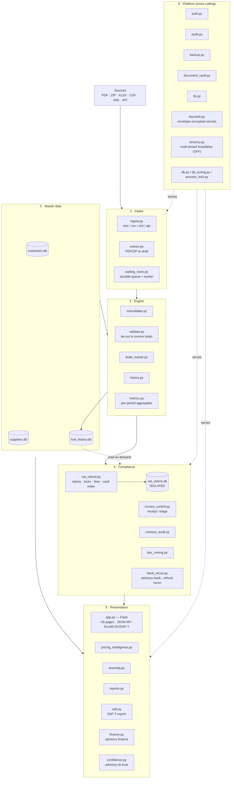

---

### 2. Upload → confirm OK / Bad → process

Every uploaded file is archived and verified on arrival. **OK** is sent for
processing; **Bad** is purged and the whole batch must be re-uploaded.

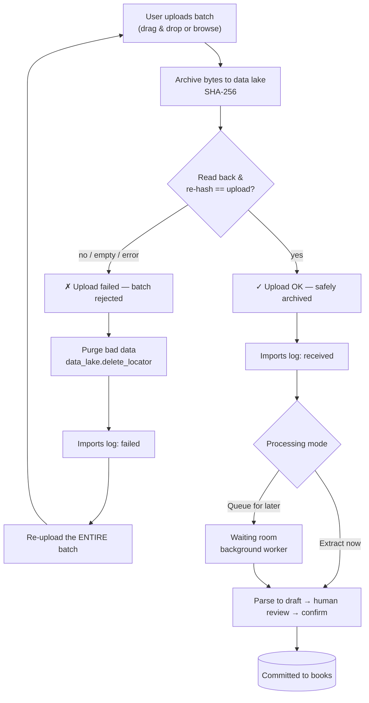

---

### 3. Monthly close pipeline

The routine that turns a month of supplier files into the master workbook, loaded
history, materialized metrics, receipt control, and a backup. The whole chain is
orchestrated by `engine_close.py` (restartable, one audit trail) and can be launched
one‑click from the admin UI (`/close`), which enqueues a `close` job to the worker.

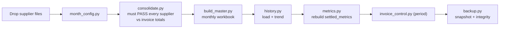

> The one‑click path: admin **`/close`** → waiting‑room kind `close` (`KIND_CLOSE`) →
> worker runs `engine_close.close(period)` over the same stages above.

---

### 4. VAT refund claim lifecycle (status codes 1A → 5)

A claim per entity × country × period. **1A–1E are system-controlled** — derived from
the adjustable checklist (contract, customer data, bank account, NACE, trade register,
power of attorney + invoices processed, documents attached, period ended). The rest
are advanced manually. Submission locks the invoices (one invoice, one submission);
rejection / appeal / confiscation **keep** the locks — only an explicit withdraw
releases them.

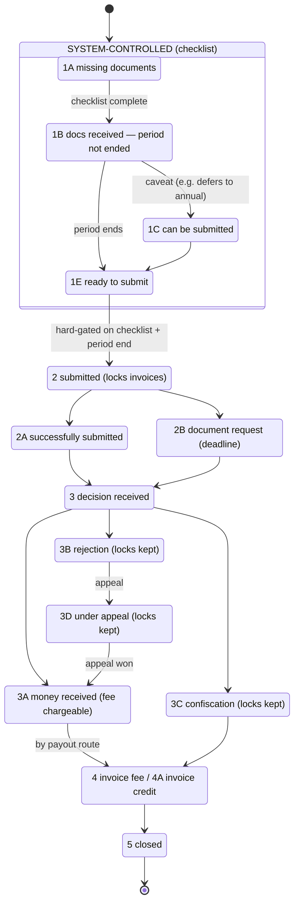

The checklist itself is **adjustable** (Customers page) and **system-verified**:

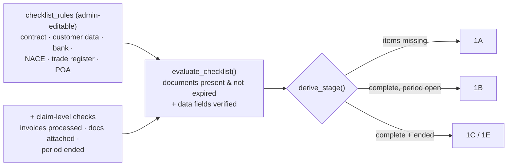

---

### 5. Databases — separated on purpose

Each store has one owner module and its own file, so *who we are*, *who they are*, and
*what happened* stay apart — and the monthly rebuild can never corrupt the claim records.

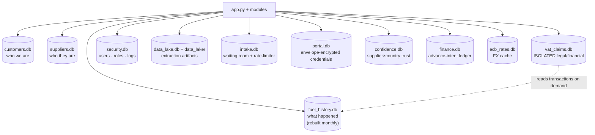

---

### 6. Storage — document vault & data lake

Originals and AI-extraction outputs are filed under the same logical tree across
interchangeable backends; every file carries a SHA-256 for dedup and integrity.

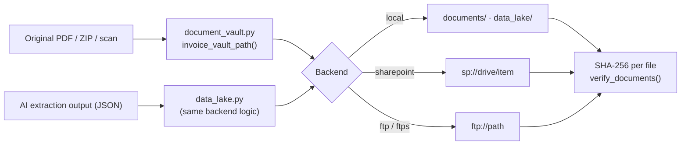

---

### 7. Request lifecycle & background workers

A web request is wrapped by audit + security hooks; two background singletons run
under the production server (never on import).

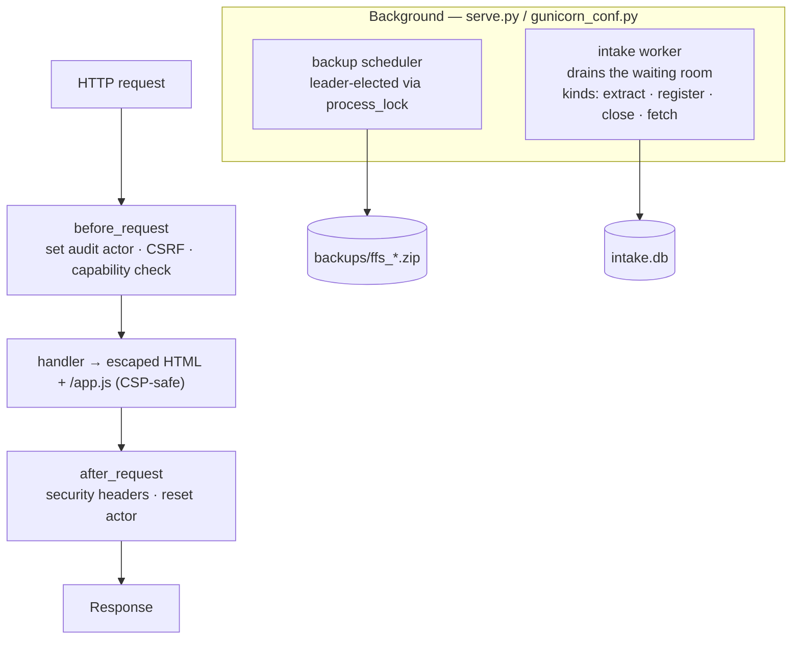

---

### 7b. Automated document capture (worker tier)

Portal fetching never runs inline in a web request. A pull is enqueued as a `fetch`
job, gated by a **per-supplier rate-limiter / circuit-breaker** (opt-in), and an
off-by-default **scheduler** auto-enqueues pulls. The worker calls `portal_scraper`,
which reads the supplier's **envelope-encrypted** credentials via `keyvault.py`.

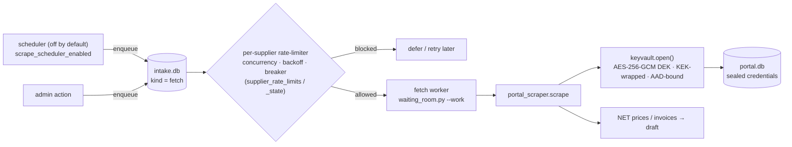

---

### 8. Roles & authorization

Two roles; a processor's capabilities are admin-tunable switches. Enforcement is
central, per endpoint.

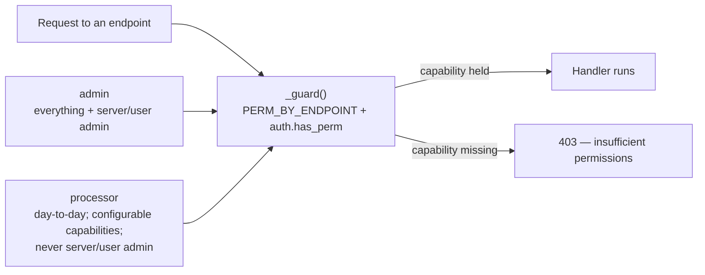

---

### 9. Claim composition & document resolution

A claim is built **from registered invoices** — one row per (invoice, product code), never
a synthetic aggregate. A line that can't be tied to a documented invoice blocks filing, and
is resolved in place by uploading or attaching an already-stored file.

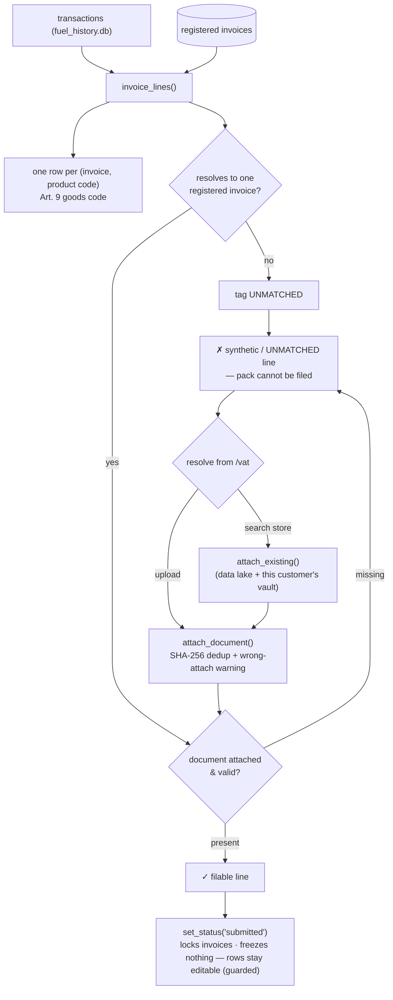

---

### 10. Scaling — one box to a multi-server fleet

The same codebase grows by **configuration, not rewrite**. Node roles split the web
tier from a worker fleet; signed-cookie sessions need no sticky routing (one shared
`FFS_SECRET_KEY`); the database tier moves SQLite → PostgreSQL via `db.py`; documents
move to object storage. Full ladder & env reference in **[docs/MANUAL.md#scaling-the-fleet-fuel-vat-refund-system](docs/MANUAL.md#scaling-the-fleet-fuel-vat-refund-system)**.

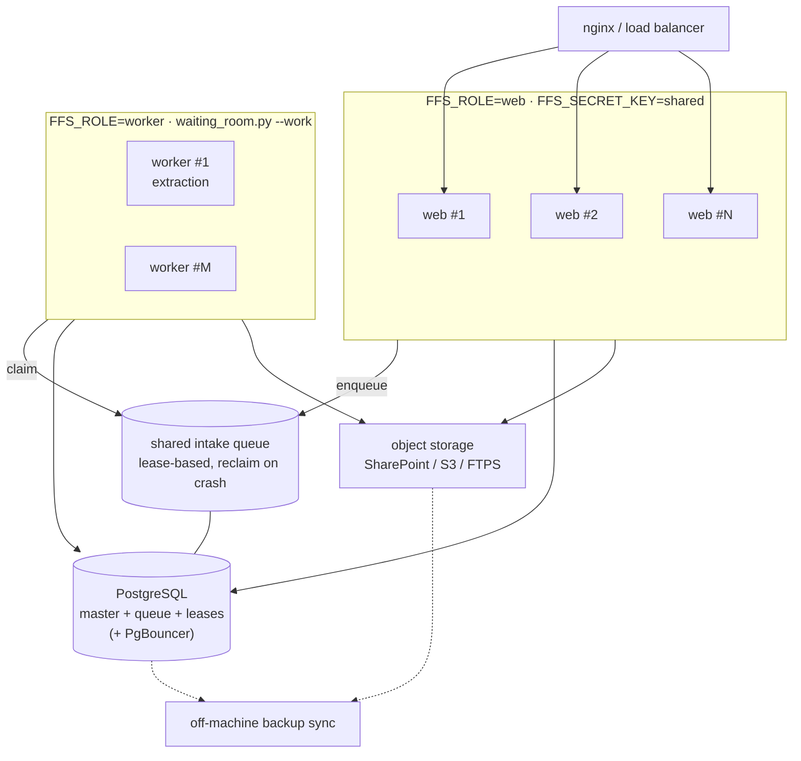

> **Status:** node roles, shared sessions, pluggable storage, the lease queue + leader-
> elected scheduler, and the `?`→`%s` paramstyle shim ship today (tested on SQLite). The
> live PostgreSQL cutover (dialect functions, audit-trigger port, `SKIP LOCKED` queue)
> is the remaining work — see docs/MANUAL.md#scaling-the-fleet-fuel-vat-refund-system "Remaining blockers".

---

### 11. Self-control — errors, backups & data integrity

Every failure is recorded where an admin can see it, and the physical PDF/ZIP store is
verified against its recorded hashes. The loop is *active*: an integrity failure both
raises a red banner and writes an entry to the error log.

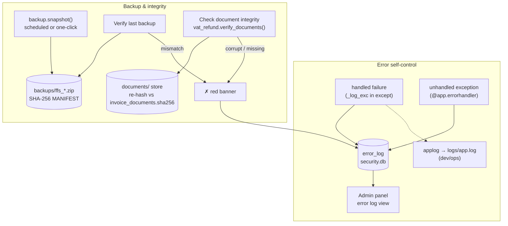

---

## File index — what every file does

A plain‑language map of every module, grouped by the role it plays. The Python files
live flat in the repo root by design (each is location‑independent and imports its
siblings directly), so this index is how you navigate them. See
[#architecture](#architecture) for how they fit together.

### Web app & serving
| File | What it does |
|------|--------------|
| `app.py` | The Flask web application — ~25 pages, the JSON API, Excel exports, the request hooks (auth actor, security headers), and the background‑worker starters. |
| `serve.py` | Production launcher (waitress; Windows + Linux). Starts the app + the auto‑backup and intake background workers. HTTPS if a certificate is present. |
| `gunicorn_conf.py` | Gunicorn config for running several worker processes on Linux; its `post_fork` hook starts the background workers in each worker. |
| `queries.py` | Read‑only SQL aggregations used by the dashboard/compare/analytics pages (kept separate so they're easy to test). |
| `reports.py` | Polished Excel workbooks (executive summary, fee report/statement, claims readiness). |

### Authentication, audit & platform
| File | What it does |
|------|--------------|
| `auth.py` | Users, roles (admin/processor) and capabilities, scrypt password hashing, login lockout / IP throttle, app settings, error log. Owns `security.db`. |
| `audit.py` | Trigger‑based change history in every database (old/new snapshots + acting user); `history()`, `diff()`, `as_of()`. |
| `backup.py` | Crash‑consistent snapshots of all DBs + the document store + audit CSVs into `backups/`, each entry SHA‑256'd; `verify()`, `restore()`, rotation. |
| `db.py` | Database abstraction seam — SQLite by default, the documented path to PostgreSQL. |
| `db_tuning.py` | Applies WAL + busy_timeout + synchronous=NORMAL to every connection so multiple processes can share the `.db` files safely. |
| `db_migrate.py` | Versioned schema migrations: each module's ALTERs run **once per database** (recorded in `_ffs_migrations`) instead of being retried on every connect. |
| `applog.py` | The logging layer — `applog.get(name)` returns a configured logger (rotating `logs/app.log`, WARNING+ to stderr). |
| `process_lock.py` | Cross‑process advisory lease lock (SQLite) — makes the scheduled backup a singleton and guards “one at a time” operations. |
| `tls.py` | Builds the TLS context from a cert/key/chain or a PKCS#12 `.pfx` (env‑configurable). |
| `make_cert.py` | Generates a self‑signed certificate for internal use. |
| `keyvault.py` | Envelope‑encryption credential custody: a fresh AES‑256‑GCM data key per secret, wrapped by a pluggable Key‑Encryption Key (`LocalKEK` from the app secret, or `EnvKEK`/`"env"` from `FFS_KEK_KEY` / per‑tenant `FFS_KEK_KEY_<TENANT>` for KMS/BYOK), AAD‑bound so a blob can't be replayed into another row. Used by `portal_scraper` for portal credentials. |
| `tenancy.py` | Multi‑tenant **foundation**: a tenant registry (in `security.db`) + a request‑scoped thread‑local tenant context + the `multitenant` master switch (OFF by default = byte‑identical single‑tenant) and inert `scope_clause()`/`require_tenant()` helpers for the deferred per‑table phase. See [docs/STRATEGY.md#multi-tenancy-program-plan](docs/STRATEGY.md#multi-tenancy-program-plan). |
| `metrics.py` | Materialized per‑period dashboard aggregates (`settled_metrics` in `fuel_history.db`, rebuilt at the monthly close so the dashboard reads them cheaply instead of re‑scanning `transactions`) + a recompute‑and‑compare **drift check**; the math is the canonical `queries.py` functions, not a fork. |

### Intake (getting invoices in)
| File | What it does |
|------|--------------|
| `ingest.py` | Source adapters — read supplier data from xlsx / csv / xml / API. |
| `extract.py` | Turn a PDF/ZIP/**XML** batch into a reviewable *draft*: deterministic PDF parser, **UBL/CII e‑invoice parser** (EN 16931, 100% confidence), or AI backend (Claude/OpenAI/Azure). |
| `waiting_room.py` | The durable “waiting room” queue + background worker: park uploads, extract later one at a time, retry on token‑quota outages, hold for manual send. |
| `watch_inbox.py` | Optional folder watcher that auto‑extracts PDFs/ZIPs dropped into an inbox. |

### Engine (monthly pipeline)
| File | What it does |
|------|--------------|
| `consolidate.py` | Map raw supplier rows to the canonical schema and **tie them out to invoice totals**; refuses to build on a mismatch. Also the pipeline smoke test. |
| `validate.py` | Line‑level cross‑checks (VAT rate, signs, ranges, batch tie‑out) + a regression baseline; blocks commit on errors. |
| `build_master.py` | Builds the monthly master workbook (benchmark, comparison, stations, VAT view). |
| `history.py` | Loads a period into `fuel_history.db` (idempotent) and produces the trend report. Defines the `transactions` table (the `settled_metrics` materialized aggregates are written alongside by `metrics.py` at the close). |
| `supplier_specs.py` | The trainable per‑supplier registry: row maps and validation targets. |
| `month_config.py` | The one file edited each month: period, input files, FX. |
| `vat_config.py` | Regulatory constants: goods codes, the 400/50 EUR minimums, deadline rule. |

### Master data
| File | What it does |
|------|--------------|
| `customer_master.py` / `customers.db` | Our entities (the refund applicants): registration/VAT, payout IBAN, portals, onboarding & per‑country activation, and the fee terms. |
| `supplier_master.py` / `suppliers.db` | Suppliers: legal identity, per‑country VAT registrations, banks, product catalogues, the invoice registry, statements, cadence. |

### VAT refunds, fees & compliance
| File | What it does |
|------|--------------|
| `vat_refund.py` / `vat_claims.db` | The heart: claims per entity × country × period, thresholds, one‑invoice‑one‑submission locks, the fee lifecycle, the document‑vault index, and the dynamic quarter→annual merge. Claim records live in their **own isolated database**; transactions are read from `fuel_history.db` via `analytics_connect()`. |
| `data_lake.py` | The data lake / **permanent file archive**: every uploaded file (and AI‑processed output) stored as files (same backends as the document vault), indexed in `data_lake.db` with SHA‑256; `verify()` integrity, explicit `delete()` only. Readable by any module. |
| `import_log.py` | Append‑only log of every data‑import attempt and outcome (received / success / partial / failed), with the actor, file, client/supplier and record count — the `/imports` report. |
| `invoice_control.py` | Receipt control (cadence × activity) and statement reconciliation with VAT triage (process / discard / discard‑domestic). |
| `contract_audit.py` | Contract‑compliance auditor: checks each invoiced line against the supplier's structured discount terms (`supplier_discounts`) and flags short discounts / over‑ceiling prices with the recoverable EUR. |
| `doc_mining.py` | Mines the vaulted documents (PDF text + XML) for EU VAT numbers and proposes fills for the INPUT gaps in supplier/customer master data. |
| `document_vault.py` | The document vault: the logical folder‑path builder and the storage backends — local / SharePoint / FTP(S) — plus integrity and re‑file helpers. |
| `pricing_intelligence.py` | Competitor NET‑price tracking and margin analysis against three baselines, plus a **self‑sourced benchmark** built from your own multi‑supplier purchases (best price achieved + avoidable overpay). |
| `portal_scraper.py` | Dynamic client‑portal price scraping: pluggable per‑supplier adapters that log into the entities' own authorized supplier portals and load NET prices into MY Prices. Credentials encrypted at rest (`portal.db`). |
| `anomaly.py` | Relative anomaly scan (station price vs country average, MoM jumps, volume spikes, off‑period dates). |
| `ecb_rates.py` / `market_prices.py` | Reference FX (ECB) and market fuel‑price pulls. |
| `money.py` | Decimal money helpers (ROUND_HALF_UP): `f2/fsum/q2`. Use these, never bare `round()` on currency. |
| `confidence.py` / `confidence.db` | Per‑(supplier × country) **trust score** (grows on clean validations, decays on flags) + an append‑only validation‑event ledger. App‑owned runtime DB. Governs **only** whether the advisory AI review runs — never a legal gate; fails toward doing the review. |
| `finance.py` / `finance.db` | Embedded‑finance seam — the financeable VAT receivable (reuses `recovery_report`) + advance‑offer economics + a `NullProvider` (default; a licensed factoring partner plugs in). Origination only, additive analytics; never lends, never touches a VAT figure/gate/lock. |
| `bank_recon.py` | Open‑banking **reconciliation** — advisory matching of bank credits (CSV upload today; AISP‑agent provider seam, NullProvider default) against expected VAT refunds by amount/date. Stateless; mutates nothing (never marks a claim paid). |
| `saft.py` | Programmable OECD‑SAF‑T‑**core** XML generator, parameterized by a `CountryProfile` (namespace/version/file‑naming); reuses `queries.q_ledger` so totals reconcile with the accounting CSV. A core structure, not a validated per‑country submission. See [docs/MANUAL.md#saf-t-export-programmable-oecd-core-generator-prework](docs/MANUAL.md#saf-t-export-programmable-oecd-core-generator-prework). |

### Install, launch & utilities
| File | What it does |
|------|--------------|
| `setup_wizard.py` | First‑run guided setup; creates the admin, cert, first backup; re‑runnable, `--yes` for automation. |
| `start.py` + `start.sh` / `start.bat` / `start.command` | One‑click launch (no terminal): install deps, start the server, open the browser to setup. |
| `install.sh` / `install.bat` / `install_service_windows.ps1` | Guided installers / Windows service registration. |
| `cleanup.py` | Safely stops a running `app.py` (without matching itself, unlike `pkill`). |

### Sample / demo data generators (not part of the running app)
| File | What it does |
|------|--------------|
| `sample_build_q8.py`, `sample_build_bp.py`, `sample_build_dkv.py`, `sample_build_e100.py`, `sample_build_moeve.py`, `sample_build_tfc.py`, `sample_build_q8_full.py` | Generate the example supplier transaction workbooks used by the demo dataset (one per supplier). |
| `sample_dkv_data.py`, `sample_e100_data.py`, `sample_moeve_data.py` | The raw sample rows those builders use. |
| `sample_q8_adjust.py` | Produces the Q8 adjusted‑pricing sample workbook. |

### Tests
`tests/` — the pytest suite (web, security, auth, customers, claims, vault, intake
queue, multi‑process, reports, money, …) plus `conftest.py` fixtures. Run with
`python -m pytest tests/ -q`.
