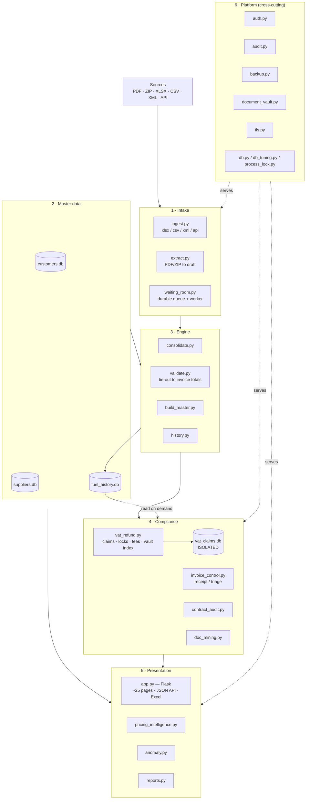
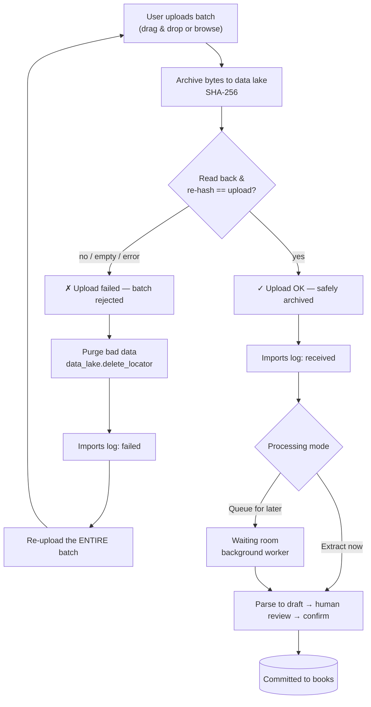
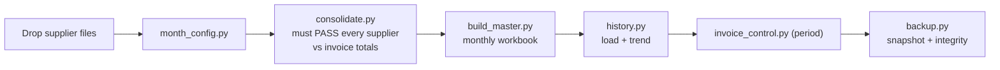
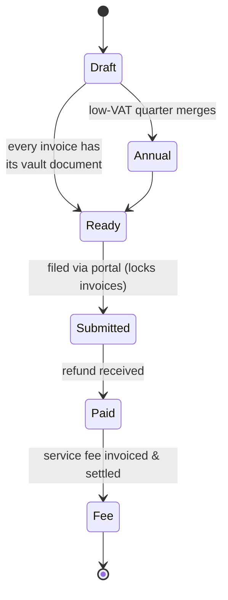
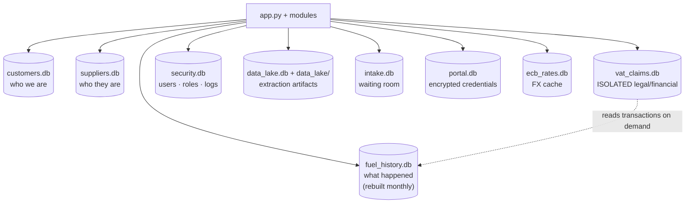
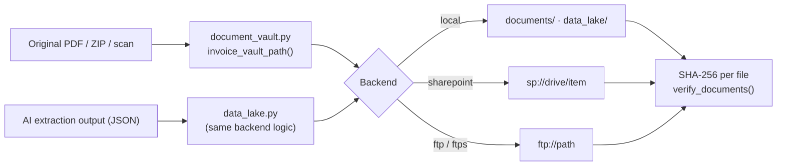
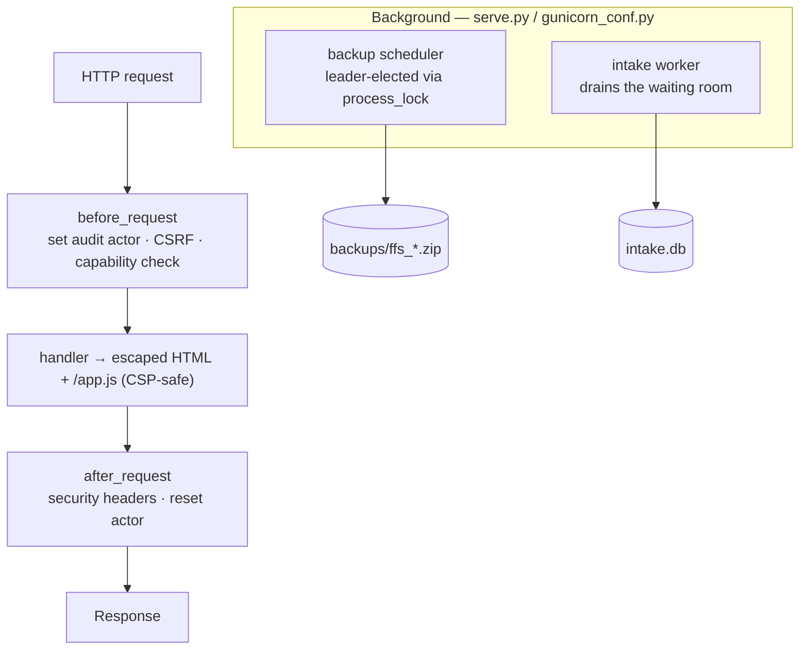
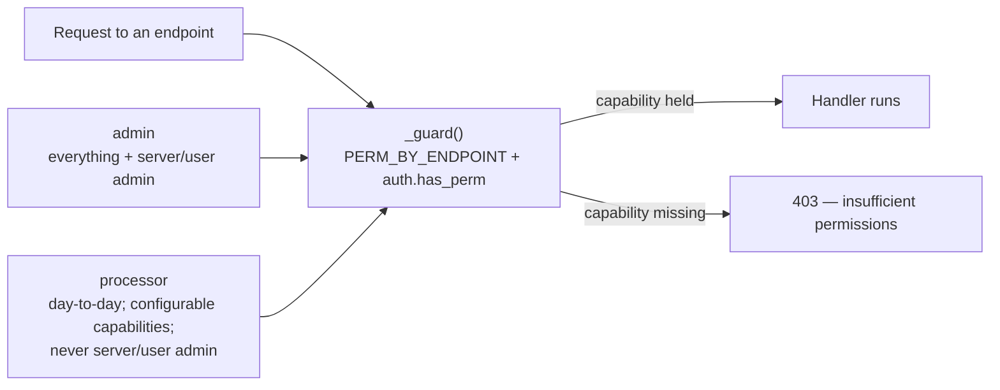

# System schematics

Visual maps of how the Fleet Fuel & VAT Refund System works. Diagrams are written in
[Mermaid](https://mermaid.js.org/) — they render automatically on GitHub and in the
web app. For the narrative version see **[ARCHITECTURE.md](ARCHITECTURE.md)**.

---

## 1. System overview — the six blocks

How a supplier's data travels from a file all the way to a VAT claim and a report,
with the platform services underneath.

---

## 2. Upload → confirm OK / Bad → process

Every uploaded file is archived and verified on arrival. **OK** is sent for
processing; **Bad** is purged and the whole batch must be re-uploaded.

---

## 3. Monthly close pipeline

The linear routine that turns a month of supplier files into the master workbook,
loaded history, receipt control, and a backup.

---

## 4. VAT refund claim lifecycle

A claim per entity × country × period. Low-VAT quarters merge dynamically into the
annual claim; submission locks the invoices (one invoice, one submission).

---

## 5. Databases — separated on purpose

Each store has one owner module and its own file, so *who we are*, *who they are*, and
*what happened* stay apart — and the monthly rebuild can never corrupt the claim records.

---

## 6. Storage — document vault & data lake

Originals and AI-extraction outputs are filed under the same logical tree across
interchangeable backends; every file carries a SHA-256 for dedup and integrity.

---

## 7. Request lifecycle & background workers

A web request is wrapped by audit + security hooks; two background singletons run
under the production server (never on import).

---

## 8. Roles & authorization

Two roles; a processor's capabilities are admin-tunable switches. Enforcement is
central, per endpoint.

