# System schematics

Visual maps of how the Fleet Fuel & VAT Refund System works. Diagrams are written in
[Mermaid](https://mermaid.js.org/) — they render automatically on GitHub and in the
web app. For the narrative version see **[ARCHITECTURE.md](ARCHITECTURE.md)**.

---

## 1. System overview — the six blocks

How a supplier's data travels from a file all the way to a VAT claim and a report,
with the platform services underneath.

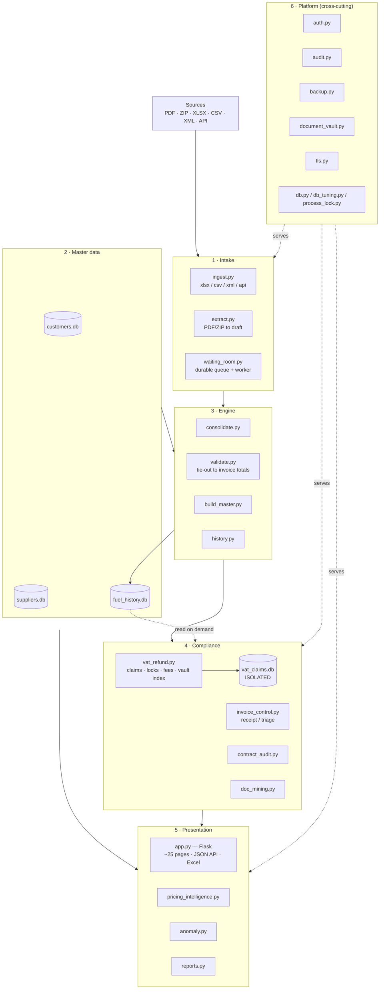

---

## 2. Upload → confirm OK / Bad → process

Every uploaded file is archived and verified on arrival. **OK** is sent for
processing; **Bad** is purged and the whole batch must be re-uploaded.

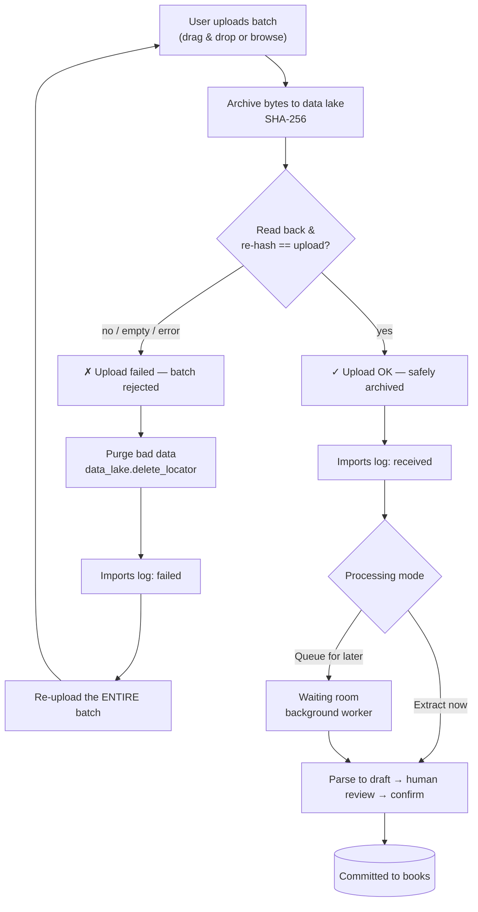

---

## 3. Monthly close pipeline

The linear routine that turns a month of supplier files into the master workbook,
loaded history, receipt control, and a backup.

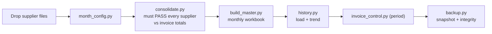

---

## 4. VAT refund claim lifecycle (status codes 1A → 5)

A claim per entity × country × period. **1A–1E are system-controlled** — derived from
the adjustable checklist (contract, customer data, bank account, NACE, trade register,
power of attorney + invoices processed, documents attached, period ended). The rest
are advanced manually. Submission locks the invoices (one invoice, one submission);
rejection / appeal / confiscation **keep** the locks — only an explicit withdraw
releases them.

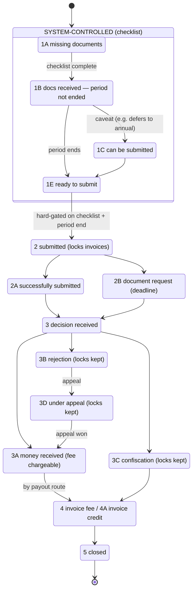

The checklist itself is **adjustable** (Customers page) and **system-verified**:

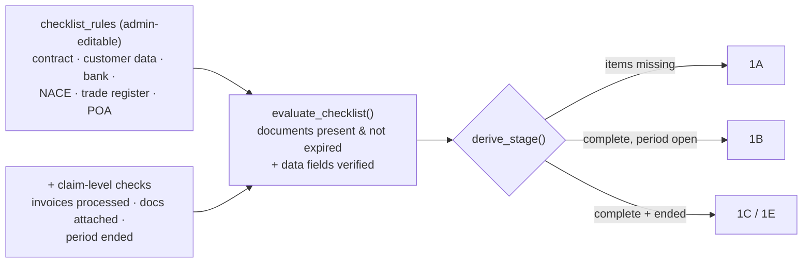

---

## 5. Databases — separated on purpose

Each store has one owner module and its own file, so *who we are*, *who they are*, and
*what happened* stay apart — and the monthly rebuild can never corrupt the claim records.

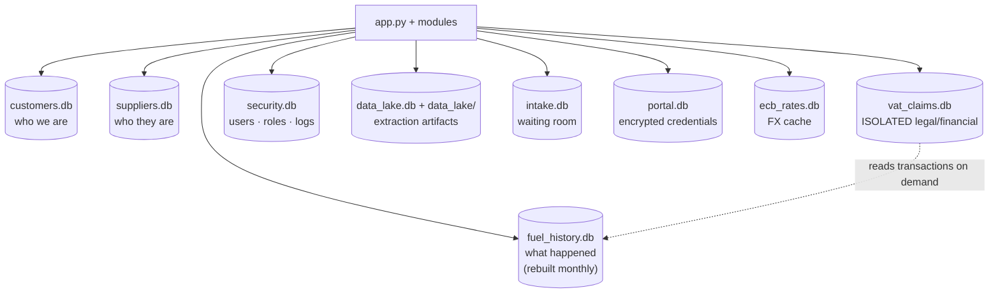

---

## 6. Storage — document vault & data lake

Originals and AI-extraction outputs are filed under the same logical tree across
interchangeable backends; every file carries a SHA-256 for dedup and integrity.

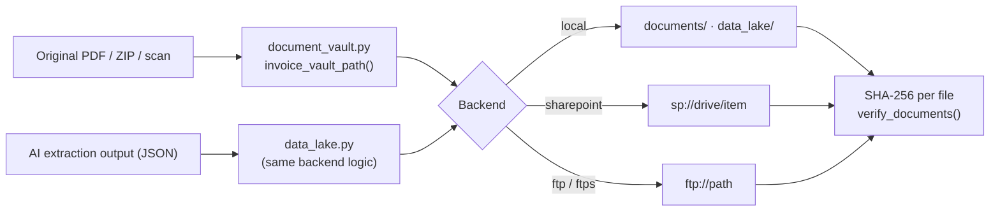

---

## 7. Request lifecycle & background workers

A web request is wrapped by audit + security hooks; two background singletons run
under the production server (never on import).

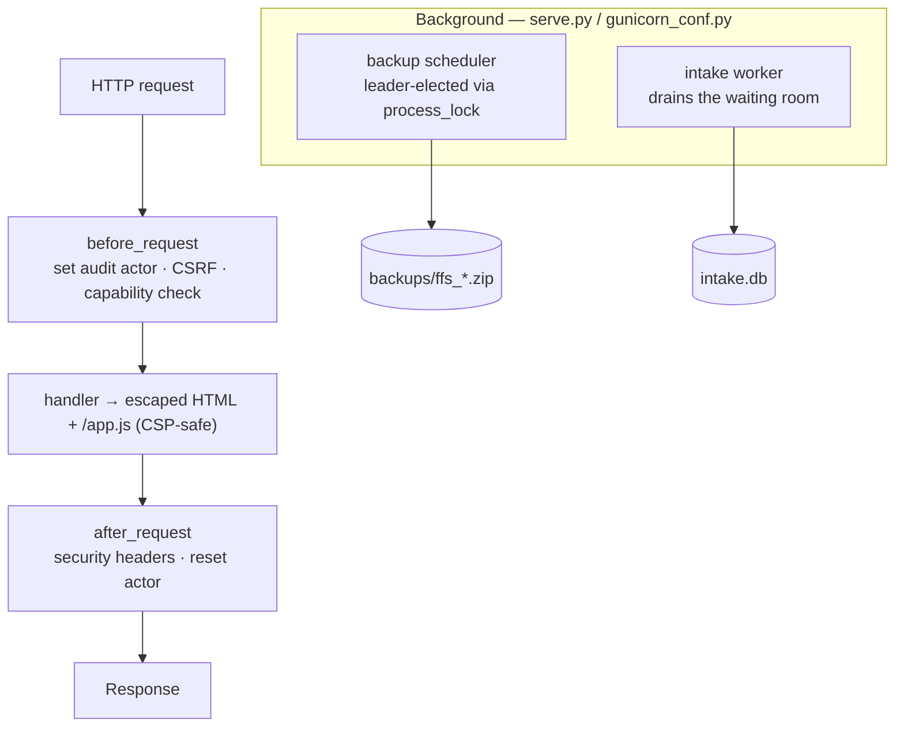

---

## 8. Roles & authorization

Two roles; a processor's capabilities are admin-tunable switches. Enforcement is
central, per endpoint.

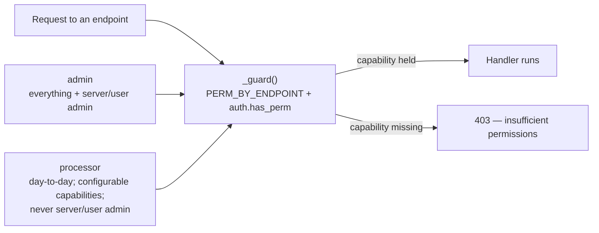

---

## 9. Claim composition & document resolution

A claim is built **from registered invoices** — one row per (invoice, product code), never
a synthetic aggregate. A line that can't be tied to a documented invoice blocks filing, and
is resolved in place by uploading or attaching an already-stored file.

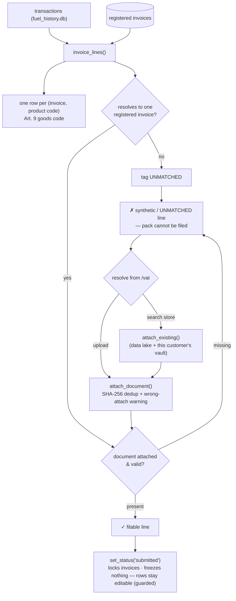

---

## 10. Scaling — one box to a multi-server fleet

The same codebase grows by **configuration, not rewrite**. Node roles split the web
tier from a worker fleet; signed-cookie sessions need no sticky routing (one shared
`FFS_SECRET_KEY`); the database tier moves SQLite → PostgreSQL via `db.py`; documents
move to object storage. Full ladder & env reference in **[SCALING.md](SCALING.md)**.

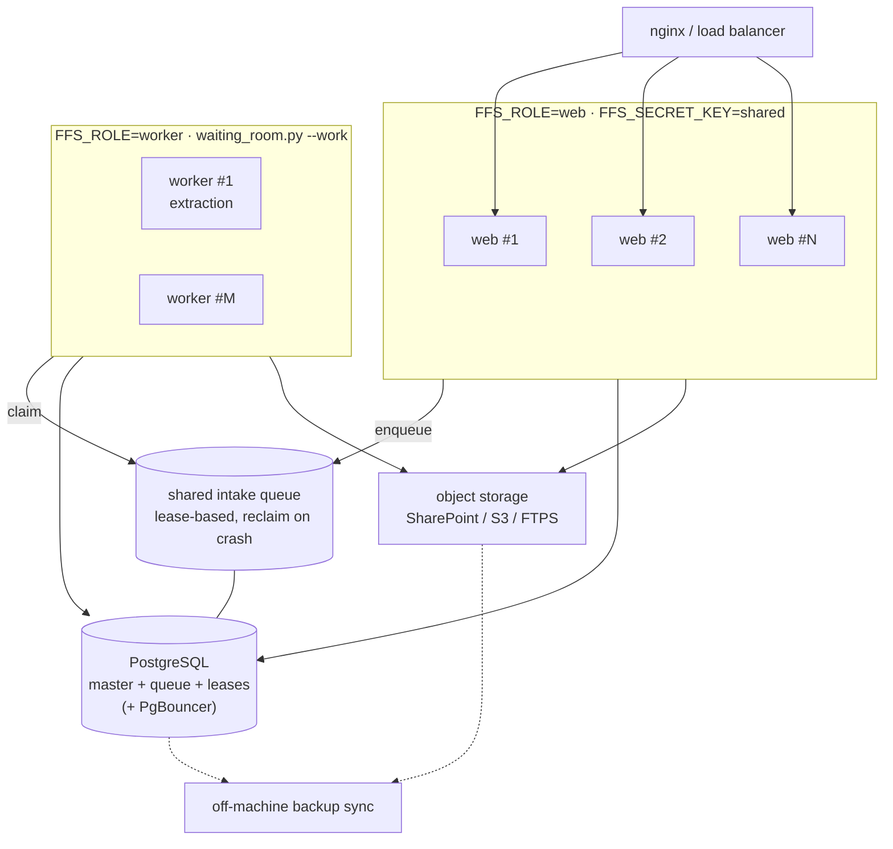

> **Status:** node roles, shared sessions, pluggable storage, the lease queue + leader-
> elected scheduler, and the `?`→`%s` paramstyle shim ship today (tested on SQLite). The
> live PostgreSQL cutover (dialect functions, audit-trigger port, `SKIP LOCKED` queue)
> is the remaining work — see SCALING.md "Remaining blockers".

---

## 11. Self-control — errors, backups & data integrity

Every failure is recorded where an admin can see it, and the physical PDF/ZIP store is
verified against its recorded hashes. The loop is *active*: an integrity failure both
raises a red banner and writes an entry to the error log.

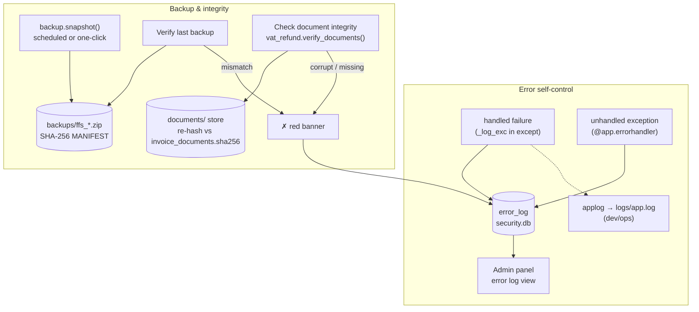
