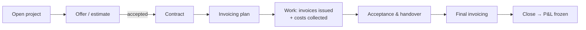

# InvoiceIQ — User Manual

> The hands-on guide to the product, screen by screen and workflow by workflow.
> Architecture and specification live in [`docs/architecture/`](./architecture/);
> this document is for the person **using** the workspace. Examples use neutral
> placeholder businesses — every feature works the same for any industry.

---

## 1. Getting started

### 1.1 Signing in and workspaces

- **Register** creates a new, fully isolated workspace (organization) with you as
  its **owner**. Registering the same company name twice creates a second,
  separate workspace — data is never merged.
- **Invitations** are the only way into an existing workspace: a teammate with
  the right role sends an invite from **Workspace → Team**; the link sets your
  name and password and drops you into that workspace with the role the inviter
  chose.
- If you belong to several workspaces, the **organization switcher** (top bar)
  moves between them. Each switch is a hard context change — lists, reports and
  permissions all follow the selected workspace.
- Single sign-on (OIDC) and SCIM user provisioning are available per workspace
  for enterprise setups (**Settings**).

### 1.2 Roles — who can do what

Four stored role tiers resolve into an 8-role, deny-by-default permission
matrix that the server enforces on every request (the UI merely hides what you
cannot do). Team invites can also assign the finer business roles (for example
**finance manager** — full bookkeeping without workspace administration):

| Role | Typical person | Can |
|---|---|---|
| **Owner** | founder / managing director | everything below, plus access control, audit log, billing, workspace settings |
| **Admin** | office manager | manage catalogs (tax codes, currencies, cost objects), documents, dunning, policies, team |
| **User** | employee / bookkeeper | day-to-day work their business role permits (expenses; for a finance manager: invoices, payments, issuing, projects) |
| **Read-only** | reviewer / accountant with view access | look, never touch |

Two boundaries worth knowing:

- **Document wording is configuration**: saving or editing a contract/offer
  template needs settings-manage rights, even though *generating* a document
  from a template only needs invoice-write. A bookkeeper books; an owner or
  admin decides what the company's contracts say.
- **Segregation of duties** on money movement: the person who creates a payment
  run cannot approve it, and neither can mark it paid.

### 1.3 The getting-started checklist

A fresh workspace shows a **Getting started** card on the dashboard: company
profile → modules → team → first customer → first invoice. Each step links to
the screen that completes it, and the card notices by itself — it is computed
from what already exists, so finishing a step anywhere ticks it here. An admin
can **dismiss** the card for the whole workspace; it also disappears on its own
once every step is done.

---

## 2. Payables — supplier invoices in

### 2.1 Capture

Three ways in, all landing in the same pipeline:

- **Upload** (`Payables → Upload`): PDF (text layer or scanned — OCR runs on the
  worker), UBL/CII e-invoice XML, Factur-X hybrid, CSV/JSON. Drop **up to 25
  files at once** — an envelope, a supplier's monthly run, a folder of scans —
  and each one is captured separately: the results list gives every accepted
  file its own review link and says, in its own words, why any file was not
  accepted. One rejected file never discards the rest. Note that the plan's
  monthly upload allowance counts **documents**, so a batch of ten uses ten.
  Large or scanned files parse asynchronously; the capture appears in
  **Captures** while it runs, and the review screen reports what the reader is
  doing — including *"Recognising page 12 of 40"* on a long scan, so you can
  tell a slow document from a stuck one.
- **Email intake** (`Payables → Email intake`, module): each workspace gets an
  inbound address; attachments are parsed and queued for review.
- **API ingest** for automation.

Every capture records **provenance**: which method read the file, which fields
were extracted vs. defaulted, and (for OCR/AI paths) per-field confidence.
Nothing is booked without a human confirming it in the **Review** queue.

### 2.2 Review and validation

The review screen shows the parsed draft field by field. One validation engine
runs two kinds of rules: **blocking** (tax totals that don't add up, missing
mandatory fields) and **advisory** (possible duplicates — exact number matches
and same-vendor/similar-amount candidates — flagged, never silently dropped).
Confirming saves the invoice with EUR conversion at the ECB rate for the issue
date, with the FX source recorded.

### 2.3 Suppliers under dual control

`Payables → Suppliers` is the vendor master. Changing an existing supplier's
**IBAN or tax id** never writes directly — it creates a **pending change
request** that a *different* admin must apply. Payment runs refuse a vendor with
a pending change. This is the classic invoice-fraud control, on by default.

### 2.4 Approval and payment

Invoices move through an approval workflow (priority-ordered policies, e.g.
"above 1 000 € needs a second pair of eyes"). Approved invoices are grouped
into **payment runs** (`Payables → Payment runs`): create → approve (different
person) → mark paid (third person), then export the SEPA `pain.001` bank file —
export-once guarded, every export audited with its message id.

### 2.5 Deleting, trash, and the archive

- **Trash** (`Invoices → Trash`): deleting an invoice is a soft delete with a
  consent step; trashed invoices can be restored. The same 30-day bin covers
  expense reports, expense inbox lines, recurring schedules and invoice
  attachments — nothing is destroyed on click any more. An invoice that backs
  a filed VAT refund claim refuses deletion entirely until the claim is
  withdrawn.
- **Archive** (`Invoices → Archive`): archived invoices are kept for their full
  retention window (default 3 years) even if the live workspace changes plan.
  Before anything expires you get a **pre-expiry notice** with the option to
  export everything or extend retention; nothing is silently destroyed, and
  every destruction that does happen is audited with what was destroyed.

---

## 3. Receivables — invoicing your customers

- **Issuer profile** (`/issuer`): your legal entity (or several) — name,
  registration, VAT number, address, logo, invoice numbering prefix. An invoice
  cannot be issued until the profile is complete (EU Art. 226 completeness).
- **Issue** (`Receivables → Issue`): line items, per-line VAT (four schemes,
  server-computed), customer from the customer master, optional **project** link
  (see §5 — this is how revenue reaches project profitability). Issued invoices
  are **immutable**: corrections are credit notes, never edits. Every credit
  note names the invoice it corrects — on the row, on the PDF (a labelled
  "CORRECTS" reference) and inside the e-invoice XML (Art. 219's unambiguous
  reference, structural rather than editable text).
- **Receipts & reconciliation**: record money received and allocate one receipt
  across several invoices; import bank statements (CSV, camt.053 XML, or SWIFT
  MT940) and reconcile.
- Overdue EUR invoices with no contractual interest show an **advisory
  statutory late-payment figure** (Directive 2011/7/EU: your configured
  reference rate + 8 points, plus the fixed €40 recovery cost) — computed on
  demand, never booked; the reference rate is set on the Dunning screen.
- **Recurring** schedules, **dunning** reminder ladders, **partner document
  gates** (don't invoice a counterparty whose contract documents are missing),
  and **invoice reports** round out the loop.

---

## 4. Expenses

Employees submit expense reports (standard, mileage, per-diem items) with
receipt photos; an 11-rule policy engine flags violations; approval chains and
reimbursement batches (CSV + SEPA) close the loop. Expense items carry the same
cost dimensions as invoices — including **project**, which is how employee
spend reaches project profitability.

---

## 5. Projects — the full lifecycle, offer to profit

This is the heart of the system for any business that works in projects — a
construction job, a consulting engagement, a season of maintenance contracts.
The product tracks the whole arc:

Every stage is live.

### 5.1 Open a project

`Workspace → Cost objects → Projects`. A project has a code, a name, dates and
a status (`active → closed → archived`). Click through to the **project page**
(`/projects/{id}`) — the one screen where the whole lifecycle lives.

### 5.2 Offers and estimates

The **Offers** card: draft an offer with line items and a total, send it,
and record the outcome — `accepted`, `rejected`, or revise it (a revision is a
new **version**; the old one is kept as `superseded`, so the negotiation
history survives). A sent offer can be pulled back to draft. Offer numbering
follows your workspace's own scheme — the platform only enforces uniqueness.

The latest **accepted** offer's total becomes the project's **estimated
revenue**, so estimated-vs-actual is readable from day one.

### 5.3 Contract and documents

The **Contract & documents** card stores the signed contract and any other
project papers — uploaded, or **generated from a template** (§6): pick one of
your saved template versions (or a platform standard), and the system fills in
the parties, project, offer total and dates, renders a PDF, and files it with
the project.

### 5.4 The invoicing plan

Break the contracted sum into planned instalments ("advance", "on delivery",
"final"). The plan card tracks **contracted vs. actually issued vs. remaining**
— the figures come from the same source the P&L uses, so the plan never
disagrees with the profit view.

### 5.5 Collecting costs

Three kinds of cost flow into a project, all in EUR at recorded rates:

1. **Supplier invoices** — on any received invoice, the **Project allocation**
   editor assigns the whole invoice, specific lines, or percentage splits
   across projects. Splits are cent-exact: shares are rounded per-share and
   any residue lands deterministically on the largest share.
2. **Expenses** — expense items tagged with the project.
3. **Manual cost entries** — wages, or anything without a document: label,
   category, amount, date, straight on the project page.

### 5.6 Reading the P&L

The project page's P&L card shows revenue (issued invoices linked to the
project, net of credit notes), the three cost streams, profit and margin. The
figures state their own basis — **live figures** while the project runs.

### 5.7 Closing — the freeze

Closing a project **freezes the P&L**: a snapshot is stored in the same
transaction as the status change. Documents that arrive after close (a late
supplier invoice, a straggling expense) do **not** silently move the frozen
numbers — they appear separately as **"arrived after close"** adjustments, so
the closed figure stays the closed figure and the difference is explained.
Reopening a project discards the snapshot (audited) and returns to live
figures.

---

### 5.8 Acceptance and the final invoice

The project page's **Acceptance & final invoice** card closes the loop. When
the work is done (Next actions suggests it once all scheduled assignments
are), generate the acceptance document from its template, get it signed, and
**Record acceptance** — optionally linking the signed file and a note. The
sign-off is stamped, audited, and revocable.

Then **Prepare final invoice**: it starts from the contracted remainder
(what the invoicing plan says is still uninvoiced) and you add **labelled
adjustment lines** — extra work, damages, deductions, either direction — so
the difference explains itself instead of hiding. The composed lines open in
the normal issuing form for review and issue. Two rules the system holds:
a total at or below zero is refused (money flowing back to the customer is a
**credit note**, never a negative invoice), and — if you enable it in
Settings → Projects & offers — the final invoice waits until acceptance is
recorded. The offer numbering prefix lives in the same settings block.

**Job photos.** The project page's **Job photos** card takes pictures
straight from the phone camera (on a computer it's a normal file picker) —
before, during, after. They're stored with the project like every other
document, shown as a tap-to-open grid, and kept exactly as shot, so the
photo's own timestamp stays intact. When it's time to record acceptance, a
photo of the signed sheet is a perfectly good linked document — signed
acceptance plus the pictures is what settles disputes about the final
invoice. Only real images are accepted as photos.

### 5.9 Customers as relationships

Click any customer's name on the Customers list to open their page: a
**stage** you can set (prospect → active → dormant → lost — no separate
"leads" anywhere, on purpose), free-text **notes** ("prefers morning
calls", "gate code 4711"), and an **activity feed** the system writes for
you — offers sent and answered, projects, invoices, every email that
actually went out, and your notes, newest first. Nobody curates it; if it
happened, it's there. Every stage change and note is in the audit log like
everything else.

### 5.10 The client portal

Each customer can get a **private link** (their page: Client portal →
Show portal link) — no account, no password; the link itself is the key.
On it they see their **offers with the line items and Accept / Decline
buttons** (accepting seeds your invoicing plan exactly as if you'd recorded
it), their **invoices with status**, and any **documents you've shared** —
each project document has a Share toggle, and nothing is visible until you
turn it on. The moment they open an offer, your timeline shows "viewed by
the customer" — you know the quote didn't sit unread. Treat the link like
a password: send it privately, **Regenerate** if it leaks (the old link
dies instantly), **Revoke** to close the portal. Every issue/regenerate/
revoke and every portal decision lands in the audit log.

## 5b. The schedule — planning the work

`Overview → Schedule`. Put people on projects for a day or a time window.
Planners (bookkeeping roles and up) see the whole workspace week, filter by
person or project, and assign; everyone else automatically sees **only their
own work** on the same screen — confirm an assignment when you accept it,
mark it done when the work is. Double-bookings are **warned about, never
blocked** — the warning names the colliding times and saves anyway, because
real schedules overlap.

Being assigned, rescheduled or cancelled emails you automatically, and a
**reminder** arrives before each assignment starts (24 hours by default,
adjustable per assignment). **Your calendar on your phone**: the Schedule
page's setup card gives you a private subscription link — add it once in
Google, Apple or Outlook calendar and your assignments appear and stay
updated. Anyone with the link can see your schedule, so treat it like a
password; **Regenerate** cuts off the old link instantly.

**Customer arrival notices** — "we arrive on {date}" by email, so the door is
open and the no-show visit stops eating your margin. Opt-in: turn it on in
`Workspace → Settings → Schedule notices` (24, 48 or 72 hours before), and
link each project to its customer on the project page (the customer needs an
email address). Every assignment can override the timing — or enable a
one-off notice even while the workspace default is off. Notices respect
quiet hours (nothing lands at 03:00 — it waits for morning), are sent **once
per assignment**, follow reschedules automatically, and appear in the sent
log like every other email. The same settings card also sets your team's
default reminder lead. SMS notices are a possible later addition (they cost
money per message, so that needs a provider decision first).

## 6. Document templates

`Workspace → Templates`. The trust model, in one sentence: **the platform
provides master documents; you adjust them into your own versions, and nothing
the platform does later ever changes your saved copies.**

- **Standard documents** (left): maintained by the platform operator — a demo
  contract, acceptance document and offer cover letter to start with (each says
  in its own text that it is an example, not legal advice; professionally
  drafted standard texts replace them centrally when available).
- **Adjust** copies a master's text into the editor. Edit it, name it ("Our
  contract — strict payment terms"), save. Keep as many versions as you like;
  edit or delete them freely. Your copies are frozen — a later change to the
  master never reaches them.
- **Placeholders** like `{{project.code}}`, `{{customer.name}}`,
  `{{offer.total}}`, `{{company.legal_name}}` are filled when you generate a
  document from a project. Anything the system doesn't know **stays visibly
  unreplaced** in the output — a gap you can see before anyone signs, instead
  of a silently blank clause.
- Generating (project page → Contract card → "Generate from template…")
  renders your chosen version against the project and files the PDF with the
  project's documents.

Saving or editing template text requires settings-manage rights; generating
documents needs only the normal bookkeeping role.

---

## 6b. Next actions

The dashboard's **Next actions** card is the day's work, computed from your
records: offers sitting unanswered past three days, invoices past due with
money outstanding, uploads waiting for review, and your own recurring
deadlines ("prepare the VAT report" — set the day, cadence and lead time
once). Every item clears ITSELF when the work happens — accept the offer,
receive the payment, confirm the upload — and **Dismiss** silences one item
forever. Nothing piles up, by design.

## 7. Insights

- **Dashboard** — "what needs me today": approvals waiting, captures to
  review, aging, cash position; every section respects your role.
- **Explore** — self-service pivot over spend by any dimension.
- **Pipeline** — every offer as a board: Draft, Sent, Won, Lost. An offer
  that sat with the customer past the threshold turns red with its age —
  that is the one to chase today. Cards link to their project.
- **Supplier costs** — what you actually pay per supplier and item, from the
  invoices already captured: an item appears after two priced purchases, the
  change compares the latest price with the weighted average of everything
  before it, and clicking any row draws its price history. Purchases in other
  currencies are flagged, never silently mixed in. When a supplier quietly
  raises a price, this page is where it shows. The same page holds your
  **agreed prices** — what a unit price *should* be, per supplier and item
  (matched against invoice line descriptions, with a validity window). Lines
  priced above the agreement are flagged on capture, listed in the
  **Overcharges** worklist with the damage priced out ((paid − agreed) ×
  quantity), and — if you turn on *Block overcharges* in Settings — refused
  at submit until corrected.
- **Benchmark, FX, Cash position, Budget** — supplier comparison, ECB-vs-paid
  FX markup, receivables/payables position, category budgets.
- Exports are CSV/Excel/PDF, formula-injection-safe, with the basis (net, EUR)
  stated on the file.

---

## 7b. VAT recovery (transport)

An entitlement-gated vertical for foreign VAT refunds on fuel and road costs.
The short tour — the full operating rules live in
[`docs/transport/rules.md`](./transport/rules.md):

- **Fuel-card statements in** — Eurowag, E100, Q8, DKV and TFC statements parse
  into typed fuel transactions (idempotent; each network's money model handled
  by its own parser behind one shared contract). A nine-rule capture review
  gate blocks registration of a statement that does not reconcile, and a
  human-typed tie-out must match the engine's own totals before a monthly
  close completes. Whatever a statement is flagged for now lands in a
  **review queue** on the same screen (`Transport → Register a statement`)
  instead of only in the upload's own reply: advisory notes on a statement
  that registered, and — the case that previously left nothing at all — the
  errors that made one be refused, naming the line and the rule. A finding
  stays there until somebody marks it **Resolved** or **Not an issue**, and
  which of the two they chose is on the audit record. Uploading the same file
  again does not duplicate its findings; a finding that comes back after
  being resolved does reappear, because it is true again.
- **Anomalies** (`Insights → Negotiation evidence → Anomalies`) — six checks
  over a month's fuel lines: a station priced above the others you used in that
  country, a supplier whose month-on-month move went against the market's, an
  unusual fill for that vehicle, a vehicle paying above the rest of the fleet,
  a transaction dated outside the month it was loaded into, and diesel bought
  overnight. Every bound is learned from **your own data's spread** — never a
  fixed price, because fuel prices move and a fixed price would quietly stop
  being right. Each finding shows the two numbers it compared, and a check that
  could not run (no previous month to measure a move against, say) says so
  rather than showing you a reassuring blank.
- **Claims** — per legal entity × refund country × period. Building a claim
  groups eligible transactions into lines; an UNMATCHED line names the
  suppliers behind it so you know who to chase. Submitting **freezes** every
  line and the VAT base: what was filed is what stays on record. Article 17
  minimums, period deadlines, document-presence gates and the adjustable
  checklist all refuse a submission that would not survive the authority's own
  checks.
- **Documents on file** — a claim is filed in your client's name under a power
  of attorney, so the submission checklist asks for the paperwork: the signed
  contract, the trade register extract, and one power of attorney *per refund
  country*. Add them on the customer activation screen. Two things it is worth
  knowing. A document with **no stated expiry never lapses** — leaving the date
  blank means "this does not expire", not "expired". And a document that HAS
  lapsed stays on the list, marked with the date it ran out, because knowing a
  power of attorney expired in March is a different job from never having had
  one. The checklist says which. Where the map knows the answer, it also names
  the national authority the power of attorney has to be addressed to; where it
  does not, it says nothing rather than guessing at a name that would get the
  document refused.
- **Business activity (NACE)** — the refund directive wants the applicant's
  line of business, so the checklist asks for a NACE code on the entity. Any
  national form is accepted (`49.41`, `H49.41`, `49.41.Z`) — the check is that
  there is one, not that it matches one country's spelling of it.
- **Decisions** — approved, rejected, or **partial**: a partial rejection
  stamps the named lines and recomputes the refund and the fee on the
  surviving base at the frozen rate. Withdrawing the claim is the only unlock.
- **Overcharges (claim-backs)** — supplier prices above the agreed contract
  terms become claim-back cases with the damage priced out; a case can be
  ignored with a required, audited reason and reinstated later.
- **Supplier reliability** — on the recovery screen, each supplier you buy from
  carries three readings over the last twelve months: overcharges found,
  how they convert foreign currency (the markup of their own stated rate over
  the ECB rate), and lines charged that no agreed term covers. Each reading is
  `clean`, `findings` or `recurring`, and the rule that produced it is printed
  beside it — you always see both the label and the threshold. The overall
  reading is simply the worst of the three, never an average. A supplier with
  under three months of activity gets no reading at all, and says so. An
  overcharge you chose to *ignore* still counts here: ignoring is a decision
  not to chase it, not evidence that it did not happen. Admins can set the
  thresholds for the workspace (audited).
- An invoice that backs a filed claim's frozen line **cannot be deleted** until
  the claim is withdrawn (see §2.5).

---

## 8. Workspace administration

- **Tax codes / Currencies / Cost objects** — per-workspace catalogs (admin).
  Master data is archived, never hard-deleted, so history always resolves.
- **Team / Access** — invite members, change roles; owners see the access
  surface and the **audit log** (append-only, hash-chained, exportable — every
  mutating action in the workspace, attributable and verifiable).
- **Documents** — the content-addressed registry of every stored original.
- **Billing** — plan, usage against limits, upgrade.
- **Settings** — workspace configuration, validation toggles, SSO.
- **Automation** (admin) — rules that watch your work and act for you: pick a
  trigger (offer sent but gone quiet, invoice overdue, work accepted, all
  visits done, customer dormant), add "only when…" conditions (e.g. *days
  quiet > 7*), and choose ordered actions — email yourself, email the
  customer, or drop a CRM note. Write `{{field}}` in a subject or body to
  insert the record's value. A rule runs only after you **publish** it (each
  publish is an immutable numbered version; revert re-publishes an old one as
  a new version). The daily sweep evaluates published rules; by default a rule
  fires **once per record** (cooldown and every-sweep policies available), at
  most 25 fires per sweep — anything beyond shows as *throttled* in the run
  log, which lists everything every rule did. **Dry run** shows what would
  fire right now without sending anything.

---

## 9. For the platform operator

A platform administrator (not a workspace role) additionally has:

- `/platform` — tenant operations.
- **Template masters** — `GET/PUT /platform/templates/{key}`: add or replace
  the standard documents every workspace sees as starting points. Demo texts
  seed themselves; replacing a master's body changes what *future* adjustments
  start from and never touches any workspace's saved versions.

---

## 10. Principles the product holds everywhere

1. **Your data is yours alone** — tenant isolation is enforced three ways on
   every query (application filters, an ORM guard, and database row-level
   security), and tested per table.
2. **Money is exact** — decimal arithmetic, server-recomputed totals, one FX
   convention with provenance, no cross-currency sums without a recorded rate.
3. **Issued documents are immutable** — corrections are new linked documents.
4. **Everything is audited** — in the same transaction as the change.
5. **Nothing is silently destroyed** — soft delete, archives with notices,
   and audit records of what was removed.
6. **Zero external calls by default** — with default settings the system runs
   with no third-party AI or network dependency; AI capture is opt-in and
   advisory.
