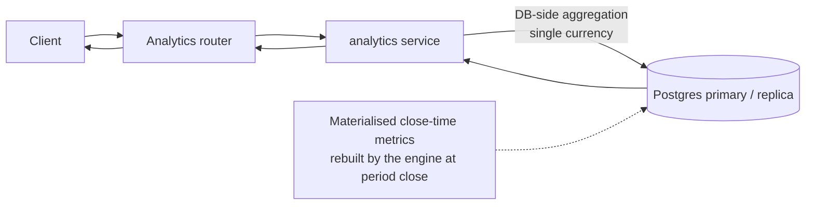

# InvoiceIQ — Request & Event Data Flows

> Companion to [overview](./overview.md) and [domain-modules](./domain-modules.md). Shows how a request moves through the stack, how events propagate, the extraction pipeline, and the **idempotency / concurrency / failure-recovery** rules that keep financial effects exactly-once.

---

## 1. Synchronous request flow (write path)

Every authenticated request establishes tenant + actor context *before* any query, so isolation and audit attribution are automatic.

```mermaid
sequenceDiagram
  autonumber
  participant C as Client (SPA)
  participant MW as Middleware
  participant D as get_current_user (dep)
  participant R as Router
  participant S as Service
  participant DB as Postgres
  participant Q as Job queue (table)

  C->>MW: HTTPS request + Bearer JWT
  MW->>MW: TenantScope=None; RequestContext(request-id)
  MW->>D: resolve dependencies
  D->>DB: load user by token sub
  D->>D: set_current_org(user.org_id)<br/>set_current_actor(user.id,email)
  D->>R: authorized User
  R->>R: authorize (role/module/quota)
  R->>S: call service(body)
  S->>DB: SELECT (auto-scoped by ORM guard)
  S->>DB: INSERT/UPDATE (domain state)
  S->>DB: audit.record(...) [same txn]
  S->>Q: jobs.enqueue / webhooks.emit [same txn, commit=false]
  S->>DB: COMMIT (domain + audit + queued jobs atomic)
  R-->>C: serialized response
  MW->>MW: reset tenant + actor context
```

**Key properties**
- **Tenant scope is set from the DB user row**, never from client input or a token claim — a stolen/edited token still can't select another org (guard uses server-derived org).
- **Audit + enqueued side effects commit in the same transaction** as the domain change → either everything happened or nothing did. A webhook is never emitted for a change that rolled back.
- **Middleware resets context** on the way out → no leakage between requests on a reused worker.

---

## 2. Asynchronous event & job flow

Side effects (webhook delivery, recurring generation, reminders) are **decoupled** from the request via the durable queue. The request only *records intent*; the worker *executes*.

```mermaid
sequenceDiagram
  autonumber
  participant S as Service (request)
  participant DB as jobs table
  participant W as Worker
  participant H as Handler (tenant-scoped)
  participant X as External (HTTP/SMTP)

  S->>DB: emit event → WebhookDelivery(pending) + enqueue job(webhook.deliver)
  Note over S,DB: committed with the domain change
  loop worker loop
    W->>DB: reclaim stale leases
    W->>DB: claim next ready job (atomic guarded UPDATE)
    W->>H: set_current_org(job.org_id); dispatch(payload)
    H->>X: signed POST / SMTP send
    alt 2xx
      H->>DB: mark delivered; job → succeeded
    else non-2xx / error
      H->>DB: mark failed; raise
      W->>DB: attempts<max → requeue with backoff<br/>attempts=max → dead-letter
    end
    W->>DB: reset tenant scope
  end
```

**Delivery guarantees:** *at-least-once* execution with *idempotent handlers* → effectively exactly-once outcomes. The claim is an atomic guarded `UPDATE ... WHERE status='queued'`, so two workers never run the same job. A crashed worker's lease is reclaimed. Retries use exponential backoff; exhausted jobs land in a dead-letter state with the error preserved.

---

## 3. Invoice extraction pipeline (deterministic-first)

The single most important accuracy/cost/residency decision. AI is the **last** resort, opt-in, and never authoritative. (ADR-0009)

```mermaid
flowchart TD
  U[Upload / email / API] --> SEC{Security gate<br/>scan + type validate}
  SEC -- reject --> ERR[415/refused]
  SEC -- ok --> VAULT[Store original in object storage<br/>+ sha256 dedup]
  VAULT --> PROBE{Embedded/structured XML?<br/>UBL / CII / Factur-X}
  PROBE -- yes --> XML[parse_einvoice → high-confidence draft<br/>NO AI]
  PROBE -- no --> TXT{PDF text layer present?}
  TXT -- yes --> PARSER[Registered parse_<supplier>() / text parse]
  TXT -- no --> OCR[OCR fallback]
  PARSER --> DRAFT[Draft]
  OCR --> DRAFT
  XML --> DRAFT
  DRAFT --> AIQ{AI capture enabled?<br/>(opt-in, DLP-gated)}
  AIQ -- no --> REVIEW[Human review queue]
  AIQ -- yes --> AI[Vision/verify model<br/>advisory corrections]
  AI --> REVIEW
  REVIEW --> CONFIRM[Human confirm]
  CONFIRM --> FXVAT[FX→EUR w/ provenance · VAT by scheme]
  FXVAT --> REC[(Saved invoice record)]
  REC --> METER[usage +1] & AUDIT[audit event] & EVT[webhook: invoice.created]
```

**Rules**
- The **original bytes are what gets vaulted** (esp. hybrid Factur-X PDFs), hashed for dedup + integrity.
- **Structured formats never fall to AI.** AI belongs to post-extraction *assistance*, not capture of a figure a deterministic path can read.
- Parse/OCR run on the **worker tier** (CPU isolation), not inline (target state; see delivery Phase 1).
- **A human confirms** every draft before it becomes a booked record.

---

## 4. Idempotency (how we prevent duplicate financial effects)

| Surface | Mechanism | Effect |
|---|---|---|
| API ingest / retried uploads | SHA-256 content dedup in the vault | Same file → same document, not two. |
| Job enqueue | Optional **idempotency key** unique on `(org_id, kind, key)` | Re-enqueue while a job is live = no-op. |
| Job execution | **Handlers are idempotent**; queue is at-least-once | Re-run never double-acts. |
| Recurring generation | `next_run_date` advanced **in the same txn** as invoice creation | A re-run never re-emits a passed occurrence. |
| Daily scheduler | Jobs keyed by **date** (`kind:YYYY-MM-DD`) | Enqueuing 100×/day = one job/day. |
| Webhook delivery | Delivery row + `X-InvoiceIQ-Delivery` id; receiver dedups on id | Receiver can safely ignore repeats. |
| Payments | Guarded update; amount capped at amount owed | No over-credit / over-pay. |
| Invoice numbering | Sequence incremented in the **same txn** as the row | Gap-free per entity; no duplicate numbers under concurrency. |

**Design stance:** we assume *at-least-once* everywhere and make the *outcome* idempotent. We never rely on "it only runs once."

---

## 5. Concurrency controls

| Scenario | Control |
|---|---|
| Two workers claim one job | Atomic guarded `UPDATE ... WHERE status='queued'`; loser's rowcount=0 → tries next. |
| Two requests number an invoice for one entity | Numbering + row insert in one transaction; DB uniqueness on `(entity, number)` as backstop. |
| Concurrent usage-counter increment | Upsert-with-retry on the `(org,period,metric)` unique constraint. |
| Concurrent audit events in one txn | `flush()` after add so the next `seq` sees the prior event; unique `(org_id, seq)`. |
| Leader-only periodic work (backup/scheduler) | Leader election (Postgres advisory lock) — one worker acts. |
| Bulk mutations | Per-item transactions where possible; a failure drops one item, not the batch. |
| Long analytics reads vs. writes | Reads on replicas (target); writers on primary; no read locks held. |

We prefer **optimistic, DB-enforced** concurrency (unique constraints + guarded updates) over application-level locks. Advisory locks are used only for singleton periodic work.

---

## 6. Failure recovery

| Failure | Detection | Recovery |
|---|---|---|
| Worker crash mid-job | Stale lease (`locked_at` past cutoff) | `reclaim_stale` returns the job to `queued`; another worker runs it (idempotent). |
| Handler throws | Exception in `run_once` | Rollback, reload job, backoff-requeue; after max attempts → dead-letter with error. |
| External endpoint down (webhook/SMTP) | non-2xx / timeout | Retry with backoff; dead-letter after budget; delivery row records last attempt; manual retry available. |
| Poison job (never succeeds) | Reaches max attempts | Dead-letter; alert on DLQ depth; operator inspects + fixes + retries. |
| DB transaction failure | Exception | Whole unit (domain + audit + enqueue) rolls back together; nothing partially applied. |
| Partial file/store corruption | Integrity re-hash vs. stored sha256 | Mismatch forces full re-hash; failure raised to error log + banner; restore from backup. |
| Migration failure | Alembic error | Migrations run before serve; a failed migration blocks rollout (fail-closed), not a half-migrated prod. |
| Region/infra outage | Health/readiness probes fail | LB stops routing; restore from verified backups (see [deployment.md](./deployment.md)); DR runbook. |

**Principle:** *fail closed on writes, degrade gracefully on reads.* A capture that can't complete is **queued, not dropped**. A limit that's hit **warns, never deletes**.

---

## 7. Read path (analytics)



- Aggregation happens **in the database**, not Python, so it stays fast as volume grows.
- Reports are **single-currency**; mixed-currency totals are forbidden by construction.
- Heavy period aggregates are **materialised at close** and read back; an un-rebuilt period falls back to a live query.
- Analytics reads target **replicas** (as they're introduced) so they never contend with the write path.

---

## 8. Data-flow invariants (must hold on every path)

1. Tenant scope is set from the server-side user row before any query, and reset after the request.
2. Domain change + its audit event + its enqueued side effects **commit atomically or not at all**.
3. Every deferred effect is **idempotent** and **at-least-once**.
4. Money is converted with **provenance**; no mixed-currency aggregation.
5. Original document bytes are **vaulted + hashed** before any lossy processing.
6. A human confirms every extracted figure before it is booked.
