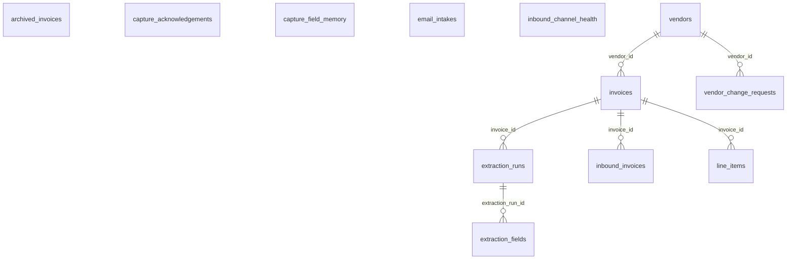
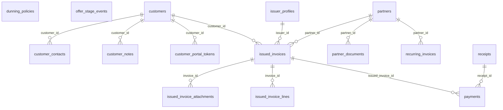
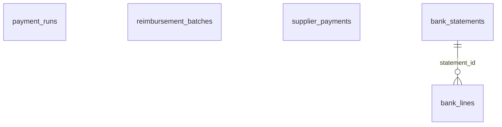
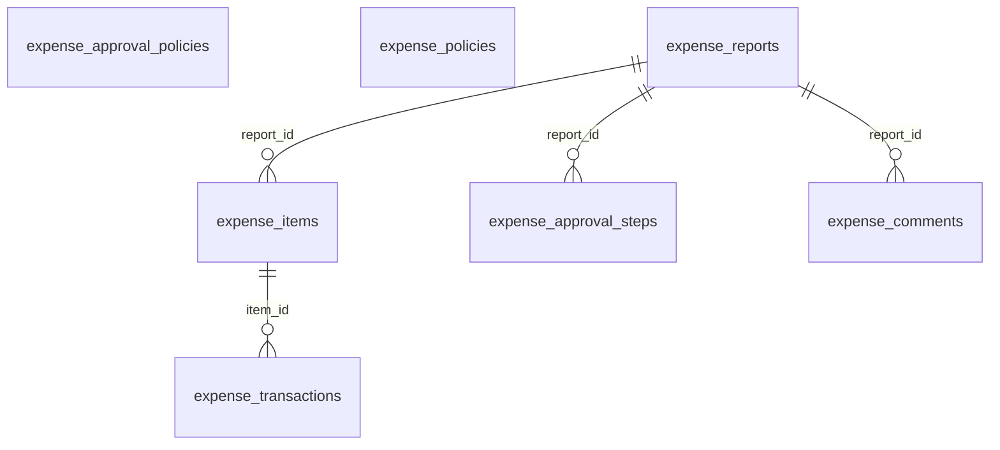
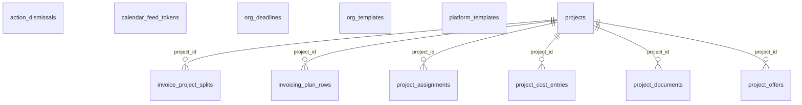
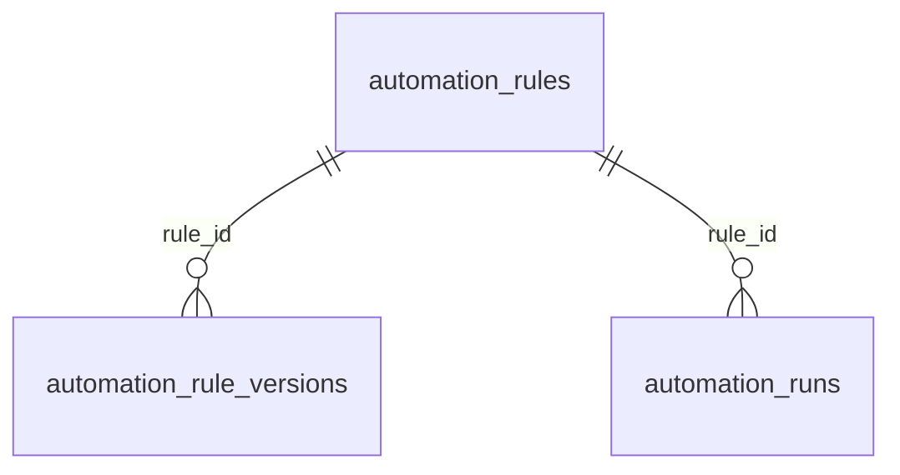
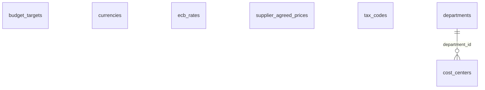
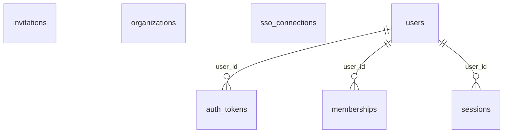
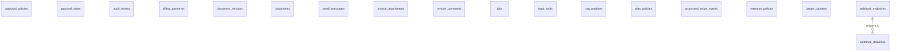

# InvoiceIQ — Generated ER Diagrams (by domain)

> **GENERATED FILE — do not edit by hand.** Derived from the live
> SQLAlchemy metadata by `backend/scripts/gen_erd.py`; the backend CI
> job fails when this file drifts from the models
> (`tests/test_erd_truth.py`). Regenerate with:
> `cd backend && python scripts/gen_erd.py`.
>
> One diagram per domain — the full schema in one picture would be
> illegible. Edges shown inside a diagram are foreign keys whose both
> ends are in the domain; **cross-domain foreign keys** are listed as
> text under each diagram (that coupling reads better as a list). The
> tenancy FK — every tenant table → `organizations` via `org_id`, the
> RLS/guard backbone — is universal and therefore never drawn.
> Companion: [data-model](./data-model.md) (the annotated logical
> model), [diagram-matrix](./diagram-matrix.md) (what we diagram and
> why).

_108 tables across 10 domains._

## Transport VAT recovery (22 tables)

```mermaid
erDiagram
  fuel_extraction_baselines {
  }
  fuel_tieout_expectations {
  }
  supplier_vat_registrations {
  }
  vat_checklist_rules {
  }
  vat_claimant_documents {
  }
  vat_country_activations {
  }
  vat_customer_lifecycles {
  }
  vat_excise_rates {
  }
  vat_fee_rates {
  }
  vat_note_invoice_overrides {
  }
  vat_off_invoice_rebates {
  }
  vat_overcharge_claims {
  }
  vat_receipt_controls {
  }
  vat_reliability_thresholds {
  }
  vat_statement_findings {
  }
  vat_supplier_cadences {
  }
  vat_supplier_contract_terms {
  }
  fuel_transactions ||--o{ vat_claimed_invoices : "fuel_transaction_id"
  vat_refund_claims ||--o{ vat_claim_lines : "claim_id"
  vat_refund_claims ||--o{ vat_claimed_invoices : "claim_id"
  vat_refund_claims ||--o{ vat_receipt_waivers : "claim_id"
```

Cross-domain foreign keys:
- `fuel_tieout_expectations.entity_id` → `issuer_profiles` (Issued invoices (AR) & partners)
- `fuel_transactions.entity_id` → `issuer_profiles` (Issued invoices (AR) & partners)
- `fuel_transactions.invoice_id` → `invoices` (Received invoices (AP) & capture)
- `vat_claim_lines.invoice_id` → `invoices` (Received invoices (AP) & capture)
- `vat_claimant_documents.entity_id` → `issuer_profiles` (Issued invoices (AR) & partners)
- `vat_claimed_invoices.entity_id` → `issuer_profiles` (Issued invoices (AR) & partners)
- `vat_country_activations.entity_id` → `issuer_profiles` (Issued invoices (AR) & partners)
- `vat_customer_lifecycles.entity_id` → `issuer_profiles` (Issued invoices (AR) & partners)
- `vat_fee_rates.entity_id` → `issuer_profiles` (Issued invoices (AR) & partners)
- `vat_note_invoice_overrides.entity_id` → `issuer_profiles` (Issued invoices (AR) & partners)
- `vat_note_invoice_overrides.target_invoice_id` → `invoices` (Received invoices (AP) & capture)
- `vat_receipt_controls.entity_id` → `issuer_profiles` (Issued invoices (AR) & partners)
- `vat_refund_claims.entity_id` → `issuer_profiles` (Issued invoices (AR) & partners)

## Received invoices (AP) & capture (12 tables)

Cross-domain foreign keys:
- `invoices.cost_center_id` → `cost_centers` (Analytics & catalogs)
- `invoices.department_id` → `departments` (Analytics & catalogs)
- `invoices.project_id` → `projects` (Projects & scheduling)
- `vendor_change_requests.source_document_id` → `documents` (Platform & compliance)

## Issued invoices (AR) & partners (15 tables)

Cross-domain foreign keys:
- `issued_invoices.project_id` → `projects` (Projects & scheduling)
- `issued_invoices.subscription_org_id` → `organizations` (Identity & tenancy)
- `offer_stage_events.offer_id` → `project_offers` (Projects & scheduling)

## Payments & settlement (5 tables)

Cross-domain foreign keys:
- `supplier_payments.invoice_id` → `invoices` (Received invoices (AP) & capture)

## Expenses (7 tables)

Cross-domain foreign keys:
- `expense_items.cost_center_id` → `cost_centers` (Analytics & catalogs)
- `expense_items.department_id` → `departments` (Analytics & catalogs)
- `expense_items.project_id` → `projects` (Projects & scheduling)
- `expense_reports.employee_id` → `users` (Identity & tenancy)
- `expense_transactions.employee_id` → `users` (Identity & tenancy)

## Projects & scheduling (12 tables)

Cross-domain foreign keys:
- `invoice_project_splits.invoice_id` → `invoices` (Received invoices (AP) & capture)

## Automation (3 tables)

## Analytics & catalogs (7 tables)

Cross-domain foreign keys:
- `supplier_agreed_prices.vendor_id` → `vendors` (Received invoices (AP) & capture)

## Identity & tenancy (7 tables)

## Platform & compliance (18 tables)

Cross-domain foreign keys:
- `approval_steps.invoice_id` → `invoices` (Received invoices (AP) & capture)
- `invoice_attachments.invoice_id` → `invoices` (Received invoices (AP) & capture)
- `invoice_comments.invoice_id` → `invoices` (Received invoices (AP) & capture)

