# InvoiceIQ — Logical Data Model

> **Status:** v1 · Owner: Data Architect · Last updated: 2026-07-22
> Companion to [overview](./overview.md), [domain-modules](./domain-modules.md), [data-flows](./data-flows.md), [security-boundaries](./security-boundaries.md).
>
> This is the **complete target logical model** across all requested domains, with each domain honestly tagged by build state, followed by the design strategies (indexes, tenant isolation, retention, migration, seed, test-factory). We **design the whole model but implement it incrementally** — no empty tables without a working use case.
>
> Build-state legend: **✅ built** · **🟡 partial** · **⬜ target (designed, not built)**.

---

## 0. Approach — design complete, build incremental

InvoiceIQ is **not greenfield**: 34 tables and 24 migrations already implement organizations, users, roles, suppliers, supplier + customer invoices, credit notes, expenses, audit, billing, SSO, retention, and more, all under a defence-in-depth tenant guard + Postgres RLS + Decimal money. So this document does two things:

1. **Documents the complete target logical model** for every requested domain — including the ones already built (so the model is coherent end-to-end) and the ones not yet built (so the target is explicit).
2. **Implements exactly one new vertical slice now** — **cost-allocation master data** (Departments, Cost centers, Projects) — because the code itself flagged it (`core/dimensions.py`: *"no master table yet … normalise later"*), it is foundational, and it lets us demonstrate every required data-principle without disturbing the working ledger.

> **Rule:** a table is created only when a service + tests exercise it. The rest of this model is the map we build against, slice by slice.

---

## 1. Domain → build-state map (the whole requested model)

| # | Requested domain | Status | Where it lives (table / plan) |
|---|---|---|---|
| 1 | Organizations | ✅ | `organizations` (tenant root; `region`, `plan`, `status`) |
| 2 | Legal entities | 🟡 | `issuer_profiles` (our issuing entities). **Target:** promote to `legal_entities` (own+counterparty), FK from invoices. |
| 3 | Organization membership | ✅ | `users.org_id` (one org per user today). **Target:** `memberships` for multi-org users. |
| 4 | Users & invitations | ✅ | `users`, `invitations` |
| 5 | Roles & permissions | ✅ | `users.role` + `role_policies` (configurable matrix) + `core/roles` |
| 6 | Departments | ✅ **(this slice)** | `departments` |
| 7 | Cost centers | ✅ **(this slice)** | `cost_centers` (→ department, composite FK) |
| 8 | Projects | ✅ **(this slice)** | `projects` |
| 9 | Suppliers | ✅ | `vendors` |
| 10 | Customers | 🟡 | `partners` + per-invoice buyer fields on `issued_invoices`. **Target:** first-class `customers`. |
| 11 | Contacts | ⬜ | **Target:** `contacts` (person rows for supplier/customer/partner). |
| 12 | Bank accounts | ⬜ | **Target:** `bank_accounts` (own + counterparty; IBAN sealed). |
| 13 | Currencies | 🟡 | ISO code strings + `ecb_rates`. **Target:** `currencies` reference table. |
| 14 | Tax codes | 🟡 | `vat.py` scheme logic. **Target:** `tax_codes` (rate + scheme + reporting box) per country. |
| 15 | Accounting periods | ⬜ | **Target:** `accounting_periods` (open/closed; posting lock). |
| 16 | Documents | 🟡 | `inbound_invoices` + `documents`/`core/storage` (bytes). **Target:** unify as `documents`. |
| 17 | Document versions | ⬜ | **Target:** `document_versions` (immutable version chain per document). |
| 18 | Extraction runs | 🟡 | `inbound_invoices.method`/`draft_json` (one implicit run). **Target:** `extraction_runs`. |
| 19 | Extraction fields & confidence | 🟡 | in `draft_json`. **Target:** `extraction_fields` (field, value, confidence, source). |
| 20 | Supplier invoices | ✅ | `invoices` |
| 21 | Supplier invoice lines | ✅ | `line_items` |
| 22 | Customer invoices | ✅ | `issued_invoices` |
| 23 | Customer invoice lines | ✅ | `issued_invoice_lines` |
| 24 | Credit notes | ✅ | `issued_invoices` (`doc_type='credit_note'`, `corrected_invoice_id`) |
| 25 | Payments | 🟡 | `issued_invoices.amount_paid`/`paid_date` (AR only). **Target:** `payments`. |
| 26 | Payment allocations | ⬜ | **Target:** `payment_allocations` (one payment → many invoices). |
| 27 | Expense reports | ✅ | `expense_reports` |
| 28 | Expense items | ✅ | `expense_items` |
| 29 | Approval policies | ⬜ | **Target:** `approval_policies` (thresholds, sequence). |
| 30 | Approval steps | ⬜ | **Target:** `approval_steps`. |
| 31 | Approval decisions | ⬜ | **Target:** `approval_decisions` (immutable). |
| 32 | Attachments | 🟡 | receipt/logo/attachment sha refs on owning rows. **Target:** polymorphic `attachments`. |
| 33 | Comments | 🟡 | `expense_comments`. **Target:** generalise to `comments`. |
| 34 | Notifications | 🟡 | `webhook_deliveries`, `email_messages`. **Target:** `notifications` (in-app inbox). |
| 35 | Accounting exports | 🟡 | `erp_export`/`saft` (stateless, on-demand). **Target:** `accounting_exports` (run record). |
| 36 | Integrations | ⬜ | **Target:** `integrations` (per-tenant connection config; SSO already models this shape). |
| 37 | Webhook endpoints | ✅ | `webhook_endpoints` (+ `webhook_deliveries`) |
| 38 | Audit events | ✅ | `audit_events` (hash-chained, immutable) |
| 39 | Subscription plans | 🟡 | code-defined `plans` + `org_modules`. **Target:** `subscription_plans` table if operator-editable. |
| 40 | Subscriptions | 🟡 | `organizations.plan`/`stripe_*` + `billing_payments`. **Target:** explicit `subscriptions`. |
| 41 | Usage records | ✅ | `usage_counters` (`count`/`reported`) |
| 42 | Feature entitlements | ✅ | `org_modules` (+ plan→module derivation) |

**Also built, beyond the list:** `processed_stripe_events` (billing idempotency ledger), `sso_connections` (SSO/SCIM/SAML), `retention_policies` + `legal_holds`, `budget_targets`, `partner_documents`, `jobs`, `ecb_rates`.

---

## 2. Entity-relationship model (target)

Grouped ER diagram of the target model. **Bold** = built; *italic* = target/partial. All tenant-owned entities carry `org_id` (omitted from the diagram for readability — see §6).

```mermaid
erDiagram
  ORGANIZATIONS ||--o{ USERS : has
  ORGANIZATIONS ||--o{ MEMBERSHIPS : "target: M:N users"
  ORGANIZATIONS ||--o{ LEGAL_ENTITIES : "target (issuer_profiles today)"
  ORGANIZATIONS ||--o{ DEPARTMENTS : owns
  DEPARTMENTS   ||--o{ COST_CENTERS : "rolls up (composite FK)"
  ORGANIZATIONS ||--o{ PROJECTS : owns
  ORGANIZATIONS ||--o{ VENDORS : owns
  ORGANIZATIONS ||--o{ CUSTOMERS : "target (partners today)"
  VENDORS       ||--o{ CONTACTS : "target"
  CUSTOMERS     ||--o{ CONTACTS : "target"
  VENDORS       ||--o{ BANK_ACCOUNTS : "target"

  ORGANIZATIONS ||--o{ INVOICES : "supplier invoices"
  INVOICES      ||--o{ LINE_ITEMS : has
  INVOICES      }o--|| VENDORS : from
  INVOICES      }o--o| COST_CENTERS : "target FK (free-text today)"
  INVOICES      }o--o| PROJECTS : "target FK"
  INVOICES      }o--o| DEPARTMENTS : "target FK"

  ORGANIZATIONS ||--o{ ISSUED_INVOICES : "customer invoices + credit notes"
  ISSUED_INVOICES ||--o{ ISSUED_INVOICE_LINES : has
  ISSUED_INVOICES }o--o| ISSUED_INVOICES : "credit note corrects"
  ISSUED_INVOICES ||--o{ PAYMENTS : "target"
  PAYMENTS      ||--o{ PAYMENT_ALLOCATIONS : "target"
  PAYMENT_ALLOCATIONS }o--|| ISSUED_INVOICES : "target"

  ORGANIZATIONS ||--o{ EXPENSE_REPORTS : owns
  EXPENSE_REPORTS ||--o{ EXPENSE_ITEMS : has
  EXPENSE_REPORTS ||--o{ APPROVAL_STEPS : "target"
  APPROVAL_POLICIES ||--o{ APPROVAL_STEPS : "target"
  APPROVAL_STEPS ||--o{ APPROVAL_DECISIONS : "target"

  DOCUMENTS     ||--o{ DOCUMENT_VERSIONS : "target"
  DOCUMENTS     ||--o{ EXTRACTION_RUNS : "target"
  EXTRACTION_RUNS ||--o{ EXTRACTION_FIELDS : "target"
  INVOICES      }o--o| DOCUMENTS : "sourced from"

  ORGANIZATIONS ||--o{ AUDIT_EVENTS : records
  ORGANIZATIONS ||--o{ WEBHOOK_ENDPOINTS : has
  WEBHOOK_ENDPOINTS ||--o{ WEBHOOK_DELIVERIES : delivers
  ORGANIZATIONS ||--o{ USAGE_COUNTERS : meters
  ORGANIZATIONS ||--o{ ORG_MODULES : entitlements
  ORGANIZATIONS ||--o{ BILLING_PAYMENTS : "billing"
  ORGANIZATIONS ||--o{ SSO_CONNECTIONS : "federated identity"
  ORGANIZATIONS ||--o{ RETENTION_POLICIES : governs
  ORGANIZATIONS ||--o{ LEGAL_HOLDS : governs
```

---

## 3. Table-by-table (implemented slice + notable existing + target shapes)

### 3.1 Implemented now — cost-allocation master data (Slice 1)

**`departments`** — a company's org units.
`id` (GUID PK) · `org_id` (FK organizations, CASCADE) · `code` (≤40) · `name` (≤200) · `status` (`active|archived`) · `archived_at` · `version` (int, optimistic concurrency) · `created_at`/`updated_at`.
Constraints: **UNIQUE(org_id, code)** (dup rule), **UNIQUE(org_id, id)** (composite-FK target). Indexes: `(org_id)`, `(org_id, status)`.

**`cost_centers`** — the primary cost object; optionally rolls up to a department.
Same base columns + `department_id` (nullable). Constraints: UNIQUE(org_id, code); UNIQUE(org_id, id); **composite FK `(org_id, department_id) → departments(org_id, id)` ON DELETE SET NULL** — a cost center can only reference a department *in the same org*, enforced by the DB, not by hope. Indexes: `(org_id)`, `(org_id, status)`, `(org_id, department_id)`.

**`projects`** — time-boxed cost objects (jobs, initiatives).
Base columns + `start_date`/`end_date`, `status` (`active|closed|archived`). Constraints: UNIQUE(org_id, code); UNIQUE(org_id, id). Indexes: `(org_id)`, `(org_id, status)`.

*Why not touch invoices yet:* the free-text `cost_center`/`department`/`project` columns on `invoices`/`expense_items` stay. A **later slice** adds nullable FK columns (`cost_center_id`, …) via composite FK, backfills by matching code, and only then deprecates the free-text columns — a reversible, no-downtime path.

### 3.2 Notable existing tables (target refinements noted)

**`organizations`** (tenant root) — `id`, `name`, `plan`, `status` (`active|suspended|canceled`), `region`, `stripe_customer_id`/`stripe_subscription_id`, `everypay_token`. Not tenant-scoped (it *is* the tenant).

**`invoices`** (supplier invoices) — money stored as three separate quantities per the tax-total rule: `subtotal` (tax-exclusive), `tax_amount`, `total` (tax-inclusive), all `Numeric(14,2)`; original currency (`currency`) **and** reporting currency (`total_eur` + `fx_rate` + `fx_source` provenance). `issue_date` indexed with `org_id`. **Target:** `cost_center_id`/`department_id`/`project_id` FKs (Slice 2).

**`issued_invoices`** (customer invoices + credit notes) — immutable once issued; corrections via a linked credit note (`doc_type`, `corrected_invoice_id`), never an edit. Gap-free per-issuer numbering. `subtotal`/`tax_total`/`total` separated. **Target:** extract `payments` + `payment_allocations` from the inline `amount_paid`/`paid_date`.

**`audit_events`** — append-only, hash-chained (`prev_hash`→`hash`), per-tenant monotonic `seq`; never updated or deleted. The integrity spine.

**`usage_counters`** — `(org_id, period, metric)` unique; `count` + `reported` watermark for metered billing.

**`sso_connections`**, **`retention_policies`**, **`legal_holds`**, **`billing_payments`**, **`processed_stripe_events`** — see ADR-0021/0019/0013.

### 3.3 Target shapes (designed, built when a slice needs them)

- **`legal_entities`** — `org_id`, `kind` (own|counterparty), `name`, `vat_number`, `country`, address; FK from invoices for multi-entity correctness. (Today: `issuer_profiles` for own entities.)
- **`customers`** / **`contacts`** — first-class AR counterparty + person rows (today: `partners` + inline buyer fields).
- **`bank_accounts`** — `owner_type`/`owner_id`, `iban` (**sealed via keyvault**), `bic`, `currency`. IBAN is a secret-at-rest, never in analytics.
- **`currencies`** — ISO 4217 code (PK), `minor_units`, `name`; a reference table so FX/rounding is data-driven.
- **`tax_codes`** — `org_id`, `code`, `country`, `rate`, `scheme` (standard|reverse_charge|intra_eu|exempt|zero), `reporting_box`; replaces hard-coded scheme logic per country.
- **`accounting_periods`** — `org_id`, `period` (YYYY-MM), `status` (open|closed), `closed_at`; a **posting lock** so a closed period can't be mutated.
- **`documents`** / **`document_versions`** — unify inbound + stored bytes; an immutable version chain (sha256 per version) preserving the original upload forever.
- **`extraction_runs`** / **`extraction_fields`** — one row per parse attempt (method, model, started/finished, status) and per extracted field (name, value, **confidence**, source page/bbox) — the extraction *history*.
- **`payments`** / **`payment_allocations`** — a payment (amount, date, method, direction) allocated across one or many invoices; supports partial + over/under.
- **`approval_policies`** / **`approval_steps`** / **`approval_decisions`** — configurable routing (threshold → sequence of approvers); decisions are **immutable** (append-only, like audit).
- **`attachments`** / **`comments`** / **`notifications`** — polymorphic (`entity_type`, `entity_id`) supporting artefacts; notifications add an in-app inbox alongside webhooks/email.
- **`accounting_exports`** — a record per export run (format, period, row count, sha of the file) for reproducibility.
- **`integrations`** — per-tenant external-connection config (ERP, bank feed) following the `sso_connections` shape (sealed secrets).
- **`subscription_plans`** / **`subscriptions`** — only if plans become operator-editable data (today code-defined + `org_modules`); explicit `subscriptions` if lifecycle needs more than `organizations.plan`.

---

## 4. Status & lifecycle definitions

Status is an **explicit column with enforced transitions** (in the owning service), never a free-for-all update.

| Entity | States | Allowed transitions | Terminal / notes |
|---|---|---|---|
| **Department / Cost center** | `active`, `archived` | active↔archived | archive = soft delete; `archived_at` set/cleared |
| **Project** | `active`, `closed`, `archived` | active→closed, active→archived, closed→{active,archived}, archived→active | closed = no new spend, still reportable |
| Organization | `active`, `suspended`, `canceled` | active↔suspended, →canceled | billing/webhook driven |
| Supplier invoice (draft) | draft (implicit) → confirmed | one-way to confirmed | editable only before confirm |
| Issued invoice | issued → paid/partial/overdue/credited | monotonic; corrections via credit note | **immutable once issued** |
| Expense report | draft→submitted→approved\|rejected→reimbursed | one-way | decisions immutable |
| Job | queued→running→succeeded\|failed→dead | at-least-once; DLQ terminal | |
| Legal hold | active→released | never deleted | preservation record |

**Invariant:** an approved/issued financial record is **never silently overwritten** — a change is a new linked document (credit note) or a rejected transition, surfaced to the user.

---

## 5. Index strategy (designed around real queries)

Principles: **every tenant table leads its hot indexes with `org_id`** (all queries are tenant-scoped); index the columns filtered/sorted by real screens, not speculatively.

| Query pattern | Index |
|---|---|
| List a tenant's active master data | `(org_id, status)` on departments/cost_centers/projects |
| Resolve a code (dedup, lookup) | UNIQUE `(org_id, code)` doubles as the lookup index |
| Cost-center roll-up by department | `(org_id, department_id)` |
| Composite-FK target | UNIQUE `(org_id, id)` |
| Invoices by date (dashboards, period) | `(org_id, issue_date)` (existing) |
| Audit by tenant, in order | UNIQUE `(org_id, seq)` (existing) |
| Job claim (oldest ready) | `(status, run_after)` (existing) |
| Usage lookup | UNIQUE `(org_id, period, metric)` (existing) |

Revisit: add covering/partial indexes (`WHERE status='active'`) and partition `invoices`/`line_items` by `org_id`/month only when a **measured** p95 breach appears (T4).

---

## 6. Tenant-isolation strategy

Four enforced layers (see [security-boundaries](./security-boundaries.md), ADR-0004):

1. **`org_id` on every tenant row** + a mandatory `TENANT_MODELS` registration (CI test fails the build if a model with `org_id` isn't registered — the new three are registered).
2. **ORM `do_orm_execute` guard** — ANDs `org_id == current_org` onto every SELECT of a tenant model.
3. **Postgres RLS** — `FORCE` + `tenant_isolation` policy on every tenant table (the three new tables get policies in their migration; the RLS coverage guard unions `TENANT_TABLES` across migrations).
4. **Cross-tenant FK protection** — **composite FKs `(org_id, fk_id) → parent(org_id, id)`** so a child can only reference a parent in the same org. Demonstrated on `cost_centers.department_id`; the pattern is mandatory for every future cross-entity FK.

Machine principals (SCIM, billing webhook) set tenant scope explicitly and never route through `get_current_user`.

---

## 7. Data-retention strategy

- **Master data (departments/cost_centers/projects):** **archived, never hard-deleted** — historical cost allocations must resolve their code/name. Not enrolled in the retention purge; archival is the only "delete".
- **Transactional/PII data:** governed by `retention_policies` (per-category keep-N-days) + `legal_holds` (suspend purging) — ADR-0019. GDPR erasure (ADR-0020) pseudonymises/redacts and **retains** statutory + audit records.
- **Never purgeable:** `audit_events` (integrity chain) and `issued_invoices` (statutory accounting retention).
- **Org delete cascades** to all tenant rows (`ON DELETE CASCADE` on `org_id`) — the clean tenant-offboarding path.

---

## 8. Migration plan (incremental slices)

Migrations are the production schema source of truth; append-only, run before serve, fail-closed. Verified by the drift guard (model == migrated schema) + the clean-from-empty test.

- **Slice 1 (`a1c2e3f4b5d6`, shipped):** departments, cost_centers, projects + composite FK + RLS. **Additive, no data change** to existing tables.
- **Slice 2 (`c1981328d6b3`, shipped):** nullable `cost_center_id`/`department_id`/`project_id` on `invoices` (composite FK `(org_id, *_id) → master(org_id, id)`), backfill job `costing.backfill_links` (resolves free-text tag → master by code then name, unmatched stays null, idempotent), dual-read. Free-text columns retained; deprecation is a later slice.
  - **Slice 2b (`de3b47386d45`, shipped):** the same links on `expense_items`, plus a denormalised `org_id` (backfilled from the parent report, then `NOT NULL`; new rows filled by a `before_insert` hook). `expense_items` is now a first-class tenant table — registered in the ORM guard + Postgres RLS — instead of relying on the report join. Backfill covers both models (`costing.backfill_expense_item_links`; the `costing.backfill_links` job runs both).
- **Slice 3a/3b (shipped):** write-path link resolution — `costing.resolve_link_id`/`apply_links` link a cost-allocation tag to its master row at **create/update** time (not only on the backfill sweep), for **both invoices (3a)** and **expense items (3b)** (all four expense write sites: report create, report-items rebuild, add-from-transaction, item PATCH). Re-tagging follows the link; clearing or an unmatched tag nulls it. The cost-allocation normalisation (Slices 1→3b) is now complete: master tables → links + backfill → expense-item org_id → live write-path resolution.
- **Slice 3c (`d99c826e4767`, shipped):** the **`payments` ledger** extracted from the inline `issued_invoices.amount_paid`. The ledger is the settlement history; `amount_paid` stays the derived cache (`= SUM(payments.amount)`) every read path already uses. `payments.set_cumulative` records each change as a SIGNED entry (positive receipt / negative correction) and refreshes the cache, preserving the existing "set the cumulative amount paid" API; `GET /issued/{id}/payments` exposes the history; the migration backfills one `migrated` entry per already-settled invoice. Composite FK `(org_id, issued_invoice_id) → issued_invoices(org_id, id)` (tenant-safe); RLS + ORM guard registered. `payment_allocations` (one receipt across many invoices) is the next step.
- **Slice 4a (`afc2c7fbc7ad`, shipped):** the **`tax_codes` catalog** — a per-tenant registry of named VAT rates + categories (standard/reduced/zero/exempt/reverse_charge, optional country). Service is CRUD-lite (unique code, active/archived + optimistic concurrency, `resolve`, idempotent standard seed); `GET /tax-codes` (any role, powers the issuing rate picker) + admin create/archive; seeded with a Baltic-first EU catalogue. `UNIQUE(org_id, id)` is the composite-FK target for the future line link. Tenant-scoped → RLS + ORM guard. Mirrors cost-allocation Slice 1; a later slice adds `tax_code_id` on issued lines (dual-read).
- **Slice 4b (`a99277d2853d`, shipped):** issued-invoice lines consume the catalog at issue time. An optional `tax_code` on a line input resolves (active-only) to its catalogue rate — the code drives `vat_rate` — and the canonical code is SNAPSHOT onto the line (`issued_invoice_lines.tax_code`, a label not an FK, because an issued invoice is immutable). Unknown/inactive code → 400; a line with no code is unchanged. Additive column, no `org_id` denormalisation needed (snapshot, not a live reference).
- **Slice 5a (`c591d32e283a`, shipped):** the **`currencies` catalog** — a per-tenant registry of the currencies a workspace transacts in (code, name, symbol, `decimal_places` for display; amounts still stored `Numeric(14,2)`). CRUD-lite mirroring the tax-code catalog (unique normalised code, active/archived + optimistic concurrency, `resolve`, idempotent standard seed); `GET /currencies` (any role — currency pickers) + admin create/archive. `UNIQUE(org_id, id)` future-FK target. Tenant-scoped → RLS + ORM guard.
- **Slice 5+ (next):** `payment_allocations` (one receipt across many invoices); `documents`/`document_versions`/`extraction_runs`/`extraction_fields` capture lineage; approvals; polymorphic attachments/comments/notifications.

Each slice: additive first, dual-read during transition, contract-migrate (drop old) only after the new path is proven — the same pattern used to move blob bytes to object storage.

---

## 9. Seed-data strategy

`python -m app.seed` — **idempotent** (clears the seed-owned orgs first). Produces a realistic demo tenant. This slice adds `_seed_costing`: 3 departments, 4 cost centers (rolled up to departments), 3 projects (incl. one `closed`) — enough to populate any future cost-allocation UI. Seed uses the **models directly** (not raw SQL) so it stays valid as the schema evolves, and never seeds secrets.

---

## 10. Test-data factory strategy

- **DB-layer tests** (`tests/test_costing.py`) assert the *schema contracts*: unique/dup rules (both service-level and the raw DB constraint), tenant-scoped listing, **DB-level cross-tenant FK rejection** (on a FK-enforcing SQLite engine), status lifecycle + soft delete, invalid-transition rejection, and optimistic-concurrency conflict.
- **Fixtures over factories, for now:** the suite builds entities through the owning **service** (`costing.create_*`) or minimal direct model construction — this exercises the real validation paths and avoids a parallel factory that can drift from the models. The autouse `conftest` fixtures give each test an isolated in-memory DB + memory object-storage + reset rate-limit counters.
- **When a factory earns its keep:** once several suites need the same complex graph (e.g. an invoice with lines + FKs + document + extraction run), introduce a thin `tests/factories.py` returning committed model instances via the services — not a schema-shadowing ORM factory. Keep it building through services so it can't assert a shape the DB forbids.
- **Cross-DB discipline:** SQLite is dev/test, Postgres is prod. FK-enforcement and RLS behave differently; the composite-FK test explicitly enables `PRAGMA foreign_keys`, and RLS enforcement is proven on the Postgres CI job. Any Postgres-only guarantee gets a Postgres-gated test.

---

## 11. Non-negotiables for every future slice

1. Tenant-owned row ⇒ `org_id` + `TENANT_MODELS` registration + RLS policy in the same migration.
2. Cross-entity FK ⇒ **composite `(org_id, id)`**, never a bare `id`.
3. Money ⇒ Decimal `Numeric(14,2)`; store tax-exclusive, tax, tax-inclusive separately; original + reporting currency with provenance.
4. Approved/issued financial records ⇒ immutable; correct via linked documents, never overwrite.
5. Soft-delete master/reference data; hard-delete only transient rows; audit is append-only.
6. New external write path ⇒ idempotency designed in (key or watermark).
7. A table ships only with a service + tests that use it.
