# InvoiceIQ — Logical Data Model

> **Status:** v2.1 (2026-08-26 truth-up: the field-service/CRM/portal, automation, agreed-price, transport VAT-recovery, recycle-bin and onboarding slices added; figures re-verified) · Owner: Data Architect · Last updated: 2026-08-26
> Companion to [overview](./overview.md), [domain-modules](./domain-modules.md), [data-flows](./data-flows.md), [security-boundaries](./security-boundaries.md).
>
> This is the **complete target logical model** across all requested domains, with each domain honestly tagged by build state, followed by the design strategies (indexes, tenant isolation, retention, migration, seed, test-factory). We **design the whole model but implement it incrementally** — no empty tables without a working use case.
>
> Build-state legend: **✅ built** · **🟡 partial** · **⬜ target (designed, not built)**.

---

## 0. Approach — design complete, build incremental

InvoiceIQ is **not greenfield**: 105 tables and 118 migrations (single head; figures re-verified 2026-08-26) already implement organizations, users/memberships, roles, suppliers (+ the protected-field change workflow), supplier + customer invoices, credit notes, payments/receipts/payment runs, expenses (+ approval chains and reimbursement batches), bank import/reconciliation, documents/versions/extraction provenance, audit, billing, SSO/SCIM, retention, and more, all under a defence-in-depth tenant guard + Postgres RLS + Decimal money. So this document does two things:

1. **Documents the complete target logical model** for every requested domain — including the ones already built (so the model is coherent end-to-end) and the ones not yet built (so the target is explicit).
2. **Implements exactly one new vertical slice now** — **cost-allocation master data** (Departments, Cost centers, Projects) — because the code itself flagged it (`core/dimensions.py`: *"no master table yet … normalise later"*), it is foundational, and it lets us demonstrate every required data-principle without disturbing the working ledger.

> **Rule:** a table is created only when a service + tests exercise it. The rest of this model is the map we build against, slice by slice.

---

## 1. Domain → build-state map (the whole requested model)

| # | Requested domain | Status | Where it lives (table / plan) |
|---|---|---|---|
| 1 | Organizations | ✅ | `organizations` (tenant root; `region`, `plan`, `status`) |
| 2 | Legal entities | 🟡 | `issuer_profiles` (our issuing entities). **Target:** promote to `legal_entities` (own+counterparty), FK from invoices. |
| 3 | Organization membership | ✅ | `memberships` — **authoritative since B1.5/WO-11**: every tenant-scoping decision (per-request live-membership gate, the users-table ORM guard + RLS policy, SCIM/DSAR/payee/approver resolution) reads memberships. `users.org_id` survives only as the **documented active-org pointer** (repointed by org-switching; never a membership assertion — see `app/models/user.py`). Dropping the column outright is deferred follow-up work (see `docs/security/multi-org-membership-plan.md`). |
| 4 | Users & invitations | ✅ | `users`, `invitations` |
| 5 | Roles & permissions | ✅ | `users.role` + `core/roles`/`core/authz` (permissions); usage quotas are separate — see `plan_policies` under Metering & Plans (WO-47: keyed by the org's plan, not the user's role) |
| 6 | Departments | ✅ **(this slice)** | `departments` |
| 7 | Cost centers | ✅ **(this slice)** | `cost_centers` (→ department, composite FK) |
| 8 | Projects | ✅ **(this slice)** | `projects` |
| 9 | Suppliers | ✅ | `vendors` (+ `version`, `status` `active\|provisional`) + `vendor_change_requests` (WO-2 protected-field workflow, see below) |
| 10 | Customers | ✅ | `customers` (+ `customer_contacts`); `partners` remains the issuing counterparty with document gates + per-invoice buyer snapshot on `issued_invoices`. |
| 11 | Contacts | 🟡 | `customer_contacts` (customer person rows). **Target:** supplier/partner contact rows. |
| 12 | Bank accounts | ⬜ | **Target:** `bank_accounts` (own + counterparty; IBAN sealed). |
| 13 | Currencies | ✅ | `currencies` per-tenant catalog (Slice 5a) + `ecb_rates`. Unified with the FX list into ONE registry (`fx.CURRENCY_BY_CODE`/`indicative_for`) — ADR-0026, C1.5, WO-23. |
| 14 | Tax codes | ✅ | `tax_codes` per-tenant catalog (Slice 4a) + snapshot onto issued lines (4b); `vat.py` scheme logic. |
| 15 | Accounting periods | ⬜ | **Target:** `accounting_periods` (open/closed; posting lock). |
| 16 | Documents | ✅ | `documents` registry (Slice 5d, content-addressed, written at the storage choke point) + `inbound_invoices` (email inbox) + `core/storage` (bytes). |
| 17 | Document versions | ✅ | `document_versions` — append-only supersession chain per single-file slot (Slice 5g). |
| 18 | Extraction runs | ✅ | `extraction_runs` (Slice 5b). |
| 19 | Extraction fields & confidence | ✅ | `extraction_fields` (field, value, status, confidence slot) — Slice 5f. |
| 20 | Supplier invoices | ✅ | `invoices` |
| 21 | Supplier invoice lines | ✅ | `line_items` |
| 22 | Customer invoices | ✅ | `issued_invoices` |
| 23 | Customer invoice lines | ✅ | `issued_invoice_lines` |
| 24 | Credit notes | ✅ | `issued_invoices` (`doc_type='credit_note'`, `corrected_invoice_id`) |
| 25 | Payments | ✅ | `payments` (AR settlement ledger, Slice 3c; `amount_paid` is the derived cache) + `supplier_payments` (AP ledger) + `payment_runs` (grouped AP payment with maker≠checker + export-once, WO-9). |
| 26 | Payment allocations | ✅ | `receipts` + `payments.receipt_id` (Slice 5c): one receipt allocated across many issued invoices, capped by unallocated balance and outstanding, under a row lock. |
| 27 | Expense reports | ✅ | `expense_reports` |
| 28 | Expense items | ✅ | `expense_items` |
| 29 | Approval policies | ✅ | `approval_policies` (AP, priority-ordered first-match) + `expense_approval_policies`. |
| 30 | Approval steps | ✅ | `approval_steps` (AP) + `expense_approval_steps`. |
| 31 | Approval decisions | 🟡 | Decisions are recorded ON the step rows + the audit chain (immutable there); a separate `approval_decisions` table remains a target only if step rows ever need mutability. |
| 32 | Attachments | 🟡 | `invoice_attachments` + `issued_invoice_attachments` (per-domain, built); receipt/logo sha refs on owning rows. **Target:** polymorphic `attachments` only when a third consumer appears. |
| 33 | Comments | 🟡 | `expense_comments` + `invoice_comments` (built). **Target:** generalise to `comments` only when a third consumer appears. |
| 34 | Notifications | 🟡 | `webhook_deliveries`, `email_messages`. **Target:** `notifications` (in-app inbox). |
| 35 | Accounting exports | 🟡 | `erp_export`/`saft` (stateless, on-demand). **Target:** `accounting_exports` (run record). |
| 36 | Integrations | ⬜ | **Target:** `integrations` (per-tenant connection config; SSO already models this shape). |
| 37 | Webhook endpoints | ✅ | `webhook_endpoints` (+ `webhook_deliveries`) |
| 38 | Audit events | ✅ | `audit_events` (hash-chained, immutable) |
| 39 | Subscription plans | 🟡 | code-defined `plans` + `org_modules`. **Target:** `subscription_plans` table if operator-editable. |
| 40 | Subscriptions | 🟡 | `organizations.plan`/`stripe_*` + `billing_payments`. **Target:** explicit `subscriptions`. |
| 41 | Usage records | ✅ | `usage_counters` (`count`/`reported`) |
| 42 | Feature entitlements | ✅ | `org_modules` (+ plan→module derivation) |

| 43 | Transport VAT recovery | ✅ | the `vat_*`/`fuel_*` vertical: `fuel_transactions`, `vat_refund_claims`, `vat_claim_lines`, `vat_claimed_invoices` (one-invoice-one-submission lock), `vat_overcharge_claims`, `vat_checklist_rules`, `vat_supplier_contract_terms`, `vat_fee_rates`, `vat_receipt_controls`/`_waivers`, `supplier_vat_registrations`, `vat_excise_rates`, `fuel_tieout_expectations`, `vat_country_activations`, `fuel_extraction_baselines`, `vat_note_invoice_overrides`, `vat_off_invoice_rebates`, `vat_supplier_cadences`, `vat_customer_lifecycles` — lines + VAT base FROZEN at submit |
| 44 | Automation rules | ✅ | `automation_rules`, `automation_rule_versions` (immutable, numbered), `automation_runs` |
| 45 | Agreed prices | ✅ | `supplier_agreed_prices` (validity-windowed; matched at capture) |
| 46 | Schedule & calendar | ✅ | `assignments`, `org_deadlines`, `calendar_feed_tokens` (ICS) |
| 47 | CRM light + client portal | ✅ | `customer_notes`, `offer_stage_events`, `customer_portal_tokens` |
| 48 | Next actions | ✅ | `action_dismissals` (the rest is derived per read) |
| 49 | Generic recycle bin | ✅ | `deleted_at`/`deleted_by` on `invoices`, `expense_reports`, `expense_transactions`, `recurring_invoices`, `issued_invoice_attachments`; guard-level auto-hide via `SOFT_DELETE_MODELS`; daily audited purge |
| 50 | Onboarding checklist | ✅ | DERIVED (no table); `organizations.onboarding_dismissed_at` is the one stamp |

**Also built, beyond the list:** `processed_stripe_events` (billing idempotency ledger), `sso_connections` (SSO/SCIM/SAML), `sessions` (revocable auth sessions), `retention_policies` + `legal_holds`, `budget_targets`, `partner_documents`, `jobs`, `ecb_rates`, `bank_statements` + `bank_lines` (statement import + reconciliation), `dunning_policies`, `recurring_invoices`, `email_intakes` + `email_messages` (inbound address + outbound mail history), `expense_policies` + `expense_transactions` + `reimbursement_batches`, `plan_policies`, `archived_invoices` (the sealed post-trash archive), `capture_acknowledgements`, `capture_field_memory`, `inbound_channel_health`, `auth_tokens`, and the project-lifecycle set (§3.4): `invoice_project_splits`, `project_cost_entries`, `project_documents`, `project_offers`, `invoicing_plan_rows`, `org_templates` + the org-less `platform_templates`.

---

## 2. Entity-relationship model (target)

Grouped ER diagram of the target model. **Bold** = built; *italic* = target/partial. All tenant-owned entities carry `org_id` (omitted from the diagram for readability — see §6).

```mermaid
erDiagram
  ORGANIZATIONS ||--o{ USERS : has
  ORGANIZATIONS ||--o{ MEMBERSHIPS : "M:N users (built)"
  ORGANIZATIONS ||--o{ LEGAL_ENTITIES : "target (issuer_profiles today)"
  ORGANIZATIONS ||--o{ DEPARTMENTS : owns
  DEPARTMENTS   ||--o{ COST_CENTERS : "rolls up (composite FK)"
  ORGANIZATIONS ||--o{ PROJECTS : owns
  ORGANIZATIONS ||--o{ VENDORS : owns
  ORGANIZATIONS ||--o{ CUSTOMERS : "owns (built; partners = issuing gate)"
  VENDORS       ||--o{ CONTACTS : "target"
  CUSTOMERS     ||--o{ CONTACTS : "target"
  VENDORS       ||--o{ BANK_ACCOUNTS : "target"

  ORGANIZATIONS ||--o{ INVOICES : "supplier invoices"
  INVOICES      ||--o{ LINE_ITEMS : has
  INVOICES      }o--|| VENDORS : from
  INVOICES      }o--o| COST_CENTERS : "target FK (free-text today)"
  INVOICES      }o--o| PROJECTS : "target FK"
  INVOICES      }o--o| DEPARTMENTS : "target FK"

  ORGANIZATIONS ||--o{ ISSUED_INVOICES : "customer invoices + credit notes"
  ISSUED_INVOICES ||--o{ ISSUED_INVOICE_LINES : has
  ISSUED_INVOICES }o--o| ISSUED_INVOICES : "credit note corrects"
  ISSUED_INVOICES ||--o{ PAYMENTS : "settlement ledger (built)"
  RECEIPTS      ||--o{ PAYMENTS : "allocation (built)"

  ORGANIZATIONS ||--o{ EXPENSE_REPORTS : owns
  EXPENSE_REPORTS ||--o{ EXPENSE_ITEMS : has
  INVOICES      ||--o{ APPROVAL_STEPS : "built (AP; expenses have their own)"
  APPROVAL_POLICIES ||--o{ APPROVAL_STEPS : "built"

  DOCUMENTS     ||--o{ DOCUMENT_VERSIONS : "built"
  INVOICES      ||--o{ EXTRACTION_RUNS : "built"
  EXTRACTION_RUNS ||--o{ EXTRACTION_FIELDS : "built"
  INVOICES      }o--o| DOCUMENTS : "sourced from"

  PROJECTS      ||--o{ PROJECT_OFFERS : "versioned offers (built)"
  PROJECTS      ||--o{ INVOICING_PLAN_ROWS : "instalment plan (built)"
  PROJECTS      ||--o{ PROJECT_COST_ENTRIES : "manual costs (built)"
  PROJECTS      ||--o{ PROJECT_DOCUMENTS : "contract + generated docs (built)"
  INVOICES      ||--o{ INVOICE_PROJECT_SPLITS : "% allocation (built)"
  PROJECTS      ||--o{ INVOICE_PROJECT_SPLITS : "allocated to"
  ORGANIZATIONS ||--o{ ORG_TEMPLATES : "saved template versions (built)"

  ORGANIZATIONS ||--o{ AUDIT_EVENTS : records
  ORGANIZATIONS ||--o{ WEBHOOK_ENDPOINTS : has
  WEBHOOK_ENDPOINTS ||--o{ WEBHOOK_DELIVERIES : delivers
  ORGANIZATIONS ||--o{ USAGE_COUNTERS : meters
  ORGANIZATIONS ||--o{ ORG_MODULES : entitlements
  ORGANIZATIONS ||--o{ BILLING_PAYMENTS : "billing"
  ORGANIZATIONS ||--o{ SSO_CONNECTIONS : "federated identity"
  ORGANIZATIONS ||--o{ RETENTION_POLICIES : governs
  ORGANIZATIONS ||--o{ LEGAL_HOLDS : governs
```

---

## 3. Table-by-table (implemented slice + notable existing + target shapes)

### 3.1 Implemented now — cost-allocation master data (Slice 1)

**`departments`** — a company's org units.
`id` (GUID PK) · `org_id` (FK organizations, CASCADE) · `code` (≤40) · `name` (≤200) · `status` (`active|archived`) · `archived_at` · `version` (int, optimistic concurrency) · `created_at`/`updated_at`.
Constraints: **UNIQUE(org_id, code)** (dup rule), **UNIQUE(org_id, id)** (composite-FK target). Indexes: `(org_id)`, `(org_id, status)`.

**`cost_centers`** — the primary cost object; optionally rolls up to a department.
Same base columns + `department_id` (nullable). Constraints: UNIQUE(org_id, code); UNIQUE(org_id, id); **composite FK `(org_id, department_id) → departments(org_id, id)` ON DELETE SET NULL** — a cost center can only reference a department *in the same org*, enforced by the DB, not by hope. Indexes: `(org_id)`, `(org_id, status)`, `(org_id, department_id)`.

**`projects`** — time-boxed cost objects (jobs, initiatives).
Base columns + `start_date`/`end_date`, `status` (`active|closed|archived`). Constraints: UNIQUE(org_id, code); UNIQUE(org_id, id). Indexes: `(org_id)`, `(org_id, status)`.

*Why not touch invoices yet:* the free-text `cost_center`/`department`/`project` columns on `invoices`/`expense_items` stay. A **later slice** adds nullable FK columns (`cost_center_id`, …) via composite FK, backfills by matching code, and only then deprecates the free-text columns — a reversible, no-downtime path.

### 3.2 Notable existing tables (target refinements noted)

**`organizations`** (tenant root) — `id`, `name`, `plan`, `status` (`active|suspended|canceled`), `region`, `stripe_customer_id`/`stripe_subscription_id`, `everypay_token`. Not tenant-scoped (it *is* the tenant).

**`invoices`** (supplier invoices) — money stored as three separate quantities per the tax-total rule: `subtotal` (tax-exclusive), `tax_amount`, `total` (tax-inclusive), all `Numeric(14,2)`; original currency (`currency`) **and** reporting currency (`total_eur` + `fx_rate` + `fx_source` provenance). **`fx_source` is a closed enum (WO-8)** — `{eur, stated, ecb, unknown}` (`models/fx.FxSource`), CHECK-constrained (`ck_invoices_fx_source`, same on `expense_items`); rates follow the single ECB convention (units per 1 EUR, converting to EUR divides) and `unknown ⇒ total_eur IS NULL`, never a guessed figure. `issue_date` indexed with `org_id`. **Target:** `cost_center_id`/`department_id`/`project_id` FKs (Slice 2).

**`issued_invoices`** (customer invoices + credit notes) — immutable once issued; corrections via a linked credit note (`doc_type`, `corrected_invoice_id`), never an edit. Gap-free per-issuer numbering. `subtotal`/`tax_total`/`total` separated. The `payments` ledger (Slice 3c) + `receipts` allocation (Slice 5c) are **built**; `amount_paid` is the derived cache (`= SUM(payments.amount)`), integrity-checked by `verify_ledger` (Slice 5e).

**`vendors`** (suppliers) — `name` (UNIQUE per org), `tax_id`, `country`, `category`, `iban`/`bic` (the SEPA creditor account), `version` (optimistic concurrency), `status` (`active|provisional`). **UNIQUE(org_id, id)** as the composite-FK target. **Protected-field rule (WO-2):** `iban` and `tax_id` on an *existing* vendor are never written directly — a change is a **workflow, not a write**: it lands in `vendor_change_requests` and only a *different* `SETTINGS_MANAGE` holder may apply it. A vendor *created* already carrying an iban/tax_id is `provisional` until a payment-run maker explicitly confirms it. Every IBAN/BIC passes `core/bank_id` (ISO 13616 + MOD-97) at write time AND again inside the SEPA builder.

**`vendor_change_requests`** (WO-2) — the second-approver queue for protected vendor fields. `org_id` · `vendor_id` (**composite FK `(org_id, vendor_id) → vendors(org_id, id)`**) · `field` · `old_value`/`new_value` (full values; the *audit trail* only ever holds a masked IBAN) · `status` (`pending|approved|rejected`) · `requested_by`(+email snapshot)/`requested_at` · `decided_by`(+email)/`decided_at`/`decision_note` · `source_document_id` (nullable FK documents, SET NULL). Partial unique index: at most ONE `pending` row per `(org_id, vendor_id, field)`. Index `(org_id, vendor_id, status)`. Tenant-scoped with its RLS policy shipped in the same migration. A payment run refuses a vendor with a pending request (checked at create AND pay time).

**`audit_events`** — append-only, hash-chained (`prev_hash`→`hash`), per-tenant monotonic `seq`; never updated or deleted. The integrity spine.

**`usage_counters`** — `(org_id, period, metric)` unique; `count` + `reported` watermark for metered billing.

**`sso_connections`**, **`retention_policies`**, **`legal_holds`**, **`billing_payments`**, **`processed_stripe_events`** — see ADR-0021/0019/0013.

### 3.3 Target shapes (designed, built when a slice needs them)

*(WO-10 truth-up: `customers`/`customer_contacts`, `currencies`, `tax_codes`, `documents`/`document_versions`, `extraction_runs`/`extraction_fields`, `payments` + the `receipts` allocation and `approval_policies`/`approval_steps` have all since been **built** — see §1 and the shipped slices in §8. What remains target-only:)*

- **`legal_entities`** — `org_id`, `kind` (own|counterparty), `name`, `vat_number`, `country`, address; FK from invoices for multi-entity correctness. (Today: `issuer_profiles` for own entities.)
- **Supplier/partner `contacts`** — person rows beyond the built `customer_contacts`.
- **`bank_accounts`** — `owner_type`/`owner_id`, `iban` (**sealed via keyvault**), `bic`, `currency`. IBAN is a secret-at-rest, never in analytics. (Today: `iban`/`bic` live on `vendors` under the WO-2 change-request control, on `issuer_profiles`, and on `users.bank_iban` for reimbursement.)
- **`accounting_periods`** — `org_id`, `period` (YYYY-MM), `status` (open|closed), `closed_at`; a **posting lock** so a closed period can't be mutated.
- **`approval_decisions`** — a separate immutable decision table; today decisions are recorded on the step rows + the audit chain.
- **Polymorphic `attachments`** / **`comments`** / **`notifications`** — per-domain tables exist (`invoice_attachments`, `issued_invoice_attachments`, `invoice_comments`, `expense_comments`); generalise only when a third consumer appears (§8, Slice 5+ note).
- **`accounting_exports`** — a record per export run (format, period, row count, sha of the file) for reproducibility.
- **`integrations`** — per-tenant external-connection config (ERP, bank feed) following the `sso_connections` shape (sealed secrets).
- **`subscription_plans`** / **`subscriptions`** — only if plans become operator-editable data (today code-defined + `org_modules`); explicit `subscriptions` if lifecycle needs more than `organizations.plan`.

### 3.4 Project lifecycle & profitability (phases 1–5a, shipped 2026-08)

Design: [`docs/design/project-profitability.md`](../design/project-profitability.md). Six tenant tables (each with FORCE RLS + ORM-guard registration + a tenancy-parity probe in the same commit) plus one org-less platform table:

**`invoice_project_splits`** (`e2b4d6f8a0c2`) — percentage allocation of a received invoice across projects. `org_id` · `invoice_id` (composite FK) · `project_id` (composite FK) · `percent` · uq(org_id, invoice_id, project_id). Line-level allocation lives on `line_items.project_id`, the whole-invoice link on `invoices.project_id` (Slice 2). Precedence at P&L time: line links > splits > the whole-invoice link; splits are quantized per-share with the rounding residue landing deterministically on the largest **percent** (cent-exact).

**`project_cost_entries`** (`e2b4d6f8a0c2`) — manual cost lines (wages, anything undocumented): label, category, amount/currency, entry date, note, created_by.

**`project_documents`** (`e2b4d6f8a0c2`) — the project's papers (contract, generated documents, other): filename/content_type/size, `sha256` (bytes in object storage), uploaded_by.

**`project_offers`** (`a5b7c9d1e3f5`) — offers/estimates with versioned negotiation history. `number` (org-configurable prefix; the platform enforces only per-org uniqueness) · `version` · `status` `draft|sent|accepted|rejected|superseded` · `total` · `line_items_json` (JSON lines — no line table until a query needs one). Revision supersedes the prior version; the latest accepted total ⇒ the P&L's `estimated_revenue`.

**`invoicing_plan_rows`** (`a5b7c9d1e3f5`) — the contracted instalment plan (label, amount, position). The plan read reports contracted vs issued vs remaining using the SAME revenue figure the P&L computes — no forked math.

**`org_templates`** (`b6c8d0e2f4a6`) — a workspace's saved document-template versions. `source_platform_id` is nullable and **lineage only — never a live pointer**: a platform edit must not reach a saved copy. `kind` `contract|acceptance|offer|other`, name, body, active, created_by.

**`platform_templates`** (`b6c8d0e2f4a6`, **org-less** — the `ecb_rates` pattern) — the operator's master documents: `key` (unique slug), kind, name, description, body, active. Demo masters seed on first read (idempotent by key, so operator edits survive restarts); writable only via `PUT /platform/templates/{key}` behind `require_platform_admin`.

Close-freeze: `projects` gained `closed_pnl_json`/`pnl_frozen_at` (`f3c5e7a9b1d4`) — closing stores the P&L snapshot **in the same transaction** as the status transition; documents arriving after close surface as labelled `adjustments` (the frozen headline never silently moves); reopening discards the snapshot (audited). The wire states its own basis (`net_eur_live|net_eur_frozen`) — screens render the server's claim, never a local guess.

---

## 4. Status & lifecycle definitions

Status is an **explicit column with enforced transitions** (in the owning service), never a free-for-all update.

| Entity | States | Allowed transitions | Terminal / notes |
|---|---|---|---|
| **Department / Cost center** | `active`, `archived` | active↔archived | archive = soft delete; `archived_at` set/cleared |
| **Project** | `active`, `closed`, `archived` | active→closed, active→archived, closed→{active,archived}, archived→active | closed = no new spend, still reportable |
| **Project offer** | `draft`, `sent`, `accepted`, `rejected`, `superseded` | draft→sent, sent→draft (pull back), sent→accepted\|rejected, revise ⇒ new version + old→superseded | accepted/rejected/superseded terminal; latest accepted drives `estimated_revenue` |
| Organization | `active`, `suspended`, `canceled` | active↔suspended, →canceled | billing/webhook driven |
| Supplier invoice (draft) | draft (implicit) → confirmed | one-way to confirmed | editable only before confirm |
| Issued invoice | issued → paid/partial/overdue/credited | monotonic; corrections via credit note | **immutable once issued** |
| Expense report | draft→submitted→approved\|rejected→reimbursed | one-way | decisions immutable |
| Job | queued→running→succeeded\|failed→dead | at-least-once; DLQ terminal | |
| Legal hold | active→released | never deleted | preservation record |

**Invariant:** an approved/issued financial record is **never silently overwritten** — a change is a new linked document (credit note) or a rejected transition, surfaced to the user.

---

## 5. Index strategy (designed around real queries)

Principles: **every tenant table leads its hot indexes with `org_id`** (all queries are tenant-scoped); index the columns filtered/sorted by real screens, not speculatively.

| Query pattern | Index |
|---|---|
| List a tenant's active master data | `(org_id, status)` on departments/cost_centers/projects |
| Resolve a code (dedup, lookup) | UNIQUE `(org_id, code)` doubles as the lookup index |
| Cost-center roll-up by department | `(org_id, department_id)` |
| Composite-FK target | UNIQUE `(org_id, id)` |
| Invoices by date (dashboards, period) | `(org_id, issue_date)` (existing) |
| Audit by tenant, in order | UNIQUE `(org_id, seq)` (existing) |
| Job claim (oldest ready) | `(status, run_after)` (existing) |
| Usage lookup | UNIQUE `(org_id, period, metric)` (existing) |

Revisit: add covering/partial indexes (`WHERE status='active'`) and partition `invoices`/`line_items` by `org_id`/month only when a **measured** p95 breach appears (T4).

---

## 6. Tenant-isolation strategy

Four enforced layers (see [security-boundaries](./security-boundaries.md), ADR-0004):

1. **`org_id` on every tenant row** + a mandatory `TENANT_MODELS` registration (CI test fails the build if a model with `org_id` isn't registered — the new three are registered).
2. **ORM `do_orm_execute` guard** — ANDs `org_id == current_org` onto every SELECT of a tenant model.
3. **Postgres RLS** — `FORCE` + `tenant_isolation` policy on every tenant table (the three new tables get policies in their migration; the RLS coverage guard unions `TENANT_TABLES` across migrations).
4. **Cross-tenant FK protection** — **composite FKs `(org_id, fk_id) → parent(org_id, id)`** so a child can only reference a parent in the same org. Demonstrated on `cost_centers.department_id`; the pattern is mandatory for every future cross-entity FK.

Machine principals (SCIM, billing webhook) set tenant scope explicitly and never route through `get_current_user`.

---

## 7. Data-retention strategy

- **Master data (departments/cost_centers/projects):** **archived, never hard-deleted** — historical cost allocations must resolve their code/name. Not enrolled in the retention purge; archival is the only "delete".
- **Transactional/PII data:** governed by `retention_policies` (per-category keep-N-days) + `legal_holds` (suspend purging) — ADR-0019. GDPR erasure (ADR-0020) pseudonymises/redacts and **retains** statutory + audit records.
- **Never purgeable:** `audit_events` (integrity chain) and `issued_invoices` (statutory accounting retention).
- **Org delete cascades** to all tenant rows (`ON DELETE CASCADE` on `org_id`) — the clean tenant-offboarding path.

---

## 8. Migration plan (incremental slices)

Migrations are the production schema source of truth; append-only, run before serve, fail-closed. Verified by the drift guard (model == migrated schema) + the clean-from-empty test.

- **Slice 1 (`a1c2e3f4b5d6`, shipped):** departments, cost_centers, projects + composite FK + RLS. **Additive, no data change** to existing tables.
- **Slice 2 (`c1981328d6b3`, shipped):** nullable `cost_center_id`/`department_id`/`project_id` on `invoices` (composite FK `(org_id, *_id) → master(org_id, id)`), backfill job `costing.backfill_links` (resolves free-text tag → master by code then name, unmatched stays null, idempotent), dual-read. Free-text columns retained; deprecation is a later slice.
  - **Slice 2b (`de3b47386d45`, shipped):** the same links on `expense_items`, plus a denormalised `org_id` (backfilled from the parent report, then `NOT NULL`; new rows filled by a `before_insert` hook). `expense_items` is now a first-class tenant table — registered in the ORM guard + Postgres RLS — instead of relying on the report join. Backfill covers both models (`costing.backfill_expense_item_links`; the `costing.backfill_links` job runs both).
- **Slice 3a/3b (shipped):** write-path link resolution — `costing.resolve_link_id`/`apply_links` link a cost-allocation tag to its master row at **create/update** time (not only on the backfill sweep), for **both invoices (3a)** and **expense items (3b)** (all four expense write sites: report create, report-items rebuild, add-from-transaction, item PATCH). Re-tagging follows the link; clearing or an unmatched tag nulls it. The cost-allocation normalisation (Slices 1→3b) is now complete: master tables → links + backfill → expense-item org_id → live write-path resolution.
- **Slice 3c (`d99c826e4767`, shipped):** the **`payments` ledger** extracted from the inline `issued_invoices.amount_paid`. The ledger is the settlement history; `amount_paid` stays the derived cache (`= SUM(payments.amount)`) every read path already uses. `payments.set_cumulative` records each change as a SIGNED entry (positive receipt / negative correction) and refreshes the cache, preserving the existing "set the cumulative amount paid" API; `GET /issued/{id}/payments` exposes the history; the migration backfills one `migrated` entry per already-settled invoice. Composite FK `(org_id, issued_invoice_id) → issued_invoices(org_id, id)` (tenant-safe); RLS + ORM guard registered. `payment_allocations` (one receipt across many invoices) is the next step.
- **Slice 4a (`afc2c7fbc7ad`, shipped):** the **`tax_codes` catalog** — a per-tenant registry of named VAT rates + categories (standard/reduced/zero/exempt/reverse_charge, optional country). Service is CRUD-lite (unique code, active/archived + optimistic concurrency, `resolve`, idempotent standard seed); `GET /tax-codes` (any role, powers the issuing rate picker) + admin create/archive; seeded with a Baltic-first EU catalogue. `UNIQUE(org_id, id)` is the composite-FK target for the future line link. Tenant-scoped → RLS + ORM guard. Mirrors cost-allocation Slice 1; a later slice adds `tax_code_id` on issued lines (dual-read).
- **Slice 4b (`a99277d2853d`, shipped):** issued-invoice lines consume the catalog at issue time. An optional `tax_code` on a line input resolves (active-only) to its catalogue rate — the code drives `vat_rate` — and the canonical code is SNAPSHOT onto the line (`issued_invoice_lines.tax_code`, a label not an FK, because an issued invoice is immutable). Unknown/inactive code → 400; a line with no code is unchanged. Additive column, no `org_id` denormalisation needed (snapshot, not a live reference).
- **Slice 5a (`c591d32e283a`, shipped):** the **`currencies` catalog** — a per-tenant registry of the currencies a workspace transacts in (code, name, symbol, `decimal_places` for display; amounts still stored `Numeric(14,2)`). CRUD-lite mirroring the tax-code catalog (unique normalised code, active/archived + optimistic concurrency, `resolve`, idempotent standard seed); `GET /currencies` (any role — currency pickers) + admin create/archive. `UNIQUE(org_id, id)` future-FK target. Tenant-scoped → RLS + ORM guard. **C1.5 (WO-23):** the default seed's name/symbol/decimal_places now derive from `fx.CURRENCY_BY_CODE` — the ONE currency-identity registry also used by the FX module — instead of a second hand-maintained copy that had already drifted; `CurrencyOut.indicative` (derived, not stored) gives every tenant currency the same ECB-vs-indicative provenance `/fx/currencies` already carried.
- **Slice 5b (`e7da509694a5`, shipped):** **`extraction_runs`** — capture provenance for received invoices. One row per attempt at the `parse_invoice_file` choke point (method — e-invoice-xml/text-layer/ocr/csv/json —, source filename + sha256, status, field/warning counts), recorded server-authoritatively at UPLOAD (no invoice yet), then LINKED to the invoice on save (status→saved) via the draft's `extraction_run_id`. Failed parses are recorded too (`method=failed`, unlinked). `GET /invoices/{id}/extraction` returns the lineage. Composite FK `(org_id, invoice_id) → invoices(org_id, id)` (invoices gained `UNIQUE(org_id, id)`), `ON DELETE CASCADE`; RLS + ORM guard. `extraction_fields` (per-field provenance/confidence) is the deeper follow-up.
- **Slice 5c (`8c5ead96a8e4`, shipped):** **`receipts` + payment allocation** — money received (a bank transfer) split across several issued invoices. A `receipts` table plus `payments.receipt_id` (composite FK, tenant-safe): allocating a receipt to an invoice records a `payments` ledger entry (Slice 3c) stamped with the receipt id, so `amount_paid` stays the single source of truth and a receipt's allocations are exactly its payments rows. `unallocated = amount − SUM(allocated)`; allocation is capped by BOTH the receipt's unallocated balance and the invoice's outstanding. `POST /receipts`, `GET /receipts[/{id}]`, `POST /receipts/{id}/allocate`. RLS + ORM guard.
- **Slice 5d (`9f4990ff8f69`, shipped):** the **`documents` registry** — metadata (sha256, size, mime, kind, filename, uploaded_by) over every stored original, until now known only inline on each owner. Written automatically at the single storage choke point (`documents.store`, now optionally `db`-aware), so every current and future upload path registers with no extra wiring. Content-addressed dedup: `UNIQUE(org_id, sha256, kind)`; re-storing the same bytes touches the row. Admin-gated `GET /documents[?kind]`. RLS + ORM guard.
- **Slice 5e (shipped, no migration):** **AR-ledger integrity check** — extends the existing document-integrity feature to verify the data-model invariants the money slices depend on: every issued invoice's `amount_paid` cache equals `SUM(payments.amount)` (Slice 3c) and no receipt is allocated beyond the amount received (Slice 5c). `integrity.verify_ledger` (never raises — a broken invariant is a finding), admin `POST /integrity/ledger/verify`, and the `integrity.verify_ledger` background job. Reuses the `IntegrityReport` shape (no new schema/table). Guards the normalisation work against silent drift a document-hash check can't see.
- **Slice 5f (`98d1896eeb26`, shipped):** **`extraction_fields`** — per-field capture provenance, deepening the Slice 5b run into one row per top-level field. The prerequisite shipped with it: `parser._provenance` now emits, for each of the five header fields (invoice_number, vendor_name, issue_date, due_date, currency), whether it was `extracted` from the source / `defaulted` / `missing`, carried on `ParsedInvoiceDraft.fields` and surfaced on the upload response. `extraction.record_fields` persists them against the run at upload; `GET /invoices/{id}/extraction` returns each run with its `fields`. A `confidence` column (`Numeric(4,3)`, nullable) is reserved for the OCR/AI path — the deterministic CSV/JSON parsers leave it null. Composite FK `(org_id, extraction_run_id) → extraction_runs(org_id, id)` (runs gained `UNIQUE(org_id, id)`), `ON DELETE CASCADE`; RLS + ORM guard.
- **Slice 5g (`efd78f4cbe2e`, shipped):** **`document_versions`** — an append-only supersession chain for the two single-file slots that until now silently replaced their file on re-upload: the issuer logo (`issuer_profiles.logo_sha256`) and an expense item's receipt (`expense_items.receipt_sha256`). A *slot* is the polymorphic `(owner_type, owner_id)` pair (deliberately NOT a composite FK — two different parent tables — so this is a log); each upload appends a row with a monotonic per-slot `version`, one flagged `is_current`, kept in sync with the owner's `*_sha256` cache (dual-read, the same pattern as payments vs `amount_paid`). `document_versions.record` appends + demotes the prior current on each logo/receipt upload; `GET /issuer/logo/versions` (admin) and `GET /expenses/{report}/items/{item}/receipt/versions` return the history newest-first — an audit trail of every file, including replacements (a swapped receipt on a submitted report is now visible). The migration BACKFILLS a version-1 current row for every pre-existing logo/receipt. `UNIQUE(org_id, owner_type, owner_id, version)`; RLS + ORM guard. Same content re-stored still records a new version (dedup happens in the object store, not the history).
- **Async direct-upload capture (`407cf4fff58b`):** `extraction_runs.draft_json` (nullable TEXT) holds the serialized `ParsedInvoiceDraft` a queued upload produces, so direct-upload OCR runs on the **worker tier** (`upload.extract` job) instead of inline in the web request. The upload endpoint returns `202` + a run id; the client polls `GET /invoices/upload/{id}`. Additive column, no backfill. See `deploy/SCALING.md` (worker lanes).
- **Slice 5h (shipped, no migration):** **document-version integrity check** — extends the integrity feature (like Slice 5e did for the ledger) to guard the invariants Slice 5g introduced: every single-file slot has EXACTLY ONE current version, that current version's sha matches the owner's live `*_sha256` pointer, and no owner holds a file without a version history. `integrity.verify_versions` (never raises — a drift is a finding), admin `POST /integrity/versions/verify`, and the `integrity.verify_versions` background job. Reuses the `IntegrityReport` shape (no new schema/table).
- **Slice 5+ (next, decision-gated):** approvals, polymorphic comments/notifications/attachments — DEFERRED as premature: the expense-approval flow is the only approval flow, `ExpenseComment` already exists, and no notification/attachment consumer is wired. Each would be an abstraction with one (or zero) consumers, against the "documented reason / no speculative complexity" rule. Revisit when a second consumer appears.

- **Project profitability (`e2b4d6f8a0c2`, `f3c5e7a9b1d4`, `a5b7c9d1e3f5`, `b6c8d0e2f4a6`, shipped 2026-08):** the project-lifecycle slices — allocation + manual costs + project documents (phase 1), the close-freeze snapshot columns (phase 2), offers + the invoicing plan (phase 4), document templates (phase 5a). Every tenant table shipped with FORCE RLS + ORM-guard registration + a tenancy-parity probe in the SAME commit (§3.4).

Each slice: additive first, dual-read during transition, contract-migrate (drop old) only after the new path is proven — the same pattern used to move blob bytes to object storage.

---

## 9. Seed-data strategy

`python -m app.seed` — **idempotent** (clears the seed-owned orgs first). Produces a realistic demo tenant. This slice adds `_seed_costing`: 3 departments, 4 cost centers (rolled up to departments), 3 projects (incl. one `closed`) — enough to populate any future cost-allocation UI. Seed uses the **models directly** (not raw SQL) so it stays valid as the schema evolves, and never seeds secrets.

---

## 10. Test-data factory strategy

- **DB-layer tests** (`tests/test_costing.py`) assert the *schema contracts*: unique/dup rules (both service-level and the raw DB constraint), tenant-scoped listing, **DB-level cross-tenant FK rejection** (on a FK-enforcing SQLite engine), status lifecycle + soft delete, invalid-transition rejection, and optimistic-concurrency conflict.
- **Fixtures over factories, for now:** the suite builds entities through the owning **service** (`costing.create_*`) or minimal direct model construction — this exercises the real validation paths and avoids a parallel factory that can drift from the models. The autouse `conftest` fixtures give each test an isolated in-memory DB + memory object-storage + reset rate-limit counters.
- **When a factory earns its keep:** once several suites need the same complex graph (e.g. an invoice with lines + FKs + document + extraction run), introduce a thin `tests/factories.py` returning committed model instances via the services — not a schema-shadowing ORM factory. Keep it building through services so it can't assert a shape the DB forbids.
- **Cross-DB discipline:** SQLite is dev/test, Postgres is prod. FK-enforcement and RLS behave differently; the composite-FK test explicitly enables `PRAGMA foreign_keys`, and RLS enforcement is proven on the Postgres CI job. Any Postgres-only guarantee gets a Postgres-gated test.

---

## 11. Non-negotiables for every future slice

1. Tenant-owned row ⇒ `org_id` + `TENANT_MODELS` registration + RLS policy in the same migration.
2. Cross-entity FK ⇒ **composite `(org_id, id)`**, never a bare `id`.
3. Money ⇒ Decimal `Numeric(14,2)`; store tax-exclusive, tax, tax-inclusive separately; original + reporting currency with provenance.
4. Approved/issued financial records ⇒ immutable; correct via linked documents, never overwrite.
5. Soft-delete master/reference data; hard-delete only transient rows; audit is append-only.
6. New external write path ⇒ idempotency designed in (key or watermark).
7. A table ships only with a service + tests that use it.
