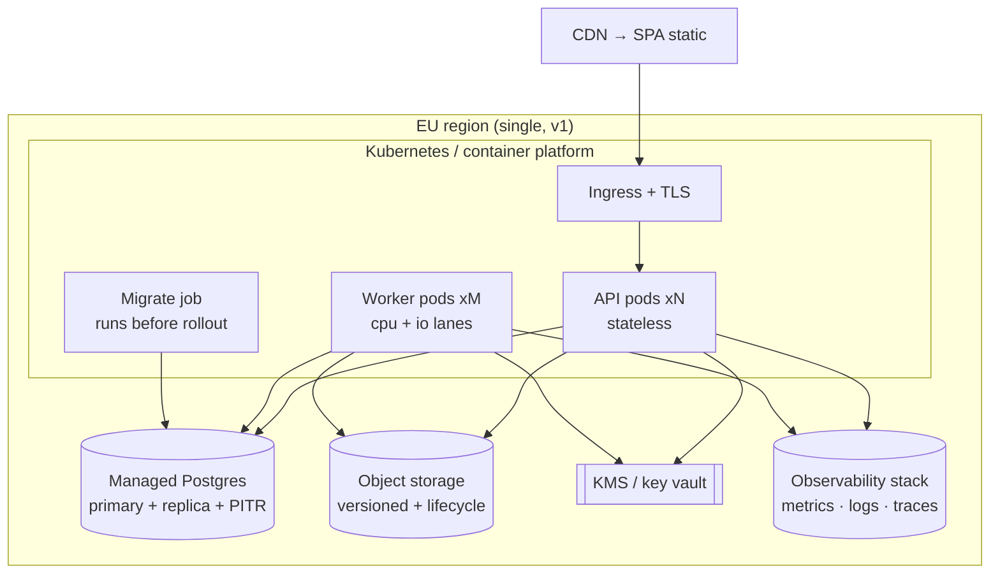

# InvoiceIQ — Deployment, Operations & Runtime Concerns

> Companion to [overview](./overview.md). Deployment environments, configuration & secrets, observability, backup & recovery, feature flags, localization, and the operational runbook basics. Complements the existing [`docs/DEPLOYMENT.md`](../DEPLOYMENT.md) and `deploy/k8s/`.

---

## 1. Runtime topology

- **One image, two entrypoints:** API (`uvicorn app.main:app`) and Worker (`python -m app.worker`). Same code → they never disagree on models/handlers.
- **Stateless API pods** scale horizontally behind the ingress. **Worker pods** scale independently; lanes (`--lane cpu|io`) isolate parse/OCR from IO-bound delivery/fetch.
- **Migrations run as a pre-rollout job** (`deploy/k8s/20-migrate-job.yaml`) and **fail-closed** — a bad migration blocks the rollout instead of half-migrating prod.
- **Readiness gates traffic:** `/health/ready` (DB reachable) must pass before the ingress routes to a pod; `/health` is liveness.

---

## 2. Deployment environments

| Env | Purpose | Data | Schema source | Notes |
|---|---|---|---|---|
| **Local/dev** | Developer loop | SQLite or local Postgres | `create_all` (non-prod) or Alembic | `docker-compose` brings up db + backend + worker + frontend. |
| **CI** | Tests + build | Ephemeral in-memory SQLite per test | `create_all` from metadata | Full suite incl. tenant-isolation + money tests; migration drift guard. |
| **Staging** | Pre-prod verification | Prod-like, anonymised | **Alembic** | Same image + config shape as prod; runs migrations; smoke tests. |
| **Production** | Live | Managed Postgres (PITR) + object storage | **Alembic (authoritative)** | `create_all` disabled in prod; EU region; backups + monitoring. |

**Promotion:** build once → same immutable image promoted dev→staging→prod. Config differs only by environment variables/secrets.

---

## 3. Configuration & secrets (ADR-0016)

- **12-factor:** all deployment-specific values via environment (`app/core/config.py::Settings`). `.env` for local only; never committed.
- **Key settings:** `ENVIRONMENT`, `DATABASE_URL`, `SECRET_KEY`, `CORS_ORIGINS`, `LOG_JSON`, `METRICS_ENABLED`, DB pool sizing (`DB_POOL_SIZE/MAX_OVERFLOW/TIMEOUT`), object-storage + KMS coordinates (as introduced).
- **Secrets** (SECRET_KEY, DB creds, provider keys, KEK) come from the platform secret store (k8s Secrets / cloud secret manager), mounted as env. Application-level stored secrets use **envelope encryption** (see [security-boundaries](./security-boundaries.md#5-secrets--key-management-adr-0016)).
- **`is_production` gates dangerous conveniences** (auto-create-all, verbose errors). Production fails loud on missing required secrets.
- **Billing (Stripe, ADR-0013), opt-in via config:** set `STRIPE_SECRET_KEY` to enable (unset → NullProvider, nothing charges). Also set `STRIPE_WEBHOOK_SECRET` (the webhook fails **closed** without it), the per-plan price ids (`STRIPE_PRICE_STARTER`, `STRIPE_PRICE_PRO`), and the redirect URLs (`BILLING_SUCCESS_URL`, `BILLING_CANCEL_URL`, `BILLING_PORTAL_RETURN_URL`). Point the Stripe dashboard webhook at `POST /api/v1/billing/webhook` for `checkout.session.completed` + `customer.subscription.{updated,deleted}`. `pip install stripe` on billing-enabled images. We are seller-of-record: enable **Stripe Tax** for VAT calculation; VAT remittance/filing remains a finance task.
- **Database role:** the app must connect as a **non-superuser** role. Postgres RLS (the tenant-isolation backstop) is bypassed by superusers even with `FORCE ROW LEVEL SECURITY`, so running the app as a superuser silently disables the DB-level isolation. Provision a dedicated least-privilege role that owns (or is granted on) the app tables and nothing more.

---

## 4. Observability

- **Structured JSON logs** with a **request-id** correlation id (RequestContextMiddleware); logs carry no secrets/PII.
- **Metrics** via Prometheus (`/metrics`, gated by `METRICS_ENABLED`): request rate/latency, DB pool, **queue depth + job success/DLQ**, **webhook delivery success**, parse method mix, per-tenant usage.
- **Health probes:** `/health` (liveness), `/health/ready` (readiness: DB `SELECT 1`).
- **Tracing (target):** OpenTelemetry spans across API→service→DB and worker handlers; propagate request-id.
- **Alerting (must-have):** DLQ depth > 0, oldest-pending-job SLO breach, webhook failure spike, readiness failures, backup verification failure, **any cross-tenant test failure in CI blocks release**.

### Golden operational signals
| Signal | Source | Alert |
|---|---|---|
| API p95 latency | metrics | > target |
| Job success rate / DLQ depth | jobs table + metrics | success < 99% or DLQ > 0 |
| Webhook delivery success | deliveries table | < 99% |
| DB pool saturation | metrics | sustained near max |
| Backup freshness + integrity | backup job | stale or manifest mismatch |
| Deterministic capture rate | `invoiceiq_documents_parsed_total{method}` | drops below target (rising AI/manual share) |

---

## 5. Backup & recovery

- **Database:** managed Postgres with **point-in-time recovery** (WAL) + daily snapshots; retention aligned to statutory needs.
- **Object storage:** **versioned** buckets with lifecycle rules; deletes are soft within the retention window.
- **Application-level integrity verification:** document bytes are content-addressed (sha256). `integrity.verify_documents` re-hashes every stored document reference (receipts, logos, email attachments) against its recorded sha256 to catch silent corruption, a lost object, or DB↔storage drift that a backup alone won't surface. Available on demand (admin: `POST /integrity/documents/verify`) and as a tenant-scoped background job (`integrity.verify_documents`). The **audit chain** is separately verifiable (`/audit/verify`). *These are backups of trust, not of bytes — the bytes are backed up by PITR + object versioning above.*
- **Restore runbook (RTO path):** (1) provision a new DB from the latest PITR/snapshot in-region; (2) point the app at it (DATABASE_URL) — object storage is unchanged (versioned, durable); (3) run `alembic upgrade head` if needed; (4) run `integrity.verify_documents` per tenant + `/audit/verify` to confirm the restored state is consistent with the object store; (5) resume traffic once `/health/ready` passes. **Drill this quarterly** into a scratch environment — *an untested backup is not a backup.*
- **RPO/RTO targets (v1):** RPO ≤ 5 min (PITR); RTO ≤ 4 h (runbook above). Multi-region DR is an Enterprise commitment (revisit when sold).

---

## 6. Feature flags (ADR-0017)

- **DB-backed flags**, two kinds:
  1. **Module switches** (`module_<key>` app_settings) — per-tenant capability on/off, plan-gated. This is the primary product-flag surface.
  2. **App settings** — per-tenant behavioural toggles (validation on/off, AI opt-in, scheduler on/off, backup interval).
- **No third-party flag service** in v1 — the module/settings mechanism is enough and keeps flags tenant-scoped and auditable. Add a dedicated flag service only if cross-cutting %-rollouts/experiments become a real need.
- **Defaults are safe:** new capabilities ship **default-off**; AI paths are opt-in.

---

## 7. Localization & internationalization

- **Data i18n first, UI i18n second.** The hard part is correct **currency, VAT, dates, number formats, and legal notes** per country — not UI strings.
- **Currency/tax/FX** handled centrally (money/fx/vat) with EUR as the pivot; per-country VAT schemes + notes; e-invoice formats sequenced per market (EN-16931 base → national profiles).
- **UI copy** externalised for the priority languages (driven by the first 2–3 target countries, PRD Q2); dates/numbers via locale formatting.
- **Retention periods** are locale-specific config, not hard-coded.

---

## 8. Scaling playbook (what we do, in order, when a metric hurts)

1. **API latency ↑** → add API replicas (stateless); check slow queries + indexes.
2. **Analytics contention** → route reads to a **replica**; materialise close-time metrics.
3. **Parse/OCR backlog** → add **cpu-lane** workers; enforce per-job deadlines.
4. **DB size from blobs** → complete **object-storage** migration (ADR-0008).
5. **Fat-tenant tables** → covering indexes → **partition** `invoices`/`line_items` by `org_id`/month.
6. **Write bottleneck** (rare) → connection-pool tuning → consider read/write split → only then bigger instances.
7. **Global latency / residency** → multi-region (Enterprise) — a deliberate, costed step, not a reflex.

No step introduces a new stateful service unless the metric proves it necessary.

---

## 9. Release & rollback

- **CI gate:** full test suite (incl. tenant-isolation + money), lint/typecheck, migration-from-empty + drift guard, image build.
- **Deploy:** migrate-job → rolling update of API + worker pods; readiness-gated.
- **Rollback:** roll back the image; **migrations are forward-safe/additive** (append columns, backfill with server defaults) so a previous image runs against the new schema. Destructive migrations are staged (expand→migrate→contract) across releases.
- **Zero-downtime:** additive migrations + readiness gates + stateless API make rolling deploys non-disruptive.

---

## 10. Operational invariants

1. Prod schema changes only via Alembic; migrations fail-closed before serve.
2. Readiness gates traffic; unhealthy pods don't receive requests.
3. Backups are verified and restore-drilled; integrity mismatches alert.
4. Secrets live in the platform secret store; none in images or logs.
5. New capabilities ship default-off; AI is opt-in.
6. A CI cross-tenant-isolation failure blocks the release. Always.
