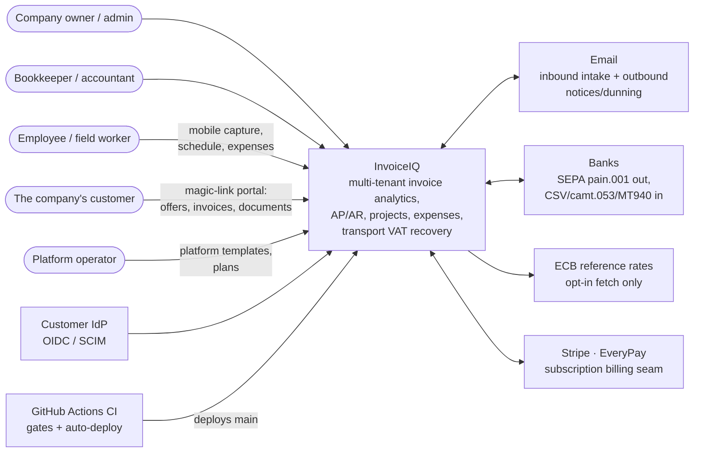
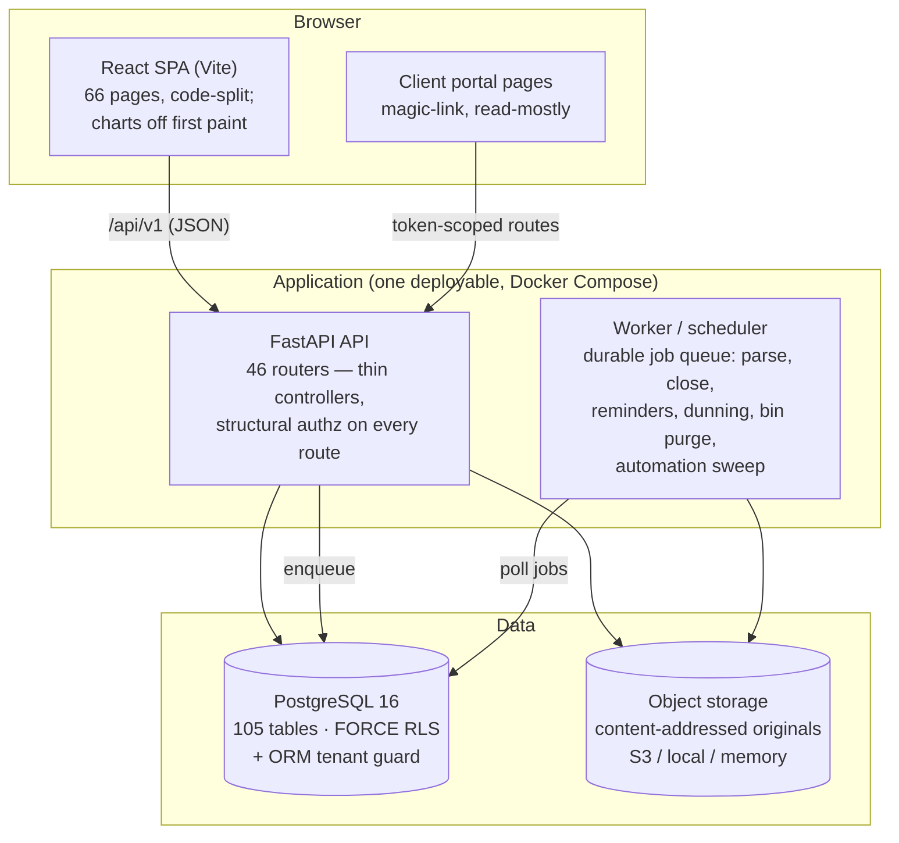

# InvoiceIQ — Diagram Matrix (what we diagram, for whom, and how it stays true)

> **Status:** v1 (2026-08-26, from the diagram-practices deep research) · Owner: Tech Lead
> Companion to [overview](./overview.md) · [domain-modules](./domain-modules.md) · [data-model](./data-model.md) · [data-model-erd (generated)](./data-model-erd.md) · [data-flows](./data-flows.md) · [deployment](./deployment.md)

The research behind this page (multi-source, adversarially verified) reduced
to three load-bearing facts:

1. **Rot is the failure mode.** Outdatedness is the most-reported
   architecture-documentation problem in industry (Fraunhofer IESE survey,
   n=147), and studies of real developers (Petre, ICSE 2013, n=50; Cherubini
   et al., CHI 2007, n=427) show heavyweight diagram sets get abandoned while
   informal, selective diagrams get used. So this matrix is deliberately
   SMALL, and every diagram carries an explicit freshness mechanism.
2. **Hand-maintain only what machines can't derive.** C4's own guidance:
   context and container diagrams are the two levels recommended for every
   team; component/code levels should be generated on demand or skipped;
   dynamic (sequence) diagrams used sparingly for the flows that earn them.
   Anything derivable from code (the ER diagrams here) is generated, with a
   CI check that fails on drift — the docs-as-code pattern.
3. **C4 doesn't cover data models or state machines** — it says so itself —
   so the ERD and the state tables live beside it, not inside it.

## The matrix

| Diagram | Where | Purpose | Audience | Maintained | Freshness mechanism / update trigger |
|---|---|---|---|---|---|
| **System context (C4-1)** | this page, below | What the system is, who touches it, what it talks to | Everyone incl. non-technical | By hand | Update in the PR that adds/removes an external actor or system; reviewed at every truth-up |
| **Container view (C4-2)** | this page, below | Deployable/runtime shape: SPA, API, worker, DB, storage | All technical staff incl. ops | By hand | Update in the PR that adds a runtime piece; deployment details live in [deployment](./deployment.md) |
| **Module map (≈C4-3)** | [domain-modules §2](./domain-modules.md) | Bounded modules + sanctioned dependencies | Engineers | By hand | Update when a module ships (the truth-up ritual); dependency RULES are machine-enforced by `tests/test_boundaries.py`, so the map can mislead but the code cannot |
| **ER diagrams, by domain** | [data-model-erd](./data-model-erd.md) | The real FK graph of all tables, legible per domain | Engineers, data/BI | **Generated** from `Base.metadata` (`backend/scripts/gen_erd.py`) | `tests/test_erd_truth.py` fails backend CI on any drift — regeneration is one command |
| **Logical data model (annotated)** | [data-model](./data-model.md) | Target model + build-state + design strategies (indexes, RLS, retention) | Engineers, reviewers | By hand | Figures pinned by `test_docs_truth.py`; narrative updated at truth-ups |
| **Key flow sequences** | [data-flows](./data-flows.md) | The ~10 flows where ordering/atomicity carries the guarantee (write path, jobs, extraction, SSO, project close, automation sweep) | Engineers | By hand, sparingly (per C4 guidance on dynamic diagrams) | A new flow gets a diagram only when a work order ships one; update in the shipping PR |
| **State machines** | in the owning docs/code (e.g. overcharge chain in `transport/overcharge.py` + [transport rules](../transport/rules.md); payment-run lifecycle in domain-modules §3) | Sanctioned status edges | Engineers | By hand, next to the enforcing code | The edge SETS are pinned by tests (e.g. the WO-82 edge-set pin) — the picture may lag, the enforcement cannot |
| **Deployment** | [deployment](./deployment.md) + the runbooks | How it runs in production | Ops, owner | By hand | Update when the topology changes (last: CI auto-deploy, 2026-08-26) |
| Component/code-level (C4-3/4) | — deliberately absent | — | — | Not kept | Per C4: generate on demand from the IDE; long-lived copies only rot |

**The standing rules.** (a) A diagram that can be derived from code must be —
with a CI gate, never a calendar reminder. (b) A hand-maintained diagram is
updated in the same PR as the change it depicts, and re-verified at each
dated truth-up (this set: 2026-08-20, 2026-08-26). (c) No diagram is added
without a row here naming its audience and freshness mechanism — an
unmaintained diagram is worse than none.

## System context (C4 level 1)

With default settings the system runs with **zero external calls**
(CI-enforced, ADR-0027): every arrow to an external system is opt-in,
per-tenant, and behind a seam.

## Container view (C4 level 2)

Both containers run the same codebase (`models → core → services → api`,
machine-enforced layering); the worker executes service code in tenant scope
through the same guard. TLS/Cloudflare/host specifics: [deployment](./deployment.md).
