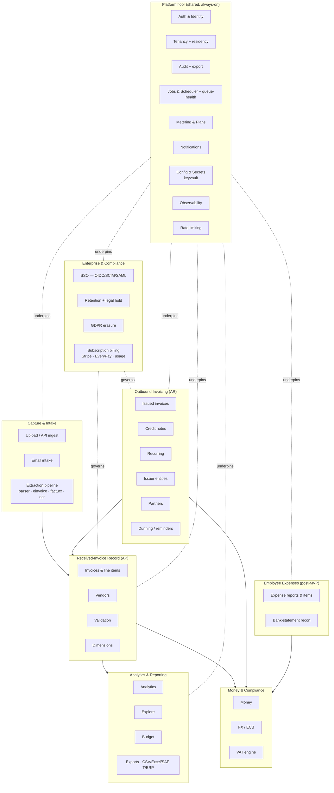

# InvoiceIQ — Domain-Module Map & Data Ownership

> Companion to [overview](./overview.md). Defines the bounded modules of the monolith, **who owns which data**, and the **dependency rules** that keep the monolith modular (and splittable later, if ever needed).

---

## 1. Module principles

1. **A module owns its tables.** Only that module's services write them. Others read via the owning service or a read model — never by reaching into another module's tables directly.
2. **Routers are thin; services hold logic.** A router validates, authorizes, calls a service, serializes. No business rules in routers.
3. **`core/` is domain-free.** It provides tenancy, security, DB session, money, dimensions, observability. It must not import domain services (no cycles).
4. **Dependencies point inward and downward.** Domain modules may depend on `core/` and on *platform* modules (auth, tenancy, audit, jobs). They must not depend "sideways" on unrelated domains except through defined seams (events, read-only queries).
5. **Cross-module side effects go through seams**, not direct calls into another module's internals: **domain events → webhooks/queue**, **audit.record**, **jobs.enqueue**.

---

## 2. Module map

**Enterprise & Compliance** is a distinct band because these modules *govern* the
record/AR data rather than produce it: SSO federates identity into Auth; retention
and GDPR erasure act on tenant data with statutory guardrails; billing gates
entitlements. They depend only on the platform floor + the data they act on, never
sideways into a domain's internals.

---

## 3. Data ownership table

Legend: **Owns** = writes + schema authority. **Reads** = consumes read-only. Isolation = tenant-scoped unless noted.

| Module | Owns (tables) | Key services | Reads from | Notes |
|---|---|---|---|---|
| **Auth & Identity** | `users`, `invitations`, `role_policies` | `security`, `roles`, `team`, `access` | — | Platform actor identity; `is_platform_admin` is *not* a company role. |
| **SSO (Enterprise)** | `sso_connections` | `oidc`, `scim`, `saml`, `sso_config` | users, orgs | Per-tenant OIDC/SCIM/SAML; JIT provisions into Auth; client secret **sealed** (keyvault). |
| **Tenancy + residency** | `organizations` (incl. `region`) | `core/tenant`, `core/residency` | users | Owns the isolation guard, org lifecycle/plan, and the region-pinning backstop. |
| **Audit** | `audit_events` | `audit`, `audit_export` | current actor/org | Append-only, hash-chained. Never edited; CSV/JSON export re-verifiable offline. |
| **Jobs & Scheduler** | `jobs` | `jobs`, `scheduler`, `job_handlers`, `worker`, `queue_health` | all (as handlers) | Durable queue; handlers run in tenant scope; `/health/queue` SLO probe. |
| **Metering & Plans** | `usage_counters` (incl. `reported`), `role_policies` (limits) | `access`, `plans`, `modules` | invoices (count) | Enforces quotas; module gating; `reported` watermark for metered billing. |
| **Subscription billing** | `billing_payments`, `processed_stripe_events` | `billing`, `billing_provider`, `billing_usage` | orgs, usage_counters | Stripe + EveryPay behind one seam; webhook/verify is the authority; idempotent. |
| **Retention & legal hold** | `retention_policies`, `legal_holds` | `retention` | all tenant tables | Purges past-window data unless on hold; audited; excludes audit + issued invoices. |
| **GDPR erasure (DSAR)** | — (acts on Auth/expenses/intake) | `privacy` | users, expenses, inbound | Pseudonymise/redact/delete; retains statutory + audit; hashed-subject audit. |
| **Secret vault** | — (pure) | `core/keyvault` | — | AES-256-GCM seal/unseal; KEK local/BYOK; seals the SSO client secret at rest. |
| **Notifications** | `webhook_endpoints`, `webhook_deliveries`, `email_messages` | `webhooks`, `mailer`, `dunning` | issued/expenses events | Delivery via the queue. |
| **Document storage** | — (sha refs on owning rows) | `documents`, `core/storage`, `integrity` | object storage | S3/local/memory backends; content-addressed; re-hash integrity verify. |
| **Upload / Ingest** | — (stateless) | `filesec`, upload routes, API ingest | plans (quota) | Produces drafts; persists nothing until confirm. |
| **Email intake** | `email_intake`, `inbound_invoices` | `email_intake`, `email_providers.mailgun` | parser | Attachments → review queue. Generic JSON webhook (`POST /email/inbound`, mandatory shared secret) plus a Mailgun-native adapter (`POST /email/inbound/mailgun`, HMAC signature + freshness window) — both resolve the tenant from the recipient-address token, never the sender, and feed the SAME `process_attachment` pipeline (E1.6). |
| **Extraction** | — (stateless) | `parser`, `einvoice`, `facturx`, `pdf_ocr` | object storage | Deterministic-first; opt-in AI seam. |
| **Invoices (AP)** | `invoices`, `line_items` | invoice routes, `validation` | vendors, fx, vat, dimensions | The core received-invoice record. |
| **Vendors** | `vendors` | vendor routes | — | Supplier master (received side). |
| **Validation** | (findings on invoice) | `validation` | invoice, fx, ecb | ONE service-owned engine (WO-7; ADR forthcoming in WO-10): a single rule registry — `block` rules (zero tolerance) gate AP submit, `advise` rules are the opt-in AI findings; human-gate routes to `pending`. |
| **Dimensions** | (columns on invoices/expense_items) | `core/dimensions` | — | Cost-allocation tags; catalog in one place. |
| **Master-data catalogs** | `tax_codes`, `currencies`, `departments`, `cost_centers`, `projects` | `tax_codes`, `currencies`, `costing` (+ `/tax-codes`, `/currencies`, `/masters/*` routes) | dimensions (tag→FK backfill) | WO-14: costing masters gained their API surface (read `invoice.read`, manage `settings.manage`); every catalog mutation is audited (`tax_code.*`, `currency.*`, `master.*`) in the same commit; optimistic `version`; archive-never-delete. |
| **Analytics** | (read models / metrics) | `analytics`, `explore`, `issued_reports`, `report_writers` | invoices, issued, dimensions | DB-side aggregation; single-currency. WO-15 (C1.6, ADR-0026): Explore and the fixed by-dimension report consume the one registry in `core/dimensions` — the five cost-allocation dimensions are pivotable in Explore and both paths return identical numbers for the same cut (shared `UNASSIGNED` bucket). WO-21 (I1.5): the general report-to-Excel/PDF gap (invoice PDF was production-grade but there was no general report writer) is closed for the Explore surface — `report_writers.to_xlsx`/`to_pdf` render any Explore cut, both formats consuming the exact same `explore.run()` result the JSON/CSV formats already do (no forked query), Excel cells formula-injection-safe using the same leading-`=`/`+`/`-`/`@`/tab/CR neutralisation CSV already uses. Scoped to Explore only — the fixed reports/audit export/ERP export do not yet have Excel/PDF output. |
| **Home dashboard** | — (pure projection) | `dashboard` (`GET /dashboard`) | approvals, expenses, payment runs, vendor changes, captures, ap_aging, issued_reports, cash_position | WO-16 (I1.1, ADR-0023): the composed "what needs me today" read — per-section permission/module gating (a section the caller may not see is `null`), SoD-aware "waiting on me" counts, zero forked math (every figure is the canonical service's own). |
| **Budget** | `budget_targets` | `budget` | invoices | Category budgets vs. spend. |
| **Exports** | — (stateless) | export services, `saft`, ERP exporters | invoices, issued | Read-only; formula-injection-safe. |
| **Issued (AR)** | `issued_invoices`, `issued_invoice_lines` | `issued_service` | issuer, vat, fx, partners | Immutable once issued; correction via credit note. |
| **Credit notes** | (rows in `issued_invoices`, `doc_type`) | `issued_service` | issued | Linked, own number series. |
| **Recurring** | `recurring_invoices` | `recurring` | issuer, partners | Idempotent generator via queue. |
| **Issuer entities** | `issuer_profiles` | `issuer` | — | Multiple legal entities; per-entity numbering + logo. |
| **Partners** | `partners`, `partner_documents` | `partners` | — | Counterparties + pre-invoicing workflow gates. |
| **Money** | — (pure) | `core/money` | — | Decimal quantization; no I/O. |
| **FX** | `ecb_rates` | `fx` | ECB (external) | EUR conversion with provenance. |
| **VAT** | — (pure) | `vat` | — | Scheme handling + breakdown. |
| **Expenses (post-MVP)** | `expense_reports`, `expense_items`, `expense_transactions`, `expense_comments` | `expenses`, `bank_statement` | fx, dimensions | Approval + reimbursement + recon. |
| **AP settlement (payment runs)** | `payment_runs`, `supplier_payments`, `reimbursement_batches` (with Expenses) | `payment_run`, `ap_payments`, `sepa`, `reimbursement` | invoices, vendors, issuer | Groups scheduled invoices, settles them via the append-only AP ledger, renders the pain.001 bank file. Carries the WO-9 settlement controls (below). |

### Settlement controls (WO-9)

The payout rails carry controls an auditor asks about, all server-enforced:

- **Maker ≠ checker ≠ payer.** A run's lifecycle is `open → approved → paid`:
  the creator cannot approve their own run, and neither creator nor approver can
  mark it paid (403 `maker_is_checker`, compared by immutable user id with an
  email fallback for pre-WO-9 rows). The only exemption is a platform admin's
  explicit `override_sod=true`, audited as `payment_run.sod_override` naming the
  overridden control.
- **Export guard.** Both bank-file routes (CSV + SEPA) require `payment.write`
  and an approved/paid run; a **second** export needs `confirm_reexport=true`
  (409 `already_exported` carrying the first export's timestamp).
- **Unique `MsgId` per generation.** `sepa.new_msg_id` emits
  `RUN-<id8>-<generation>-<random8>` (≤35 chars, enforced again in
  `build_pain001`) so a re-export never sends the bank a duplicate message id;
  the last MsgId is stored on the run and EVERY export's MsgId is in the audit
  log (`payment_run.exported`) — a bank query about any historic id is answerable.
- **Skipped payees are named.** An export that would drop a payee (missing IBAN
  — an invalid one is already refused at write and in `build_pain001`, WO-2) is
  refused with 409 `skipped_payees` naming them; `acknowledge_skipped=true`
  proceeds and the audit event records who was skipped.
- **Same treatment for reimbursement batches** (no approval stage — each report
  was individually approved under its own SoD — but export-once, unique MsgId
  and named-skipped-payee acknowledgement all apply).

**Ownership rule of thumb:** if you need another module's data, call its service or read its published read model. If you find yourself importing another module's *model* to write it, that's a boundary violation — raise it in review.

---

## 4. Dependency rules (allowed vs. forbidden)

**Allowed**
- Any module → `core/` (money, tenant, security, dimensions, observability, database).
- Any module → platform modules via their public service functions (`audit.record`, `jobs.enqueue`, `webhooks.emit`, `plans.*`, `modules.require_enabled`).
- AR/Expenses → Money (`fx`, `vat`, `money`).
- Analytics/Exports → read-only over Record/AR tables.

**Forbidden**
- `core/` → any domain service (no cycles).
- Router → another router's internals (compose via services).
- Direct write to another module's tables.
- Sideways domain→domain imports except through events/queue/audit seams.
- Raw SQL in request paths that bypasses the tenant guard.

**Seams between modules (the only sanctioned cross-module coupling)**
1. **Domain events** — `webhooks.emit(org_id, event_type, data)` fans out via the queue. Producers don't know consumers.
2. **Jobs** — `jobs.enqueue(kind, payload, ...)` for deferred/idempotent work; handlers registered centrally.
3. **Audit** — `audit.record(...)` best-effort, never breaks the caller.
4. **Metering/gating** — `access.enforce_*`, `modules.require_enabled` as guards at the router edge.

---

## 5. Bounded contexts (if we ever split)

If a future metric ever forces extraction of a service (unlikely before real scale), these are the **natural seams**, in order of least-painful:

1. **Extraction/OCR worker** — already stateless + queue-fed; split first (CPU isolation).
2. **Notifications delivery** — webhooks/email are already queue-driven, event-fed.
3. **Analytics/read models** — read-only; could move behind a read replica / read service.
4. **AR (issuing)** — self-contained aggregate with its own tables.

Everything else (auth, tenancy, invoices, money) stays in the core monolith. **We do not split speculatively** — the seams exist so we *could*, not so we *must*.

---

## 6. Module-to-route quick index

| Bounded area | Routers (`app/api/routes/`) | Primary services |
|---|---|---|
| Auth/identity | `auth`, `team`, `access` | `security`, `roles`, `team`, `access` |
| Received invoices | `invoices`, `vendors` | `parser`, `validation`, `fx`, `vat` |
| Intake | `invoices/upload`, `email` | `filesec`, `email_intake`, `einvoice` |
| Analytics | `analytics`, `budget` | `analytics`, `explore`, `budget` |
| Issuing (AR) | `issued`, `recurring`, `issuer`, `partners` | `issued_service`, `recurring`, `dunning`, `facturx`, `invoice_pdf` |
| Expenses | `expenses` | `expenses`, `bank_statement` |
| Exports | `export` | `erp_export`, `saft` |
| Enterprise SSO | `sso`, `scim`, `auth` (`/sso/*`) | `oidc`, `scim`, `saml`, `sso_config`, `core/keyvault` |
| Compliance | `retention`, `privacy`, `audit` (`/export`) | `retention`, `privacy`, `audit_export` |
| Platform | `jobs`, `webhooks`, `modules`, `billing`, `platform`, `settings`, `audit`, `integrity` | `jobs`, `scheduler`, `queue_health`, `webhooks`, `mailer`, `plans`, `modules`, `audit`, `billing_provider`, `billing_usage`, `integrity` |
