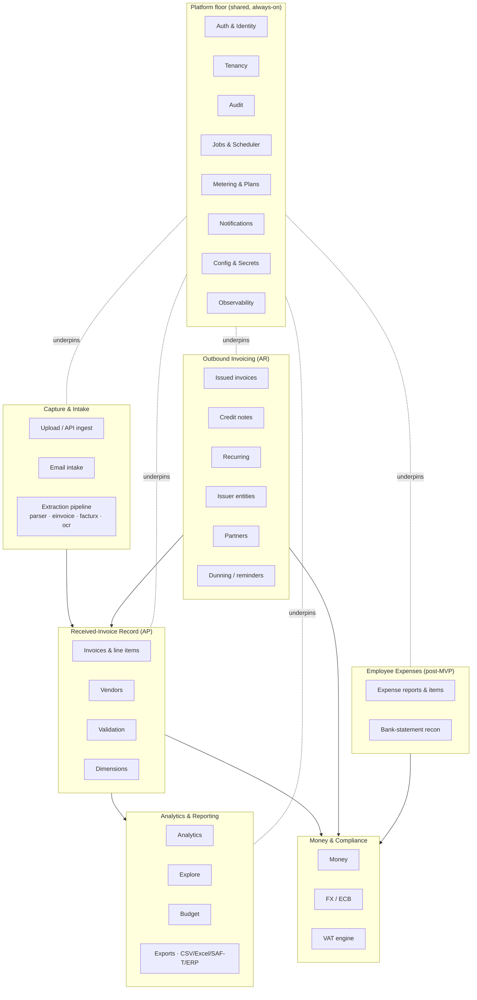

# InvoiceIQ — Domain-Module Map & Data Ownership

> Companion to [overview](./overview.md). Defines the bounded modules of the monolith, **who owns which data**, and the **dependency rules** that keep the monolith modular (and splittable later, if ever needed).

---

## 1. Module principles

1. **A module owns its tables.** Only that module's services write them. Others read via the owning service or a read model — never by reaching into another module's tables directly.
2. **Routers are thin; services hold logic.** A router validates, authorizes, calls a service, serializes. No business rules in routers.
3. **`core/` is domain-free.** It provides tenancy, security, DB session, money, dimensions, observability. It must not import domain services (no cycles).
4. **Dependencies point inward and downward.** Domain modules may depend on `core/` and on *platform* modules (auth, tenancy, audit, jobs). They must not depend "sideways" on unrelated domains except through defined seams (events, read-only queries).
5. **Cross-module side effects go through seams**, not direct calls into another module's internals: **domain events → webhooks/queue**, **audit.record**, **jobs.enqueue**.

---

## 2. Module map

---

## 3. Data ownership table

Legend: **Owns** = writes + schema authority. **Reads** = consumes read-only. Isolation = tenant-scoped unless noted.

| Module | Owns (tables) | Key services | Reads from | Notes |
|---|---|---|---|---|
| **Auth & Identity** | `users`, `invitations`, `role_policies` | `security`, `roles`, `team`, `access` | — | Platform actor identity; `is_platform_admin` is *not* a company role. |
| **Tenancy** | `organizations` (+ registry) | `core/tenant` | users | Owns the isolation guard + org lifecycle/plan. |
| **Audit** | `audit_events` | `audit` | current actor/org | Append-only, hash-chained. Never edited. |
| **Jobs & Scheduler** | `jobs` | `jobs`, `scheduler`, `job_handlers`, `worker` | all (as handlers) | Durable queue; handlers run in tenant scope. |
| **Metering & Plans** | `usage_counters`, `role_policies` (limits) | `access`, `plans`, `modules` | invoices (count) | Enforces quotas; module gating. |
| **Notifications** | `webhook_endpoints`, `webhook_deliveries`, `email_messages` | `webhooks`, `mailer`, `dunning` | issued/expenses events | Delivery via the queue. |
| **Upload / Ingest** | — (stateless) | `filesec`, upload routes, API ingest | plans (quota) | Produces drafts; persists nothing until confirm. |
| **Email intake** | `email_intake`, `inbound_invoices` | `email_intake` | parser | Attachments → review queue. |
| **Extraction** | — (stateless) | `parser`, `einvoice`, `facturx`, `pdf_ocr` | object storage | Deterministic-first; opt-in AI seam. |
| **Invoices (AP)** | `invoices`, `line_items` | invoice routes, `validation` | vendors, fx, vat, dimensions | The core received-invoice record. |
| **Vendors** | `vendors` | vendor routes | — | Supplier master (received side). |
| **Validation** | (findings on invoice) | `validation` | invoice, fx, ecb | Advisory; AI opt-in; never blocks unless human-gate on. |
| **Dimensions** | (columns on invoices/expense_items) | `core/dimensions` | — | Cost-allocation tags; catalog in one place. |
| **Analytics** | (read models / metrics) | `analytics`, `explore`, `issued_reports` | invoices, issued, dimensions | DB-side aggregation; single-currency. |
| **Budget** | `budget_targets` | `budget` | invoices | Category budgets vs. spend. |
| **Exports** | — (stateless) | export services, `saft`, ERP exporters | invoices, issued | Read-only; formula-injection-safe. |
| **Issued (AR)** | `issued_invoices`, `issued_invoice_lines` | `issued_service` | issuer, vat, fx, partners | Immutable once issued; correction via credit note. |
| **Credit notes** | (rows in `issued_invoices`, `doc_type`) | `issued_service` | issued | Linked, own number series. |
| **Recurring** | `recurring_invoices` | `recurring` | issuer, partners | Idempotent generator via queue. |
| **Issuer entities** | `issuer_profiles` | `issuer` | — | Multiple legal entities; per-entity numbering + logo. |
| **Partners** | `partners`, `partner_documents` | `partners` | — | Counterparties + pre-invoicing workflow gates. |
| **Money** | — (pure) | `core/money` | — | Decimal quantization; no I/O. |
| **FX** | `ecb_rates` | `fx` | ECB (external) | EUR conversion with provenance. |
| **VAT** | — (pure) | `vat` | — | Scheme handling + breakdown. |
| **Expenses (post-MVP)** | `expense_reports`, `expense_items`, `expense_transactions`, `expense_comments` | `expenses`, `bank_statement` | fx, dimensions | Approval + reimbursement + recon. |

**Ownership rule of thumb:** if you need another module's data, call its service or read its published read model. If you find yourself importing another module's *model* to write it, that's a boundary violation — raise it in review.

---

## 4. Dependency rules (allowed vs. forbidden)

**Allowed**
- Any module → `core/` (money, tenant, security, dimensions, observability, database).
- Any module → platform modules via their public service functions (`audit.record`, `jobs.enqueue`, `webhooks.emit`, `plans.*`, `modules.require_enabled`).
- AR/Expenses → Money (`fx`, `vat`, `money`).
- Analytics/Exports → read-only over Record/AR tables.

**Forbidden**
- `core/` → any domain service (no cycles).
- Router → another router's internals (compose via services).
- Direct write to another module's tables.
- Sideways domain→domain imports except through events/queue/audit seams.
- Raw SQL in request paths that bypasses the tenant guard.

**Seams between modules (the only sanctioned cross-module coupling)**
1. **Domain events** — `webhooks.emit(org_id, event_type, data)` fans out via the queue. Producers don't know consumers.
2. **Jobs** — `jobs.enqueue(kind, payload, ...)` for deferred/idempotent work; handlers registered centrally.
3. **Audit** — `audit.record(...)` best-effort, never breaks the caller.
4. **Metering/gating** — `access.enforce_*`, `modules.require_enabled` as guards at the router edge.

---

## 5. Bounded contexts (if we ever split)

If a future metric ever forces extraction of a service (unlikely before real scale), these are the **natural seams**, in order of least-painful:

1. **Extraction/OCR worker** — already stateless + queue-fed; split first (CPU isolation).
2. **Notifications delivery** — webhooks/email are already queue-driven, event-fed.
3. **Analytics/read models** — read-only; could move behind a read replica / read service.
4. **AR (issuing)** — self-contained aggregate with its own tables.

Everything else (auth, tenancy, invoices, money) stays in the core monolith. **We do not split speculatively** — the seams exist so we *could*, not so we *must*.

---

## 6. Module-to-route quick index

| Bounded area | Routers (`app/api/routes/`) | Primary services |
|---|---|---|
| Auth/identity | `auth`, `team`, `access` | `security`, `roles`, `team`, `access` |
| Received invoices | `invoices`, `vendors` | `parser`, `validation`, `fx`, `vat` |
| Intake | `invoices/upload`, `email` | `filesec`, `email_intake`, `einvoice` |
| Analytics | `analytics`, `budget` | `analytics`, `explore`, `budget` |
| Issuing (AR) | `issued`, `recurring`, `issuer`, `partners` | `issued_service`, `recurring`, `dunning`, `facturx`, `invoice_pdf` |
| Expenses | `expenses` | `expenses`, `bank_statement` |
| Platform | `jobs`, `webhooks`, `modules`, `billing`, `platform`, `settings`, `audit` | `jobs`, `scheduler`, `webhooks`, `mailer`, `plans`, `modules`, `audit` |
