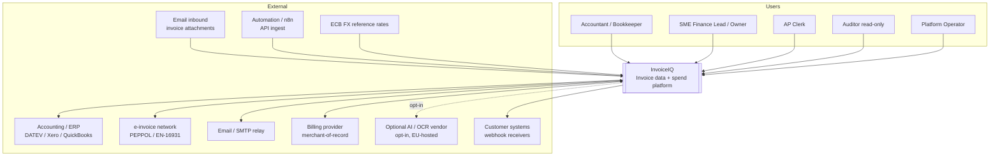
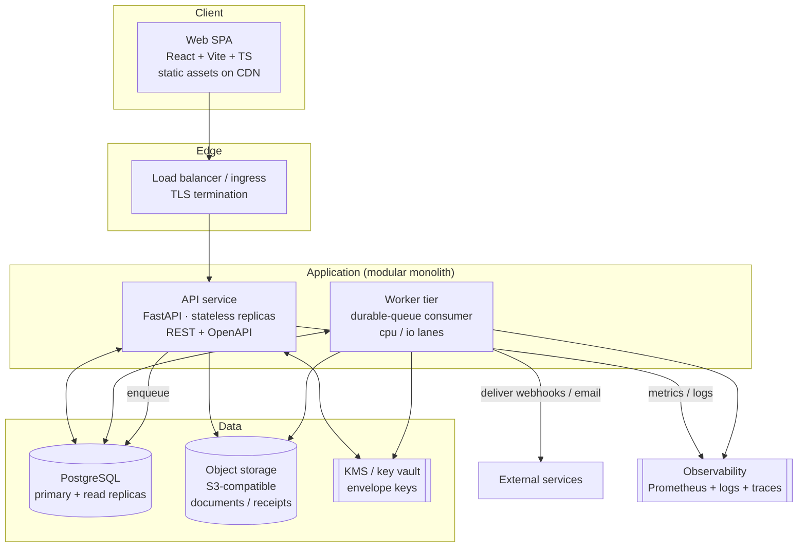

# InvoiceIQ — Architecture Overview

> **Status:** Draft v1 · Owner: Tech Lead · Last updated: 2026-07-20
> **Audience:** engineers, reviewers, future maintainers (5-year horizon).
> **Companion docs:** [domain-modules](./domain-modules.md) · [data-flows](./data-flows.md) · [security-boundaries](./security-boundaries.md) · [deployment](./deployment.md) · [ADRs](./adr/)
> **Product context:** [../product/product-requirements.md](../product/product-requirements.md)
>
> This is the authoritative architecture reference. The root [`ARCHITECTURE.md`](../../ARCHITECTURE.md) is a lightweight intro; this set supersedes it for detail.

---

## 0. Stance (read this first)

I am designing this to be **owned and maintained for at least five years by a small team**. Every decision optimises for: *tenant-isolation safety*, *money correctness*, *operational simplicity*, and *the ability to change one module without touching the rest*. When two options are close, I pick the **more boring, more reversible** one.

The foundations already exist and are sound (FastAPI + async SQLAlchemy + Postgres, a defence-in-depth tenant guard, a durable job queue, hash-chained audit, Decimal money, ECB FX). This document formalises them, **challenges the risky parts**, and defines the target architecture we grow into — without a rewrite.

---

## 1. Challenging the requirements (before any code)

The product context and PRD are ambitious. As the long-term owner I am flagging what is unclear, dangerous, or needlessly complex, and recommending simpler paths. **These are architectural guardrails, not just opinions.**

### 1.1 Unclear requirements that must be pinned down

| # | Unclear | Why it blocks architecture | Recommended default |
|---|---|---|---|
| U1 | "Support multiple … data residency" — but which regions, and is per-tenant pinning promised? | Determines single-region vs. multi-region topology (a huge cost/complexity fork). | **Single EU region for v1**; region-pinning is an Enterprise feature, designed-for but not built. |
| U2 | "Immutable accounting history where required" — *where* exactly? | Immutability has real cost (append-only tables, no deletes). Applying it everywhere is wrong. | Immutability applies to **issued invoices, credit notes, and the audit log** only. Received-invoice drafts remain editable until confirmed. |
| U3 | "AI extraction" scope — is AI in the *capture* path or advisory? | Puts customer documents through third parties → residency + accuracy + cost risk. | **Deterministic-first**; AI is opt-in, default-off, advisory, DLP-gated. Never the sole source of a booked figure. |
| U4 | "Search" — over what, and how fuzzy? | Elasticsearch is a large operational commitment. | **Postgres full-text** over documents/metadata first; a dedicated engine only when proven necessary. |
| U5 | "API and webhooks" — public API SLA? partner integrations? | Public API = versioning, rate-limits, docs, support burden. | Ship **REST + OpenAPI** (already generated) for first-party + token-gated ingest; a *supported public API* is a later, deliberate product. |

### 1.2 Dangerous financial-data assumptions (call them out now)

| # | Dangerous assumption | Consequence | Mitigation (architectural) |
|---|---|---|---|
| D1 | "We can store money as float." | Rounding drift → wrong VAT/totals → liability + lost trust. | **Decimal end-to-end**, `ROUND_HALF_UP`, `money.py`; storage columns `Numeric(14,2)`; never `round()` on currency. Enforced by review + tests. (ADR-0010) |
| D2 | "One currency total is meaningful across currencies." | Summing EUR+GBP is nonsense; silently wrong reports. | Reports operate on a **single currency**; FX→EUR conversion carries **provenance** (rate + source + date). Mixed-currency aggregates are forbidden. |
| D3 | "The invoice figure the AI read is authoritative." | Booking a hallucinated number. | The **PDF/source is the source of truth**; AI output is a draft a human confirms; structured formats never fall to AI. |
| D4 | "We can freely delete/edit invoices." | Breaks accounting integrity + statutory retention. | Issued docs immutable; corrections via **credit notes**, not edits; deletions blocked by retention/legal hold. |
| D5 | "Re-running a job is safe by default." | Duplicate invoices, double emails, double webhooks. | **Idempotency is designed in**: idempotency keys, guarded updates, `next_run_date` advanced atomically. (ADR-0011) |
| D6 | "Usage limits can hard-block anytime." | Losing a customer's invoice at a cap = data loss + churn. | Caps are **soft with visible signalling**; never drop/delete a document to enforce a limit. |
| D7 | "Timestamps are wall-clock local." | FX-by-date, retention, and audit ordering break across zones. | **UTC everywhere**; dates for FX are the invoice's stated date; audit uses monotonic seq + UTC ms. |

### 1.3 Scaling risks

| Risk | Trigger | Design response |
|---|---|---|
| Fat tenants (100k+ invoices) slow dashboards | A few large customers | DB-side aggregation (already), covering indexes, **materialised close-time metrics**, partition `invoices`/`line_items` by `org_id`/month when needed. |
| Parse/OCR CPU saturates the API | Bursty uploads | Extraction runs on the **worker tier**, never inline; worker lanes (cpu/io) scale independently. |
| Blob-in-DB bloats Postgres | Receipts/logos stored as `LargeBinary` today | **Migrate document bytes to S3-compatible object storage**; DB keeps metadata + hash. (ADR-0008) |
| Single primary write bottleneck | Growth | Read-replicas for analytics; the app already reads product data through a read-oriented path; connection pool is bounded. |
| Queue starvation / thundering herd | Many tenants, daily scheduler | Bounded worker concurrency, backoff, dedicated lanes; scheduler is date-keyed idempotent. |

### 1.4 Security & tenant-isolation risks

| Risk | Design response |
|---|---|
| A forgotten `org_id` filter leaks data | **Two layers**: per-route filters *and* an ORM `do_orm_execute` guard that ANDs `org_id == current_org` onto every SELECT touching a tenant model. Every new tenant table **must** be registered in `TENANT_MODELS` (enforced by test + review). (ADR-0004) |
| Child tables (line items) have no `org_id` | Reached only via an already-scoped parent; never queried standalone with user input. |
| Raw SQL bypasses the guard | Raw SQL is forbidden in request paths; if unavoidable, it carries an explicit tenant predicate + review. |
| Cross-tenant via background jobs | The worker runs **unscoped** to claim jobs, then **sets tenant scope** around each handler so handler queries + audit are correctly scoped. |
| Malicious uploads | Single choke-point scan + type validation; zip caps/slip neutralised; documents served **inert** (attachment + nosniff) under strict CSP; parse worker sandboxed. |
| Secret leakage | Envelope encryption (KEK→DEK) for stored secrets; never log plaintext; GCM auth failures raise. |

### 1.5 Features that add unnecessary complexity → simpler alternatives

| Tempting feature | Simpler alternative (chosen) | Tradeoff accepted |
|---|---|---|
| Microservices per domain | **Modular monolith** with strict module boundaries | Less independent scaling/deploy; but one team, one deploy, transactional integrity, far less ops. Revisit only at real scale/team-size pressure. (ADR-0001) |
| Kafka/event bus | **In-process events + the durable DB job queue** | No streaming/replay across services; but no broker to run, exactly-once via DB. |
| Elasticsearch | **Postgres FTS** | Weaker relevance/scale ceiling; but one datastore, no sync. (ADR-0014) |
| Redis for cache/queue/locks | **Postgres** for queue + `advisory locks`/leader election; add Redis only if a measured need appears | One less stateful service; slightly less throughput headroom. (ADR-0007) |
| Separate auth service / OIDC provider | **First-party JWT** now; SSO/SAML via a provider at Enterprise | Less standards surface early; but simpler, and pluggable later. (ADR-0005) |
| Generic BI query builder | **Opinionated dashboards + explore** | Less flexibility; but supportable and fast. |

### 1.6 Explicit top-level tradeoffs (recorded)

- **Monolith over microservices:** we trade independent scaling for transactional integrity, one deployable, and low ops cost. This is correct for a small team and financial data that wants ACID.
- **Postgres for everything (data, queue, search, locks):** we trade specialised-tool ceilings for one datastore to run, back up, and reason about. We accept that some of these get replaced *if and when* a metric forces it.
- **Shared-schema multitenancy:** we trade the hard isolation of schema/DB-per-tenant for cost and operability, and buy back safety with the ORM guard (+ Postgres RLS as belt-and-braces later).
- **Deterministic-first extraction:** we trade "magic" AISlurp for accuracy, cost control, and residency safety.

---

## 2. C4 Level 1 — System context



---

## 3. C4 Level 2 — Containers



**Container notes**
- **API** and **Worker** run the *same codebase* (`app.main` vs. `python -m app.worker`) — one image, two entrypoints. Simplifies build/deploy and guarantees the two agree on models + handlers.
- **The queue is a table in Postgres** — no separate broker. (ADR-0007)
- **Object storage** is the target for document bytes; today some bytes live in the DB (logos/receipts) and must migrate. (ADR-0008)

---

## 4. C4 Level 3 — Components (API service)

```mermaid
graph LR
  subgraph API[FastAPI app]
    MW[Middleware<br/>TenantScope · RequestContext · CSP/headers]
    DEPS[Deps<br/>get_current_user → sets tenant + actor]
    subgraph Routers
      R1[auth / team / access]
      R2[invoices / vendors / upload]
      R3[analytics / explore / budget]
      R4[issued / recurring / issuer / partners]
      R5[expenses]
      R6[jobs / webhooks]
      R7[modules / billing / platform / settings]
    end
    subgraph Services["Domain services (business logic)"]
      S1[validation · parser · einvoice · facturx]
      S2[analytics · issued_reports · dunning]
      S3[issued_service · recurring · vat · fx · money]
      S4[jobs · scheduler · webhooks · mailer]
      S5[access · plans · modules · audit]
    end
    subgraph Platform["Cross-cutting (core/)"]
      C1[tenant guard]
      C2[security / JWT]
      C3[database / session]
      C4[money · dimensions]
      C5[observability]
    end
  end

  MW --> DEPS --> Routers --> Services --> Platform
  Services --> ORM[(SQLAlchemy models)]
  Platform --> ORM
```



Boundary rule: **routers are thin** (validate, authorize, call a service, serialize). **Services own business logic** and are the only place that mutates domain state. **`core/` is dependency-free of domain modules** (no service imports core-into-a-cycle). Full module map in [domain-modules.md](./domain-modules.md).

---

## 5. Technology choices (summary; rationale in ADRs)

| Concern | Choice | ADR |
|---|---|---|
| Architecture style | Modular monolith | [0001](./adr/0001-modular-monolith.md) |
| Backend stack | FastAPI + async SQLAlchemy 2.0 + Pydantic v2 | [0002](./adr/0002-backend-stack.md) |
| Datastore | PostgreSQL (single primary + replicas) | [0003](./adr/0003-postgres-primary-datastore.md) |
| Tenant isolation | Shared-schema row-level + ORM guard (+ RLS later) | [0004](./adr/0004-tenant-isolation.md) |
| AuthN | Stateless JWT bearer | [0005](./adr/0005-authentication-jwt.md) |
| AuthZ | Role hierarchy + permission matrix + module gating | [0006](./adr/0006-authorization-model.md) |
| Background work | DB-backed durable queue + worker | [0007](./adr/0007-background-jobs.md) |
| File storage | S3-compatible object storage | [0008](./adr/0008-object-storage.md) |
| Extraction | Deterministic-first pipeline, opt-in AI | [0009](./adr/0009-extraction-pipeline.md) |
| Money/tax/FX | Decimal + ECB provenance + VAT engine | [0010](./adr/0010-money-tax-fx.md) |
| Idempotency/concurrency | Keys + guarded/optimistic updates | [0011](./adr/0011-idempotency-concurrency.md) |
| Audit | Hash-chained append-only | [0012](./adr/0012-audit-log.md) |
| Billing | Merchant-of-record + usage metering | [0013](./adr/0013-billing-metering.md) |
| Search | Postgres full-text first | [0014](./adr/0014-search.md) |
| API | REST + OpenAPI, versioned | [0015](./adr/0015-api-strategy.md) |
| Config/secrets | Env + envelope encryption (KMS) | [0016](./adr/0016-config-secrets.md) |
| Feature flags | DB-backed modules + settings | [0017](./adr/0017-feature-flags.md) |
| Notifications | Webhooks + email via the queue | [0018](./adr/0018-notifications.md) |

---

## 6. Delivery sequence (architecture work, not product features)

Ordered to de-risk the platform before scaling product. Each phase is shippable and reversible.

**Phase 0 — Harden the foundation** ✅ *shipped*
1. ✅ Enforce "every tenant table registered in `TENANT_MODELS`" — `tests/test_tenant_registration.py` fails the build if a model with `org_id` is unregistered (or a registration is stale/duplicated).
2. ✅ Migrations run clean from an empty DB + downgrade→upgrade round-trip, and the migrated schema matches the models (table/column parity) — `tests/test_migrations.py` (complements CI `alembic check`).
3. ✅ Money/FX/VAT invariants locked as a golden-file suite — `tests/test_money_invariants.py` (Decimal HALF_UP, VAT scheme correctness + notes, FX provenance, no mixed-currency aggregation).

**Phase 1 — Storage & extraction correctness**
4. ✅ Migrate document bytes (receipts, logos, email attachments) to **object storage** (`core/storage.py` local/s3/memory + `services/documents.py`); DB keeps sha256 + size; legacy blobs read via dual-read; MinIO wired into `docker-compose` (ADR-0008).
5. ✅ Move **bulk/non-interactive** parse/OCR to the worker tier: email attachments are stored + `queued`, an `email.extract` job parses out-of-band (retryable, off the API tier). Interactive single-file upload stays synchronous **by design** (ADR-0009).
6. ✅ Deterministic-capture-rate metric wired to observability: `parse_invoice_file` (the single parse choke point) records `invoiceiq_documents_parsed_total{method}` in the default Prometheus registry, exposed on `/metrics` (`core/metrics.py`).

**Phase 1 complete.**

**Phase 2 — Multi-tenant safety at the DB layer**
7. ✅ **Postgres RLS** behind the app guard (defence in depth; no API change): `FORCE` RLS + a `tenant_isolation` policy on all 22 tenant tables keyed on the `app.current_org` GUC; a Postgres CI job runs migrations + the RLS enforcement tests (SQLite can't). Verified against real Postgres (ADR-0004). *Also surfaced + fixed a latent Postgres-only migration bug (boolean literal) that SQLite CI had masked.*
8. ✅ **Integrity verification** — `integrity.verify_documents` re-hashes every content-addressed document (receipts/logos/email attachments) against its recorded sha256 to catch corruption/loss; admin endpoint + background job. Restore runbook documented (bytes are backed by PITR + object versioning; this verifies trust). ([deployment.md](./deployment.md))

**Phase 2 complete.**

**Phase 3 — Commercial + integration surface**
9. 🟡 **Billing — Stripe + EveryPay** wired to the existing plan/entitlement model (ADR-0013): one provider seam, `billing_provider`-selected. **Stripe** (subscription) = Checkout + Portal + signed webhook as the authority. **EveryPay** (Baltic card gateway, redirect kind) = hosted payment page → **server-side verify** (never the redirect) via `billing_payments`, tokenised initial payment, and **merchant-initiated recurring** on the job queue (`everypay.charge_mit`). Both apply plan/status **idempotently**. We are seller-of-record → EU VAT is our responsibility (Stripe Tax calculates; remit/file is a documented follow-up). **Metered-usage overage** now reports to Stripe (idempotent `count - reported` deltas as Billing Meter events, `billing.report_usage` daily job). Deferred: Stripe Tax enablement + EveryPay advanced dunning.
10. 🟡 **ERP exporters** behind the export hub (read-only, formula-injection-safe): generic accounting CSV + Xero (Bills) + QuickBooks (Bills) shipped (`erp_export.py`, `GET /export/accounting`). DATEV (needs the German SKR framework + EXTF spec) and country-profiled SAF-T deferred as config-gated builds.
11. 🟡 **Rate limiting** — a per-process fixed-window abuse guard shipped (`core/ratelimit.py`, `RateLimitMiddleware`): a strict IP-keyed tier on `/auth/*` (brute-force / credential-stuffing) and a general per-token/IP tier, both env-tunable (`RATE_LIMIT_*`), returning `429` + `Retry-After`; health/metrics probes exempt. Honest scope: per-replica, so a precise *global* limit remains the shared-store (Redis) scale path. API-key auth + versioning + published OpenAPI docs still open (ADR-0015).

**Phase 4 — Enterprise readiness**
12. 🟡 **Data retention + legal hold** shipped (ADR-0019): per-(tenant, category) keep-N-days policies (opt-in, safe by default) with a daily `retention.purge` queue job + on-demand admin run; **legal hold** suspends all purging (preservation > minimization); explicit child+object-byte deletion; every action audited; `audit_events` + `issued_invoices` deliberately excluded.
13. 🟡 **Audit-log export** shipped: owner-gated `GET /audit/export?fmt=csv|json` (+ action/date filters) streams the hash-chained trail **including the seq/prev_hash/hash columns** so an auditor can re-verify the chain offline; formula-injection-safe CSV; chain-verify status in the JSON body + response headers. SOC 2 / ISO evidence.
14. 🟡 **GDPR right-to-erasure (DSAR)** shipped (ADR-0020): admin-gated erasure keyed by email that **respects the law's limits** — pseudonymises user accounts (row kept for audit/FK integrity), redacts expense author names, deletes inbound-email records + bytes, and **retains + reports** issued tax invoices (statutory, Art. 17(3)(b)) and the audit trail (integrity chain). A legal hold blocks it; a preview classifies every location before execution; the run is audited with a hashed subject reference.
15. 🟡 **Enterprise SSO — OIDC** implemented (ADR-0021): per-tenant OIDC connection (`sso_connections`), authorization-code + **PKCE** + signed stateless `state`, **ID-token validation** (RS256/JWKS, iss/aud/exp/nonce) proven with locally-minted key fixtures, **JIT provisioning** (match/create in-org, cross-org + domain guards), `/auth/sso/{slug}/authorize` + `/auth/sso/callback` + admin config (secret write-only). **Fixtures boundary (ADR-0021):** the live discovery/token-exchange/JWKS HTTP is exercised against a real IdP / Keycloak — the "return to finish" step. **SCIM** provisioning + **SAML** are next/scaffolded.
16. 🟡 **SCIM 2.0 provisioning** implemented (ADR-0021): token-gated `/scim/v2/Users` (create/list/get/replace/patch/delete) the tenant's IdP calls to auto-create + **deactivate** users (soft delete → audit/FK integrity survives); per-connection bearer token (sha256 stored, minted once), request scoped to the connection's org. **Return to finish:** SCIM `Groups` + Okta/Entra paging/PATCH dialects.
17. 🟡 **SAML SP scaffolding** (ADR-0021): the offline-provable request side — `build_authn_request`, HTTP-Redirect binding, SP metadata — plus config + `/auth/sso/{slug}/saml/{metadata,login}` routes. **The boundary:** assertion consumption (`/auth/sso/saml/acs`) deliberately returns **501** — validating a signed SAML Response needs a vetted XML-DSig library (none installed) + a real IdP, the final "return to finish". Still open in Phase 4: SAML assertion validation, region-pinning, SOC 2/ISO controls.

**SSO/SCIM/SAML "return to finish" (needs a real IdP / Keycloak):** the OIDC live discovery/token-exchange/JWKS HTTP; SCIM `Groups` + Okta/Entra dialects; SAML assertion validation via a pinned XML-DSig library; and moving `sso_connections.client_secret` to the encrypted secret store (ADR-0016).
18. 🟡 **Queue-health observability** shipped: `queue_health.snapshot` (cross-tenant) surfaces dead-letter depth + oldest ready-but-unprocessed age (queue-lag SLO); a **`/health/queue`** probe returns **503 when degraded** (DLQ over threshold or lag past `queue_slo_max_pending_age_seconds`) so an uptime check pages, and Prometheus gauges (`invoiceiq_jobs{status}`, `invoiceiq_jobs_oldest_pending_seconds`) are refreshed by the worker each loop. Still open in Phase 4: region-pinning, SOC 2/ISO controls; fat-tenant dashboard latency + distributed rate limiting remain scale-gated.

Guiding rule: **no phase introduces a new stateful service unless a metric forces it.**

---

## 7. Technical risk register

Scored **Impact (1–5) × Likelihood (1–5)**. Product/market risks live in [../product/risks.md](../product/risks.md); this is *technical*.

| ID | Risk | I | L | Score | Mitigation | Revisit when |
|---|---|---|---|---|---|---|
| T1 | Cross-tenant leak via unguarded query/table | 5 | 2 | 10 | ORM guard + mandatory `TENANT_MODELS` registration + CI test + RLS later | any new query pattern; before enterprise |
| T2 | Money/VAT/FX miscalculation | 5 | 2 | 10 | Decimal-only, provenance, golden tests, sampled audits | new tax scheme/country |
| T3 | Blob-in-DB bloat degrades Postgres | 3 | 4 | 12 | Migrate to object storage (ADR-0008) | before 10k tenants or DB > ~50% blobs |
| T4 | Fat-tenant dashboard latency | 3 | 3 | 9 | DB aggregation, indexes, materialised metrics, partitioning | p95 > 1.5s at 100k invoices |
| T5 | Parse worker overload / poison messages | 3 | 3 | 9 | worker lanes, backoff, DLQ, sandbox, per-job deadline | DLQ depth rising; parse p95 breach |
| T6 | Schema drift between models and migrations | 3 | 3 | 9 | CI drift guard; `db_migrate` versioned per module | any migration confusion |
| T7 | Secret exposure / KEK mismanagement | 5 | 1 | 5 | envelope encryption, KMS provider, no plaintext logs | provider switch; multi-region |
| T8 | Idempotency gap → duplicate financial effect | 4 | 2 | 8 | idempotency keys, guarded updates, dedup constraints | new write path/integration |
| T9 | External vendor outage (billing/AI/SMTP) | 3 | 3 | 9 | provider-abstracted seams, queue-buffered, graceful degradation | vendor SLA breach |
| T10 | Single-region outage | 4 | 2 | 8 | backups + documented DR; multi-region is Enterprise | residency/DR commitment sold |
| T11 | Migration lock / long-running DDL downtime | 3 | 2 | 6 | batched migrations, `db_migrate` idempotent steps, off-peak | table > tens of millions of rows |
| T12 | Public API misuse / no rate limits | 3 | 3 | 9 | token scopes, rate limits, quotas (ADR-0015) | public API GA |

---

## 8. Repository structure (current + target)

```
Bid_it/
├── backend/
│   ├── app/
│   │   ├── main.py                # API entrypoint (FastAPI app + middleware)
│   │   ├── worker.py              # Worker entrypoint (durable-queue consumer)
│   │   ├── seed.py                # Demo/dev seed
│   │   ├── api/
│   │   │   ├── router.py          # Router registration (order matters)
│   │   │   ├── deps.py            # get_current_user → tenant + actor context
│   │   │   └── routes/            # Thin HTTP routers (one per bounded area)
│   │   ├── core/                  # Cross-cutting, domain-free
│   │   │   ├── config.py          # 12-factor settings
│   │   │   ├── database.py        # engine + session factory
│   │   │   ├── tenant.py          # ContextVar + ORM guard + middleware
│   │   │   ├── security.py        # JWT + password hashing
│   │   │   ├── security_headers.py# CSP + nosniff
│   │   │   ├── money.py           # Decimal quantization
│   │   │   ├── dimensions.py      # cost-allocation dimension catalog
│   │   │   ├── roles.py           # role hierarchy helpers
│   │   │   └── observability.py   # logging + request-id + metrics
│   │   ├── models/                # SQLAlchemy models (one file per aggregate)
│   │   ├── schemas/               # Pydantic v2 request/response models
│   │   └── services/              # Domain logic (the real work)
│   ├── alembic/versions/          # Migrations (source of truth in prod)
│   └── tests/                     # pytest (incl. tenant-isolation, money)
├── frontend/                      # React + Vite SPA
├── deploy/k8s/                    # Kubernetes manifests
├── docker-compose.yml             # local: db + backend + worker + frontend
├── docs/
│   ├── product/                   # PRD, personas, workflows, pricing, metrics, risks
│   └── architecture/              # ← this set
│       ├── overview.md
│       ├── domain-modules.md
│       ├── data-flows.md
│       ├── security-boundaries.md
│       ├── deployment.md
│       └── adr/                   # Architecture Decision Records
└── ARCHITECTURE.md                # lightweight intro (superseded by docs/architecture)
```

**Target additions (as phases land):** `app/core/storage.py` (object-storage abstraction), `app/core/flags.py` (flag reads), `app/services/export/` (ERP/SAF-T exporters), `infra/` (IaC — Terraform), `docs/architecture/adr/` growth.

---

## 9. Non-negotiable invariants (the things that must never break)

1. **No cross-tenant data access** — enforced at row + ORM (+ RLS) layers; every tenant table registered.
2. **Money is Decimal with provenance** — no floats on currency; FX/VAT auditable to source.
3. **Financial documents are durable and, once issued, immutable** — corrections via credit notes; deletions respect retention.
4. **Background effects are idempotent** — re-running never double-charges, double-emails, or double-books.
5. **Every change is attributed and audited** — hash-chained, verifiable.
6. **Secrets never hit logs; documents are served inert.**

These invariants outrank features. A change that risks one gets blocked in review.
