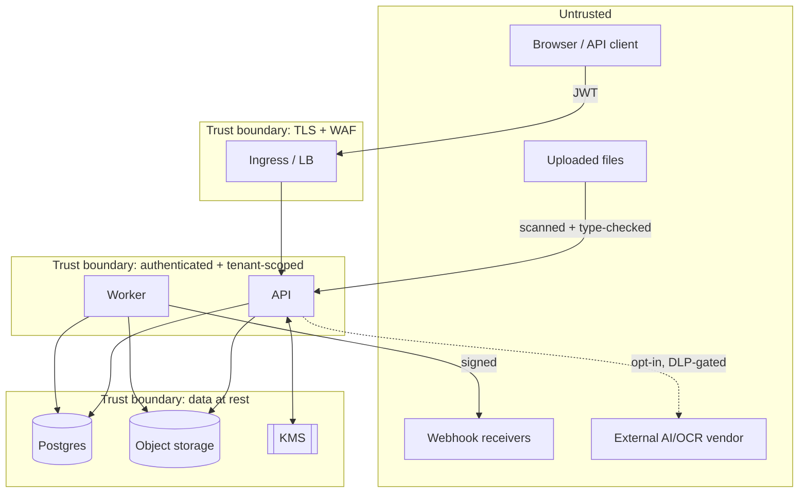

# InvoiceIQ — Security Boundaries

> Companion to [overview](./overview.md). The trust boundaries, tenant isolation, authentication, authorization, secret handling, file-upload security, and audit that make a multi-tenant financial-data platform safe. A cross-tenant leak is treated as **existential** (GDPR Art. 33/34).

---

## 1. Trust boundaries

Everything left of the app boundary is **untrusted**: request bodies, tokens, uploaded bytes, and any external verdict (AV scan, AI output, webhook receiver) are re-validated on our side.

---

## 2. Tenant isolation (the primary control)

**Model:** shared-schema, row-level `org_id`, with **three enforced layers** (ORM guard + mandatory `TENANT_MODELS` registration + Postgres RLS). (ADR-0004)

1. **Explicit per-route filters** — every query filters `org_id == current_org`. First line of defence.
2. **ORM guard (defence in depth)** — a `do_orm_execute` hook ANDs `org_id == current_org` onto **every SELECT** touching a registered tenant model, via `with_loader_criteria`. A *forgotten* filter cannot leak.
3. **Postgres RLS (implemented, Phase 2)** — every tenant table has `FORCE ROW LEVEL SECURITY` + a `tenant_isolation` policy keyed on the per-transaction GUC `app.current_org` (mirrored from the tenant ContextVar). Even a raw query, a bug above the ORM, or an unregistered model is contained *at the database*. GUC unset ⇒ bypass (bootstrap/operator/worker); set ⇒ restricted. Verified against real Postgres (a raw cross-tenant select returns nothing; a cross-tenant insert is refused). **The app must run as a non-superuser** — superusers bypass RLS even with `FORCE`.

**Context establishment**
- A request-scoped `ContextVar` holds the current org. It is set **from the authenticated user's DB row** (`user.org_id`) in `get_current_user` — never from client input or a token claim.
- `TenantScopeMiddleware` sets scope to `None` at request start and resets on exit → no leakage across requests on a reused process.
- **Unscoped contexts** are explicit and few: bootstrap (register/login/accept-invite) and platform-operator reads. The worker runs unscoped to *claim* jobs, then sets scope per job.

**Mandatory registration rule**
- Every table with an `org_id` **must** be listed in `TENANT_MODELS`. This is the single most important operational rule. **Phase 0 adds a CI test that fails if a model has `org_id` but isn't registered.**

**Child tables** (`line_items`, `issued_invoice_lines`, `expense_items`) have no `org_id` and are reached only through an already-scoped parent — never queried standalone from user input.

**Cross-tenant by role:** the only cross-tenant capability is `is_platform_admin` (a platform operator), which is **separate from any company role** and always outranks them. No company `owner` can ever see another company. This is verified by automated tests (a fresh owner sees zero foreign rows; can invite but cannot touch the global matrix).

---

## 3. Authentication (ADR-0005)

- **Stateless JWT bearer tokens.** Any API replica validates a token with no session store. Login is by **email** (mapped to the internal principal); SSO accounts use email as principal.
- Passwords hashed with **bcrypt** (passlib). Tokens signed with the app secret (HS256) — **secret from the environment**, never committed.
- Token carries only the subject (`sub` = user id). All authorization data (role, org) is **re-read from the DB each request** so a revoked/downgraded user takes effect immediately and a token can't assert privileges.
- **Per-request gate chain (WO-4).** `deps.get_current_user` enforces, in order: token signature → live server-side session (`jti` neither revoked nor expired) → `user.is_active` → an **active membership** in the active org → **`Organization.status == "active"`**. Suspending a tenant therefore kills the very **next** request from every member (401, `code="organization_suspended"` — a 401, not 403, so the SPA logs the user out; the body is otherwise identical to an invalid-token 401, leaking nothing about the org). The org row fetched by this gate is reused for the residency backstop and `get_current_org` — exactly one organizations query per request.
- **Session revocation triggers.** One mechanism (`sessions.revoke_bulk`, non-committing so revocation is atomic with its cause + audit event): logout / sign-out-everywhere / password reset / user deactivation / **role change** (org-scoped — a session active in another org is untouched) / **org suspension** (all sessions pointed at the tenant, via the platform lever). Each bulk revocation is audited as `session.revoked_bulk` with the trigger and count. Revocation is one-way: reactivating a suspended org does **not** resurrect old tokens — members log in afresh.
- **Platform-operator routes are deliberately unscoped** (`get_current_user_unscoped` + `is_platform_admin`): they must keep working against a suspended tenant — that is how an operator reverses a suspension. Token/session/`is_active` checks still apply; the tenant ContextVar stays `None`.
- **Enterprise SSO (ADR-0021):** **OIDC login + JIT provisioning + IdP-group→role mapping** and **SCIM 2.0 provisioning** are shipped (ID-token validation proven offline with key fixtures); **SAML** SP request-side is scaffolded and assertion consumption is the documented boundary (needs a vetted XML-DSig library + a real IdP). The SSO OAuth **client secret is sealed at rest** (AES-256-GCM via `core/keyvault`, ADR-0016). Machine principals (SCIM bearer token, Stripe webhook signature) authenticate as a token/signature — **not** a user — and set tenant scope explicitly. JWT remains the internal session token. Still to formalise before public-API GA: refresh-token rotation + short access-token TTL, and the production KEK provider (env/BYOK vs cloud KMS, `DECISIONS-NEEDED.md §5`).

---

## 4. Authorization (ADR-0006)

Layered, checked centrally, fail-closed.

1. **Role hierarchy** (company-scoped, low→high): `user` (read-only base) < `processor`/`user` (day-to-day) < `admin` (business admin) < `owner` (company's top role — **not** a system admin). Plus the separate platform-operator flag.
2. **Permission matrix** — configurable per role for the configurable tiers, with sane default grants (admin/processor all-on, read-only user all-off). Enforced via `has_perm` / `PERM_BY_ENDPOINT`.
3. **Module gating** — capabilities (`issuing`, `expenses`, …) are on/off per tenant and **plan-gated**; `modules.require_enabled` guards the routes.
4. **Usage quotas** — per-role monthly limits (invoices, uploads) enforced at the router edge (`access.enforce_*`), soft-capped with visible signalling.
5. **Segregation of duties** — e.g. an approver cannot approve their own expense report; an issued invoice to a partner is blocked until required documents are signed.

Authorization decisions never trust client-supplied role/org — they use the server-derived user + tenant context.

---

## 5. Secrets & key management (ADR-0016)

- **Configuration is 12-factor:** every deployment value comes from the environment; nothing secret is committed (`.secret_key`, certs, `security.db`, runtime DBs are git-ignored).
- **Stored secrets** (e.g. portal credentials) use **envelope encryption**: a fresh AES-256-GCM DEK per secret, wrapped by a KEK, AAD-bound to context. KEK provider is pluggable (`local` derived from app secret; `env`/BYOK; KMS/HSM target). **GCM auth failures raise — never silently return empty.**
- **Never log a plaintext secret or IBAN.** Analytics payloads carry no secrets/PII/amounts.
- **KEK rotation / provider switch** on a populated store requires a re-wrap migration — documented as an operational procedure, not an ad-hoc action.

---

## 6. File-upload security

Attacker-controlled PDFs/ZIPs are a top threat. Defence in depth at a single choke point:

- **`filesec` gate** — magic-byte type sniff + allowlist + size cap, and an AV scan (EICAR + clamd; fail-open only when no daemon configured, fail-closed at the external ingest endpoint). Enforced at the **enqueue choke point** so *every* path (UI, API ingest, email) is covered.
- **ZIP extraction** enforces decompression caps (member/size/total) and neutralises **zip-slip** (writes via basename, in-memory + hashed, never the raw path).
- **Never execute an upload.** `/doc/<id>` serves **inert** (attachment + `nosniff`) under a strict CSP (`script-src 'self'`, `object-src 'none'`).
- **The parse/OCR worker is sandboxed** (unprivileged, no-network, resource-capped) — a malicious document can't pivot.
- **XML parsing** guards against XXE/entity expansion; **exports** are formula-injection-safe (CSV/Excel).

---

## 7. Audit (ADR-0012)

- **Immutable, hash-chained** append-only log: each event chains its hash into the next; `verify_chain` walks a tenant's events and reports the first break (a deleted or edited row breaks the chain).
- Every data change is attributed to an **actor** (set in the request context) and recorded **best-effort** — an audit failure is logged loudly but never breaks the user's operation; the event commits atomically with the operation it describes.
- Reads are tenant-scoped. The audit table is **never edited or deleted** through application code.

---

## 8. Data protection & residency

- **EU-region hosting** by default (app, DB, object storage, backups). No personal data leaves the EU/EEA without adequacy/SCCs; sub-processors documented.
- **Encryption:** TLS in transit; encryption at rest for DB + object storage; envelope encryption for application secrets.
- **PII minimisation:** collect only what the job needs; mask bank data in analytics; short-lived logs without secrets.
- **Retention & erasure** (Phase 4, ADR-0019, shipped): per-(tenant, category) **retention windows** — opt-in, *no default* (absence = keep forever), so nothing is deleted until an admin sets a window; a daily + on-demand purge removes rows **and** their object-storage bytes and is audited. A **legal hold** suspends all purging (preservation overrides minimization). `audit_events` (the tamper-evident record) and `issued_invoices` (statutory accounting retention + gap-free numbering) are deliberately **not** purgeable.
- **GDPR erasure / DSAR** (ADR-0020, shipped): admin-gated erasure keyed by email that pseudonymises user accounts (row kept for audit/FK integrity), redacts expense author names, and deletes inbound-email records + bytes, while **retaining and reporting** statutory records (issued tax invoices, Art. 17(3)(b)) and the audit chain rather than silently deleting them. A legal hold blocks it; execution is audited with a hashed subject reference (no cleartext email retained). Still open: a formal DSAR register/SLA, async erasure for large subjects, per-matter (per-record) holds.

---

## 9. Threat model (STRIDE, abbreviated)

| Threat | Example | Control |
|---|---|---|
| **Spoofing** | Forged token / another user | JWT signature + DB re-read of identity each request |
| **Tampering** | Edit a booked invoice / audit row | Immutable issued docs + hash-chained audit + integrity hashes |
| **Repudiation** | "I didn't change that" | Attributed, verifiable audit chain |
| **Information disclosure** | Cross-tenant read | ORM guard + registration rule + Postgres RLS + tests |
| **Denial of service** | Upload floods / zip bombs | Size/decompression caps, rate limits, worker isolation, quotas |
| **Elevation of privilege** | Company user gains system power | Company roles capped at `owner`; `is_platform_admin` separate + audited |

---

## 10. Security invariants (never violate)

1. Tenant scope derives from the server-side user row and guards every SELECT; every tenant table is registered.
2. Authorization is re-evaluated per request from server state, fail-closed.
3. Secrets are envelope-encrypted, KMS-backed, never logged.
4. Uploads are scanned + type-validated at one choke point and served inert.
5. The audit chain is append-only and verifiable.
6. No personal data leaves the EU without a documented legal basis.
