# Platform Engineering Plan — evolving Bid_it (InvoiceIQ) into the all-in-one financial workspace

**Author:** Senior Solution Architect / acting CTO
**Date:** 2026-07-24
**Inputs:** `BA_bidit.md` (analysis of `/home/user/Bid_it`), `BA_fleet_fuel.md` (analysis of `/home/user/fleet_fuel_system`), the founder's charter.
**Decision already taken (not relitigated here):** evolve **Bid_it** as the single platform. One repo. Fleet Fuel is retired as a codebase and harvested as a **specification** — its unique domain becomes a **transport vertical module** inside the platform.
**Team assumption:** essentially **one engineer + AI assistance**. Every estimate below is engineer-days for that team. There is no second engineer to parallelise onto.

**Verification note.** Every claim about the current code was re-checked against the repo before being planned on. Confirmed directly this session: `app/api/routes/vendors.py` has **no `authz.require` and no `audit.record`** on create/update (it does set `iban`/`bic`); `app/api/routes/partners.py::_guard` checks **only `modules.require_enabled(..., "issuing")`**, no permission; `app/api/deps.py::get_current_user` checks `user.is_active`, a live session `jti` and an active membership but **never `Organization.status`**; `app/api/routes/email.py` treats the inbound secret as optional (`expected = settings.inbound_email_secret`, checked only if set); `_reconcile` — the hard AP submit gate — lives in **`app/api/routes/invoice_review.py:94`**, i.e. business logic in a controller; 60 Alembic migrations, 46 model modules, 38 route modules, 75 service modules, 115 test modules, 5 CI jobs incl. a real-Postgres RLS + concurrent-numbering job. In Fleet Fuel, real client identifiers are confirmed as module constants (`customer_master.CUSTOMERS` carries `«Client-EE» AS / EE1########0 / «street», «postcode» «city», Estonia`, `UAB «Client-LT-1» / LT1##########7`, …) and `customers.db`, `fuel_history.db`, `suppliers.db` are **committed to git**.

---

## Table of contents

1. Architecture Decision Record
2. Gap analysis (charter vs. reality)
3. Product roadmap (M0–M6)
4. Epics → features → tasks
5. Dependency graph & critical path
6. Risk assessment
7. Technical-debt register
8. Test strategy
9. TODO board
10. First 10 work orders

---

# 1. ARCHITECTURE DECISION RECORD

## ADR-P1 — Target architecture: modular monolith on the existing Bid_it stack

**Status:** Accepted. **Supersedes:** nothing. **Extends:** Bid_it ADR-0001 (modular monolith), 0002 (backend stack), 0003 (Postgres), 0004 (tenant isolation), 0006 (authorization).

### Decision

Keep the stack and the layering exactly as they are: **FastAPI + async SQLAlchemy 2.0 + Postgres + Alembic + React SPA**, a **modular monolith** with a machine-enforced one-way dependency rule (`models → core → services → api`, enforced by `tests/test_boundaries.py`). Do not rewrite, do not extract services, do not introduce a message broker.

This is not inertia. Bid_it already satisfies most of the charter's stated *principles* at a level that is expensive to reproduce:

- **"business logic never in controllers"** — declared in `docs/architecture/engineering-rules.md` §3 and CI-enforced for the import direction. (It is violated in exactly one important place — `routes/invoice_review.py::_reconcile` — which §4 fixes.)
- **"modules independent with clear interfaces"** — `docs/architecture/domain-modules.md` already publishes a data-ownership table: a module owns its tables, others read through its service, cross-module side effects go through seams (`audit.record`, `jobs.enqueue`, webhooks).
- **"assume hostile users"** — three independent tenant-isolation layers (per-query filters, an ORM `do_orm_execute` guard over a 59-model registry, Postgres `FORCE ROW LEVEL SECURITY`), plus a CI test asserting the RLS-covered table set **equals** the tenant-model set exactly.
- **"every feature ships with … audit logging"** — a hash-chained, per-tenant-monotonic `audit_events` table with offline-verifiable export.

The 22 ADRs and `docs/product/*` are the real specification. **`README.md` and `ARCHITECTURE.md` are materially stale and must be treated as legacy** (they describe a ~12-test analytics MVP; the backend is ~32k LOC with 761 tests).

### Consequences

- Migration cost is zero; the work becomes *closing gaps*, not *porting*.
- The 761 existing tests remain the regression net through every refactor (see §8).
- The known scaling limits (per-process rate limiting, single-region residency) stay as documented debt, not blockers.

---

## ADR-P2 — Bounded contexts: the charter's 10 modules are 8 contexts + 2 projections

**Status:** Accepted. **This is a challenge to the charter.**

### The challenge

The charter names 10 "core modules". Two of them — **1 Dashboard** and **7 Reports** — are **not bounded contexts**. They own no domain concept, no lifecycle and no writes. They are *projections* over other contexts' data. Modelling them as modules is how you get the exact defect the Fleet Fuel BA flags as requirement **R51** ("one canonical query layer — nothing forks the math") and the exact defect Bid_it already has (the Explore pivot engine and the fixed `/analytics/by-dimension` report carry **different dimension registries**; `analytics.summary()` hard-codes `"EUR"` while the AR reports correctly force one currency per report).

Likewise **9 Integrations** and **10 SaaS Administration** are not one context each: Integrations is a *set of adapters at the edges of several contexts* (email into Intake, ERP out of Exports, banks into Payments, IdPs into Identity), and SaaS Administration is genuinely two things (entitlements/metering, and subscription billing) that Bid_it already separates.

### Decision — the target context map

**Domain contexts (own tables, own lifecycle, own invariants):**

| # | Context | Owns | Charter modules served |
|---|---|---|---|
| C1 | **Intake & Capture** | (stateless) + `email_intakes`, `inbound_invoices`, `extraction_runs`, `extraction_fields` | 2 |
| C2 | **AP Record** (payables) | `invoices`, `line_items`, `vendors`, validation findings, `approval_policies`/`approval_steps`, `invoice_comments`/`_attachments` | 2 |
| C3 | **AR / Issuing** (receivables) | `issuer_profiles`, `customers`/`customer_contacts`, `partners`/`partner_documents`, `issued_invoices`/`_lines`/`_attachments`, `recurring_invoices`, `dunning_policies`, `email_messages` | 4 |
| C4 | **Settlement & Banking** | `supplier_payments`, `payment_runs`, `payments` (AR ledger), `receipts`, `bank_statements`, `bank_lines` | 5 |
| C5 | **Expenses** | `expense_*`, `reimbursement_batches` | 3 |
| C6 | **Money & Compliance kernel** (pure) | `ecb_rates`, `tax_codes`, `currencies` + pure `money`/`vat`/`fx` services | 4, 5, 6 |
| C7 | **Organization & Identity** | `organizations`, `users`, `memberships`, `invitations`, `sessions`, `sso_connections`, `departments`/`cost_centers`/`projects` | 8 |
| C8 | **Transport vertical** *(new — see ADR-P3)* | `fuel_transactions`, `vat_refund_claims` + locks, per-country supplier registrations, excise, overcharge | new |

**Cross-cutting projection layers (own no domain tables, may own read models / materialised rollups):**

| # | Layer | Rule | Charter modules served |
|---|---|---|---|
| P1 | **Insight** — analytics, explore, benchmark, budget, cash position, cash flow, dashboards | **Every figure derives from one canonical query registry.** No surface may fork the math. A materialised rollup must be recomputable through the same code path and drift-checked. | 1, 6 |
| P2 | **Export & Reporting** — CSV/Excel/PDF/SAF-T/ERP/e-invoice XML/audit export | Read-only over context services. Formula-injection-safe. Never invents a figure. Never sums across currencies. | 7 |

**Platform floor (underneath everything, already built):** auth/authz, tenancy + residency, audit, jobs & scheduler, metering & plans, billing, notifications/webhooks, documents & storage, filesec, keyvault, observability, retention/legal hold, GDPR erasure.

**Integrations (charter 9)** is explicitly *not* a context. It is a **register of adapters**, each owned by the context it feeds, each behind an existing Protocol seam: `ExtractionProvider`, `BillingProvider`, storage backend Protocol, `email_intake` provider adapter, ERP exporter registry, `sso_connections`. New integrations add an adapter, never a module.

**SaaS Administration (charter 10)** splits into **Entitlements & Metering** (`org_modules`, `plans`, `usage_counters`, `role_policies` — built) and **Subscription Billing** (`billing_*`, Stripe/EveryPay behind `BillingProvider` — built, not live).

### Why this matters commercially

Because it converts "build 10 modules" into "close the last mile on 8 contexts that mostly exist, and build 1 new one". The charter reads like a greenfield brief; the codebase is ~85% of the way to it in *shape*. The plan below is therefore a **gap-closing plan, not a build plan** — except for the transport vertical, which is genuinely new.

---

## ADR-P3 — How the transport vertical plugs in without polluting the core

**Status:** Accepted. **This is the single most important structural decision in this plan.**

### The risk

Fleet Fuel's domain is intensely specific: litres, `net_eur_eff` (effective net after *off-invoice* rebates), `product_group` with a "PROMO → HVO → everything else → Diesel LAST" precedence, EU VAT refund claims keyed `(entity × refund country × period)`, Art. 9 expenditure codes, per-country seller legal entities, excise per 1,000 L. If any of that leaks into `invoices`, `line_items` or `vendors`, every non-transport tenant pays the complexity tax forever, and the AP record — the most reusable asset — becomes a fuel-card table.

### Decision — a plug-in context with a one-way seam

```
app/models/transport/       fuel_transaction.py, vat_claim.py, supplier_registration.py,
                            excise.py, overcharge.py, contract_term.py
app/services/transport/     capture.py, claim.py, claim_gates.py, goods_codes.py,
                            entity_resolution.py, excise.py, overcharge.py, fuel_analytics.py
app/api/routes/transport/   fuel.py, claims.py, recovery.py, excise.py, overcharges.py
tests/transport/            one test file per R-requirement group
```

Six binding rules:

1. **Transport owns only transport tables.** It never adds a column to `invoices`, `line_items` or `vendors`. Fuel line detail lives in `fuel_transactions` with a nullable FK to the AP invoice it was captured from.
2. **Transport reads the core through services, never through joins.** It calls `invoice_service`, `vendor_service`, `documents`, `fx`, `vat` — the same seam any other context uses. `tests/test_boundaries.py` gets a new assertion: no module under `services/transport/` may import a model from another domain package.
3. **Transport is an entitlement.** A new `org_modules` key `transport`, default **off**, plan-gated exactly like `issuing`/`expenses`. A tenant that does not buy it sees no nav, no routes (`modules.require_enabled` → 403), and pays no query cost.
4. **Transport reuses the platform floor unchanged** — `core/money` (Decimal ROUND_HALF_UP), the hash-chained audit, tenancy (`org_id` + composite FK + RLS), the jobs queue for the monthly close and any portal fetch, `filesec` at the single upload choke point, `documents` for the vault, `keyvault` for any stored credential.
5. **Transport adds permissions, not roles.** New `Permission` members `VAT_READ`, `VAT_WRITE`, `VAT_SUBMIT`, `TRANSPORT_READ` join the existing 20 in `app/core/authz.py`, and get rows in `ROLE_PERMISSIONS` for all 8 business roles. No new role tier.
6. **Transport never gates a core figure and the core never gates a claim.** The advisory covenant from Fleet Fuel §3.L is preserved: excise, overcharge, benchmark and any AI seam are advisory and cannot mutate a legal figure.

### The one Fleet Fuel invariant that must be *translated*, not copied

Fleet Fuel §3.H is emphatic that the **engine owns and writes the product DB; the app reads it read-only**, and that **`vat_claims.db` is a physically separate database** — "so a monthly reload can never corrupt the legal/financial claim data", because `history.load()` does a DELETE-by-period + INSERT of an entire month.

That is a **SQLite-shaped solution to a real problem.** Copying it into Postgres (separate database, read-only connection) would fight the tenancy model, the RLS design and the single-transaction audit commit, for no gain.

**Translate it as follows — and this is strictly stronger than the original:**

- A claim **materialises its own lines at submission** into `vat_claim_lines`, frozen, alongside the already-frozen `vat_eur`/`vat_local`/`fee_pct`/`fee_min`/`fee_eur`. Fleet Fuel derives claim lines live from `transactions` at read time (`invoice_lines()` computes them from `GROUP BY (note, product_group)`), which is precisely why the separate database was needed.
- Once frozen, a re-close of the period **cannot change what was filed**, because nothing reads through to `fuel_transactions` any more.
- `fuel_transactions` rows locked into a submitted claim are **protected at the database level** — the period-scoped delete in the close service excludes rows referenced by a lock row, and a `RESTRICT` FK from `vat_claimed_invoices` makes accidental deletion an error rather than silent data loss.
- The close runs as a **durable job** (`jobs` kind `transport.close`), tenant-scoped, idempotent by `(org, period)` — reusing the existing queue rather than Fleet Fuel's `process_lock` + pickle hand-off.

### What we deliberately do NOT harvest from Fleet Fuel

Grounded in that BA's own §8 "dead weight" list, and re-confirmed against the target architecture:

| Not harvested | Reason |
|---|---|
| `app.py` (21,476 lines, 206 routes, hand-concatenated HTML) | Bid_it has a React SPA and thin routers. |
| ~26 runtime SQLite databases | One Postgres instance, schemas by context. |
| The nominal `db.py` SQLite/Postgres abstraction | Modules call `sqlite3.connect` directly — it reads as done and moves nothing. Bid_it is already async SQLAlchemy on Postgres. |
| The overloaded `note` column | Split into `invoice_ref` + `provenance_note` + typed flags. Most of `_resolve_inv`'s heuristic complexity and the entire `note_invoice_overrides` admin table exist to compensate for this one design choice. |
| Positional row lists for transactions | A typed model. |
| `invoicing.py` (235 KB general sales invoicing) | **Bid_it's AR engine is better and already built.** Fleet Fuel's four series (INV/KR/PROF/PIED), simplified-invoice ceiling and LV VAT presets are *rules to fold into the AR context*, not a second engine. |
| `workflow.py` (~40 KB) + visual builder | Bid_it has two approval engines (AP + expenses). Fleet Fuel's own design statement is that a workflow run "changes NOTHING about a claim". |
| The full DMS/sharing suite (`sharing`, `metadata`, `retention`, `esign`, `search`, `versioning`, `classify`, `dokobit`) | A second product bolted on. Bid_it already has documents + versions + retention + legal hold + integrity. Data rooms, NDA gates and page-dwell analytics have no role in filing a VAT claim. |
| `portal_scraper.py` | **Zero real supplier adapters exist.** The limiter, breaker, credential custody, scheduler and worker lanes are all built around a capability that has never fetched a real invoice. ToS/credential-sharing exposure is real and unmitigated. |
| `autopilot.py` | Auto-files with no human review; an *absent* verification result still passes. Do not rebuild until capture accuracy is measured. |
| `finance.py`, `bank_recon.py` | Partner- and counsel-gated. Bid_it has `reconciliation.py`; do not build a third rail. |
| `translations_lv.py` | ~330 strings against a 21k-line UI. Do i18n properly or ship English. |
| Hard-coded client data, `month_config.py`, three committed `.db` files | Configuration and fixtures, not code — and a live GDPR exposure (see §6). |

### What we DO harvest (the specification)

- **The 76 numbered requirements R1–R76** become the acceptance-test spec for C8. Each merges with its test.
- **The five non-negotiables** the Fleet Fuel BA names up front: the claim gates (§3.A/§3.C), read-the-seller-off-the-invoice + the IBAN/VAT/reg fraud-safety invariant (§3.B), Decimal ROUND_HALF_UP and the NET EUR/L basis (§3.G), the write/isolation boundary (§3.H, translated per above), the advisory covenant (§3.L).
- **`money.py`'s discipline** — already present in Bid_it as `core/money.q2`.
- **`vat_config.py` / `vat_entitlement.py`** — "small files carrying the most expensive knowledge in the repo". Port as data + constants with citations.
- **`capture_checks.py`** and its "fail toward not crying wolf" posture.
- **The audit snapshot** (supplier-RED / client-BLUE highlighted PDF duplicate) — ~7 KB for a distinctive compliance artifact.
- **The explicit fail-open vs fail-closed decision documented at every gate** — "the most valuable non-obvious asset in the codebase after the VAT rules".

---

## ADR-P4 — Authorization becomes structural, not imperative

**Status:** Accepted. **This is a challenge to the existing design.**

### The problem

Bid_it's permission matrix is genuinely good: 20 permissions × 8 business roles, deny-by-default, one choke point `authz.require(user, Permission.X)`, published at `GET /api/v1/auth/authz-matrix`, documented in `docs/security/authorization-policy-matrix.md`, and kept in lock-step by `tests/test_authz.py::test_every_role_is_in_the_matrix`.

But it is enforced by an **imperative call inside each handler**. Coverage is therefore a per-route discipline with **no structural guarantee** — and the discipline has already failed in the highest-consequence place in the system. `POST /vendors` and `PATCH /vendors/{id}` carry no permission check and no audit record, and they set the `iban` that `sepa.payment_run_sepa` pays. That is a payment-redirection fraud vector open to any authenticated member of any tenant. The entire `partners` router is likewise unguarded, and partners hold the signed contract/acceptance documents that gate whether an invoice may be issued at all.

Fixing those two routers by hand fixes today's instance of the bug. It does not fix the class.

### Decision

1. Authorization moves to a **router-level dependency**: every router declares its permission(s) at `APIRouter(dependencies=[...])`, with per-route overrides for stricter verbs. Reads and writes get distinct declarations.
2. A **CI test asserts total coverage**: every route in `app.routes` either declares a permission or appears in a small, explicitly-reviewed `PUBLIC_ROUTES` allow-list (auth bootstrap, health, webhooks with their own signature auth, public share endpoints). **An unclassified route fails the build.** This is Fleet Fuel R58, and it is the correct improvement the Bid_it BA itself recommends (M5: "enforce it as a route dependency/decorator so coverage is structural").
3. The allow-list is asserted **in both directions** — an entry naming a route that no longer exists also fails, closing the Fleet Fuel defect where `share_revoke` was classified in two permission structures but did not exist.
4. **Audit follows authorization.** A second CI test asserts every mutating route's service path calls `audit.record` — or is on a reviewed exemption list.

### Consequence to plan for

Turning this on **will break existing tests** that exercise previously-open endpoints with a low-privilege fixture (`GET /team/members`, `GET /webhooks`, `GET /jobs`, `GET /access/*`, `GET /modules`, `GET /settings/validation`, the six KPI analytics endpoints). That breakage is the *point*: it is the inventory of the gap. **Policy: never weaken a test to make authorization pass — raise the fixture's role instead**, and record each change in the PR body.

---

## ADR-P5 — One validation engine, one FX convention, one currency registry

**Status:** Accepted.

Three correctness defects are inherited and all three are *duplication*, which is the failure mode the charter's "modules independent with clear interfaces" principle is meant to prevent.

1. **Two validators.** `app/services/validation.py` runs 14 deterministic checks, advisory, org-toggled, findings persisted as JSON, tolerances `0.01` money / `0.02` tax / `max(0.01, 1%)` per line. `app/api/routes/invoice_review.py::_reconcile` runs an always-on, **zero-tolerance**, blocking gate at `POST /invoices/{id}/submit`. They disagree, and the blocking one lives **in a controller**. → Merge into `services/validation.py` with an explicit per-rule `block | advise` policy; the route calls the service.
2. **Two FX conventions.** ECB rates are *units per 1 EUR* and the invoice path **divides**; the expense item path **multiplies**, and `fx_source` on an expense item is unvalidated free text. Consequences already visible: `ap_aging.summarize` sums outstanding **across currencies** without conversion, and `reimbursement.eur_of` / `payment_run.eur_of` fall back to the raw foreign `total` and then label the sum EUR — which the SEPA file emits as `Ccy="EUR"`. → One convention (ECB, divide), `fx_source` a validated enum, and every cross-currency sum either converted or refused.
3. **Two currency registries** — the tenant catalogue and the FX currency list can disagree. → One registry.

Also unified under this ADR: the **Explore pivot engine's 9 dimensions do not include the five cost-allocation dimensions**, which only reach a separate fixed report. One dimension registry.

---

## ADR-P6 — Challenges to the charter, stated plainly

The founder asked to be told where the charter is unwise. Six places.

**Ch-1 — "Target: SMEs, transport, construction, property, accounting firms, consulting, manufacturing, wholesale" is not a target; it is the absence of one.**
The PRD already ranks segments and picks a beachhead (accountancy practices, 2–50 staff — "one practice = many tenants; buys tools that save billable hours; strongest referral loop"). The code is already, by its own BA's account, "three or four products". Adding seven verticals of demand-shaping to one engineer produces a demo, not a business. **Recommendation:** pick ONE beachhead now and let the others be *not contradicted* rather than *targeted*. The two defensible choices are (a) accountancy practices — needs the multi-client console, which does not exist; or (b) transport — needs C8, and there are already five Baltic entities paying a contingency fee against the Fleet Fuel system. **This is a decision gate on the critical path (see §5).**

**Ch-2 — Do not invest in Expenses (charter module 3) before M5.**
It is mature — three item kinds, an 11-rule policy engine, an 8-state lifecycle, an approval chain, reimbursement batches with SEPA pain.001. It is also **explicitly frozen as post-MVP by the PRD** because it competes with Pleo/Payhawk, which win on cards + banking we will not have. **Recommendation:** freeze, keep green, do not extend. Fix only its two correctness bugs (the FX multiply; `reclaimable_tax` captured on every item and read by nothing while the "reclaimable VAT" figure sums all VAT including drafts and rejected reports).

**Ch-3 — "AI assists but never silently changes financial records" is not a guardrail here; it is a new build.**
There is **no AI in Bid_it at all.** `ai_enrich()` is a literal no-op and the five "extraction providers" wrap local libraries — the only ML in the system is Tesseract. So "every AI suggestion reviewable with confidence scores" describes something that must be *built*. **Recommendation:** harvest the *policy* from Fleet Fuel now (opt-in, default-off, advisory, an independent verifier that treats the source document as truth, a DLP classification gate that persists `{type, count}` findings and **never the matched value**, and confidence that governs only whether the advisory review runs) and encode it as an ADR + tests **before** any model is wired. Build the AI itself only after capture accuracy is measured — which is exactly the open question Fleet Fuel could not answer about itself.

**Ch-4 — "Later: enterprise/multinational" inverts the actual state.**
The enterprise groundwork is the *most* complete part of the platform: per-tenant OIDC with PKCE S256 and full ID-token validation, SCIM 2.0 Users in the Okta/Entra dialects, retention + legal hold, GDPR erasure that respects statutory retention, offline-verifiable audit export, data-residency pinning with a fail-closed 421. This is what closes an accountancy practice's security review — i.e. it is *beachhead* infrastructure, not late-stage. What is genuinely missing is SAML assertion validation (deliberately a 501 stub, correctly so) and certification against a real IdP. **Recommendation:** stop calling it "later"; call it "done except SAML", and spend the money on the *evidence* (DPA, Art. 30 RoPA, breach runbook) rather than more code.

**Ch-5 — "Dashboard" and "Reports" as modules will fork your math.** See ADR-P2.

**Ch-6 — "Production-ready multi-tenant SaaS" and "one engineer" are in tension, and the honest resolution is scope, not speed.**
The plan below totals roughly **330–460 engineer-days** ≈ 16–22 months for the full charter at one engineer. The path to something *chargeable* is **M0 + M1 + M2 ≈ 105–145 days ≈ 5–7 months**. Any plan that promises the full charter sooner is fiction. The lever is which milestones you skip, not how fast they run.

---

# 2. GAP ANALYSIS — charter target vs. what exists today

Status legend: **PG** = production-grade (real logic, enforced, tested) · **SL** = scope-limited (real but narrow) · **STUB** = seam/scaffold only · **ABS** = absent.
Effort legend: **S** = 1–2d · **M** = 3–5d · **L** = 6–12d · **XL** = 13–25d · **XXL** = 26d+.

## Module 1 — Dashboard

| Capability | Status | Gap | Effort |
|---|---|---|---|
| Fixed KPI dashboards (spend, tax, unpaid, top vendors, by category, by status) | **PG** | Six KPI endpoints carry **no `authz.require`** while the three dashboards beside them require `REPORT_READ` | S |
| Spend by cost-allocation dimension | **PG** | Untagged correctly rolls to `(unassigned)` so it always sums to total. Not in Explore's dimension list | S |
| Cash position | **SL** | It is a **working-capital gap (receivables − payables), not a bank balance** — no bank-account entity, no opening/closing balance. Currently mislabelled to a user | M |
| Cash flow | **SL** | **Historical only despite the name** — walks backwards over the ledgers. No forecast | L |
| A single composed "home" dashboard | **ABS** | Pieces exist; no assembled first-screen answering "what needs me today" | M |

## Module 2 — Supplier Invoice Management

| Capability | Status | Gap | Effort |
|---|---|---|---|
| Multi-channel capture (upload / email-in / API) | **PG** | Email intake is provider-agnostic with **no adapter shipped** and an **optional** shared secret | M |
| Deterministic-first extraction (UBL/CII → Factur-X embedded → PDF text → OCR) | **PG** | Five providers behind a registry; XXE-hardened via `defusedxml` | — |
| Off-request-tier parsing (202 + run id + poll) | **PG** | — | — |
| Per-field provenance & honest confidence | **SL** | Covers only **five header fields**; **line items carry no per-field confidence**; `reviewed_value` stored but **no learning loop** | L |
| **Capture-review UI** | **ABS** | Backend complete, **zero frontend consumption** (verified by grep). This is the #1 job-to-be-done with no front door | L |
| Validation engine | **SL** | **TWO conflicting engines**, one of them in a controller, with different tolerances | M |
| Duplicate control | **SL** | Exact `invoice_number` only, advisory in both engines; no fuzzy/amount-date scoring; **no hash-based rejection of a re-uploaded identical file** | M |
| AP approval workflow (14 states, optimistic concurrency, SoD, record lock) | **PG** | `uploaded`/`processing`/`review_required` are declared and reachable but **never assigned anywhere** — dead states | S |
| Approval policy engine (priority-ordered, first-match, finance-final tail) | **PG** | — | — |
| **Vendor master** | **SL** | **NO permission check, NO audit, no version guard, no IBAN mod-97, no dual approval — and it controls the IBAN that gets paid.** Dedup is exact stripped-name only | M |
| Costing dimensions | **PG** | Three of five have master tables with composite FKs; vehicle/property remain free text; **no split/percentage allocation** | L |
| Three-way match (PO + goods receipt) | **ABS** | No PO or GR entity exists; a "PO" is an uploaded attachment | XL |
| Document storage, integrity, retention, legal hold | **PG** | Content-addressed SHA-256, version chain, re-hash sweeps, hold blocks every purge and erasure | — |

## Module 3 — Expense Reporting

| Capability | Status | Gap | Effort |
|---|---|---|---|
| Claim capture (standard/mileage/per-diem), 7 categories | **PG** | No per-diem **rate table** (per-diem is a computation shape, not a sanctioned rate) | M |
| Bank-statement import → available-expenses inbox | **PG** | debits only, 15 MB cap, 0.01 match tolerance | — |
| Receipt OCR suggestions | **PG (advisory)** | Writes nothing — correct | — |
| 8-state lifecycle + two-gate submission (purpose + receipt, then policy) | **PG** | — | — |
| 11-rule policy engine, flag-never-auto-reject | **PG** | Duplicate detection is **intra-report only** — never cross-report or cross-employee | M |
| Approval chain | **SL** | Only criterion is `min_amount`; **no out-of-office delegation, no SLA/escalation** | M |
| Reimbursement batches → CSV + SEPA pain.001 | **PG** | Employees without an IBAN are **silently skipped**, counted in an `X-Skipped` header the route discards | S |
| `reclaimable_tax` | **STUB** | Captured on every item, **read by no computation**; the "reclaimable VAT" figure sums all VAT incl. drafts and rejected reports | S |
| FX on expense items | **SL** | **Multiplies where the ECB convention divides**; `fx_source` unvalidated free text | M |

## Module 4 — Customer Invoicing (the crown jewel)

| Capability | Status | Gap | Effort |
|---|---|---|---|
| Multi-entity issuer registry, per-entity gap-free numbering + separate credit-note series | **PG** | Proven under real-Postgres concurrency (`test_numbering_concurrency.py`) | — |
| Art. 226 completeness gate on the issuer | **PG** | 409 naming the missing fields | — |
| Seller + buyer **snapshotted** at issue | **PG** | A later profile edit never rewrites a finalized invoice | — |
| Lifecycle (draft/approved/issued/disputed/written_off/cancelled), only a draft editable | **PG** | — | — |
| Credit notes — own series, frozen seller, no due date, over-credit refused, omit-lines scales the rate mix | **PG** | Best-in-class. Do not touch | — |
| Cancel vs void vs write-off as three distinct events | **PG** | — | — |
| Server-side VAT (per-rate buckets, 4 schemes, forced 0% + legal note) | **PG** | — | — |
| PDF + EN-16931 CII XML, both rebuilt from stored lines | **PG** | Not strict PDF/A-3 (documented) | M |
| **UBL 2.1 outbound** | **ABS** | Read-only inbound; **no UBL writer**. Peppol BIS 3.0 needs UBL | L |
| Recurring schedules (cross-worker idempotent, catch-up cap, month-end clamping) | **PG** | — | — |
| Cash application (append-only ledger, overpay cap under row lock) | **PG** | — | — |
| Dunning ladder (3 levels, fire-once idempotency, 3-way policy semantics) | **PG** | **No promise-to-pay, payment plans, dunning holds, or the EU Dir. 2011/7 €40 recovery fee**; a partial payment does not pause the ladder | M |
| Delivery — idempotent send, view tracking, outbox | **PG** | — | — |
| Partner pre-invoicing document gate | **PG** *(logic)* / **ABS** *(authz)* | **The entire router has no permission checks** — any member can create partners and sign the documents that gate invoicing | S |
| E-invoice **transmission** (Peppol AP / AS4 / national portals) | **ABS** | Delivery is an email attachment or a download | XXL |

## Module 5 — Payments

| Capability | Status | Gap | Effort |
|---|---|---|---|
| AP settlement ledger, derived paid/overdue status, no overpayment | **PG** | `overdue` correctly beats `partial` in precedence | — |
| AP aging + daily due/overdue digest | **PG** | `ap_aging.summarize` **sums across currencies without conversion** | S |
| Payment runs (5 double-payment guards incl. `SELECT … FOR UPDATE`) | **PG** | **No maker≠checker** — one user holding both permissions can approve and pay. **No export-once guard** — the SEPA/CSV GETs have no `PAYMENT_WRITE`, no exported flag, and work on an **unpaid** run | M |
| Payment-run selection intelligence | **ABS** | 100% manual cherry-pick; no due-date window, no early-payment discount, no cash constraint, no per-creditor aggregation | L |
| SEPA pain.001.001.03 (one renderer, two rails) | **PG** | **No IBAN mod-97, no BIC format check anywhere**; deterministic `MsgId` (`RUN-{id[:8]}`) so re-export duplicates the message id; no XSD validation; execution date backdated; payees with no IBAN **silently skipped** | M |
| pain.008 / mandates / pain.002 / camt.052 / camt.054 | **ABS** | Required for any "collect automatically" story | XL |
| Bank statement import (CSV / camt.053 / PDF with running-balance disambiguation) | **PG** | The ≥60% balance-delta heuristic is a genuine differentiator | — |
| Reconciliation | **SL** | **Advisory annotation only — reconciling a bank line does not settle an invoice.** Fixed €0.02 tolerance, strict 1:1, no partials, no many-to-many, no write-off/cash-discount tolerance, no auto-match | L |
| Bank connectivity (EBICS / host-to-host / PSD2 AISP) | **ABS** | Deliberate — "we never move money, which keeps us outside PSD2/e-money licensing" | XXL |

## Module 6 — Financial Analytics

| Capability | Status | Gap | Effort |
|---|---|---|---|
| Explore self-service pivot (line-item grain, 9 dims × 6 measures, whitelist registries, no SQL-injection surface, DB-side aggregation) | **PG** | **Does not include the five cost-allocation dimensions**; max 2 dimensions; 1000-row clamp | M |
| Supplier benchmark (scorecard + cross-supplier effective unit price + `total_savings_opportunity`) | **PG (advisory)** | Self-declared: unit comparability within a category is loose | — |
| Budget | **SL** | Positioned as **household/personal monthly budgeting** — one recurring limit per `(org, category)`, EUR-only, gross, advisory, no alert. Not corporate budget control | L |
| AR reports (summary/turnover, receivables + aging + DSO proxy, by partner, output-VAT) | **PG** | Correctly single-currency; credit notes negated in the VAT base | — |
| FX analytics — `fx.ecb_comparison` markup vs. supplier-stated rate | **PG** | Genuinely differentiated ("how much is your supplier's FX margin costing you") | — |
| FX rate freshness | **SL** | **Admin-triggered only — no scheduled refresh job.** Rates go stale unless someone clicks | S |
| FX gain/loss accounting | **ABS** | No revaluation, no realised/unrealised split; `total_eur` stamped once | L |
| Multi-currency reporting | **SL** | `analytics.summary()`, benchmark summary and budget hard-code `"EUR"` | M |
| **Forecasts** (charter asks explicitly) | **ABS** | Nothing projects forward | L |

## Module 7 — Reports

| Capability | Status | Gap | Effort |
|---|---|---|---|
| CSV exports (Explore, AR reports, audit, accounting ledger) — all formula-injection-safe | **PG** | — | — |
| Excel / PDF report output | **SL** | Invoice PDF is production-grade; **there is no general report-to-PDF or report-to-Excel writer** | M |
| ERP exports — generic, Xero Bills, QuickBooks Bills | **SL** | **Hard-coded account/tax constants** (`400`, `NONE`, "Accounts Payable"); no configurability | M |
| **DATEV** | **ABS** | Deliberately not attempted — needs the German SKR03/SKR04 chart + EXTF spec. Fleet Fuel *has* a DATEV writer worth harvesting as a starting point | L |
| **SAF-T** | **ABS** in Bid_it | Fleet Fuel ships one deliberately **generic OECD** profile with placeholder namespace and an in-file banner; per-country profiles (LT i.SAF-T, PL JPK, PT) are named seams | L |
| Scheduled reports (charter asks explicitly) | **ABS** | The durable queue + stateless scheduler exist; nothing schedules a report | M |
| Live ERP connector / OAuth / push | **ABS** | File exports only | XL |

## Module 8 — Organization Management

| Capability | Status | Gap | Effort |
|---|---|---|---|
| Tenancy (org root, memberships, org switch, invitation-only join, seat metering) | **PG** | `users.org_id` is still the authoritative projection — a **dual-write migration is in flight** | M |
| Three-layer tenant isolation + RLS/model parity CI test + composite FKs | **PG** | The single most valuable structural idea in the schema. Live RLS test only runs when `RLS_TEST_DATABASE_URL` is set (the CI Postgres job supplies it) | — |
| Permission matrix — 20 permissions × 8 roles, deny-by-default, published + test-locked | **PG (design)** / **SL (data)** | **Only four role values are ever stored.** Finance Manager, Accountant, Approver, Auditor are unreachable except through the forward-compatible resolver | M |
| Permission *enforcement* | **SL** | **Imperative per-handler — no structural guarantee.** Confirmed unguarded: whole `partners` router; `vendors` create/update; several read endpoints | L |
| Departments / cost centres / projects masters (archived-never-deleted, `version` concurrency, composite FK) | **PG** | Dual-read transition in progress (`resolve_link_id` matches code-then-name, invents nothing) | S |
| Vehicle / property masters | **ABS** | Free text only | M |
| Org suspension | **SL** | **Checked only at login** — an issued token keeps working on a suspended tenant for up to its 24h TTL | S |
| Tenant offboarding / deletion | **ABS** | No path exists at all | M |
| GDPR data-portability export (Art. 20) | **ABS** | Only erasure exists | M |
| Identity — bcrypt, session-bound revocable JWT, lockout, enumeration-safe flows | **PG** | 24h bearer tokens, no refresh-token rotation | M |
| SSO — OIDC (PKCE S256, full ID-token validation, JIT, group→role, owner never granted/demoted) | **PG** | Not certified against a live IdP | M |
| SCIM 2.0 Users | **SL** | **No Groups, no `/ServiceProviderConfig` `/Schemas` `/ResourceTypes`, no ETags** | M |
| SAML | **STUB** | **ACS returns 501** — deliberately, because a hand-rolled XML-DSig validator is an auth bypass. Needs a vetted library + a real IdP | L |
| Multi-client console for practices | **ABS** | Org switching exists; the console does not. This is the stated beachhead's core surface | L |

## Module 9 — Integrations

| Capability | Status | Gap | Effort |
|---|---|---|---|
| Accounting software (Xero/QuickBooks/DATEV) | **SL / ABS** | CSV file exports only; **no live connector, no OAuth, no push** | XL |
| Bank APIs | **ABS** | Deliberate (PSD2 avoidance). Strategy is agent-of-a-licensed-AISP, not a licence | XL |
| Email | **SL** | Inbound: provider-agnostic normalised payload, **no adapter shipped**, secret optional, tenant resolved from a 16-hex address token. Outbound: outbox-first, SMTP if configured | M |
| Storage | **PG** | S3 / local / memory behind one Protocol, content-addressed, tenant-prefixed sharded keys | — |
| OCR / document AI | **STUB** | The `ExtractionProvider` registry is a **well-designed, empty seam**. Only Tesseract | L |
| Payment providers | **PG (code)** / **ABS (live)** | Stripe + EveryPay behind one Protocol; `NullProvider` default raises "Billing is not configured" | — |
| Outbound webhooks — 17 events, HMAC-SHA256, queue-delivered, SSRF re-checked at delivery | **PG** | **No secret rotation, no replay/redeliver, no per-endpoint circuit breaker, no signature timestamp** | M |
| ECB rates | **PG** | Pull-only, admin-triggered, never on the request path | S |
| Peppol / AS4 / national portals (KSeF, FatturaPA, Chorus) | **ABS** | ViDA makes this a 2026–2030 forcing function | XXL |

## Module 10 — SaaS Administration

| Capability | Status | Gap | Effort |
|---|---|---|---|
| Plans + module entitlements + usage quotas (3 stacked layers) | **PG** | **Quotas key off the individual user's role, not the org's plan** — almost certainly wrong for a hybrid seats+usage model | M |
| Subscription billing — Stripe (Checkout, Portal, signed webhook as the authority, Billing Meter) + EveryPay (server-side verify, MIT recurring) | **PG (code)** | **Operationally not live.** No credentials; EU-VAT seller-of-record question unresolved. Cancellation drops to free and never deletes data; `PUT /billing/plan` returns 409 if billing is live and the target is paid | M + external |
| Idempotent webhook processing (`processed_stripe_events`) | **PG** | Deliberately not org-scoped — correct | — |
| Feature flags | **PG** | `org_modules` + `plans.allows_module` + `modules.require_enabled` | — |
| Platform operator console | **SL** | List tenants (metadata only), set status/plan, edit the global usage matrix. **No impersonation, no cross-tenant search, no tenant deletion** — deliberately | S |
| Production config validation (crashes at boot on dev secret / SQLite URL / missing KEK / `*` CORS) | **PG** | — | — |
| Observability (JSON logs, `X-Request-ID`, Prometheus, `/health` `/health/ready` `/health/queue` with 503 on degraded) | **PG** | — | — |

## Cross-cutting: the frontend

| Capability | Status | Gap | Effort |
|---|---|---|---|
| 39 pages / ~15.5k LOC React SPA | **PG** | — | — |
| UI for: documents, retention, privacy/DSAR, webhooks, jobs, integrity, tax codes, currencies, costing masters, recurring schedules, **capture review** | **ABS** | **All have complete APIs and zero UI.** This is where "why would a customer pay for this?" dies | XL |
| Grouped navigation IA (Overview / Payables / Receivables / Insights / Workspace) | **STUB** | Built as a fixture-driven showcase under `/design`; the live app ships a flat ~25-item nav | M |
| Frontend gating | **PG-by-design** | Cosmetic nav filtering only; routes reachable by URL. Correct — server is the control — but the UI must never be treated as one | — |

## Cross-cutting: the transport vertical (charter-adjacent, Fleet Fuel harvest)

| Capability | Status in the *target* repo | Effort |
|---|---|---|
| Fuel/toll line-item ledger with `net_eur_eff` off-invoice rebate layer | **ABS** | XL |
| EU VAT refund claim engine (Dir. 2008/9/EC) — grain, gates, locks, deadline, minimums, goods codes, fee freezing | **ABS** | XXL |
| Per-country seller legal-entity resolution + the IBAN/VAT/reg fraud-safety invariant | **ABS** | L |
| Fuel-card parsers (7 networks with learned quirks) | **ABS** | XL |
| Receipt control (cadence × activity) | **ABS** | L |
| Overcharge claim-back (evidence packet + PDF claim letter) | **ABS** | L |
| Diesel excise refund (7 countries) | **ABS** | M |
| Cash-recovery dashboard, client claim-status portal, refund estimate funnel | **ABS** | L |
---

# 3. PRODUCT ROADMAP

**Sequencing principle: sellability.** Order is (1) *can we responsibly put a stranger's money data in this?* → (2) *can a customer actually use the thing we already built?* → (3) *can we take money?* → (4) *what makes them pay more / churn less?*

**Honest totals.** M0–M2 ≈ **105–145 engineer-days ≈ 5–7 months** to a chargeable product. The full charter is **330–460 engineer-days ≈ 16–22 months** at one engineer + AI. There is no version of this where the whole charter lands in a quarter.

**Two external asks must be raised on day 1**, because their lead time is legal/finance, not engineering, and they gate M2 and M6 respectively:
1. Stripe live credentials + per-plan Price IDs + Billing Meter `event_name`, **and** a decision on EU VAT seller-of-record (we are seller-of-record, not merchant-of-record, so registration + remittance is a finance task — `docs/DECISIONS-NEEDED.md` §2).
2. A dev IdP (Okta/Entra developer tenant or approval to run local Keycloak) + green-light to add a vetted SAML library (`pysaml2`/`xmlsec`) — `docs/DECISIONS-NEEDED.md` §1.

---

## M0 — "Safe to hold a stranger's money data"

**Theme:** security and correctness debt. Nothing else ships until this does.
**Business rationale:** every item here is either a fraud vector, a breach vector, or a wrong number. You cannot onboard a paying tenant over an unguarded IBAN field, and you cannot sell "audit-ready" while two validators disagree about whether a total reconciles. This milestone buys the *right to sell*, not a feature.
**Effort:** 35–45 days.

**Exit criteria — all must be true:**
- [ ] Every route in the app either declares a permission via a router dependency or appears in a reviewed `PUBLIC_ROUTES` allow-list; **a CI test fails the build otherwise, asserted in both directions.**
- [ ] Vendor bank-detail change is permission-gated, audited, IBAN mod-97 + BIC validated, version-guarded, and lands as a **pending change request requiring a second person's approval** before it can be paid.
- [ ] The `partners` router is fully permission-gated and audited.
- [ ] `Organization.status != 'active'` is enforced **on every request**, not only at login, and suspension revokes live sessions.
- [ ] The inbound-email shared secret is **mandatory** (boot fails in production without it).
- [ ] Exactly **one** validation engine, called from the service layer, with an explicit per-rule `block | advise` policy; `_reconcile` no longer lives in a route module.
- [ ] Exactly **one** FX convention; `fx_source` is a validated enum everywhere; no report sums across currencies without conversion; a scheduled ECB refresh job exists.
- [ ] Payment runs enforce **maker ≠ checker**; bank-file export requires `PAYMENT_WRITE`, works only on a paid/approved run, is **export-once guarded**, emits a **unique `MsgId` per generation**, and **surfaces** the skipped-payee count instead of discarding it.
- [ ] `users.org_id` dual-write is resolved; memberships are authoritative.
- [ ] Fleet Fuel real-client data is quarantined out of the harvest path (see §6 L-3) and the harvest protocol is written down.
- [ ] `README.md` + `ARCHITECTURE.md` either regenerated truthfully or deleted with a pointer to `docs/`.
- [ ] 761 baseline tests still green + the new authorization-coverage, audit-coverage and tenancy-parity tests green in CI.

---

## M1 — "A customer can actually use what we already built"

**Theme:** close the frontend gap on the AP and AR paths; make the product demo-able end to end.
**Business rationale:** the backend has ~20 complete, tested APIs with **zero UI** — including the capture-review queue, which is the front door to J1 ("stop re-keying invoices"), the #1 job-to-be-done. A capability with no screen cannot be sold, demoed, or trialled. This is the highest revenue-per-day work in the plan.
**Effort:** 50–70 days.

**Exit criteria:**
- [ ] Upload → parse (202 + poll) → **review with per-field provenance and low-confidence flags** → confirm → approve → schedule → pay, fully driven from the SPA with loading, error and empty states.
- [ ] Line-item level provenance/confidence exists (extends today's five header fields).
- [ ] AR: create → issue → PDF/XML → send → track → credit note → cash application, fully driven from the SPA.
- [ ] Documents, recurring schedules, tax codes, currencies and costing masters have screens.
- [ ] The composed home dashboard answers "what needs me today" (approvals waiting, overdue in/out, low-confidence captures, deadline risks).
- [ ] The grouped navigation IA (Overview / Payables / Receivables / Insights / Workspace) replaces the flat ~25-item nav.
- [ ] Every new screen ships with permission-aware rendering, an empty state, an error state and a Playwright happy-path e2e.

---

## M2 — "We can take money"

**Theme:** billing go-live + SaaS administration.
**Business rationale:** billing is **code-complete and operationally dead** — `NullProvider` raises "Billing is not configured" on every money operation. Until this flips, engineering output has zero revenue derivative. Note the quota model is probably wrong (it keys off the *user's role*, not the *org's plan*) and must be fixed before the first invoice, not after.
**Effort:** 20–30 days engineering + external lead time.

**Exit criteria:**
- [ ] Stripe live: Checkout, Billing Portal, signed webhook as the authority for plan/status, Billing Meter reporting the metered event.
- [ ] Quotas key off the **org's plan**, not the individual user's role; overage policy decided and implemented (guardrail already stated in code: **never lose a document because of a limit**).
- [ ] Plan ladder reconciled — the code has trial/starter/pro/enterprise at €0/€29/€99/custom; the pricing hypothesis proposes Free/Starter €39/Team €99/Business €249/Enterprise + a per-seat Practice plan. **They do not match. Pick one.**
- [ ] Seller-of-record VAT process owned by finance (Stripe Tax enabled or an explicit alternative).
- [ ] In-product usage visibility; trial → paid conversion flow; dunning on our own subscription.
- [ ] **Fallback that de-risks the whole milestone:** we can invoice our own customers through our own AR module (dogfooding) if Stripe credentials slip. Revenue is not blocked on a provider.

---

## M3 — Transport vertical, phase 1: the VAT refund claim engine

**Theme:** harvest the highest-value, most defensible part of Fleet Fuel.
**Business rationale:** this is contingency-fee revenue against money that is otherwise *permanently forfeited* (30-Sep-year+1 is a fatal time-bar, CJEU C-294/11 *Elsacom*). It is also the hardest thing in either repo to reproduce and the thing no captive fuel-card scheme will build. Five Baltic entities already pay for it.
**Sequencing note:** if those five entities are live revenue that must not be interrupted, **M3 moves ahead of M1** and the Fleet Fuel system stays in production, frozen, until M3 lands. **This is the Ch-1 decision gate.**
**Effort:** 70–100 days.

**Exit criteria:** R1–R17, R29–R32, R44, R45 from the Fleet Fuel BA all pass as executable tests, plus:
- [ ] Claim grain `(entity × refund country × period)`; period ∈ `{YYYY-Qn, YYYY-YEAR}`.
- [ ] A **single centralized `is_synthetic()` predicate** used by the lock gate, checklist gate, readiness check and workbook builder — a pack with any synthetic line cannot be filed.
- [ ] One-invoice-one-submission locks acquired **in the same transaction** as the status change; a lost race **aborts the whole transition**.
- [ ] Only an explicit withdraw releases locks — rejection (3B), confiscation (3C) and appeal (3D) **keep** them.
- [ ] Annual claim is the **mop-up** (excludes quarter-locked invoices); a quarterly claim treats overlap as a duplicate and blocks.
- [ ] Hard period-end gate; 30-Sep-year+1 deadline with a 60-day risk window scanning `{today.year, today.year-1}`.
- [ ] Art. 17 minimum enforced **in the correct currency** (national fixed amounts vs the €400/€50 EUR base), admin override recorded in `status_note`.
- [ ] Art. 9 goods codes: fuel→1, tolls→4, **unknown→"10", never "9"** (luxuries/entertainment = non-deductible). A test asserts no mapping emits "9".
- [ ] Fee rate **frozen at submission**, charged on the **paid** amount, over exactly the locked claim set; `paid_amount` + status commit atomically.
- [ ] Claim lines **materialised and frozen at submission** (ADR-P3) — a re-close cannot alter a filed claim.
- [ ] `2B` (document request) stays a **soft** worklist reminder — never hardened into a forfeiture gate (CJEU C-133/18 *Sea Chefs*).
- [ ] Adjustable submission checklist as **data, not code**; document expiry (e.g. an expired PoA) re-blocks a claim.

---

## M4 — Payments & cash depth

**Theme:** make Settlement & Banking answer the questions a finance lead actually has.
**Business rationale:** the charter's modules 5 and 6 ask for "reconciliation" and "forecasts". Today reconciliation is **annotation that never posts cash** and "cash flow" is **historical only despite the name**. Both are the kind of gap a prospect finds in the trial and leaves over.
**Effort:** 40–55 days.

**Exit criteria:**
- [ ] An explicit, documented answer to "does reconciling a bank line settle an invoice?" — and the implementation matches it, including partial matching, many-to-many, configurable absolute+percentage tolerance, and a write-off / cash-discount tolerance.
- [ ] A real **forward** cash forecast from due dates, payment runs and recurring schedules.
- [ ] Payment-run selection intelligence: due-date window, early-payment discount capture, cash-availability constraint, per-creditor aggregation in the file.
- [ ] A bank-account entity so "cash position" can mean a balance, or the surface is relabelled honestly as a working-capital gap.
- [ ] FX gain/loss decided (revaluation in, or explicitly out and documented).

---

## M5 — Transport vertical, phase 2: recovery intelligence

**Theme:** the analytics that make the vertical *sticky* rather than merely compliant.
**Business rationale:** the claim engine recovers VAT; this milestone recovers **overcharges, excise and avoidable overpay** — three additional cash streams off the same validated line-item ledger, and the "money an independent partner surfaces that a captive card scheme structurally will not" positioning.
**Effort:** 50–70 days.

**Exit criteria:** R38–R43, R49–R56 pass, plus:
- [ ] The **NET EUR/L, final (VAT excluded, rebates applied)** basis is stated on every price surface; both as-invoiced and effective prices exposed.
- [ ] `net_eur_eff` carries off-invoice rebate layers, and feeding an unadjusted source **fails or warns loudly** — it does not silently produce list-price analytics.
- [ ] Overcharge claim-back lifecycle with an Excel evidence packet **and** a PDF claim letter built from the **same** line source.
- [ ] Excise refund per (entity × country) with admin-overridable rates and a loud "asserts no eligibility" caveat on every surface showing the number.
- [ ] Two overpay definitions preserved and **labelled distinctly by grain** — they are supposed to differ.
- [ ] Legal framing per analysis is not flattened: contract breach = "money the supplier owes"; same-day overpay = "negotiation evidence, NOT a contractual claim-back"; peer/excise/estimate = "indicative, verify".
- [ ] Peer benchmarking suppresses a cohort below `PEER_MIN_CONTRIBUTORS = 2` and restricts the cohort **intra-tenant** — the antitrust gate.

---

## M6 — Integrations & enterprise go-live

**Theme:** the things that close bigger deals and reduce switching cost.
**Business rationale:** ERP export and SSO are the two most common procurement blockers for the accountancy-practice beachhead. Peppol/ViDA is a regulatory forcing function (national mandates 2026–2028; intra-EU B2B by 1 Jul 2030) — it is a deadline, not a preference.
**Effort:** 60–90 days.

**Exit criteria:**
- [ ] Configurable ERP account/tax mappings (not hard-coded constants) + at least one real connector with OAuth push.
- [ ] SAML ACS implemented with a **vetted** library and certified against a real IdP; SCIM Groups + discovery endpoints.
- [ ] UBL 2.1 **writer** (Peppol BIS Billing 3.0), so outbound is not CII-only.
- [ ] Multi-client console for practices (the stated beachhead's core surface).
- [ ] Tenant offboarding (export → delete) + GDPR Art. 20 data-portability export.
- [ ] Webhook secret rotation, replay/redelivery, signature timestamp.
- [ ] A decision recorded on Peppol: **build an Access Point or contract one.** (Recommendation: contract. An AP is certified infrastructure, not product.)

---

# 4. EPICS → FEATURES → TASKS

Effort key: **S** 1–2d · **M** 3–5d · **L** 6–12d · **XL** 13–25d. Priority **P0** = blocks the milestone · **P1** = milestone scope · **P2** = valuable, deferrable · **P3** = opportunistic.

---

## EPIC A — Structural authorization & audit coverage *(M0)*

> Rationale: fixing `vendors` and `partners` by hand fixes today's instance of a class of bug. ADR-P4 fixes the class.

### Feature A1 — Router-level permission dependencies

**A1.1 — Introduce `require_perm()` router dependency** · **P0 · M**
*Description:* Add a dependency factory in `app/core/authz.py` returning a FastAPI dependency that resolves `CurrentUser` and calls `authz.require`. Wire it as `APIRouter(dependencies=[Depends(require_perm(Permission.X))])` for read scope, with per-route overrides for stricter verbs.
*Deps:* none. *Files:* `app/core/authz.py`, `app/api/deps.py`.
*Acceptance:* a route under a router with a declared permission returns 403 for a role lacking it, without any in-handler call; a stricter per-route override wins over the router default.
*Testing:* unit tests over the factory; one router converted end-to-end with its existing tests still green.

**A1.2 — Convert all 38 route modules to declared permissions** · **P0 · L**
*Description:* Sweep every router. Remove the now-redundant in-handler `authz.require` calls only where the router dependency is strictly equal or stricter — never silently relax.
*Deps:* A1.1. *Files:* all of `app/api/routes/*.py`.
*Acceptance:* no mutating route relies on an in-handler check alone; the six KPI analytics endpoints, `GET /team/members`, `GET /webhooks`, `GET /jobs`, `GET /access/*`, `GET /modules`, `GET /settings/validation` all now require a permission.
*Testing:* **expect test breakage** — every break is an inventory item. Policy: raise the fixture's role, never weaken the assertion. Record each change in the PR body.

**A1.3 — CI: authorization coverage, asserted both ways** · **P0 · M**
*Description:* A test enumerating `app.routes`: each route must declare a permission or be in `PUBLIC_ROUTES` (auth bootstrap, health, signature-authenticated webhooks, public share endpoints). Also assert every `PUBLIC_ROUTES` entry resolves to a live route.
*Deps:* A1.2. *Files:* `tests/test_authz_coverage.py`, `app/core/authz.py`.
*Acceptance:* adding an unclassified route fails CI; deleting a route named in the allow-list fails CI.
*Testing:* the test tests itself — a deliberately unclassified fixture route must fail.

**A1.4 — CI: audit coverage on mutating routes** · **P1 · M**
*Description:* Assert every mutating route (POST/PATCH/PUT/DELETE) reaches an `audit.record` call, or sits on a reviewed exemption list with a stated reason.
*Deps:* A1.3. *Files:* `tests/test_audit_coverage.py`.
*Acceptance:* a new mutating route with no audit call fails CI.
*Testing:* fixture route proves the failure path.

**A1.5 — Make the 8 business roles reachable** · **P1 · M**
*Description:* Today only four role values are ever stored; Finance Manager, Accountant, Approver and Auditor exist only through the forward-compatible resolver. Add a migration + role-assignment UI/API so the matrix is real.
*Deps:* A1.3. *Files:* `app/models/user.py`, `app/models/membership.py`, migration, `app/api/routes/team.py`, `app/core/roles.py`.
*Acceptance:* an Auditor account can read everything + audit + export and write nothing; an Approver can approve but not write.
*Testing:* one authz test per newly-reachable role against a representative mutating route.

### Feature A2 — Vendor bank-detail control *(the single largest control gap)*

**A2.1 — Gate + audit vendor create/update** · **P0 · S**
*Description:* Add permission dependency + `audit.record` + `version` optimistic concurrency to `POST /vendors` and `PATCH /vendors/{id}`.
*Deps:* A1.1. *Files:* `app/api/routes/vendors.py`, `app/models/vendor.py`, `app/services/` (new `vendors.py` service — move logic out of the route), migration.
*Acceptance:* an Employee-role member gets 403; every change produces an audit event naming old→new; a stale `version` returns 409.
*Testing:* authz test per role; audit assertion; concurrency test.

**A2.2 — IBAN mod-97 + BIC format validation** · **P0 · S**
*Description:* Add `core/bank_id.py` with ISO 13616 structure + ISO 7064 MOD-97 check digits and BIC format. Apply at vendor write, employee IBAN write, issuer profile write, **and before any SEPA file is produced**.
*Deps:* none. *Files:* `app/core/bank_id.py`, `app/api/routes/vendors.py`, `app/services/sepa.py`, `app/models/user.py` write paths.
*Acceptance:* a structurally invalid IBAN is refused at write and can never reach a payment file; a valid one with wrong check digits is refused.
*Testing:* table-driven cases per country length; a negative test asserting `sepa.build_pain001` refuses an invalid creditor.

**A2.3 — Bank-detail change requires a second approver** · **P0 · M**
*Description:* Harvest Fleet Fuel's **HARD FRAUD-SAFETY INVARIANT** (BA §3.B/B4, R23): `iban`, `tax_id`/VAT and registration number are **never** silently updated on an existing vendor. A change lands in `vendor_change_requests` (pending → approved | rejected) requiring an explicit approval by a *different* user with `SETTINGS_MANAGE`, showing old→new and a link to the source document. A brand-new vendor may be created with captured details but lands `provisional`.
*Deps:* A2.1, A2.2. *Files:* `app/models/vendor_change_request.py`, `app/services/vendors.py`, `app/api/routes/vendors.py`, migration, frontend approval screen.
*Acceptance:* a capture or an API call that changes an existing vendor's IBAN leaves the stored IBAN unchanged and creates a pending request; the requester cannot approve their own request; a payment run refuses a vendor with a pending IBAN change.
*Testing:* the maker≠checker case; the "payment blocked while pending" case; audit on both approve and reject.

**A2.4 — Vendor dedup beyond exact stripped-name** · **P2 · M**
*Description:* "Acme Ltd" and "Acme Ltd." become two vendors today. Add normalised matching (case, punctuation, legal-form suffixes) as a **suggestion a human confirms** — never a silent auto-merge. Prefer `tax_id` as the strong key when present.
*Deps:* A2.1. *Files:* `app/services/vendors.py`.
*Acceptance:* creating a near-duplicate surfaces a merge suggestion; nothing merges without confirmation.
*Testing:* fixture set of realistic name variants.

### Feature A3 — Partners router lockdown

**A3.1 — Permission-gate + audit the whole `partners` router** · **P0 · S**
*Description:* `_guard` currently checks only `modules.require_enabled(db, org, "issuing")`. Add `ISSUED_READ` for reads and `ISSUED_WRITE` (or a new `PARTNER_MANAGE`) for writes; add `audit.record` on create/update/document-sign — the sign action gates whether an invoice may be issued at all.
*Deps:* A1.1. *Files:* `app/api/routes/partners.py`, `app/services/partners.py`.
*Acceptance:* an Employee cannot create a partner or sign a contract/acceptance document; every document sign is audited with actor and partner.
*Testing:* authz test per role over every verb in the router.

---

## EPIC B — Tenant & session integrity *(M0)*

**B1.1 — Enforce org status on every request** · **P0 · S**
*Description:* `get_current_user` validates the user, the session `jti` and an active membership but **never `Organization.status`**. A suspended tenant's token stays valid for up to 24h. Add the check; return 401/403 with a stable code.
*Deps:* none. *Files:* `app/api/deps.py`, `tests/test_membership_enforcement.py`.
*Acceptance:* suspending an org invalidates the next request from any of its members.
*Testing:* suspend mid-session; assert the next call fails; assert platform-admin routes still work.

**B1.2 — Suspension and role change revoke live sessions** · **P0 · S**
*Description:* Suspending an org, deactivating a user, or changing a user's role revokes their `sessions` rows (the mechanism exists for logout / sign-out-everywhere / password reset).
*Deps:* B1.1. *Files:* `app/services/sessions.py`, `app/services/team.py`, `app/api/routes/platform.py`.
*Acceptance:* role change forces re-auth; the old token is dead immediately.
*Testing:* one test per trigger.

**B1.3 — Tenancy parity test over every scoped table** · **P0 · M**
*Description:* Fleet Fuel R64 as an executable bar, complementing Bid_it's existing RLS/model set-equality test. For every tenant-scoped table reachable by a route: seed A and B with overlapping data, bind A, run the **real query path** (not a raw select), assert A present / B absent, then mirror.
*Deps:* none. *Files:* `tests/test_tenancy_parity.py`.
*Acceptance:* a leak fails CI. **A leak in CI is a release blocker.**
*Testing:* deliberately unscope one query in a fixture branch and prove the test catches it.

**B1.4 — Run the Postgres RLS job on every PR** · **P0 · S**
*Description:* The live RLS test only runs when `RLS_TEST_DATABASE_URL` is set, supplied by the `postgres` CI job. Confirm it runs on `pull_request`, not only `push: main`, and that the app role is `NOSUPERUSER` (a superuser bypasses RLS).
*Deps:* none. *Files:* `.github/workflows/ci.yml`.
*Acceptance:* the postgres job is a required check on PRs.

**B1.5 — Finish `users.org_id` → memberships** · **P1 · M**
*Description:* Resolve the in-flight dual-write. Memberships become authoritative; `users.org_id` becomes an explicit "active org" pointer with a documented meaning, or is retired.
*Deps:* B1.1. *Files:* `app/models/user.py`, `app/models/membership.py`, `app/services/memberships.py`, `app/api/deps.py`, migration.
*Acceptance:* org switching, invitation acceptance, SCIM deactivation and platform suspension all behave identically before and after; no code reads `users.org_id` as a membership assertion.
*Testing:* `tests/test_org_switch.py` and `tests/test_membership_enforcement.py` unchanged and green.

**B1.6 — Mandatory inbound-email secret** · **P0 · S**
*Description:* `settings.inbound_email_secret` is optional; unset means anyone who guesses a 64-bit address token can inject documents into a tenant's review inbox. Make it required in production via `Settings._validate_production` (which already crashes at boot on a dev secret / SQLite URL / missing KEK / `*` CORS).
*Deps:* none. *Files:* `app/core/config.py`, `app/api/routes/email.py`.
*Acceptance:* production boot fails without the secret; the endpoint 401s without a valid one.
*Testing:* config-validation test; endpoint test.

**B1.7 — Per-tenant inbound address token rotation** · **P2 · S**
*Description:* Tokens are already rotatable in concept; expose rotation so a leaked address is revocable.
*Deps:* B1.6. *Files:* `app/services/email_intake.py`, `app/api/routes/email.py`, frontend settings.
*Acceptance:* rotating invalidates the old address.

**B1.8 — Tenant offboarding path** · **P2 · M**
*Description:* No offboarding exists at all. Export-then-delete, respecting legal holds and statutory retention (an active hold must block deletion exactly as it blocks purge and erasure).
*Deps:* B1.5. *Files:* `app/services/privacy.py`, `app/services/retention.py`, `app/api/routes/platform.py`.
*Acceptance:* deletion is refused while a hold is active and surfaces the conflict rather than silently resolving it.

---

## EPIC C — Financial correctness unification *(M0)*

**C1.1 — Merge the two validation engines** · **P0 · M**
*Description:* Fold `routes/invoice_review.py::_reconcile` (always-on, zero-tolerance, blocking at `POST /invoices/{id}/submit`) into `services/validation.py` (14 checks, advisory, org-toggled). One engine, one rule registry, each rule carrying an explicit `block | advise` policy and its own tolerance. The route calls the service — **business logic leaves the controller**, satisfying the charter principle and `engineering-rules.md` §3.
*Deps:* none. *Files:* `app/services/validation.py`, `app/api/routes/invoice_review.py`, `app/api/routes/invoices.py`.
*Acceptance:* submit still refuses 422 on per-line `tax_rate ∉ [0,100]`, `amount ≠ q2(qty × unit_price)`, header mismatch, or zero lines; advisory findings still persist as JSON with `{severity, code, message, field}`; no rule exists in two places.
*Testing:* every existing validation and submit-gate test green unchanged; a new test asserting the rule registry has no duplicate codes.

**C1.2 — One FX convention** · **P0 · M**
*Description:* ECB convention (units per 1 EUR, divide) becomes canonical everywhere. Fix the expense item path, which **multiplies**. Make `fx_source` a validated enum (`eur | stated | ecb | unknown`) on every model that carries it — it is unvalidated free text on expense items today.
*Deps:* none. *Files:* `app/services/fx.py`, `app/services/expenses.py`, `app/models/expense.py`, migration + data backfill.
*Acceptance:* the same amount/date/currency yields the same EUR figure through the invoice path and the expense path; an invalid `fx_source` is rejected at write.
*Testing:* a property test comparing both paths; a migration test over existing rows.

**C1.3 — No silent cross-currency sums** · **P0 · M**
*Description:* `ap_aging.summarize` sums outstanding across currencies without conversion; `reimbursement.eur_of` and `payment_run.eur_of` fall back to the raw foreign `total` and then label the sum EUR — **and the SEPA file emits it as `Ccy="EUR"`**. Every aggregate either converts with provenance or refuses and reports per-currency.
*Deps:* C1.2. *Files:* `app/services/ap_aging.py`, `app/services/reimbursement.py`, `app/services/payment_run.py`, `app/services/sepa.py`.
*Acceptance:* a mixed-currency payment run either converts with a recorded rate or is refused with a clear message; no file ever labels a foreign amount EUR.
*Testing:* extend `tests/test_money_invariants.py` with a cross-currency aggregation invariant.

**C1.4 — Scheduled ECB refresh job** · **P0 · S**
*Description:* Rates refresh only when an admin clicks `POST /fx/refresh`. Register a daily job via the existing stateless `enqueue_daily` (date-keyed, idempotent, so enqueuing a hundred times yields one job per day).
*Deps:* none. *Files:* `app/services/scheduler.py`, `app/services/job_handlers.py`, `app/services/fx.py`.
*Acceptance:* rates are never more than one business day stale; the job never raises into the scheduler; the existing graceful-degradation behaviour (12s timeout, never raises) is preserved.
*Testing:* handler idempotency; failure path leaves cached rates usable.

**C1.5 — One currency registry** · **P1 · S**
*Description:* The tenant currency catalogue and the FX currency list can disagree. Collapse to one, preserving the `indicative` flag on the 12 non-ECB-published currencies.
*Deps:* C1.2. *Files:* `app/services/currencies.py`, `app/services/fx.py`, `app/models/currency.py`.
*Acceptance:* a currency exists in exactly one place; `indicative` provenance survives.

**C1.6 — One dimension registry** · **P1 · M**
*Description:* Explore's 9 dimensions do not include the five cost-allocation dimensions, which only reach a separate fixed report. Unify into one registry both consume.
*Deps:* none. *Files:* `app/services/explore.py`, `app/services/analytics.py`, `app/core/dimensions.py`.
*Acceptance:* cost centre / department / project / vehicle / property are groupable in Explore; the fixed report and Explore return identical numbers for the same cut.
*Testing:* a cross-check test asserting equality between the two paths.

**C1.7 — Multi-currency reporting** · **P1 · M**
*Description:* `analytics.summary()`, the benchmark summary and budget hard-code `"EUR"`. Follow the AR reports' correct pattern: a currency filter, never a cross-currency sum.
*Deps:* C1.2, C1.3. *Files:* `app/services/analytics.py`, `app/services/benchmark.py`, `app/services/budget.py`.
*Acceptance:* `test_issued_report_never_sums_across_currencies` generalises to every report surface.

**C1.8 — Fix `reclaimable_tax` and the reclaimable-VAT figure** · **P2 · S**
*Description:* `reclaimable_tax` is captured on every expense item and read by nothing, while the displayed "reclaimable VAT" sums **all** VAT including drafts and rejected reports. Either wire the field or delete it — and fix the figure to exclude drafts and rejected reports either way.
*Deps:* none. *Files:* `app/services/expenses.py`, `app/models/expense.py`.
*Acceptance:* the figure excludes drafts and rejected reports; a decision is recorded in an ADR.

**C1.9 — Remove dead AP workflow states** · **P2 · S**
*Description:* `uploaded`, `processing`, `review_required` are declared and reachable in `TRANSITIONS` but **never assigned anywhere**. Either wire them to the extraction lifecycle (preferable — they are the natural capture states) or delete them from the enum.
*Deps:* E1.x (capture review). *Files:* `app/models/invoice.py`, `app/services/invoice_workflow.py`.
*Acceptance:* every declared state is either assignable or absent; the transition table has no unreachable node.

---

## EPIC D — Payment-run controls *(M0)*

**D1.1 — Maker ≠ checker on payment runs** · **P0 · M**
*Description:* Permissions separate approve from pay, but one user holding both can do both. Enforce that the user who created/approved a run cannot be the user who marks it paid — mirroring the SoD already enforced on AP invoices (`_guard_decider`: `Invoice.submitted_by` cannot approve/reject/return) and expenses ("You cannot approve your own expense report").
*Deps:* A1.1. *Files:* `app/services/payment_run.py`, `app/api/routes/payment_runs.py`.
*Acceptance:* the creator marking the run paid gets 403 with a clear message; platform-admin exemption is explicit and audited.
*Testing:* SoD test mirroring the existing AP/expense SoD tests.

**D1.2 — Bank-file export guard** · **P0 · M**
*Description:* The SEPA/CSV GETs have **no `PAYMENT_WRITE`, no already-exported flag, and work on an unpaid run**. Add the permission, restrict to an approved/paid run, add an `exported_at`/`export_count` guard requiring an explicit re-export confirmation, and generate a **unique `MsgId` per generation** (today it is deterministic `RUN-{id[:8]}`, so a re-export duplicates the message id at the bank).
*Deps:* A1.1, D1.1. *Files:* `app/api/routes/payment_runs.py`, `app/services/sepa.py`, `app/models/payment_run.py`, migration.
*Acceptance:* a second export requires explicit confirmation and produces a different `MsgId`; an unpaid/unapproved run cannot produce a file.
*Testing:* export-twice test asserting distinct `MsgId`; permission test.

**D1.3 — Surface skipped payees** · **P0 · S**
*Description:* Vendors/employees with no IBAN are silently skipped and the count is carried in an `X-Skipped` header the route discards — **the treasurer is never warned**. Surface it in the response body and the UI, and block the export if any payee in the run is skipped unless explicitly acknowledged.
*Deps:* A2.2. *Files:* `app/services/sepa.py`, `app/api/routes/payment_runs.py`, `app/api/routes/reimbursements.py`, frontend.
*Acceptance:* exporting a run containing a payee without an IBAN requires acknowledgement and names the payees.

**D1.4 — Per-creditor aggregation + forward-dated execution** · **P2 · M**
*Description:* Two invoices for one vendor produce two transfers today; execution date is backdated, never forward-dated.
*Deps:* D1.2. *Files:* `app/services/sepa.py`.
*Acceptance:* one creditor = one `CdtTrfTxInf` with concatenated remittance within the 140-char `Ustrd` limit; execution date is settable forward.

**D1.5 — Payment-run selection intelligence** · **P2 · L** *(M4)*
*Description:* Due-date window, early-payment-discount capture, cash-availability constraint.
*Deps:* D1.4, M4 forecast. *Files:* `app/services/payment_run.py`.

---

## EPIC E — Capture & review, end to end *(M1)*

**E1.1 — Capture-review UI** · **P0 · L**
*Description:* The single highest revenue-per-day item in this plan. The backend queue, per-field review and lineage endpoints are **complete with zero frontend consumption**. Build the review screen: side-by-side document + extracted fields, per-field `extracted|defaulted|missing` status, confidence with the `0.75` low-confidence flag, `original` vs `normalized` vs `reviewed` values, duplicate warnings (`exact` vs `cross_supplier`), validation findings, and confirm.
*Deps:* C1.1. *Files:* `frontend/src/pages/ReviewQueue.tsx`, `InvoiceReview.tsx`, `frontend/src/lib/api.ts`.
*Acceptance:* upload → 202 + run id → poll (`queued → parsed → failed`) → review → confirm creates the invoice; nothing persists before confirm; a low-confidence field is visually distinct.
*Testing:* Playwright e2e over the full chain; component tests for each field state.

**E1.2 — Line-item provenance** · **P1 · L**
*Description:* Provenance covers only five header fields (`invoice_number`, `vendor_name`, `issue_date`, `due_date`, `currency`); **line items carry no per-field confidence**. Extend `extraction_fields` to line-item scope.
*Deps:* E1.1. *Files:* `app/models/extraction.py`, `app/services/extraction.py`, providers, migration, frontend.
*Acceptance:* a line-item field carries the same honest confidence semantics — **`None` means exact (a typed field), not "unknown"**; PDF text `0.85`; OCR `0.55`.
*Testing:* per-provider provenance assertions.

**E1.3 — Hash-based re-upload detection** · **P1 · S**
*Description:* There is no hash-based rejection of a re-uploaded identical file (bank statements have this; invoices do not). Add a SHA-256 check at the upload choke point surfacing "you already uploaded this" as an advisory, with an explicit override.
*Deps:* none. *Files:* `app/services/filesec.py`, `app/services/documents.py`, upload routes.
*Acceptance:* re-uploading identical bytes warns and links to the existing invoice; the override path is audited.

**E1.4 — Duplicate detection beyond exact number** · **P2 · M**
*Description:* Exact `invoice_number` match only, no amount/date similarity scoring. Add scored candidates (amount ± tolerance, date proximity, vendor) as **advisory** — duplicate detection never blocks, by design.
*Deps:* C1.1. *Files:* `app/services/duplicates.py`.
*Acceptance:* a same-amount same-date different-number invoice from one vendor surfaces as a candidate with a score and a reason.

**E1.5 — Extraction learning loop** · **P2 · L**
*Description:* `reviewed_value` is stored for audit only; nothing feeds back. Add per-vendor field-mapping memory (harvesting Fleet Fuel's `capture_confidence` shape: per-(supplier × field) accuracy, **advisory hints that never gate**).
*Deps:* E1.2. *Files:* new `app/services/capture_memory.py`, migration.
*Acceptance:* a corrected vendor-name mapping is proposed on the next document from that vendor; it is a suggestion, never an auto-apply.

**E1.6 — Email-intake provider adapter** · **P1 · M**
*Description:* The pipeline is complete and provider-agnostic but **no adapter ships**. Build one (SendGrid or Mailgun inbound parse) mapping to the normalised payload.
*Deps:* B1.6. *Files:* new `app/services/email_providers/`, `app/api/routes/email.py`.
*Acceptance:* a real provider webhook lands an attachment in the review queue; the shared secret is verified; **the tenant is resolved from the recipient token, never the sender** (the sender is forgeable and forwarding breaks SPF/DKIM).

**E1.7 — AI capture policy ADR (no model yet)** · **P1 · S**
*Description:* Per Ch-3, encode the policy before any model is wired: opt-in and default-off; advisory (a draft a human confirms; mutates no figure); strict (never invents a field); best-effort (falls back to the deterministic chain); an **independent** verifier treating the source document as truth; a DLP classification gate persisting `{type, count}` findings and **never the matched value**, failing **open** on a scan error and **closed** only when a policy is set and exceeded.
*Deps:* none. *Files:* `docs/architecture/adr/0023-ai-capture-policy.md`, `tests/test_ai_policy.py`.
*Acceptance:* with all AI settings at defaults the system runs end to end with **zero external calls**, asserted by a test.

---

## EPIC F — AR polish & the charter's module 4 gaps *(M1/M6)*

**F1.1 — AR screens completeness** · **P0 · L** *(M1)*
*Description:* Recurring schedules, tax codes, currencies and costing masters have complete APIs and no UI.
*Deps:* none. *Files:* `frontend/src/pages/*`.
*Acceptance:* each has list/create/edit/archive with permission-aware rendering, empty and error states.

**F1.2 — Dunning depth** · **P2 · M** *(M4)*
*Description:* Add promise-to-pay, payment plans, a dunning hold, and the EU Dir. 2011/7 €40 statutory recovery fee. Decide whether a partial payment pauses the ladder (today it does not).
*Deps:* none. *Files:* `app/services/dunning.py`, `app/models/dunning.py`, migration.
*Acceptance:* the three-way policy semantics are preserved verbatim — **no rows = built-in default; some active = only those; all inactive = dunning disabled** — and fire-once idempotency per level survives.

**F1.3 — UBL 2.1 writer** · **P1 · L** *(M6)*
*Description:* Outbound is CII-only; UBL is read-only inbound. Peppol BIS Billing 3.0 needs UBL. Harvest Fleet Fuel's exporter shape, including its honest conformance caveat and its **hard rule that a genuinely-absent field gets a marked placeholder but amounts are NEVER placeholdered**.
*Deps:* none. *Files:* new `app/services/ubl.py`, `app/api/routes/issued.py`.
*Acceptance:* the same invoice round-trips through our own reader in both CII and UBL; tax categories map correctly (`AE` + 0% + mandatory exemption reason for reverse charge, `Z` for other zero-rated, `S` otherwise).
*Testing:* **Schematron validation must never produce a false PASS** — do not use `lxml.isoschematron` (both official schematrons declare `queryBinding="xslt2"` and lxml bundles only the XSLT 1.0 skeleton, so it silently drops every xslt2-bound rule and reports a false pass). Use a real XSLT 2.0 engine and **fail soft**: a missing engine returns `ok: None`, never `ok: True`.

**F1.4 — PDF/A-3 conformance** · **P3 · M**
*Description:* The hybrid Factur-X PDF is functional but explicitly not strict PDF/A-3 (colour profile / XMP conformance).
*Deps:* none. *Acceptance:* validates against a PDF/A-3 checker.
---

## EPIC G — Transport vertical *(M3 + M5)*

> Every task here carries its Fleet Fuel requirement id. **No task merges without its R-test.** See ADR-P3 for the seam rules.

### Feature G0 — Harvest hygiene *(M0 — legal, do first)*

**G0.1 — Quarantine Fleet Fuel real-client data** · **P0 · S**
*Description:* Real client identifiers are hard-coded as module constants — `customer_master.CUSTOMERS` carries `«Client-EE» AS / EE1########0 / «street», «postcode» «city», Estonia`, `UAB «Client-LT-1» / LT1##########7`, plus `BANKS`, `SUPPLIER_ACCOUNTS`, `supplier_master.SUPPLIERS`/`VAT_REGS`/`INVOICE_REG`, `vat_config.INVOICES`/`ISSUERS` — and `customers.db`, `fuel_history.db`, `suppliers.db` are **committed to git**. This is a GDPR exposure that must not be replicated into the new repo.
*Deps:* none. *Files:* harvest tooling only — **the new repo must never receive these values.**
*Acceptance:* a written harvest protocol; a `git log -S` scan of the Bid_it repo returns zero occurrences of any real VAT number, company name, address or bank reference from Fleet Fuel; all fixtures are synthetic; a CI secret/PII scan runs on every PR.
*Testing:* a deny-list scan in CI over the known real identifiers.

**G0.2 — Write the harvest protocol** · **P0 · S**
*Description:* Rules for porting: read the Fleet Fuel source for *rules*, never copy-paste code (different stack); every rule arrives as (a) a typed model or pure function, (b) a test citing its R-number and its legal source, (c) a line in a `docs/transport/rules.md` register. Configuration and fixture data are generated synthetically.
*Deps:* G0.1. *Files:* `docs/transport/harvest-protocol.md`.
*Acceptance:* the protocol is written and referenced by every G-task PR.

### Feature G1 — Foundations

**G1.1 — Transport context skeleton + module entitlement** · **P0 · M** *(no R)*
*Description:* Create `models/transport/`, `services/transport/`, `api/routes/transport/`, `tests/transport/`. Add `org_modules` key `transport`, default off, plan-gated. Extend `tests/test_boundaries.py` to forbid transport services importing another domain's models. Add `VAT_READ/WRITE/SUBMIT`, `TRANSPORT_READ` to `Permission` and to all 8 rows of `ROLE_PERMISSIONS`.
*Deps:* A1.3, ADR-P3. *Acceptance:* a tenant without the module gets 403 on every transport route and zero extra query cost; the boundary test fails on a cross-domain import.

**G1.2 — `fuel_transactions` model** · **P0 · L** *(R29, R30, and Fleet Fuel §8.1 items 4–6)*
*Description:* A **typed** model, not a positional row list (Fleet Fuel declares the same field list verbatim in two modules and defaults it in a third). Columns per the canonical schema: `entity`, `supplier`, `country` (country of supply = the VAT jurisdiction), `vehicle`, `date`, `time`, `station` (the city dimension), `product`, `product_group`, `qty` (**deliberately not money-quantized** — it is the €/L denominator), `currency`, `net_local`/`vat_local`/`gross_local`, `net_eur`, `vat_eur`, **`net_eur_eff`** (effective net after all rebate layers incl. off-invoice), `fx_rate`/`fx_ecb_rate`/`fx_ecb_date`/`fx_source`, `org_id`, `period`.
**Split the overloaded `note` column** into `invoice_ref`, `provenance_note` and typed flags — most of `_resolve_inv`'s heuristic complexity and the entire `note_invoice_overrides` admin table exist to compensate for that one design choice.
**Add a natural key** so duplicate suppression is structural (Fleet Fuel has no PK and no unique constraint; idempotency is DELETE-by-period only).
*Deps:* G1.1. *Acceptance:* a duplicate line is rejected by the database, not by convention; `qty` is never quantized to 2dp.
*Testing:* `product_group` precedence — **PROMO → HVO → everything else → Diesel LAST**, so "HVO 100" is never mis-grouped as diesel; multilingual diesel tokens (`DIESEL`, `ON ACT`, `GASOLEO`, `GASOIL`, `GAZOLE`, `"ON "`).

**G1.3 — The monthly close as a durable job** · **P0 · M** *(R31, R60)*
*Description:* `jobs` kind `transport.close`, tenant-scoped, idempotent by `(org, period)`, restartable, one audit trail, halts on first failure. Replaces Fleet Fuel's `process_lock` + period-stamped pickle hand-off.
*Deps:* G1.2. *Acceptance:* re-running a failed close needs no manual cleanup; the close never runs inline in a web request.

**G1.4 — Locked lines are protected from a re-close** · **P0 · M** *(R30, ADR-P3)*
*Description:* The period-scoped delete excludes rows referenced by a claim lock; a `RESTRICT` FK from `vat_claimed_invoices` makes accidental deletion an error.
*Deps:* G1.3, G2.2. *Acceptance:* running a full close touches **zero** claim rows and cannot delete a locked transaction.

### Feature G2 — The VAT refund claim engine *(the revenue engine)*

**G2.1 — Claim aggregate + grain** · **P0 · M** *(R1)*
*Description:* `vat_refund_claims` keyed `(org, entity, refund_country, ref_period)`, period ∈ `{YYYY-Qn, YYYY-YEAR}` (Art. 16: min 3 months, max 1 year, shorter only as the remainder of the year). Carries frozen `vat_eur`/`vat_local`/`currency`, engine status, workflow code, `status_note`, `decision_date`, `action_deadline`, dates, `paid_amount`, frozen `fee_pct`/`fee_min`/`fee_eur`/`fee_billed_date`, `payout_to`.
*Deps:* G1.1. *Acceptance:* creating two claims with the same key upserts, never duplicates.

**G2.2 — Locks: one invoice, one submission** · **P0 · M** *(R4, R5)*
*Description:* `vat_claimed_invoices` with `UNIQUE(org, entity, refund_country, supplier, invoice_ref)`. Acquired **in the same transaction** as the status change, via a **plain INSERT (not upsert)** so a lost race raises and **aborts the whole transition** rather than proceeding as if the lock were won. Only `withdraw_claim` releases; rejection (3B), confiscation (3C) and appeal (3D) **keep** the locks — deliberately, so contested invoices cannot be re-claimed elsewhere and create a duplicate submission.
*Deps:* G2.1. *Acceptance:* two concurrent submissions over an overlapping invoice — exactly one succeeds, the loser's status is unchanged. After 3B the invoice cannot be claimed in another period; after withdraw it can.
*Testing:* real-Postgres concurrency test in the existing `postgres` CI job.

**G2.3 — `is_synthetic()` — one predicate, four gates** · **P0 · S** *(R3)*
*Description:* One centralized predicate: `"INPUT" in ref or ref.startswith("ALL:") or ref == "UNMATCHED" or "INPUT" in str(vat_id)`. Used by the lock gate, the checklist gate, the readiness check **and** the workbook builder — deliberately, "so they all block the same set". A pack with any synthetic line **cannot be filed**.
*Deps:* G2.1. *Acceptance:* inject one synthetic line ⇒ all four surfaces block with the same message set.

**G2.4 — Claim-line construction + note→invoice resolution** · **P0 · L** *(R2, R16)*
*Description:* One row per (invoice, product code); never an `ALL:` aggregate; unresolved → `UNMATCHED` (a hard block, not an invented aggregate). One shared resolution order used by both the claim builder and the unmatched view "so the two can never drift": note-prefix heuristic → registered-ref-stem heuristic → admin-curated override (which only *reduces* UNMATCHED and never displaces a successful match) → sole-registered fallback → `UNMATCHED`. Overrides are validated **twice** — at set time (refuse a non-registered or synthetic target) and at read time (re-validate against the live registered set and silently drop a stale one). **An override changes only the invoice association, never an amount.**
*Deps:* G2.3. *Acceptance:* de-register the target ⇒ the override stops resolving and the line reverts to UNMATCHED.

**G2.5 — Frozen claim lines at submission** · **P0 · M** *(ADR-P3; strengthens R30)*
*Description:* Materialise `vat_claim_lines` at first entry to a locking state, alongside the frozen VAT base computed over **exactly the locked claim set** — *not* a raw `SUM(vat_eur)` over the period, which would wrongly include period invoices not in this claim.
*Deps:* G2.2, G2.4. *Acceptance:* after submission, editing or re-closing the underlying period changes nothing about the filed claim.

**G2.6 — The gate stack** · **P0 · L** *(R6, R7, R8, R9, R10, R15)*
*Description:* In `set_status_code` order — **checklist (1A) → period-end (1B) → national-currency minimum (Art. 17)** → then the engine transition applying the synthetic, duplicate and document gates.
- **Annual = mop-up**: a `-YEAR` claim *excludes* invoices already locked to a quarter (`continue`, not a conflict); a **quarterly** claim treats any overlap as a duplicate and **blocks**; an annual claim with an empty set is refused.
- **Period-end**: `today > period_end_date(period)` (Q2 → 30 Jun; YEAR → 31 Dec).
- **Minimums (Art. 17)**: `MIN_QUARTER = 400.00` / `MIN_ANNUAL = 50.00` EUR, but **national fixed statutory amounts compare `vat_local`** — `{Sweden: (SEK, 4000, 500), Denmark: (DKK, 3000, 400)}`; these are **fixed statutory local amounts, NOT a live FX conversion**. Euro countries and Poland are *intentionally absent* and fall back to the EUR base. Admin override allowed and **recorded in `status_note`**. *(Why the block exists: a below-minimum claim would be refused **and** its invoices locked out of the annual mop-up — the money is permanently lost.)*
- **Deadline**: 30 September of year+1, a **fatal time-bar** (CJEU C-294/11 *Elsacom*); risk window `DEADLINE_RISK_DAYS = 60`, scanning both `{today.year, today.year-1}` — a tight, exhaustive bound.
- **Document presence**: every invoice in the claim set needs ≥1 vaulted document (one-query set, no N+1).
- **Receipt-control waivers**: permitted **only** where the ref is synthetic **AND** starts with `INPUT` **AND** the supplier has **no registered invoice at all** for that refund country. Waiving a supplier that *has* invoices is **refused** — "an UNMATCHED transaction there is a note-matching fix, not a missing invoice; waiving would drop claimable VAT." A waived supplier is excluded **by construction** and the waiver is stamped into `status_note` on submission.
*Deps:* G2.5. *Acceptance:* the R6/R7/R8/R9/R10/R15 acceptance tests verbatim, incl. SEK 3,999 blocked / SEK 4,000 allowed and €399.99 blocked / €400.00 allowed.

**G2.7 — Status lifecycle 1A→5** · **P0 · M** *(R12, R17)*
*Description:* Two layers — a coarse engine status driving locks/fees (`draft/submitted/approved/paid/withdrawn/rejected`) and a workflow code. `1A/1B/1C/1E` are **AUTO, system-derived, never user-settable**. `derive_stage()`: any non-period checklist item failing → 1A; period not ended → 1B; verdict carries a caveat → 1C; else 1E. **The only legal first manual step from an unlocked claim is `2` (Submit).** `2B` (document request) carries an `action_deadline` and is a **soft worklist reminder — never an auto-reject or forfeiture gate** (CJEU C-133/18 *Sea Chefs*; the source docs say "do not ever harden it into a forfeiture gate").
*Deps:* G2.6. *Acceptance:* setting `1C` returns "system-controlled"; setting `3A` on an unlocked claim is refused; passing an `action_deadline` changes no status and blocks nothing.

**G2.8 — Art. 9 goods codes** · **P0 · S** *(R11)*
*Description:* Diesel/HVO/promo-adj → `"1"` Fuel; toll/fees → `"4"`; AdBlue/parking/service/other → `"10"`. **An unknown product group defaults to `"10"`, NEVER `"9"`** — code 9 is "luxuries, amusements and entertainment", the archetypal non-deductible category, and filing an operating fluid under it invites refusal. *(Historical note: tolls were once coded 3 and AdBlue/parking 9 — both bugs. Do not regress.)*
*Deps:* G1.2. *Acceptance:* a test asserts the unknown default is `"10"` and that **no mapping anywhere emits `"9"`**.

**G2.9 — Fee freezing & settlement routes** · **P0 · M** *(R13)*
*Description:* On first entry to a locking state, freeze `fee_pct`, `fee_min`, `fee_eur` and the VAT base. On `paid`, recompute `fee_eur = compute_fee(paid_amount or vat_eur, frozen pct, frozen min)` and stamp `fee_billed_date` — **only the base changes (claimed → paid); the frozen rate and minimum are never re-derived.** `record_payment` stamps `paid_amount` and drives the claim to `3A` in **one transaction** so a crash can never leave `paid_amount` stamped while status and fee lag. Fee formula: % takes priority; if it falls below the per-declaration minimum, the **minimum** is charged, returning `(fee, basis ∈ {percent, minimum})`. Routes: `payout_to='customer'` → we invoice the fee; `payout_to='us'` → we deduct and remit the net.
*Deps:* G2.5. *Acceptance:* changing the customer fee % after submission leaves the claim's fee unchanged; a partial payment recomputes on that amount at the frozen rate.

**G2.10 — Adjustable submission checklist** · **P0 · L** *(R45)*
*Description:* Rules as **data, not code**: key, label, scope (`customer` once / `country` per refund country), check type (`document` = a valid document of that kind exists / `data` = a built-in verifier passes), reference, active, sort. Defaults: contract, customer data, bank account, NACE, trade register (customer scope); power of attorney (country scope). **NACE is required because Art. 11 requires the business-activity description via harmonised NACE codes.** `_field_ok` treats any value containing `"INPUT"` as **missing** — the placeholder convention is a first-class rule. **Document expiry re-blocks**: an expired PoA fails and the claim drops back to 1A. An open PoA document request enriches the item's **label** only — the boolean `ok` is untouched.
Claim-level items appended: receipt control, all invoice refs resolved, all documents attached, claim period ended. **Invariant: every synthetic ref is covered by exactly one of the first two items** — waivable+unwaived → named in item 1; waivable+waived → excluded entirely; not waivable → blocks item 2. Nothing slips through.
*Deps:* G2.6. *Acceptance:* deactivate a rule ⇒ it disappears from the gate; expire a PoA ⇒ the claim drops to 1A.

**G2.11 — Customer lifecycle & activation gates** · **P0 · M** *(R44)*
*Description:* `prospect → pending → active → inactive`; **every legal/claim gate keys off `active`** — a prospect is ignored exactly like a pending customer. `add_prospect` idempotent on company name and **never downgrades a real client**; `promote_prospect` is the onboarding handoff. Per-(customer × refund country) activation with its own required-document set; `country_ready_to_activate` is **informational only — not a gate**; activation stays an explicit admin click.
*Deps:* G2.10. *Acceptance:* submitting a claim for a prospect is refused with the activation message.

**G2.12 — Evidence pack + claim workbook** · **P1 · M**
*Description:* The filing bundle and the Excel claim workbook, both refusing any synthetic line. Vault tree human-navigable and backend-independent: `<Customer> <RegNo> / <Year> / <Country> / <Claim period> / <file>`.
*Deps:* G2.5, G2.8. *Acceptance:* the workbook and the evidence pack agree line-for-line.

### Feature G3 — Capture: reading the legal entity off the invoice

**G3.1 — Per-country supplier legal entities** · **P0 · L** *(R20, R21, R22)*
*Description:* `supplier_vat_registrations (supplier, country) → vat_number, entity_name, source`. Capture reads the **seller printed on the document** — never the buyer, never a factoring entity. Eurowag: the per-country seller from the invoice footer (`Pārdevējs / Verkoper: <name…legal form>, <addr>, PVN reg. Nr.: <VAT>`) yielding the **local issuing entity per country** (BE BVBA, LT UAB, `a.s.`, …), **NOT** the Czech "W.A.G. Issuing Services, a.s." factoring entity the receivables are ceded to — filing that would be wrong on both name and VAT prefix. E100: **anchor** seller name and VAT to the `"E100 International Trade"` marker itself, because a generic seller/buyer heuristic grabs the **buyer's** VAT id from annexe pages where it repeats.
Matching is **marker-only** (admin-curated brand/VAT registrations, country-scoped) — **no fuzzy auto-pairing**; the UI **leads with the legal entity** and the supplier code is a confirm-able suggestion.
**Per-country learning:** confirming a statement whose supply country ≠ the supplier's home country **seeds that country's** registration (`source='capture'`, **never clobbering a curated value**) and does **not** change the group primary legal name / home VAT, nor queue a spurious home-VAT change.
*Deps:* G1.2, A2.3. *Acceptance:* R20/R21/R22 verbatim — a Eurowag BE invoice yields the BE entity with the CZ primary untouched and no pending change queued.

**G3.2 — Fuel-card parser registry** · **P1 · XL**
*Description:* Deterministic per-supplier parsers behind the existing `ExtractionProvider` registry. Seven networks with real learned quirks: Q8 (list price + a **separate Port One rebate invoice per country** → the entire reason `net_eur_eff` exists; per-line country and currency), BP/Aral (PLN, Poland split-payment MPP, ~2.5% ORS toll fee lines), TFC by Moya (−0.205/L **only at TFC hubs**, Meer −0.19, third-party stations undiscounted, flat 21% VAT), E100 (VAT-inclusive gross, **semi-monthly**, station-colour discount tiers), Moeve (**all amounts VAT-inclusive**, per-line IVA 10%/21%, cash-at-pump nets against transfer, 6-dp internal calc), DKV (SEK/EUR, Swedish fiscal rep, flat 1.30 SEK/L, **5.63% service fee** on parking/services, semi-monthly), Eurowag (per-country footer entity).
Preserve the **~30-minute supplier onboarding contract**: first invoice PDF + portal export → standard workbook → a ~5–10 line row map → fill `expected` **from the invoice** (the training target) → run the tie-out: **PASS = trained.**
*Deps:* G3.1. *Acceptance:* each supplier's fixture parses to its typed `expected` figures.

**G3.3 — Two independent validation regimes** · **P0 · L** *(R25)*
*Description:* Both must exist — they answer different questions.
- **Engine tie-out** — "does what we parsed equal what the invoice PDF says?" Metrics per supplier vs figures typed from the PDF: `lines` (**tolerance 0 — exact line count, always**), `gross_local` (0.02–0.05), `net_eur` (0.05), `gross_eur` (0.05), `diesel_litres`. Failure **halts the close** — but only *after* processing every supplier so the operator sees all failures at once, and the hand-off artifact is not written.
- **Capture review gate** — "is this batch internally coherent enough to register?" Verdict lattice `ok < warn < error`: invoice number present (error); date format (warn); country in the 23-country set (warn); net/vat parse as numbers (error, early return); `net > 0` (error); `vat >= 0` (error); `vat <= net` (error); `net <= 5,000,000` (warn); **VAT-rate coherence** — `vat/net` within **±0.5pp** of a known rate for that country, with `vat == 0` deliberately **skipped** and the whole check deliberately a coherence check not a hard rule, because reduced rates exist (warn). The 23-country rate table carries real dual entries encoding business cases: **PL diesel 8%**, **ES gasoleo 10%**, **EE 22→20**, **FI 24→25.5**.
**Batch tie-out:** `abs(q2(Σ net+vat) − q2(coversheet_total)) <= 0.02`, **compared on Decimals** so a diff sitting exactly on the 2-cent boundary never flips on binary-float noise. **Commit gate:** `can_commit = (errors == 0) and (tie is None or tie.ok)`. **Warnings never block.**
Anti-drift: record a confirmed extraction as a known-good baseline; flag a re-extraction moving net or vat by more than 0.02.
*Deps:* G3.2, C1.1. *Acceptance:* R25 verbatim — line count off by one halts the close; VAT > net blocks registration; batch tie-out €0.03 blocked / €0.02 allowed.

**G3.4 — Deterministic post-capture checks (advisory)** · **P1 · M** *(R26)*
*Description:* IBAN ISO 13616 + MOD-97 (severity **error**); VAT-ID **structural check only** — the **live VIES lookup is deliberately not done inline** (rate-limited, frequently unavailable); it is offline-graceful, returns "not checked", **never raises or blocks** (warn); duplicate = same normalised invoice number + amount **across all entities** (prior duplicate = error; in-batch repeat = warn). **Unknown or uncheckable inputs yield no finding — fail toward not crying wolf.**
*Deps:* A2.2. *Acceptance:* a malformed VAT-ID warns and does not block; an unreachable VIES returns "not checked".

**G3.5 — Receipt control (cadence × activity)** · **P1 · L**
*Description:* "Did we receive every invoice the supplier issued?" Each supplier has a cadence — `semi-monthly` (E100, DKV), `monthly` (Moeve, BP, TFC, Port One), `monthly-per-country` (Q8, one per month **per country with activity**). **Expectation = cadence × activity**: an invoice is expected for a slot only if transactions exist in it; no activity → "NO ACTIVITY", nothing expected, OK. Cross-control statuses: `RECEIVED + DOC` (registered **and** in the vault) / `RECEIVED no doc` / `MISSING`, plus an **orphan check** — every transaction must be covered by a registered invoice. **Manual overrides (waived / note) survive re-runs.**
*Deps:* G1.2, G2.10. *Acceptance:* a supplier with no activity in a slot is never chased; a transaction with no registered invoice surfaces as an orphan.

**G3.6 — Compliance audit snapshot** · **P2 · M**
*Description:* At confirm, vault a highlighted duplicate of each invoice PDF: **supplier details boxed RED, client details boxed BLUE** via PDF `/Square` annotations, combining `tm × cm` so boxes are correct on **rotated** pages, matching the supplier by **VAT / registration number / address — not the bare name**. Best-effort — **never blocks confirm**. No AGPL dependency.
*Deps:* G3.1. *Acceptance:* a rotated-page fixture places boxes correctly; a stamping failure logs and does not block.

### Feature G4 — Recovery intelligence *(M5)*

**G4.1 — Canonical query layer for transport** · **P0 · M** *(R51)*
*Description:* Every report, export, dashboard and materialised metric derives from one registry; **nothing forks the math**. Materialised metrics carry a **drift check that recomputes through the same code path**; an un-materialised period still renders via a live fallback.
*Deps:* G1.2. *Acceptance:* renaming a canonical function breaks every consumer; no duplicate implementation exists.

**G4.2 — Price basis + `net_eur_eff` source guard** · **P0 · M** *(R49, R50)*
*Description:* **NET EUR/L, final (VAT excluded, rebates applied)** stated on every price surface; effective price = `net_eur_eff / qty`; both as-invoiced (`eur_l_doc`) and effective (`eur_l_eff`) exposed so the rebate value is visible. **Guard the input source**: feeding an unadjusted file must **fail or warn loudly** — today the Q8 rebate layer silently disappears if the raw workbook is swapped in, corrupting every price, benchmark and overpay figure.
*Deps:* G4.1. *Acceptance:* R50 verbatim.

**G4.3 — Cash-recovery dashboard** · **P0 · M** *(R38)*
*Description:* Six readiness states (`ready · deadline · missing · below · submitted · paid`) and north-star euros: recovered, awaiting, claimable, overcharges, **median days-to-refund**, deadline-risk count. Built on the canonical claims + recovery queries, **never a forked query**.
*Deps:* G2.7, G4.1. *Acceptance:* dashboard totals reconcile exactly with the underlying claim reports.

**G4.4 — Client claim-status portal** · **P1 · M** *(R39)*
*Description:* Plain-language stages only — **prep → ready → filed → awaiting → refunded** (+ "needs attention") mapped from the internal 1A..5 codes. **No internal codes, no actions, no fees** exposed to a client-role session. A deliberate competitive differentiator.
*Deps:* G2.7. *Acceptance:* a client-role session cannot see a status code or a fee anywhere.

**G4.5 — Supplier overcharge claim-back** · **P1 · L** *(R41)*
*Description:* Per-(supplier × period) lifecycle `detected → packaged → claimed → recovered | rejected | written_off`, read-only over the analytics, feeding the "€ overcharges recovered" north star. Two send-ready artifacts off the **same** line source: an Excel evidence packet and a formal PDF claim letter with a credit/refund demand and a 30-day deadline, on our letterhead from the issuer registry.
Underlying contract audit models exactly two term types — **`expected_discount_eur_l`** (rebate that should have been applied) and **`max_net_eur_l`** (contracted NET price ceiling) — flagging "short discount" and "over ceiling", `recover_eur = gap × litres`, dropped if ≤ 0, tolerance **0.005 €/L**. **No volume-tier / stepped-rebate / annual-bonus / card-fee modelling.**
*Deps:* G4.2, F1.1. *Acceptance:* both artifacts for the same (supplier, period) show identical lines and totals.

**G4.6 — Diesel excise refund** · **P1 · M** *(R42)*
*Description:* Parallel claim engine over the same validated diesel lines: per (entity × country), `litres × rate/1,000 L`, seven countries (BE·FR·IT·SI·HU·ES·HR), Excel packet for **customs** (a separate regime). Rates are **indicative admin-overridable defaults** — the current €30/1,000 L is an explicit placeholder in a reported €25–33 band — and the figure **asserts no eligibility** (vehicle ≥ 7.5 t / carrier registration not modelled). Caveats surfaced loudly on every surface showing the number.
*Deps:* G4.1. *Acceptance:* R42 verbatim.

**G4.7 — Overpay & benchmark analytics** · **P1 · L** *(R52, R53, R54, R55)*
*Description:* Preserve **two distinct overpay definitions, labelled distinctly by grain** — (a) same-day, same-country cheapest rival (requires ≥2 suppliers that day, positive deltas only, attributed to the country of supply and the supplier that charged the premium); (b) country × month best-of-your-own-suppliers ("money you could have saved by routing volume to the cheaper supplier you were **already** using" — self-sourced, so no antitrust exposure). **They will not reconcile — that is correct.**
Legal framing per analysis must not be flattened: contract breach = "money the supplier owes"; same-day overpay = **"negotiation evidence, NOT a contractual claim-back"** printed on every sheet; peer/excise/estimate = "indicative, verify".
Anomaly detection uses **no absolute price thresholds** — every bound learned from the data's own spread (2σ and robust modified-z cutoff 3.5) with volume floors (200 L station, 100 L vehicle) — because fuel prices swing.
**Peer benchmark is the antitrust gate**: equal-weight median of the *other* entities (itself excluded, deliberately not volume-weighted), suppressed below `PEER_MIN_CONTRIBUTORS = 2`, and **restricted intra-tenant** — a client never sees another client's prices.
*Deps:* G4.2. *Acceptance:* R52–R55 verbatim; doubling every price flags the same rows.

**G4.8 — Refund estimate acquisition funnel** · **P2 · M** *(R43)*
*Description:* "Upload last quarter → see your refund opportunity." In-memory parse, **no product-DB write**, per-country aggregation with the minimum-threshold flag, and an explicit "**a sales preview, never a filed figure**" caveat. Optional prospect handoff creating a lead.
*Deps:* G2.11, E1.1. *Acceptance:* running an estimate writes nothing to the transaction store.

**G4.9 — Late-refund interest tracking** · **P3 · M** *(R73)*
*Description:* Track the statutory decision ladder (4 → 6 → 8 months) and **interest owed on late refunds** (Arts. 19–22, 26–27). This is recoverable money the current system leaves on the table.
*Deps:* G2.7. *Acceptance:* a claim past its decision deadline surfaces the interest entitlement.

**G4.10 — Art. 9(2) sub-codes** · **P3 · S** *(R74)*
*Description:* Where a refund state opts into Art. 9(2), truck diesel should emit **`1.1.2`** (mass > 3,500 kg, diesel), not the bare top-level `1`. Per-country configuration selects top-level vs sub-code.
*Deps:* G2.8. *Acceptance:* per-country config drives the emitted code.

---

## EPIC H — Billing & SaaS administration *(M2)*

**H1.1 — Raise the external billing ask (day 1)** · **P0 · S**
*Description:* Stripe secret + webhook signing secret + per-plan Price IDs; the Billing Meter `event_name`; a decision on EU VAT seller-of-record (we are seller-of-record, not merchant-of-record — registration + remittance is a finance/legal task; Stripe Tax can calculate but not own it). EveryPay API credentials + processing account if the Baltic rail is wanted.
*Deps:* none — **this is a scheduling act, not engineering.** *Acceptance:* the ask is raised and tracked with an owner and a date.

**H1.2 — Reconcile the plan ladder** · **P0 · S**
*Description:* Code has trial/starter/pro/enterprise at €0/€29/€99/custom with seat caps 3/2/10/200 and module entitlements. The pricing hypothesis proposes Free/Starter €39/Team €99/Business €249/Enterprise plus a per-seat **Practice** partner plan. **They do not match.** Pick one, implement it, delete the other.
*Deps:* H1.1. *Acceptance:* one ladder exists in code, docs and marketing.

**H1.3 — Quotas key off the plan, not the user's role** · **P0 · M**
*Description:* Usage quotas are a per-role monthly limits matrix enforced at invoice creation, with admins/owners unlimited. For a hybrid seats+usage model that is almost certainly wrong — the *org's plan* should set the cap.
*Deps:* H1.2. *Acceptance:* two users on the same plan share one org-level cap; the guardrail already stated in code holds — **never lose a document because of a limit** (block or auto-charge at the cap, but never discard).

**H1.4 — Billing go-live** · **P0 · M**
*Description:* Wire live credentials; verify the signed webhook remains **the authority** for plan/status; verify the `processed_stripe_events` idempotency ledger; verify a cancellation drops to the free plan and **never deletes data**, and a downgrade disables now-unentitled modules but **never evicts seats**; verify `PUT /billing/plan` still returns 409 if billing is live and the target is paid.
*Deps:* H1.1, H1.3. *Acceptance:* a real test-mode charge completes end to end; a webhook replay is idempotent.

**H1.5 — In-product usage & upgrade surface** · **P1 · M**
*Description:* Usage visible in-product against the cap; a trial→paid conversion flow; dunning on our own subscription.
*Deps:* H1.4. *Acceptance:* a user at 90% of cap sees it before hitting it.

**H1.6 — Dogfood fallback** · **P1 · S**
*Description:* De-risk the milestone: bill our own customers through our own AR module (issuer profile, gap-free numbering, PDF+XML, send, dunning) so revenue is not blocked on a provider.
*Deps:* none. *Acceptance:* we can issue and collect a real subscription invoice without Stripe.

---

## EPIC I — Insight & Export layers *(M1/M4/M6)*

**I1.1 — Composed home dashboard** · **P0 · M** *(M1)*
*Description:* One screen answering "what needs me today": approvals waiting on me, overdue in and out, low-confidence captures, deadline risks, cash position with its honest label.
*Deps:* E1.1, C1.6. *Acceptance:* every tile links to a filtered worklist; every figure comes from the canonical registry.

**I1.2 — Grouped navigation IA** · **P1 · M** *(M1)*
*Description:* The Overview / Payables / Receivables / Insights / Workspace IA exists as a fixture-driven showcase under `/design` and is **not wired to the live app**, which ships a flat ~25-item nav. Wire it.
*Deps:* F1.1. *Acceptance:* nav is grouped, permission-aware and module-aware.

**I1.3 — Cash position honesty** · **P0 · S** *(M1)*
*Description:* It is receivables − payables, a **working-capital gap, not a bank balance**. Either introduce a bank-account entity with opening/closing balance (M4) or relabel the surface truthfully now. Do the relabel now; the entity is M4.
*Deps:* none. *Acceptance:* the UI never implies a bank balance.

**I1.4 — Real cash forecast** · **P1 · L** *(M4)*
*Description:* `cash_flow.monthly()` walks **backwards** from today. Add a forward projection from due dates, scheduled payment runs and recurring schedules, with a stated confidence horizon.
*Deps:* I1.3. *Acceptance:* the forecast reconciles with the AR/AP ledgers at the boundary date.

**I1.5 — Report-to-Excel and report-to-PDF writers** · **P1 · M** *(M1)*
*Description:* The charter asks for Excel/CSV/PDF reports. CSV exists everywhere and is formula-injection-safe; the invoice PDF writer is production-grade; there is **no general report writer**.
*Deps:* C1.6. *Acceptance:* any Explore cut exports to Excel and PDF; formula-injection safety extends to Excel.

**I1.6 — Scheduled reports** · **P2 · M** *(M4)*
*Description:* The durable queue + stateless scheduler exist; nothing schedules a report. Add a per-tenant schedule delivering to email/storage.
*Deps:* I1.5. *Acceptance:* `enqueue_daily`-style date-keyed idempotency — a hundred enqueues yield one delivery per period.

**I1.7 — Configurable ERP mappings** · **P1 · M** *(M6)*
*Description:* Xero/QuickBooks account and tax defaults are **hard-coded constants** (`400`, `TaxType NONE`, "Accounts Payable"). Make them per-tenant settings. **Mappings must be confirmed with the client's bookkeeper** — state it in the UI.
*Deps:* none. *Acceptance:* a tenant can set its own chart mapping without a code change.

**I1.8 — DATEV + SAF-T** · **P2 · L** *(M6)*
*Description:* Both deliberately absent in Bid_it. Fleet Fuel has a DATEV Buchungsstapel writer (`;`-delimited, German comma decimals, cp1252, **Umsatz = GROSS**, `S` debit on the expense account against the supplier creditor Gegenkonto, `BU-Schlüssel` **defaulting to empty** precisely because the correct key depends on the client's chart and supply country, bill grouping key `{supplier}-{date}`) and one deliberately **generic OECD** SAF-T profile with a placeholder namespace and an in-file banner saying so. Harvest both as starting points; ship only against a real chart of accounts / country profile.
*Deps:* I1.7, an external chart-of-accounts decision. *Acceptance:* **reconciliation guarantee** — every ledger row becomes exactly one GL transaction; a malformed row is skipped **and logged**, never silently dropped; SAF-T and the ERP CSVs share one ledger source so they reconcile with each other.

**I1.9 — Budget: decide corporate or personal** · **P2 · M**
*Description:* Today it is household/personal monthly budgeting (one recurring limit per `(org, category)`, EUR-only, gross, advisory, no alert) sitting in a corporate finance product. Either make it corporate budget control (period budgets by cost centre/department/project, with variance and alerts) or remove it from the sell.
*Deps:* C1.6, C1.7. *Acceptance:* a recorded decision + implementation matching it.

---

## EPIC J — Documentation, enterprise & platform hygiene

**J1.1 — Kill the stale docs** · **P0 · S** *(M0)*
*Description:* `README.md` and `ARCHITECTURE.md` describe a ~12-test analytics MVP against a ~32k-LOC, 761-test platform, and `docs/architecture/data-model.md` marks as "target/not built" several things that now exist (`payments`, `customers`, `tax_codes`, approval policies). Regenerate truthfully or delete with a pointer to `docs/`. The ADRs and `docs/product/*` are the specification and stay.
*Deps:* none. *Acceptance:* no document in the repo contradicts the code.

**J1.2 — New ADRs** · **P0 · S** *(M0)*
*Description:* ADR-0023 platform evolution + the transport vertical seam (this plan's ADR-P2/P3); ADR-0024 structural authorization (ADR-P4); ADR-0025 one validation engine / one FX convention (ADR-P5); ADR-0026 AI capture policy (E1.7).
*Deps:* none. *Acceptance:* each is referenced by the tasks that implement it.

**J1.3 — Compliance evidence pack** · **P1 · M** *(M2)*
*Description:* Not code: a signed DPA template, an Art. 30 record of processing, a 72-hour Art. 33/34 breach runbook, a sub-processor list. **Assume yes** — an accountancy practice will ask before the first paying customer.
*Deps:* none. *Acceptance:* each artifact exists and has an owner.

**J1.4 — SAML go-live** · **P1 · L** *(M6)*
*Description:* The ACS endpoint returns **501 by design** because a hand-rolled XML-DSig validator is an auth bypass. Add a vetted library (`pysaml2`/`xmlsec`, needs system `libxmlsec1`) against a real IdP.
*Deps:* the external IdP ask. *Acceptance:* certified against one real IdP; the request side and SP metadata already work.

**J1.5 — SCIM completeness** · **P2 · M** *(M6)*
*Description:* Users only today — no Groups, no `/ServiceProviderConfig` `/Schemas` `/ResourceTypes`, no ETags.
*Deps:* J1.4. *Acceptance:* Okta and Entra both provision and de-provision cleanly.

**J1.6 — Multi-client practice console** · **P1 · L** *(M6)*
*Description:* The stated beachhead's core surface. Org switching exists (`audit.A.SWITCH_ORG`, `get_current_user_unscoped`, memberships); the console does not.
*Deps:* B1.5. *Acceptance:* one screen listing every client workspace with its worklist counts and one-click switching.

**J1.7 — GDPR Art. 20 portability export** · **P2 · M** *(M6)*
*Description:* Erasure exists and is well-built (pseudonymise the person, retain statutory financial records citing Art. 17(3)(b), retain the audit chain because redaction would break the hash chain, hashed subject reference). **Portability does not exist.**
*Deps:* B1.8. *Acceptance:* a subject export in a machine-readable format, audited with a hashed subject reference.

**J1.8 — Webhook hardening** · **P2 · M**
*Description:* Add secret rotation, replay/redelivery, a per-endpoint circuit breaker and a signature timestamp. SSRF defence (blocking non-http(s), localhost, IP literals, private/loopback/link-local/reserved ranges incl. `169.254.169.254`, re-checked **at delivery time** as a DNS-rebinding defence) is already correct — do not regress it.
*Deps:* none. *Acceptance:* a rotated secret has an overlap window; a replay is explicit and audited.

**J1.9 — Distributed rate limiting** · **P3 · M**
*Description:* Rate limiting is per-process, so N replicas mean N × limit. Documented as a deliberate first version. Move to a shared store **only when a metric shows the ceiling is insufficient.**
*Deps:* none.

**J1.10 — Refresh-token rotation** · **P2 · M**
*Description:* 24h bearer tokens with no refresh rotation. Required before any public API GA.
*Deps:* none. *Acceptance:* short-lived access token + rotating refresh, with the existing session-revocation semantics preserved.

**J1.11 — Scoped machine principals (API keys)** · **P2 · M**
*Description:* Routes assume the caller is a real user row; a machine principal is undesigned. Fleet Fuel's model is worth harvesting: 256-bit tokens, shown once, **SHA-256 only stored**, constant-time verify that **keeps scanning after a match so timing does not reveal which key matched**, scoped, metered, immediately revocable, default-off.
*Deps:* A1.3. *Acceptance:* a scoped key can call only its scoped routes and appears correctly as the audit actor.
---

# 5. DEPENDENCY GRAPH & CRITICAL PATH

## 5.1 The graph

```mermaid
graph TD
  subgraph M0["M0 — Safe to hold money data (35-45d)"]
    A11[A1.1 require_perm dependency]
    A12[A1.2 convert 38 routers]
    A13[A1.3 CI authz coverage]
    A14[A1.4 CI audit coverage]
    A21[A2.1 gate+audit vendors]
    A22[A2.2 IBAN mod-97 / BIC]
    A23[A2.3 vendor change requests]
    A31[A3.1 partners lockdown]
    B11[B1.1 org status per request]
    B12[B1.2 revoke on suspend]
    B13[B1.3 tenancy parity test]
    B16[B1.6 mandatory email secret]
    B15[B1.5 finish org_id to memberships]
    C11[C1.1 one validation engine]
    C12[C1.2 one FX convention]
    C13[C1.3 no cross-currency sums]
    C14[C1.4 scheduled ECB refresh]
    D11[D1.1 maker != checker]
    D12[D1.2 export-once + unique MsgId]
    D13[D1.3 surface skipped payees]
    G01[G0.1 PII quarantine]
    G02[G0.2 harvest protocol]
    J11[J1.1 kill stale docs]
    J12[J1.2 ADRs]
  end

  subgraph M1["M1 — Usable (50-70d)"]
    E11[E1.1 capture-review UI]
    E12[E1.2 line-item provenance]
    E16[E1.6 email adapter]
    F11[F1.1 AR screens]
    I11[I1.1 home dashboard]
    I12[I1.2 grouped nav]
    I13[I1.3 cash-position honesty]
    I15[I1.5 report writers]
  end

  subgraph M2["M2 — Chargeable (20-30d + lead time)"]
    H11[H1.1 EXTERNAL: Stripe + VAT decision]
    H12[H1.2 plan ladder]
    H13[H1.3 quotas by plan]
    H14[H1.4 billing go-live]
    J13[J1.3 DPA / RoPA / breach runbook]
  end

  subgraph M3["M3 — VAT refund engine (70-100d)"]
    G11[G1.1 context skeleton]
    G12[G1.2 fuel_transactions]
    G13[G1.3 close as a job]
    G21[G2.1 claim aggregate]
    G22[G2.2 locks]
    G23[G2.3 is_synthetic]
    G24[G2.4 claim lines + resolution]
    G25[G2.5 frozen lines]
    G26[G2.6 gate stack]
    G27[G2.7 lifecycle 1A-5]
    G28[G2.8 Art.9 goods codes]
    G29[G2.9 fee freezing]
    G210[G2.10 checklist]
    G31[G3.1 per-country entities]
    G33[G3.3 two validation regimes]
  end

  subgraph M5["M5 — Recovery intelligence (50-70d)"]
    G41[G4.1 canonical queries]
    G42[G4.2 price basis + source guard]
    G43[G4.3 recovery dashboard]
    G45[G4.5 overcharge claim-back]
    G46[G4.6 excise]
    G47[G4.7 overpay + benchmark]
  end

  A11 --> A12 --> A13 --> A14
  A13 --> A21 --> A23
  A22 --> A23
  A22 --> D13
  A11 --> A31
  A11 --> D11 --> D12 --> D13
  B11 --> B12 --> B15
  C12 --> C13
  G01 --> G02
  A13 --> G11 --> G12 --> G13
  G12 --> G21 --> G22 --> G23 --> G24 --> G25 --> G26 --> G27
  G25 --> G29
  G26 --> G210
  A23 --> G31
  G12 --> G31
  C11 --> G33
  G12 --> G28
  C11 --> E11 --> E12
  B16 --> E16
  E11 --> I11
  F11 --> I12
  H11 --> H12 --> H13 --> H14
  E11 --> H14
  G02 --> G11
  G13 --> G41 --> G42 --> G43
  G27 --> G43
  G42 --> G45
  G42 --> G47
  G41 --> G46
  B13 --> G11
```



## 5.2 The critical path

**To a chargeable product:**

```
A1.1 → A1.2 → A1.3 ─┬→ (M0 exit gate) → E1.1 → I1.1 → H1.4 → first charge
                    └→ A2.1 → A2.3
H1.1 (external, day 1, ~4–8 weeks lead) ─────────────────────→ H1.4
```

**Three observations that change scheduling:**

1. **A1.1 → A1.2 → A1.3 is the true critical path of M0**, not the individually scary items. Everything else in M0 is parallelisable around it, but A1.2 (converting 38 routers) will generate the largest test-breakage surface in the whole plan and cannot be time-boxed optimistically. Budget 8–12 days for A1.2 alone.
2. **H1.1 is on the critical path but is not engineering work.** Stripe credentials plus an EU VAT seller-of-record decision have a legal/finance lead time measured in weeks. Raising it on day 1 costs nothing and removes it from the path; raising it in month 5 makes it the bottleneck. **Same for the IdP ask (J1.4) and the chart-of-accounts ask (I1.8).**
3. **E1.1 (the capture-review UI) is the highest revenue-per-engineer-day item in the plan** — it is the front door to the #1 job-to-be-done and it is currently a complete backend with no screen. It has exactly one hard dependency (C1.1, one validation engine) and should start the day M0's authorization work is merged.

**To the transport vertical:** `G0.1 → G0.2 → G1.1 → G1.2 → G2.1 → G2.2 → G2.3 → G2.4 → G2.5 → G2.6 → G2.7` is a strict chain — roughly 45–60 of M3's 70–100 days sit on it. `G3.x` (capture) can run in parallel from `G1.2`. **`G2.5` (frozen claim lines) is the linchpin**: it is what makes ADR-P3's translation of the Fleet Fuel isolation rule sound, and every downstream gate assumes it.

**Ch-1 decision gate.** If the five Baltic entities are live revenue, the order becomes **M0 → M3 → M1 → M2**, and the Fleet Fuel system stays in production, frozen, with a no-new-features policy until M3 lands. Under that ordering the first charge slips by roughly 3–4 months but existing revenue is protected. **This decision must be made before M1 starts; it cannot be deferred past the M0 exit gate.**

---

# 6. RISK ASSESSMENT

Likelihood (L) and Impact (I): **1** low · **2** medium · **3** high. Score = L × I.

## 6.1 Security

| # | Risk | L | I | Score | Mitigation |
|---|---|---|---|---|---|
| S-1 | **Payment-redirection fraud via the unguarded vendor IBAN.** `POST/PATCH /vendors` has no permission check, no audit, no version guard and no IBAN validation — and `sepa.payment_run_sepa` pays whatever IBAN sits on the row. Exploitable today by **any authenticated member of any tenant**. | 3 | 3 | **9** | A2.1–A2.3 in M0: gate, audit, mod-97 validate, and require a **second approver** for an IBAN change; block a payment run against a vendor with a pending change. This is Work Order 2. |
| S-2 | **Cross-tenant data leak** — a GDPR Art. 33/34 reportable breach and existential for the product. | 1 | 3 | **3** | Three layers already exist (query filters, ORM `do_orm_execute` guard over 59 models, Postgres `FORCE RLS`) plus the set-equality CI test. Add B1.3 (tenancy parity over the real query path), make the Postgres job a **required PR check** (B1.4), and keep the app role `NOSUPERUSER` — a superuser bypasses RLS. **A leak in CI is a release blocker.** |
| S-3 | **Unguarded `partners` router** — any member can create a partner and sign the contract/acceptance documents that gate whether an invoice may be issued. | 3 | 2 | **6** | A3.1 in M0. |
| S-4 | **Suspended tenant keeps working for 24h** — org status is checked only at login. | 2 | 2 | **4** | B1.1 + B1.2 in M0. |
| S-5 | **Document injection via the optional inbound-email secret** — anyone guessing a 64-bit address token can put documents into a tenant's review inbox. | 2 | 2 | **4** | B1.6: mandatory in production via the existing boot-time config validation; B1.7 token rotation. |
| S-6 | **Authorization coverage regresses again** after M0 because enforcement is per-handler discipline. | 3 | 3 | **9** *(before mitigation)* | ADR-P4: router dependency + CI coverage asserted **both ways**. After A1.3 the residual likelihood drops to 1. |
| S-7 | **Parser/OCR RCE** — parsing attacker-controlled PDFs/XML is the main RCE vector. | 1 | 3 | **3** | `filesec` already does size cap, magic-byte sniffing with a universal reject list (PE/ELF/Mach-O, zip/PK so no macro carriers, RAR, gzip, 7z, shebang, OLE), active-content markers, EICAR always, optional ClamAV **failing closed** when configured, `defusedxml` for XXE. **Missing: the worker sandbox.** Add unprivileged / no-egress / resource-capped execution as a deployment task before multi-tenant go-live. |
| S-8 | **KEK compromise** — the default KEK derives from the app secret, so filesystem access yields every sealed value, and rotating `SECRET_KEY` invalidates everything sealed. | 2 | 3 | **6** | BYOK via env is already supported and fails loud. Decide cloud KMS before the first enterprise tenant; document the rotation procedure now. |

## 6.2 Technical

| # | Risk | L | I | Score | Mitigation |
|---|---|---|---|---|---|
| T-1 | **A1.2 breaks a large, unknown number of the 761 tests** and the temptation is to weaken assertions to go green. | 3 | 3 | **9** | Written policy in ADR-P4: **never weaken a test to make authorization pass — raise the fixture's role instead**, and list every change in the PR body. The breakage list *is* the security-gap inventory. |
| T-2 | **VAT rule loss during harvest.** 2,422 Fleet Fuel tests are being discarded. Losing one gate (the `_synthetic` predicate, lock release semantics, fee freezing, the "unknown → 10 never 9" default) either forfeits client money or files an invalid claim. | 3 | 3 | **9** | R1–R76 become an executable acceptance spec (§8.5). **No G-task merges without its R-test**, and each test cites its legal source. `docs/transport/rules.md` is the register. |
| T-3 | **The two FX conventions produce a wrong number in a bank file.** Already live: `reimbursement.eur_of`/`payment_run.eur_of` fall back to the raw foreign total, label it EUR, and SEPA emits `Ccy="EUR"`. | 3 | 3 | **9** | C1.2 + C1.3 in M0; a cross-currency aggregation invariant added to `test_money_invariants.py`. |
| T-4 | **The `users.org_id` dual-write is left half-done** and a future change diverges the two sources of truth. | 2 | 2 | **4** | B1.5 in M0 — finish it while the context is loaded, not later. |
| T-5 | **The transport vertical pollutes the core** despite ADR-P3, because a shortcut is faster once. | 2 | 3 | **6** | Machine enforcement: extend `tests/test_boundaries.py` so a transport service importing another domain's models fails CI (G1.1). |
| T-6 | **Fleet Fuel parser accuracy does not survive the port.** Seven suppliers with learned quirks (Q8's off-invoice Port One rebate, Moeve's VAT-inclusive 6-dp maths, DKV's 5.63% service fee) are the moat. | 2 | 3 | **6** | Port the tie-out regime (G3.3) **first**, then each parser must hit its `expected` figures typed from a real invoice — "PASS = trained". Never port a parser without its tie-out fixture. |
| T-7 | **Scale limits bite before they are planned for**: rate limiting is per-process (N replicas = N × limit); analytics has no materialised rollups. | 2 | 2 | **4** | Both are documented, both have a stated scale path (shared store; the Explore engine is designed to read a rollup with no API change). Act on a metric, not a fear. |
| T-8 | **The 24h bearer token with no refresh rotation** becomes a liability at public-API GA. | 2 | 2 | **4** | J1.10 before any public API GA. Sessions are already revocable per request, which materially reduces this. |

## 6.3 Legal & compliance

| # | Risk | L | I | Score | Mitigation |
|---|---|---|---|---|---|
| L-1 | **Missed 30-Sep filing deadline** — a fatal time-bar (CJEU C-294/11 *Elsacom*); the right is permanently forfeited and the client's loss is directly attributable to us. | 2 | 3 | **6** | The deadline engine with a 60-day risk window scanning `{today.year, today.year-1}` (G2.6) plus the recovery dashboard's deadline-risk count (G4.3). **North-star KPI: deadline misses = 0.** |
| L-2 | **Filing an invalid claim** — wrong goods code (9 = luxuries), the factoring entity instead of the per-country seller, a synthetic line, a below-minimum claim that also locks the invoices out of the annual mop-up. | 2 | 3 | **6** | G2.3, G2.6, G2.8, G3.1, each with its R-test. |
| L-3 | **GDPR exposure from the Fleet Fuel harvest** — real client names, VAT numbers, addresses, bank references and invoice numbers exist as module constants, and three databases are committed to git. | 3 | 2 | **6** | G0.1 in M0: quarantine, synthetic fixtures only, a deny-list CI scan over the known real identifiers, and a `git log -S` check that nothing crossed over. **Note the Fleet Fuel repo's own history retains this data regardless — that repo's disposal is a separate legal decision.** |
| L-4 | **No DPA / Art. 30 record / breach runbook** before the first paying customer. An accountancy practice will ask. | 3 | 2 | **6** | J1.3 in M2. This is paperwork, not code, and it blocks revenue. |
| L-5 | **Art. 233 authenticity/integrity claim is unreviewed by counsel.** The technical substrate (content-addressed storage, re-hash sweeps, hash-chained audit, inert serving) exists; the legal claim has not been validated. | 2 | 2 | **4** | Legal review before it appears in marketing copy. Do not claim it until then. |
| L-6 | **Antitrust — the benchmark is the trap.** Redistributing rivals' live prices is textbook hub-and-spoke. | 1 | 3 | **3** | Keep the code-enforced controls: `PEER_MIN_CONTRIBUTORS = 2` suppression and **intra-tenant cohort restriction**. The operator's cross-tenant analytics scope is currently a *documented commitment with no code-enforced de-identification* — either build the aggregation layer or get counsel sign-off before any cross-tenant analytics ships. |
| L-7 | **EU VAT on our own subscriptions.** We are **seller-of-record, not merchant-of-record**, so registration and remittance is ours. | 3 | 2 | **6** | H1.1 — decide Stripe Tax vs a merchant-of-record (Paddle) **before** the first charge, not after. |
| L-8 | **Portal scraping ToS/credential-sharing exposure** if the harvest is tempted to include it. | 1 | 3 | **3** | ADR-P3 excludes it. If it is ever revisited: transitional only, with a sunset, a consent artifact, and counsel review. ViDA-mandated e-invoicing inbound structurally replaces it. |
| L-9 | **Statutory retention conflicts with erasure.** | 1 | 2 | **2** | Already handled well — retention absent = keep forever (safe by default); an active legal hold blocks every purge **and** every erasure; issued invoices retained citing Art. 17(3)(b); the audit chain retained because redaction would break the hash. Preserve this exactly. |

## 6.4 Commercial

| # | Risk | L | I | Score | Mitigation |
|---|---|---|---|---|---|
| C-1 | **Billing never goes live**, so engineering output has zero revenue derivative regardless of quality. | 2 | 3 | **6** | H1.1 raised on day 1; **H1.6 dogfood fallback** — invoice our own customers through our own AR module so revenue is not hostage to a provider. |
| C-2 | **No beachhead is chosen** and the product is built for seven verticals at once. | 3 | 3 | **9** | Ch-1: force the decision before M1 starts. The two defensible answers are accountancy practices (needs J1.6, the console) or transport (needs M3). |
| C-3 | **Plan ladder mismatch** — the code's ladder and the pricing hypothesis are different products. | 3 | 1 | **3** | H1.2. |
| C-4 | **Quotas keyed to the user's role, not the org's plan**, silently mis-price the first cohort. | 3 | 2 | **6** | H1.3 **before** the first charge — repricing an installed base is far worse than getting it right once. |
| C-5 | **Expenses maintenance drag** — a substantial, maintained module that is explicitly cut from the sellable wedge and competes with card-issuing incumbents. | 3 | 1 | **3** | Ch-2: freeze, keep green, fix only its two correctness bugs. |
| C-6 | **Trial users hit the empty half of the product** (no UI for documents, retention, webhooks, jobs, integrity, tax codes, currencies, costing masters, recurring, capture review) and conclude it is unfinished. | 3 | 2 | **6** | M1 exists for exactly this. Until then, gate the trial to the paths that have screens. |

## 6.5 Execution

| # | Risk | L | I | Score | Mitigation |
|---|---|---|---|---|---|
| X-1 | **One engineer, ~330–460 days of scope.** | 3 | 3 | **9** | The milestone structure is the mitigation: M0+M1+M2 is a coherent, shippable, chargeable subset at ~105–145 days. Everything after is optional and re-orderable. **The lever is scope, not speed.** |
| X-2 | **Bus factor of one** on a codebase where the ADRs are the only external memory. | 3 | 3 | **9** | The ADRs and `docs/product/*` are unusually good — protect that asset. J1.1/J1.2 keep them true. Every non-obvious invariant gets a *test*, not a comment. |
| X-3 | **Refactor paralysis** — M0 touches authorization, validation, FX and payments simultaneously. | 2 | 2 | **4** | Strict sequencing (§5.2), one concern per PR, the 761 tests as the net, and the M0 exit gate as a hard stop before feature work. |
| X-4 | **Scope creep from the charter's "every feature ships with error handling, loading states, validation, audit logging, permissions, tests, documentation."** That is a ~2× multiplier on every UI task and it is correct — but it must be *in* the estimate, not discovered. | 3 | 2 | **6** | It is in the M1 estimate (50–70 days for what looks like "some screens"). Do not compress it. |
| X-5 | **Fleet Fuel stays in production, unmaintained, while M3 is built.** | 2 | 2 | **4** | Explicit freeze policy: security patches only, no new features, a written cutover plan, and a dual-run period where claims are filed from the new system and reconciled against the old before decommissioning. |

---

# 7. TECHNICAL DEBT REGISTER

Judgment: **PAY NOW** (M0/M1) · **PAY LATER** (a named milestone) · **ACCEPT** (a documented, deliberate position — revisit on a trigger).

## 7.1 Inherited from Bid_it

| # | Debt | Judgment | Reasoning |
|---|---|---|---|
| 1 | Authorization enforced imperatively per handler, no structural guarantee | **PAY NOW** (A1.x) | It has already failed in the highest-consequence place. Fixing instances does not fix the class. |
| 2 | `vendors` create/update: no permission, no audit, no version guard, no IBAN validation | **PAY NOW** (A2.x) | It controls the IBAN that gets paid. |
| 3 | Whole `partners` router unguarded | **PAY NOW** (A3.1) | Partner documents gate whether an invoice may be issued. |
| 4 | Two validation engines with different tolerances, the blocking one **in a controller** | **PAY NOW** (C1.1) | Violates the charter's own principle and produces contradictory answers about whether an invoice reconciles. |
| 5 | Two FX conventions (invoice divides, expenses multiply); `fx_source` unvalidated on expense items | **PAY NOW** (C1.2) | Already produces wrong money in a bank file. |
| 6 | Cross-currency sums without conversion (`ap_aging.summarize`, `reimbursement.eur_of`, `payment_run.eur_of`) | **PAY NOW** (C1.3) | Same reason; SEPA labels it `Ccy="EUR"`. |
| 7 | `users.org_id` dual-write migration in flight | **PAY NOW** (B1.5) | Half-done migrations rot. Finish while the context is loaded. |
| 8 | Org suspension checked only at login | **PAY NOW** (B1.1) | 24h of access to a suspended tenant. |
| 9 | Inbound-email shared secret optional | **PAY NOW** (B1.6) | One config flag between a stranger and a tenant's inbox. |
| 10 | No maker≠checker on payment runs; no export-once guard; deterministic `MsgId`; skipped payees discarded | **PAY NOW** (D1.x) | Every one of these is a real-money control an auditor will ask about. |
| 11 | No IBAN mod-97 / BIC validation anywhere | **PAY NOW** (A2.2) | A structurally invalid IBAN reaches the bank file unchallenged. |
| 12 | No scheduled FX refresh — rates go stale unless an admin clicks | **PAY NOW** (C1.4) | One handler; the scheduler already exists. |
| 13 | Stale `README.md` / `ARCHITECTURE.md` / parts of `data-model.md` | **PAY NOW** (J1.1) | With a bus factor of one, a lying document is worse than no document. |
| 14 | Capture-review UI absent despite a complete backend | **PAY NOW** (E1.1, M1) | The #1 job-to-be-done has no front door. |
| 15 | Line items carry no per-field confidence | **PAY LATER** (M1, E1.2) | Header-level provenance is genuinely useful today. |
| 16 | No extraction learning loop (`reviewed_value` stored, never fed back) | **PAY LATER** (M1/M4, E1.5) | Needs volume before it can learn anything. |
| 17 | Duplicate detection: exact invoice number only, advisory | **PAY LATER** (E1.4) | Advisory-never-block is the *correct* posture; only the recall is weak. |
| 18 | Dead AP workflow states (`uploaded`, `processing`, `review_required` never assigned) | **PAY LATER** (C1.9) | Wire them to the capture lifecycle in M1, or delete. |
| 19 | The 8-role matrix is aspirational — only 4 role values are ever stored | **PAY LATER** (A1.5) | The resolver is forward-compatible; nothing is unsafe today. |
| 20 | Explore's dimensions exclude the five cost-allocation dimensions | **PAY LATER** (C1.6, M1) | Two registries will diverge; not yet wrong. |
| 21 | Analytics/benchmark/budget hard-code `"EUR"` | **PAY LATER** (C1.7, M1) | AR reports already do it right; follow that pattern. |
| 22 | Reconciliation annotates but never posts cash | **PAY LATER** (M4) | It is *documented* as advisory, which makes it honest debt, not a lie. But the charter asks for reconciliation and a prospect will find this in a trial. |
| 23 | "Cash flow" is historical only; no forecast | **PAY LATER** (M4, I1.4) | Relabel now (I1.3, ~2h), build in M4. |
| 24 | No bank-account entity — "cash position" is a working-capital gap | **PAY LATER** (M4) | Relabel now; build the entity when reconciliation posts cash. |
| 25 | ERP export account/tax codes hard-coded | **PAY LATER** (M6, I1.7) | Fine for a design partner, blocking at scale. |
| 26 | DATEV / SAF-T absent | **PAY LATER** (M6, I1.8) | **Deliberately** absent — they must map to a real chart/profile, not a guess. Correct decision; keep it until a market is chosen. |
| 27 | Email intake has no provider adapter; SAML ACS returns 501; SCIM Users-only; no cloud KMS; no live ERP connector | **PAY LATER** (M1/M6) | All are *honest, documented seams*. The SAML 501 in particular is the right call — a hand-rolled XML-DSig validator is an auth bypass. |
| 28 | Webhooks lack secret rotation, replay, circuit breaker, signature timestamp | **PAY LATER** (J1.8) | The hard parts (HMAC, SSRF re-checked at delivery, queue-backed retry/DLQ) are done. |
| 29 | Budget is household-shaped in a corporate product | **PAY LATER** (I1.9) | Decide in/out; do not half-build. |
| 30 | `reclaimable_tax` captured and never read; "reclaimable VAT" sums drafts and rejected reports | **PAY LATER** (C1.8) | Small, but it is a *wrong number on a screen*. |
| 31 | Per-process rate limiting (N replicas = N × limit) | **ACCEPT** | Documented as a deliberate first version with a stated scale path. Trigger: a metric showing the ceiling is breached. |
| 32 | Audit is append-only **by convention** — tamper-evident, not tamper-proof (no DB trigger) | **ACCEPT** | The hash chain + `UniqueConstraint(org_id, seq)` + offline re-verification is a strong posture. Trigger: a SOC 2 / litigation-evidence requirement. |
| 33 | Data residency single-region, off by default, no relocation path | **ACCEPT** | Model + fail-closed 421 exist and are tested. **Trigger: stop advertising it, or stand it up.** Do not sell what is off. |
| 34 | Frontend gating is cosmetic (nav filtering only; routes reachable by URL) | **ACCEPT** | Correct by design — the server is the control. Document it so nobody "fixes" it into a false sense of security. |
| 35 | No three-way match (no PO / goods-receipt entity) | **ACCEPT** | Out of the SME wedge. Trigger: moving upmarket. |
| 36 | No Peppol AP / AS4 / national portals; no bank connectivity | **ACCEPT** *(revisit M6)* | Both are deliberate boundaries — "we never move money, which keeps us outside PSD2/e-money licensing". ViDA forces the e-invoicing side by 2030; **contract an Access Point rather than building one.** |
| 37 | 24h bearer tokens, no refresh rotation | **ACCEPT** *(until public API GA)* | Sessions are revocable on every request, which is the bigger control. |
| 38 | 61 migrations, single head, `alembic check` clean | **ACCEPT** | Healthy. Keep the single-head CI assertion. |

## 7.2 Inherited from Fleet Fuel (harvest decisions)

| # | Debt / artifact | Judgment | Reasoning |
|---|---|---|---|
| 39 | Real client PII as module constants + three committed `.db` files | **PAY NOW** (G0.1) | Live GDPR exposure and it must not cross into the new repo. |
| 40 | 21k-line `app.py`, hand-concatenated HTML, one Jinja template | **DO NOT CARRY** | Bid_it has an SPA and thin routers. |
| 41 | ~26 runtime SQLite databases | **DO NOT CARRY** | Multiplies migration, backup, tenancy and transaction work by ~26. One Postgres, schemas by context. |
| 42 | Nominal `db.py` engine abstraction that moves no module | **DO NOT CARRY** | "Worse than no abstraction because it reads as done." |
| 43 | Positional row lists + duplicated schema declaration | **DO NOT CARRY** (G1.2) | One typed model. |
| 44 | The overloaded `note` column (invoice ref ‖ rebate explanation ‖ cash-at-pump flag, and the field invoice resolution matches on) | **DO NOT CARRY** (G1.2) | Split it. Most of `_resolve_inv`'s complexity and the entire override table exist to compensate for this one choice. |
| 45 | `transactions` with no PK and no unique constraint | **DO NOT CARRY** (G1.2) | Add a natural key; make duplicate suppression structural. |
| 46 | `month_config.py` as a hand-edited file naming input filenames and FX rates per month | **DO NOT CARRY** | The monthly procedure literally begins "edit `month_config.py`". Make period and inputs runtime parameters. |
| 47 | Portal scraping (zero real adapters) | **DO NOT CARRY** | Scaffolding around a capability that has never fetched a real invoice, with real ToS exposure, structurally replaced by ViDA e-invoicing. |
| 48 | `workflow.py` + visual builder (~40 KB) | **DO NOT CARRY** | By its own design statement it "changes NOTHING about a claim". Bid_it already has two approval engines. |
| 49 | Full DMS + sharing suite (~200 KB across 9 modules) | **DO NOT CARRY** | A second product. Bid_it has documents, versions, retention, legal hold and integrity — which is what a claim actually needs. |
| 50 | `invoicing.py` (235 KB general sales invoicing) | **DO NOT CARRY** | Bid_it's AR engine is better and built. Harvest the *rules* (simplified-invoice ceiling, reverse-charge as an explicit confirmed flag never a silent 0%, the VAT-in-EUR rule that refuses to issue rather than fabricate a rate, non-VAT issuer cannot charge VAT) into the AR context. |
| 51 | `finance.py` (embedded finance), `bank_recon.py` | **DO NOT CARRY** | Partner- and counsel-gated; Bid_it has reconciliation. Do not build a third settlement rail. |
| 52 | `autopilot.py` (auto-files with no human review; an *absent* verification result still passes) | **DO NOT CARRY** | Not until capture accuracy is measured in production. |
| 53 | `translations_lv.py` (~330 strings vs a 21k-line UI) | **DO NOT CARRY** | Do i18n properly with extraction tooling, or ship English. |
| 54 | Multi-tenancy phase-1 plumbing shipped inert for a single-tenant deployment (~25 modules, ~30 test files) | **DO NOT CARRY** | Bid_it's tenancy is real and enforced at three layers. |
| 55 | Dead references (`/files` nav link with no route; `share_revoke` classified but non-existent; a module switch naming the wrong endpoint) | **DO NOT CARRY** — and **learn from it** | Exactly why A1.3 asserts the allow-list **in both directions**. |
| 56 | Desktop-install / self-managed-TLS surface (`cloudflare.py`, `start.*`, `install_service_windows.ps1`, `make_cert.py`, `tls.py`) | **DO NOT CARRY** | Deployment configuration for managed hosting, not application code. |
| 57 | Audit with no hash chain (snapshot-based tamper evidence; backup interval defaults to 0 = off) | **RESOLVED BY MIGRATION** | Bid_it's audit is already hash-chained with a per-tenant monotonic seq and offline re-verification — strictly better. |
| 58 | `pickle` for the review stash | **DO NOT CARRY** | Bid_it stores bytes content-addressed in object storage. |

**Explicitly kept from Fleet Fuel** (its BA's own §8.3 — "look like dead weight but are NOT"): the single-predicate discipline (`is_synthetic`, waiver eligibility, invoice resolution) that exists **precisely so the gates cannot drift apart**; the money module's 60 lines; `vat_config`/`vat_entitlement` ("the most expensive knowledge in the repo"); `capture_checks` and its fail-toward-not-crying-wolf posture; the audit snapshot; and **the explicit fail-open vs fail-closed decision documented at every gate** — "the most valuable non-obvious asset in the codebase after the VAT rules."

---

# 8. TEST STRATEGY

## 8.1 The inherited baseline (protect it)

761 passing tests across 115 test modules (~17.7k test LOC) and 5 CI jobs: **lint** (ruff check + ruff format --check + `mypy app`, whole-app type-clean and enforced), **backend** (single Alembic head + `alembic upgrade head` + `alembic check` for drift, then the full pytest suite on SQLite), **postgres** (creates a **NOSUPERUSER** app role, applies migrations on real Postgres, runs `test_rls.py` + `test_numbering_concurrency.py`), **frontend** (`tsc --noEmit` + vite build), **release**.

**These are the regression net for every refactor in this plan. The baseline must be green before and after every PR.**

## 8.2 The seven test layers

| Layer | Scope | Gate |
|---|---|---|
| **Unit** | Pure functions: `core/money`, `services/vat`, `issued_status`, `ap_status`, `issued_lifecycle`, `invoice_workflow` transitions, `core/bank_id`, transport goods codes and gates. No DB, no HTTP. | Every PR |
| **Service/integration** | A service against a real session: ledgers, locks, state machines, the job queue, extraction providers. | Every PR |
| **Authorization** | Every role × every route class. Deny-by-default proven, not assumed. | Every PR (**blocking**) |
| **Tenancy** | Isolation via the real query path, plus RLS on real Postgres. | Every PR (**blocking**) |
| **Financial correctness** | The FI-1…FI-14 invariants as executable assertions. | Every PR (**blocking**) |
| **E2E** | Playwright over the SPA: upload→review→confirm→approve→pay; create→issue→send→credit→collect. | Every PR (happy paths) / nightly (full) |
| **Regression** | The 761 baseline, unchanged in meaning. | Every PR (**blocking**) |

## 8.3 Authorization testing (new — the M0 deliverable)

Three tests, all blocking:

1. **`test_authz_coverage.py`** — every route declares a permission or is in a reviewed `PUBLIC_ROUTES` allow-list; **asserted in both directions** so a stale allow-list entry also fails. (Fleet Fuel R58; closes the class of bug that left `share_revoke` classified but non-existent.)
2. **`test_audit_coverage.py`** — every mutating route reaches `audit.record` or is on a reviewed exemption list with a stated reason.
3. **The role × route matrix** — extend the existing `tests/test_authz.py::test_every_role_is_in_the_matrix` with a parametrised sweep asserting each of the 8 business roles gets exactly the documented outcome on a representative route per permission. Segregation-of-duties cases get their own explicit tests: AP submitter cannot approve their own invoice; expense claimant cannot approve their own report; a named approval step is decidable only by its assignee; queue-jumping is refused; billing is owner-only; **payment-run maker ≠ checker** (new); **vendor bank-detail requester ≠ approver** (new).

## 8.4 The tenancy parity test (explicitly requested)

Two complementary tests, both required.

**(a) Structural parity — already exists, keep it as a merge gate.**
`tests/test_rls.py::test_rls_migration_covers_every_tenant_table` asserts the union of `TENANT_TABLES` across all migrations **equals** `{m.__tablename__ for m in TENANT_MODELS}` **exactly**. A new tenant table cannot ship without an RLS policy. Every transport table added in M3/M5 lands in `TENANT_MODELS` and gets a policy in the same migration, or the build fails.

**(b) Behavioural parity — new (B1.3), Fleet Fuel R64.**
For **every tenant-scoped table reachable by any route**: seed tenant A and tenant B with overlapping data (same invoice numbers, same vendor names, same amounts — overlap is the point), bind tenant A's context, run the **real query path the route uses** (never a hand-written select), assert A's rows present and **zero** of B's, then mirror with B bound. Additionally assert the behavioural rule already proven elsewhere: **a cross-tenant fetch by id returns an opaque 404, never a 403** — object-id guessing must yield no information.

Operational requirements: the Postgres job must be a **required check on pull requests**, not only on `push: main`; the app role must remain **NOSUPERUSER** (a Postgres superuser bypasses RLS entirely); and the guard must be proven to reset at both ends of a request so a ContextVar cannot leak between requests.

**A leak in CI is a release blocker. No exceptions, no "fix it next sprint".**

## 8.5 Financial-correctness testing

The FI-1…FI-14 invariants from the Bid_it analysis become an explicit, named suite:

- **FI-1** money is `Decimal`/`Numeric(14,2)`, ROUND_HALF_UP, **never float** — a source scan proves no float path touches money (`test_money_invariants.py::test_money_never_uses_float` exists; extend it to transport).
- **FI-2** the server recomputes every total; a client-supplied total is ignored.
- **FI-3** `SUM(ledger) == cached amount_paid` on both AR and AP ledgers.
- **FI-4** payment/aging status is derived, never stored.
- **FI-5** no overpayment (AR capped at `total − credited`, AP capped at `total`, allocation capped by both the receipt's unallocated balance and the invoice's outstanding), enforced under a row lock.
- **FI-6** no over-crediting (1-cent tolerance, `credited_total` clamped).
- **FI-7** invoice numbers gap-free, sequential, unique per issuer entity — **proven under real Postgres concurrency**, not SQLite.
- **FI-8** an issued document is immutable; correction only by credit note.
- **FI-9** the rendered PDF/XML always matches the stored values (both rebuilt from stored lines through the same tax function).
- **FI-10** reports never sum across currencies — **generalise from AR to every report surface** (C1.7).
- **FI-11** FX provenance always ∈ `{eur, stated, ecb, unknown}`; `unknown` yields NULL, never a wrong number.
- **FI-12** recurring generation idempotent across workers.
- **FI-13** invoice email idempotent.
- **FI-14** all CSV/Excel exports formula-injection-safe.
- **New FI-15** no aggregate sums across currencies without a recorded conversion (C1.3).
- **New FI-16** a claim's fee rate is frozen at submission and the base is the paid amount (G2.9).

Plus the money-boundary smoke tests harvested verbatim from Fleet Fuel: `q2("399.994") < 400` and `q2("399.995") >= 400`; `f2(2.675) == 2.68`. These exist because a VAT regime compares totals against **hard EUR thresholds** and a total sitting exactly on a boundary must never flip on binary-float noise.

## 8.6 Transport-vertical testing (M3/M5)

**R1–R76 are the acceptance specification.** Each requirement in the Fleet Fuel BA is already written to be testable and carries its own acceptance criterion. Rules:

- One test (or test class) per R-number, named `test_r{n}_{slug}`, located under `tests/transport/`.
- Each test's docstring cites **both** the R-number and the legal source (Directive article, CJEU case, or Regulation) — e.g. *"R9 — Art. 15 / CJEU C-294/11 Elsacom: 30 Sep year+1 is a fatal time-bar."*
- **A G-task PR that does not include its R-test does not merge.**
- `docs/transport/rules.md` is the register mapping R-number → test → source. It is the external memory that survives the bus factor.

Highest-value concurrency tests, run in the **real-Postgres** CI job alongside the existing numbering test:
- Two concurrent submissions over an overlapping invoice: exactly one succeeds; **the loser's status is unchanged** (a plain INSERT so a lost lock raises and aborts the whole transition).
- A close running concurrently with a submission cannot delete a locked transaction.

## 8.7 Preserving the 761 tests through the refactors

Four rules, in order of importance:

1. **The wire contract is frozen.** Every error response is `{"detail": "<message>", "code": "<slug>"}` with an `X-Request-ID` header, and every route declares a `response_model`. The SPA and the test suite both depend on this shape and it is CI-enforced. **Refactors that preserve route contracts preserve the tests.** Move logic between layers freely; do not move it across the wire.
2. **Never weaken a test to make a refactor pass.** For A1.2 specifically: adding a permission to a previously-open endpoint *will* break tests using a low-privilege fixture. **Raise the fixture's role; never lower the assertion.** Every such change is listed in the PR body — the list *is* the security-gap inventory and is the most valuable artifact A1.2 produces.
3. **One concern per PR.** Authorization, validation unification, FX unification and payment controls are four separate PRs with four separate green runs, even though they land in the same milestone. A combined PR makes a failure un-bisectable.
4. **Behaviour-preserving moves get a characterisation test first.** Before merging `_reconcile` out of the route (C1.1), pin its current behaviour with tests at the *route* level; then move the implementation; then assert the same route-level tests still pass unchanged. Same for the FX unification: pin the current invoice-path output, fix the expense path to match, prove convergence.

## 8.8 What CI must gate (the required-check list)

| Check | Blocking? |
|---|---|
| ruff check + ruff format --check | Yes |
| `mypy app` (whole app, type-clean) | Yes |
| Single Alembic head + `alembic upgrade head` + `alembic check` | Yes |
| Full pytest suite (SQLite) | Yes |
| Postgres job: migrations + `test_rls.py` + `test_numbering_concurrency.py`, as a **required PR check** | Yes *(new)* |
| `test_authz_coverage.py` (both directions) | Yes *(new)* |
| `test_audit_coverage.py` | Yes *(new)* |
| `test_tenancy_parity.py` | Yes *(new)* |
| Financial-invariant suite (FI-1…FI-16) | Yes |
| PII deny-list scan over the harvest identifiers | Yes *(new)* |
| Frontend `tsc --noEmit` + build | Yes |
| Playwright happy-path e2e | Yes *(new, from M1)* |
| Transport R-suite | Yes *(from M3)* |
---

# 9. TODO BOARD

> **This section is intended to be committed to the repo as `TODO.md`.**
> Statuses: `Backlog` · `Planned` · `In Progress` · `Blocked` · `Testing` · `Review` · `Completed`.
> Move a card by moving its row between sections. Every card carries: ID · Task · Epic · Milestone · Priority · Effort · Dependencies.
> Effort: **S** 1–2d · **M** 3–5d · **L** 6–12d · **XL** 13–25d.

## Completed

_(nothing yet — this board is opened at the start of M0)_

## Review

_(empty)_

## Testing

_(empty)_

## In Progress

| ID | Task | Epic | M | Pri | Effort | Deps |
|---|---|---|---|---|---|---|
| A1.1 | Introduce `require_perm()` router dependency | A | M0 | P0 | M | — |

## Blocked

| ID | Task | Epic | M | Pri | Effort | Blocked on |
|---|---|---|---|---|---|---|
| H1.2 | Reconcile the plan ladder (code vs pricing hypothesis) | H | M2 | P0 | S | H1.1 — external decision |
| H1.4 | Billing go-live (Stripe live credentials + webhook authority) | H | M2 | P0 | M | H1.1 — external credentials |
| J1.4 | SAML ACS with a vetted library, certified against a real IdP | J | M6 | P1 | L | External: dev IdP + dependency green-light |
| I1.8 | DATEV + SAF-T exporters | I | M6 | P2 | L | External: a real chart of accounts / country profile |
| — | **Ch-1 beachhead decision** (accountancy practices vs transport) | — | M0 | P0 | — | Founder decision — **gates the M1/M3 ordering** |

## Planned — M0 "Safe to hold a stranger's money data"

| ID | Task | Epic | Pri | Effort | Deps |
|---|---|---|---|---|---|
| A1.2 | Convert all 38 route modules to declared permissions | A | P0 | L | A1.1 |
| A1.3 | CI: authorization coverage, asserted both ways | A | P0 | M | A1.2 |
| A1.4 | CI: audit coverage on mutating routes | A | P1 | M | A1.3 |
| A2.1 | Gate + audit + version-guard vendor create/update | A | P0 | S | A1.1 |
| A2.2 | IBAN mod-97 + BIC format validation (`core/bank_id.py`) | A | P0 | S | — |
| A2.3 | Vendor bank-detail change requires a second approver | A | P0 | M | A2.1, A2.2 |
| A3.1 | Permission-gate + audit the whole `partners` router | A | P0 | S | A1.1 |
| B1.1 | Enforce `Organization.status` on every request | B | P0 | S | — |
| B1.2 | Suspension / deactivation / role change revoke live sessions | B | P0 | S | B1.1 |
| B1.3 | Tenancy parity test over every scoped table (real query path) | B | P0 | M | — |
| B1.4 | Make the Postgres RLS job a required PR check | B | P0 | S | — |
| B1.5 | Finish `users.org_id` → memberships; kill the dual write | B | P1 | M | B1.1 |
| B1.6 | Mandatory inbound-email secret (fails production boot) | B | P0 | S | — |
| C1.1 | Merge the two validation engines; `_reconcile` leaves the controller | C | P0 | M | — |
| C1.2 | One FX convention; `fx_source` a validated enum | C | P0 | M | — |
| C1.3 | No silent cross-currency sums (aging, reimbursement, payment run, SEPA) | C | P0 | M | C1.2 |
| C1.4 | Scheduled daily ECB refresh job | C | P0 | S | — |
| D1.1 | Maker ≠ checker on payment runs | D | P0 | M | A1.1 |
| D1.2 | Bank-file export guard: permission, state, export-once, unique `MsgId` | D | P0 | M | A1.1, D1.1 |
| D1.3 | Surface skipped payees instead of discarding the count | D | P0 | S | A2.2 |
| G0.1 | Quarantine Fleet Fuel real-client PII; CI deny-list scan | G | P0 | S | — |
| G0.2 | Write the harvest protocol | G | P0 | S | G0.1 |
| J1.1 | Kill / regenerate the stale `README.md` + `ARCHITECTURE.md` | J | P0 | S | — |
| J1.2 | New ADRs 0023–0026 (vertical seam, structural authz, unification, AI policy) | J | P0 | S | — |
| H1.1 | **Raise the external billing ask** (Stripe + EU VAT seller-of-record) | H | P0 | S | — |

## Planned — M1 "A customer can actually use what we already built"

| ID | Task | Epic | Pri | Effort | Deps |
|---|---|---|---|---|---|
| E1.1 | Capture-review UI (the #1 job-to-be-done's front door) | E | P0 | L | C1.1 |
| E1.2 | Line-item provenance & confidence | E | P1 | L | E1.1 |
| E1.3 | Hash-based re-upload detection (advisory, overridable) | E | P1 | S | — |
| E1.6 | Email-intake provider adapter (SendGrid or Mailgun) | E | P1 | M | B1.6 |
| E1.7 | AI capture policy ADR + zero-external-call test (no model yet) | E | P1 | S | — |
| F1.1 | AR screens: recurring, tax codes, currencies, costing masters, documents | F | P0 | L | — |
| I1.1 | Composed home dashboard ("what needs me today") | I | P0 | M | E1.1, C1.6 |
| I1.2 | Wire the grouped navigation IA to the live app | I | P1 | M | F1.1 |
| I1.3 | Cash-position honesty (relabel; entity deferred to M4) | I | P0 | S | — |
| I1.5 | Report-to-Excel and report-to-PDF writers | I | P1 | M | C1.6 |
| C1.5 | One currency registry | C | P1 | S | C1.2 |
| C1.6 | One dimension registry (Explore + fixed reports) | C | P1 | M | — |
| C1.7 | Multi-currency reporting across analytics/benchmark/budget | C | P1 | M | C1.2, C1.3 |
| C1.9 | Wire or delete the dead AP workflow states | C | P2 | S | E1.1 |
| A1.5 | Make the 8 business roles reachable (migration + assignment) | A | P1 | M | A1.3 |

## Planned — M2 "We can take money"

| ID | Task | Epic | Pri | Effort | Deps |
|---|---|---|---|---|---|
| H1.3 | Quotas key off the org's plan, not the user's role | H | P0 | M | H1.2 |
| H1.5 | In-product usage visibility + trial→paid conversion | H | P1 | M | H1.4 |
| H1.6 | Dogfood fallback: bill customers through our own AR module | H | P1 | S | — |
| J1.3 | Compliance evidence pack (DPA, Art. 30 RoPA, breach runbook, sub-processors) | J | P1 | M | — |

## Planned — M3 "Transport vertical, phase 1: the VAT refund engine"

| ID | Task | Epic | Pri | Effort | Deps | R |
|---|---|---|---|---|---|---|
| G1.1 | Transport context skeleton + `transport` module entitlement + boundary test | G | P0 | M | A1.3, G0.2, B1.3 | — |
| G1.2 | `fuel_transactions` typed model; split `note`; natural key | G | P0 | L | G1.1 | R29/R30 |
| G1.3 | Monthly close as a durable, idempotent, restartable job | G | P0 | M | G1.2 | R31/R60 |
| G1.4 | Locked lines protected from a re-close (RESTRICT FK + delete guard) | G | P0 | M | G1.3, G2.2 | R30 |
| G2.1 | Claim aggregate + grain (entity × refund country × period) | G | P0 | M | G1.1 | R1 |
| G2.2 | One-invoice-one-submission locks; only withdraw releases | G | P0 | M | G2.1 | R4/R5 |
| G2.3 | `is_synthetic()` — one predicate, four gates | G | P0 | S | G2.1 | R3 |
| G2.4 | Claim-line construction + note→invoice resolution (validated twice) | G | P0 | L | G2.3 | R2/R16 |
| G2.5 | Frozen claim lines + frozen VAT base at submission | G | P0 | M | G2.2, G2.4 | ADR-P3 |
| G2.6 | The gate stack: annual mop-up, period end, Art. 17 minimums, deadline, docs, waivers | G | P0 | L | G2.5 | R6–R10, R15 |
| G2.7 | Status lifecycle 1A→5; AUTO codes; `2B` stays soft | G | P0 | M | G2.6 | R12/R17 |
| G2.8 | Art. 9 goods codes — unknown → "10", **never "9"** | G | P0 | S | G1.2 | R11 |
| G2.9 | Fee freezing at submission; charged on the paid amount | G | P0 | M | G2.5 | R13 |
| G2.10 | Adjustable submission checklist as data; expiry re-blocks | G | P0 | L | G2.6 | R45 |
| G2.11 | Customer lifecycle + per-country activation gates | G | P0 | M | G2.10 | R44 |
| G2.12 | Evidence pack + claim workbook | G | P1 | M | G2.5, G2.8 | — |
| G3.1 | Per-country supplier legal entities; marker-only matching; learning | G | P0 | L | G1.2, A2.3 | R20–R22 |
| G3.3 | Two independent validation regimes (engine tie-out + capture gate) | G | P0 | L | G3.2, C1.1 | R25 |
| G3.4 | Deterministic post-capture checks (advisory; VIES never inline) | G | P1 | M | A2.2 | R26 |

## Backlog — M4 "Payments & cash depth"

| ID | Task | Epic | Pri | Effort | Deps |
|---|---|---|---|---|---|
| — | Decide + implement: does reconciling a bank line settle an invoice? | D | P1 | L | M4 start |
| — | Partial + many-to-many matching; configurable tolerance; write-off tolerance | D | P1 | L | above |
| — | Bank-account entity + opening/closing balance | I | P1 | M | above |
| I1.4 | Real forward cash forecast | I | P1 | L | I1.3 |
| D1.4 | Per-creditor aggregation + forward-dated execution in SEPA | D | P2 | M | D1.2 |
| D1.5 | Payment-run selection intelligence (due window, discounts, cash constraint) | D | P2 | L | D1.4, I1.4 |
| F1.2 | Dunning depth: promise-to-pay, plans, holds, Dir. 2011/7 €40 fee | F | P2 | M | — |
| I1.6 | Scheduled reports | I | P2 | M | I1.5 |
| C1.8 | Fix `reclaimable_tax` and the reclaimable-VAT figure | C | P2 | S | — |
| E1.4 | Duplicate detection beyond exact invoice number (advisory, scored) | E | P2 | M | C1.1 |
| E1.5 | Extraction learning loop (per-vendor field-mapping memory) | E | P2 | L | E1.2 |
| — | FX gain/loss: decide in or explicitly out | C | P2 | L | C1.2 |

## Backlog — M5 "Transport vertical, phase 2: recovery intelligence"

| ID | Task | Epic | Pri | Effort | Deps | R |
|---|---|---|---|---|---|---|
| G4.1 | Canonical query layer for transport (nothing forks the math) | G | P0 | M | G1.3 | R51 |
| G4.2 | NET EUR/L price basis + `net_eur_eff` source guard | G | P0 | M | G4.1 | R49/R50 |
| G4.3 | Cash-recovery dashboard (six readiness states, north-star €) | G | P0 | M | G2.7, G4.1 | R38 |
| G4.4 | Client claim-status portal (plain-language stages only) | G | P1 | M | G2.7 | R39 |
| G4.5 | Supplier overcharge claim-back (evidence packet + PDF claim letter) | G | P1 | L | G4.2, F1.1 | R41 |
| G4.6 | Diesel excise refund (7 countries, indicative rates, asserts no eligibility) | G | P1 | M | G4.1 | R42 |
| G4.7 | Overpay + benchmark analytics (two grains, framing, antitrust gate) | G | P1 | L | G4.2 | R52–R55 |
| G4.8 | Refund-estimate acquisition funnel (in-memory, no DB write) | G | P2 | M | G2.11, E1.1 | R43 |
| G3.2 | Fuel-card parser registry (7 networks) | G | P1 | XL | G3.1 | — |
| G3.5 | Receipt control (cadence × activity, orphan check, overrides survive) | G | P1 | L | G1.2, G2.10 | — |
| G3.6 | Compliance audit snapshot (supplier-RED / client-BLUE) | G | P2 | M | G3.1 | — |
| G4.9 | Late-refund interest tracking (Arts. 19–22, 26–27) | G | P3 | M | G2.7 | R73 |
| G4.10 | Art. 9(2) sub-codes (truck diesel `1.1.2`) | G | P3 | S | G2.8 | R74 |

## Backlog — M6 "Integrations & enterprise go-live"

| ID | Task | Epic | Pri | Effort | Deps |
|---|---|---|---|---|---|
| I1.7 | Configurable ERP account/tax mappings | I | P1 | M | — |
| F1.3 | UBL 2.1 writer (Peppol BIS 3.0), Schematron must never false-PASS | F | P1 | L | — |
| J1.5 | SCIM Groups + discovery endpoints + ETags | J | P2 | M | J1.4 |
| J1.6 | Multi-client practice console | J | P1 | L | B1.5 |
| B1.8 | Tenant offboarding (export → delete, hold-aware) | B | P2 | M | B1.5 |
| J1.7 | GDPR Art. 20 data-portability export | J | P2 | M | B1.8 |
| J1.8 | Webhook secret rotation, replay, circuit breaker, signature timestamp | J | P2 | M | — |
| J1.10 | Refresh-token rotation | J | P2 | M | — |
| J1.11 | Scoped machine principals (API keys) | J | P2 | M | A1.3 |
| B1.7 | Per-tenant inbound address token rotation | B | P2 | S | B1.6 |
| A2.4 | Vendor dedup beyond exact stripped-name (suggest, never auto-merge) | A | P2 | M | A2.1 |
| I1.9 | Budget: decide corporate control or remove | I | P2 | M | C1.6, C1.7 |
| F1.4 | PDF/A-3 conformance | F | P3 | M | — |
| J1.9 | Distributed rate limiting *(trigger: a metric, not a fear)* | J | P3 | M | — |
| — | Peppol: **decide build vs contract an Access Point** (recommendation: contract) | — | P2 | — | — |
| — | Expenses: per-diem rate table; cross-report duplicate detection; delegation/SLA *(frozen per Ch-2)* | — | P3 | M–L | — |
| — | Three-way match (PO + goods receipt) *(trigger: moving upmarket)* | — | P3 | XL | — |

---

# 10. FIRST 10 WORK ORDERS

> Each is precise enough to hand to an engineer. Execute **in order** — the sequencing is deliberate.
> Every work order ends the same way: **the 761 baseline tests are green, plus the new tests it introduces.**

---

### WO-1 — Structural authorization: router dependency + CI coverage
**Board:** A1.1 → A1.2 → A1.3 · **Effort:** M + L + M ≈ **13–18 days** · **Priority:** P0

**Why:** enforcement is an imperative per-handler call today, so coverage is discipline with no structural guarantee — and the discipline has already failed on the IBAN field that determines who gets paid. Fixing routers one at a time fixes instances; this fixes the class. **Everything else in M0 depends on this.**

**Do:**
1. Add a dependency factory to `app/core/authz.py` that resolves `CurrentUser` and calls `authz.require(user, permission)`. Return a FastAPI dependency usable as `APIRouter(dependencies=[Depends(require_perm(Permission.X))])`, with per-route overrides for stricter verbs.
2. Sweep all 38 modules in `app/api/routes/`. Declare a router-level read permission and per-route write/approve/send permissions. Remove an in-handler `authz.require` **only** where the declared dependency is equal or stricter. Never relax.
3. Newly gate the confirmed-open endpoints: the six KPI analytics endpoints, `GET /team/members`, `GET /webhooks`, `GET /jobs`, `GET /access/*`, `GET /modules`, `GET /settings/validation`.
4. Add `tests/test_authz_coverage.py`: enumerate `app.routes`; every route declares a permission or appears in `PUBLIC_ROUTES` (auth bootstrap, `/health*`, signature-authenticated webhooks, public share endpoints). **Assert both directions** — a `PUBLIC_ROUTES` entry naming a non-existent route also fails.
5. Write `docs/architecture/adr/0024-structural-authorization.md`.

**Acceptance:**
- Adding an unclassified route fails CI. Deleting a route named in the allow-list fails CI.
- No mutating route relies on an in-handler check alone.
- `GET /api/v1/auth/authz-matrix` and `docs/security/authorization-policy-matrix.md` remain in lock-step (`test_every_role_is_in_the_matrix` still green).

**Testing:** a deliberately unclassified fixture route must fail the coverage test. **Expect widespread breakage in tests using low-privilege fixtures — this breakage is the deliverable.** Policy: **raise the fixture's role; never lower an assertion.** List every fixture change in the PR body.

**Files:** `app/core/authz.py`, `app/api/deps.py`, all of `app/api/routes/*.py`, `tests/test_authz_coverage.py`, new ADR.

---

### WO-2 — Vendor bank-detail control (the payment-redirection fraud vector)
**Board:** A2.1 + A2.2 + A2.3 · **Effort:** S + S + M ≈ **7–9 days** · **Priority:** P0 · **Depends:** WO-1

**Why:** `POST /vendors` and `PATCH /vendors/{id}` carry **no permission check, no audit record, no version guard and no IBAN validation** — and `sepa.payment_run_sepa` pays whatever IBAN sits on the vendor row. Any authenticated member of any tenant can redirect a supplier payment today.

**Do:**
1. Create `app/services/vendors.py` and move all logic out of the route (routes stay thin — `engineering-rules.md` §3).
2. Add `SETTINGS_MANAGE` (or a dedicated `VENDOR_MANAGE`) via the WO-1 dependency; add `audit.record` on create and update recording old→new; add a `version` column with optimistic concurrency (409 on stale).
3. Create `app/core/bank_id.py`: IBAN ISO 13616 structure + **ISO 7064 MOD-97** check digits, and BIC format. Apply at vendor write, employee IBAN write, issuer profile write, **and inside `sepa.build_pain001` before any file is produced**.
4. Harvest the Fleet Fuel **hard fraud-safety invariant**: `iban`, `tax_id`/VAT and registration number are **never** silently updated on an existing vendor. Add `vendor_change_requests` (`pending → approved | rejected`) showing old→new and a link to the source document; approval requires a **different** user; the requester cannot approve their own. A brand-new vendor may be created with captured details but lands `provisional`. A payment run **refuses** a vendor with a pending IBAN change.
5. Frontend: a pending-changes approval screen.

**Acceptance:** an Employee-role member gets 403 on create/update; every change is audited; an invalid IBAN is refused at write and can never reach a payment file; changing an existing vendor's IBAN leaves the stored value unchanged and creates a pending request; the requester cannot approve it; a payment run against that vendor is refused while pending.

**Testing:** authz per role; audit assertion; optimistic-concurrency 409; table-driven IBAN cases per country length; a negative test proving `sepa.build_pain001` refuses an invalid creditor; the maker≠checker case; the payment-blocked-while-pending case.

**Files:** `app/api/routes/vendors.py`, new `app/services/vendors.py`, `app/models/vendor.py`, new `app/models/vendor_change_request.py`, `app/core/bank_id.py`, `app/services/sepa.py`, migration, `frontend/src/pages/Vendors.tsx`.

---

### WO-3 — Partners router lockdown
**Board:** A3.1 · **Effort:** **1–2 days** · **Priority:** P0 · **Depends:** WO-1

**Why:** `partners.py::_guard` checks only `modules.require_enabled(db, org, "issuing")`. Any member of an issuing-enabled org can create partners **and sign the contract/acceptance documents that gate whether an invoice may be issued at all** (`_enforce_partner_gate`).

**Do:** apply `ISSUED_READ` at the router and `ISSUED_WRITE` (or a new `PARTNER_MANAGE`) on every write; add `audit.record` on create, update and **document sign** — recording actor, partner and document kind; keep `modules.require_enabled` as an additional gate, not a replacement.

**Acceptance:** an Employee cannot create a partner or sign a document; every sign is audited; the partner gate still refuses issue with 409 *"Cannot issue to X: awaiting signed Contract"*.

**Testing:** authz per role over every verb; an audit assertion on `partner.document_sign`.

**Files:** `app/api/routes/partners.py`, `app/services/partners.py`.

---

### WO-4 — Tenant & session integrity
**Board:** B1.1 + B1.2 + B1.4 · **Effort:** **3–5 days** · **Priority:** P0

**Why:** `get_current_user` validates the user, the session `jti` and an active membership but **never `Organization.status`** — a suspended tenant keeps working for up to the token's 24h TTL. And a role change does not invalidate a live token.

**Do:**
1. In `app/api/deps.py`, check `Organization.status == 'active'` on every request (the org is already fetched when `enforce_region_pinning` is on — make the fetch unconditional or cache per request). Return 401 with a stable machine code.
2. Revoke `sessions` rows on: org suspension, user deactivation, role change, tenant reassignment. The revocation mechanism already exists (logout / sign-out-everywhere / password reset / deactivation).
3. Confirm the `postgres` CI job (migrations + `test_rls.py` + `test_numbering_concurrency.py`) runs on `pull_request` and is a **required check**, and that the app role stays `NOSUPERUSER` — a Postgres superuser bypasses RLS entirely.

**Acceptance:** suspending an org kills the next request from any member; a role change forces re-auth; platform-operator routes (which run deliberately unscoped) still work.

**Testing:** one test per revocation trigger; a suspend-mid-session test; `tests/test_membership_enforcement.py` still green.

**Files:** `app/api/deps.py`, `app/services/sessions.py`, `app/services/team.py`, `app/api/routes/platform.py`, `.github/workflows/ci.yml`.

---

### WO-5 — Mandatory inbound-email secret
**Board:** B1.6 · **Effort:** **1–2 days** · **Priority:** P0

**Why:** the shared secret on `POST /email/inbound` is optional. Unset, anyone who guesses a 16-hex (64-bit) address token can inject documents into a tenant's review inbox.

**Do:** add `inbound_email_secret` to `Settings._validate_production` so production **crashes at boot** without it — matching the existing behaviour for a dev `secret_key`, a SQLite `database_url`, a missing KEK and `*` CORS. Reject the request with 401 when absent or mismatched. Keep the correct existing design: **the tenant is resolved from the recipient token, never the sender** — the sender is forgeable and forwarding breaks SPF/DKIM.

**Acceptance:** production boot fails without the secret; the endpoint 401s without a valid one; development is unaffected.

**Testing:** a config-validation test; endpoint tests for present/absent/wrong secret.

**Files:** `app/core/config.py`, `app/api/routes/email.py`.

---

### WO-6 — Fleet Fuel PII quarantine + harvest protocol
**Board:** G0.1 + G0.2 · **Effort:** **2–4 days** · **Priority:** P0

**Why:** real client identifiers live as module constants — `customer_master.CUSTOMERS` carries `«Client-EE» AS / EE1########0 / «street», «postcode» «city», Estonia` and `UAB «Client-LT-1» / LT1##########7`, alongside `BANKS`, `SUPPLIER_ACCOUNTS`, `supplier_master.SUPPLIERS`/`VAT_REGS`/`INVOICE_REG` and `vat_config.INVOICES`/`ISSUERS` — and `customers.db`, `fuel_history.db`, `suppliers.db` are **committed to git**. None of this may cross into the new repo.

**Do:**
1. Build a deny-list of every real identifier (company names, VAT numbers, registration numbers, addresses, IBANs, bank references, invoice numbers) from the Fleet Fuel constants.
2. Add a CI scan over the Bid_it repo (working tree **and** history via `git log -S`) that fails on any hit.
3. Generate synthetic fixtures for every transport test — realistic in *shape* (VAT prefix, IBAN check digits, invoice-number format) and fictional in *content*.
4. Write `docs/transport/harvest-protocol.md`: read Fleet Fuel for **rules, never code** (different stack); every rule arrives as (a) a typed model or pure function, (b) a test naming its R-number and legal source, (c) a row in `docs/transport/rules.md`. Configuration and fixtures are generated, never copied.
5. Raise separately, as a legal item: the Fleet Fuel repo's own history retains this data regardless — its disposal is a decision for counsel, not this plan.

**Acceptance:** the CI scan is green and would fail on a seeded violation; the protocol is written and referenced by every subsequent G-task PR.

**Files:** `.github/workflows/ci.yml`, `scripts/pii_scan.py`, `docs/transport/harvest-protocol.md`, `docs/transport/rules.md`.

---

### WO-7 — One validation engine
**Board:** C1.1 · **Effort:** **3–5 days** · **Priority:** P0

**Why:** two overlapping validators disagree. `app/services/validation.py` runs 14 advisory, org-toggled checks with tolerances `0.01` money / `0.02` tax / `max(0.01, 1%)` per line. `app/api/routes/invoice_review.py:94::_reconcile` is an always-on, **zero-tolerance**, **blocking** gate at `POST /invoices/{id}/submit` — and it lives **in a controller**, violating both the charter's "business logic never in controllers" and `engineering-rules.md` §3.

**Do:**
1. **First**, pin `_reconcile`'s current behaviour with route-level characterisation tests (submit refuses on per-line `tax_rate ∉ [0,100]`, `amount ≠ q2(qty × unit_price)`, header subtotal/tax/total mismatch, zero lines → 422).
2. Move it into `app/services/validation.py` as rules in the single registry, each carrying an explicit `block | advise` policy and its own tolerance. The submit gate's rules are `block` with zero tolerance; the 14 advisory checks stay `advise` unless human validation is on.
3. The route calls the service and shapes the response. No rule exists in two places.
4. Add a registry test asserting no duplicate rule codes.

**Acceptance:** the characterisation tests pass unchanged after the move; advisory findings still persist as JSON `{severity, code, message, field}`; the two org-level toggles (AI validation advisory / human validation routing to `pending`) behave exactly as before; with neither on, status is still `none`.

**Files:** `app/services/validation.py`, `app/api/routes/invoice_review.py`, `app/api/routes/invoices.py`, `tests/test_validation.py`.

---

### WO-8 — One FX convention, no silent cross-currency sums, scheduled refresh
**Board:** C1.2 + C1.3 + C1.4 · **Effort:** **7–10 days** · **Priority:** P0

**Why:** the invoice path uses the ECB convention (units per 1 EUR, **divide**); the expense item path **multiplies**, and `fx_source` on an expense item is unvalidated free text. Downstream, `ap_aging.summarize` sums outstanding **across currencies without conversion**, and `reimbursement.eur_of` / `payment_run.eur_of` fall back to the raw foreign `total` and then label the sum EUR — **which the SEPA file emits as `Ccy="EUR"`.** That is wrong money in a bank file.

**Do:**
1. Make the ECB convention canonical. Fix the expense path; migrate existing rows with a data migration that records what it changed.
2. Make `fx_source` a validated enum `{eur, stated, ecb, unknown}` on every model that carries it. Preserve the correct existing rule: **`unknown` yields `total_eur = None`, never a wrong number.**
3. Every aggregate either converts with a recorded rate or refuses and reports per-currency. A mixed-currency payment run is refused unless every line converts.
4. Register a daily ECB refresh via the existing stateless `enqueue_daily` (date-keyed, so a hundred enqueues yield one job per org per day). Preserve the existing graceful degradation (12s timeout, never raises, cached rates keep working).
5. Extend `tests/test_money_invariants.py` with **FI-15**: no aggregate sums across currencies without a recorded conversion.

**Acceptance:** the same amount/date/currency yields the same EUR figure through the invoice path and the expense path; no export or bank file ever labels a foreign amount EUR; rates are never more than one business day stale.

**Files:** `app/services/fx.py`, `app/services/expenses.py`, `app/models/expense.py`, `app/services/ap_aging.py`, `app/services/reimbursement.py`, `app/services/payment_run.py`, `app/services/sepa.py`, `app/services/scheduler.py`, `app/services/job_handlers.py`, migration, `tests/test_money_invariants.py`.

---

### WO-9 — Payment-run controls: maker ≠ checker, export-once, unique MsgId, skipped payees
**Board:** D1.1 + D1.2 + D1.3 · **Effort:** **7–9 days** · **Priority:** P0 · **Depends:** WO-1, WO-2

**Why:** the run itself has five good double-payment guards (pool exclusion, create-time check, `open`-only gate, optimistic `version`, `SELECT … FOR UPDATE`) but **no segregation of duties** — one user holding both permissions can approve and pay. The bank-file GETs have **no `PAYMENT_WRITE`, no already-exported flag, and work on an unpaid run**; `MsgId` is deterministic (`RUN-{id[:8]}`) so a re-export duplicates the message id at the bank; and payees with no IBAN are **silently skipped** with the count carried in an `X-Skipped` header the route discards — the treasurer is never warned.

**Do:**
1. Enforce that the user who created/approved a run cannot mark it paid, mirroring the existing SoD patterns (`_guard_decider` on AP invoices; "You cannot approve your own expense report"). Platform-admin exemption must be explicit and audited.
2. Require `PAYMENT_WRITE` on the SEPA/CSV export routes; restrict to an approved/paid run; add `exported_at` / `export_count` with an explicit re-export confirmation; generate a **unique `MsgId` per generation**.
3. Surface the skipped-payee count and names in the response body and the UI; block the export when any payee is skipped unless explicitly acknowledged. Apply the same to reimbursement batches.

**Acceptance:** the creator marking the run paid gets 403 with a clear message; a second export requires confirmation and produces a different `MsgId`; an unpaid/unapproved run cannot produce a file; exporting a run containing a payee without an IBAN requires acknowledgement and names them.

**Testing:** an SoD test mirroring the AP/expense SoD tests; an export-twice test asserting distinct `MsgId`; permission tests; a skipped-payee test asserting the count reaches the caller.

**Files:** `app/services/payment_run.py`, `app/api/routes/payment_runs.py`, `app/api/routes/reimbursements.py`, `app/services/sepa.py`, `app/models/payment_run.py`, migration, frontend.

---

### WO-10 — Documentation truth-up, the new ADRs, and the M0 exit gate
**Board:** J1.1 + J1.2 + B1.3 · **Effort:** **5–7 days** · **Priority:** P0

**Why:** with a bus factor of one, a lying document is worse than no document. `README.md` and `ARCHITECTURE.md` describe a ~12-test analytics MVP against a ~32k-LOC, 761-test platform, and `docs/architecture/data-model.md` marks as "target/not built" things that now exist (`payments`, `customers`, `tax_codes`, approval policies). The four decisions in this plan need ADRs before anyone builds on them. And M0 needs a gate that proves it is actually done.

**Do:**
1. Regenerate `README.md` and `ARCHITECTURE.md` truthfully, or delete them with a pointer to `docs/architecture/overview.md` + the ADR index. Correct `data-model.md`'s stale "not built" markers. The ADRs and `docs/product/*` are the specification and stay untouched.
2. Write: **ADR-0023** platform evolution + the transport-vertical seam (this plan's ADR-P2/P3, including the *translation* of the Fleet Fuel isolation rule into frozen claim lines + a `RESTRICT` FK, which is strictly stronger than a separate database); **ADR-0024** structural authorization (delivered in WO-1); **ADR-0025** one validation engine / one FX convention / one currency registry / one dimension registry; **ADR-0026** AI capture policy — opt-in, default-off, advisory, strict, best-effort, an **independent** verifier treating the source document as truth, and a DLP gate persisting `{type, count}` findings and **never the matched value**, failing open on a scan error and closed only when a policy is set and exceeded.
3. Add `tests/test_tenancy_parity.py` (B1.3): for every tenant-scoped table reachable by a route, seed tenants A and B with **overlapping** data, bind A, run the **real query path**, assert A present / **zero** of B, then mirror. Also assert a cross-tenant fetch by id returns an **opaque 404, never 403**.
4. Add `tests/test_ai_policy.py`: with all AI settings at defaults, the system runs end to end with **zero external calls**.
5. Stand up the M0 exit gate as a documented, runnable checklist mapping each M0 exit criterion (§3) to the test or artifact that proves it.

**Acceptance:** no document in the repo contradicts the code; four ADRs merged and referenced by the tasks implementing them; the tenancy parity test is a required check and would fail on a deliberately unscoped query; the M0 exit checklist is fully ticked.

**Files:** `README.md`, `ARCHITECTURE.md`, `docs/architecture/data-model.md`, `docs/architecture/adr/0023-*.md` … `0026-*.md`, `tests/test_tenancy_parity.py`, `tests/test_ai_policy.py`, `docs/M0-exit-gate.md`.

---

## After WO-10

M0 is complete. The next three work orders are **E1.1 (capture-review UI)**, **F1.1 (AR screens)** and **I1.1 (home dashboard)** — the M1 sequence that turns a complete backend into a product a customer can see. **H1.1 (the external billing ask) must already have been raised in week 1**, in parallel with WO-1, so that M2 is not waiting on a legal/finance lead time when the engineering is ready.

**And the Ch-1 beachhead decision must be made before M1 starts.** If the five Baltic entities are live revenue, the order becomes M0 → M3 → M1 → M2, the Fleet Fuel system goes into a documented freeze (security patches only), and a dual-run reconciliation period precedes its decommissioning.
