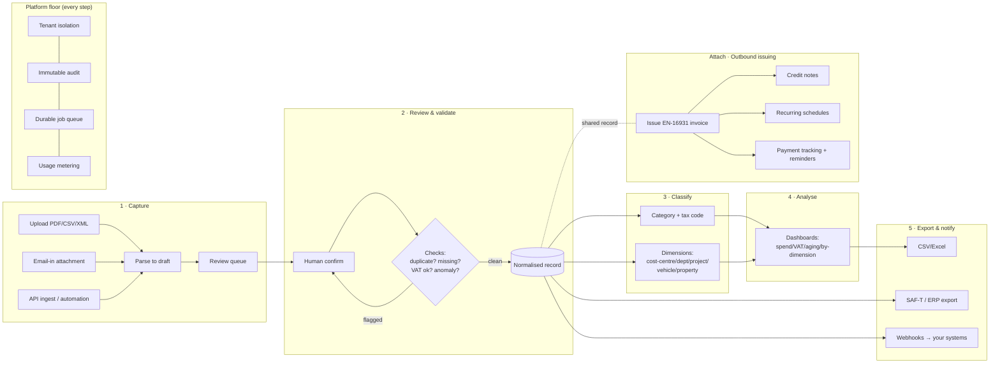
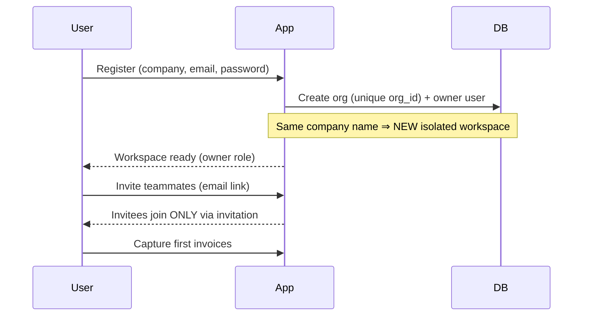
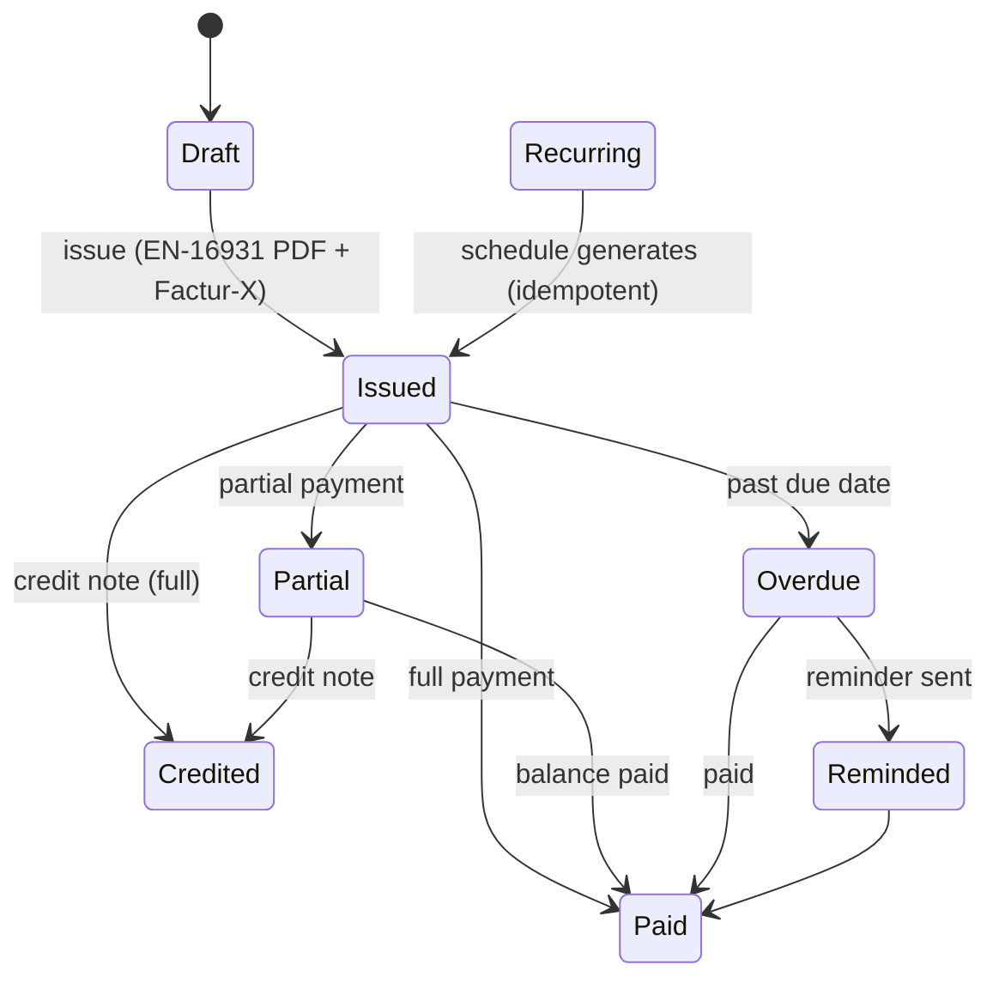

# InvoiceIQ — Jobs-to-be-Done & Workflow Map

> Companion to the [PRD](./product-requirements.md) and [personas](./personas.md). Contains the JTBD table, the end-to-end workflow map (capture → record → analyse → export, plus the outbound issuing loop), and the detailed main workflows. Diagrams are Mermaid.

---

## Jobs to be done

Format: *When [situation], I want to [motivation], so I can [expected outcome].* Priority is for the **v1 wedge**.

| # | Job (When… I want to… so I can…) | Persona | Priority | Today's alternative |
|---|---|---|---|---|
| J1 | When invoices arrive in many formats/channels, I want them captured into one record without re-keying, so I can stop wasting hours. | Marco, Tom, Elena | **Must** | Manual download + type into accounting SW |
| J2 | When I capture an invoice, I want errors (duplicate, missing field, wrong VAT) flagged before I save, so I can avoid costly mistakes. | Marco, Tom | **Must** | Eyeballing; caught at year-end |
| J3 | When I record spend, I want it classified by supplier/tax/cost-centre/project/vehicle/property, so I can see where money goes. | Sofia, Tom | **Must** | Spreadsheet tabs |
| J4 | When invoices are in foreign currency across entities, I want correct VAT + EUR conversion, so I can trust the numbers. | Tom, Marco | **Must** | Manual FX + accountant clean-up |
| J5 | When the period ends, I want a complete, reconciled record, so I can close confidently. | Marco, Tom | **Must** | Week-long crunch |
| J6 | When I close, I want to export to my accounting system / e-invoice / VAT return, so I can avoid re-work. | Marco, Tom | **Must** (CSV) / **Should** (ERP) | Re-keying, CSV wrangling |
| J7 | When I manage many clients, I want to switch between isolated workspaces instantly, so I can work without mixing data. | Marco, Priya | **Must** | Separate logins/tools |
| J8 | When I onboard a workspace, I want to be sure no one uninvited can see my data, so I can trust the platform. | All buyers | **Must** | Trust/hope |
| J9 | When I issue invoices to customers, I want compliant PDFs + credit notes + recurring bills, so I can bill correctly. | Tom, Sofia | **Should** (attach) | Word/Excel templates |
| J10 | When customers pay late, I want overdue tracking + reminders, so I can get paid. | Tom | **Should** | Manual chasing |
| J11 | When an auditor arrives, I want every figure traceable to a source doc + a tamper-evident log, so I can pass audit. | David, Sofia | **Must** | Shared drives + trust |
| J12 | When mandates change (ViDA), I want structured e-invoice in/out, so I can stay compliant. | Priya, Tom | **Should** | Not ready |
| J13 | When I hit plan limits, I want to see usage and upgrade, so I can keep working. | Tom, Priya | **Must** | Surprise blocks |
| J14 | When events happen (invoice created, payment recorded), I want my other systems notified, so I can automate. | Tom (technical) | **Should** | Manual sync |
| J15 | When an employee incurs a cost, I want them to submit a receipt + purpose for approval/reimbursement, so I can control spend. | Ravi, Tom | **Later** (module) | Email + spreadsheet |

---

## End-to-end workflow map

The product is two connected loops sharing one platform floor (auth, tenancy, audit, jobs, metering). The **inbound loop** (AP) is the wedge; the **outbound loop** (AR/issuing) is the attach.

---

## Main workflows (detailed)

### W1 — Onboard & isolate (activation path)

**Acceptance:** uninvited users see zero cross-tenant data (CI-tested); registering a duplicate company name never merges data. (PRD §11.)

### W2 — Capture → record (the core loop)
1. User uploads a file (or it arrives by email/API). Security gate scans + type-validates at the single choke point.
2. Deterministic parse first: structured e-invoice (UBL/CII/Factur-X) → high-confidence draft, **no AI**. Otherwise text-layer → OCR fallback → (opt-in) AI capture.
3. Draft lands in the **review queue**; user confirms field-by-field.
4. On confirm: FX→EUR at ECB rate for the date (with provenance), VAT computed per scheme, record saved.
5. Usage meter increments; audit event recorded; matching webhooks emitted.

### W3 — Trust (validation gate)
- Duplicate check (supplier + number + amount) → flag before save.
- Missing mandatory fields, tax-total inconsistency, implausible dates → flag.
- Optional anomaly/unusual-price flag (advisory).
- Optional AI validation: **opt-in, default-off, derived-data-only, never blocks** a save.
- Optional human approval routing (Could): threshold-based approver step.

### W4 — Classify & analyse
- Tag category/tax code + up to five cost dimensions (cost-centre/dept/project/vehicle/property), editable/clearable.
- Dashboards: spend over time, top vendors, by category, by status, **by dimension** (breakdown sums to total spend), VAT summary, aging, cash-flow.

### W5 — Reconcile & export
- Reconcile a period to a complete record.
- Export transactions + reports to CSV/Excel (NET/EUR basis stated).
- Should: SAF-T / accounting-ledger / ERP (DATEV/Xero/QuickBooks) export.

### W6 — Attach: outbound issuing loop

- Issue → PDF with embedded valid Factur-X; gap-free number series per legal entity.
- Credit notes: linked, own series, reduce outstanding + turnover; over-credit refused.
- Recurring schedules generate invoices with no duplicates on re-run (idempotent, queue-driven).
- Payment tracking (paid/partial/overdue/credited) + reminders (single + bulk overdue run, queue-driven).

### W7 — Automate & integrate
- Outbound **webhooks** on domain events (invoice.created, issued.payment, issued.credit_note, expense.*) — signed (HMAC-SHA256), retried, dead-lettered via the durable job queue.
- API ingest (Should) for automation platforms (e.g. n8n) and supplier feeds.

### W8 — Govern (runs under every workflow)
- Immutable, hash-chained audit of every change (verifiable).
- Durable background jobs (recurring generation, reminders, webhook delivery) with retry/backoff/dead-letter + a daily scheduler.
- Usage metering + per-plan limits (invoices, uploads) with clear in-product signalling at the cap.
- Retention + legal hold (Should): documents kept per statutory period; erasure respects retention.

---

## Workflow-to-status quick reference

| Workflow | Build status | Notes |
|---|---|---|
| W1 Onboard & isolate | ✅ | tenant isolation + invitations shipped |
| W2 Capture → record | ✅ upload/CSV/XML, 🟡 OCR/email/AI | portal capture is Later |
| W3 Trust | 🟡 | duplicate/missing/tax checks to harden; AI opt-in exists |
| W4 Classify & analyse | ✅ | dimensions + dashboards + by-dimension shipped |
| W5 Reconcile & export | ✅ CSV/Excel, 🟡 SAF-T/ERP | ERP export is Should |
| W6 Issuing loop | ✅ | issue + credit notes + recurring + reminders shipped |
| W7 Automate & integrate | ✅ webhooks, 🟡 API ingest | webhooks + queue shipped |
| W8 Govern | ✅ audit/jobs/metering, ✅ retention + legal hold + GDPR erasure + audit export | SSO (OIDC+SCIM) ✅, SAML scaffold 🟡; residency seam ✅ |
